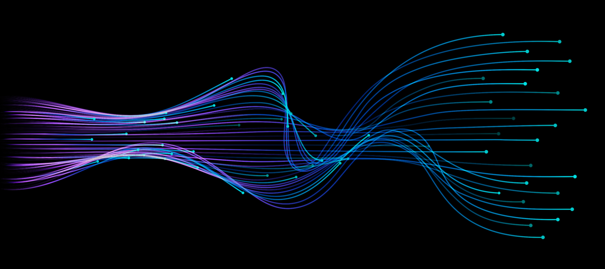

# Artificial intelligence : s-AI-kia

here is my mini resource guide on AI > ML > DL:

<center></center>


## Artificial Intelligence [[RESOURCES]()]

```latex
    AI ~ θ|1

```

## Deep Learning [[theory]()] 


## Deep Learning [[code]()] 

```python
    from torch.autograd import Variable
    a = Variable(torch.Tensor([[1,2],[3,4]]), requires_grad=True)
    y = torch.sum(a**2)

```