# AI Resource Guide : by @[florist_notes](http://floristnotes.wiki/)

# Introduction 🌸
Artificial Intelligence is about mimicking the human senses to its truest forms:
```
💠 COMPUTER VISION < What we see
💠 NATURAL LANGUAGE PROCESSING < What we speak, read or hear
💠 REINFORCEMENT LEARNING < How we learn from experience
💠 AUGMENTED REALITY < Digital twin of the environment where we live
💠 ROBOTICS < What we can touch
💠 SENSOR FUSION & EDGE ELECTRONICS < How we feel, smell and taste
💠 MACHINE LEARNING < learn about the world around us
        + SUPERVISED LEARNING < give labels & information
        + UNSUPERVISED LEARNING < let ML algo find patterns itself
        + META LEARNING < learn about the learnings of the world around us
In addition:
💠 SYSTEMS and DATA CENTER < How we remember and make use of known tools
💠 MATHEMATICS < rule of nature that governs patterns and logic
```

Intro blogs : [history of ai](https://youtu.be/jz8hf5i_qDU?si=f-0LXNARScI9hChR), [intro to ai](https://vas3k.com/blog/machine_learning/), [introtodeeplearning](http://introtodeeplearning.com/), [adeshpande (cnn)](https://adeshpande3.github.io/), [colah](http://colah.github.io/posts/2015-08-Understanding-LSTMs/), [intro to nlp](https://towardsdatascience.com/a-gentle-introduction-to-natural-language-processing-e716ed3c0863), [intro to rl](https://lilianweng.github.io/posts/2018-02-19-rl-overview/), [ros cv](https://roboticscasual.com/ros-tutorial-how-to-use-opencv-in-a-robot-pick-and-place-task-for-computer-vision/), [robotics](https://en.wikipedia.org/wiki/Robotics), [a tour of ML algorithms](https://machinelearningmastery.com/a-tour-of-machine-learning-algorithms/), [Machine Learning Algorithms & Models Explained with Python](https://medium.com/coders-camp/all-machine-learning-algorithms-models-explained-adcd95d5fb3c), [awesome-ml-blogs](https://github.com/antoinebrl/awesome-ml-blogs), google:[ml-crash-course](https://developers.google.com/machine-learning/crash-course).

DATA: Everything in CS is 0 or 1. Life has been binary! Most common data formats: Image / Video / Audio / Text / etc (other formats).

<center>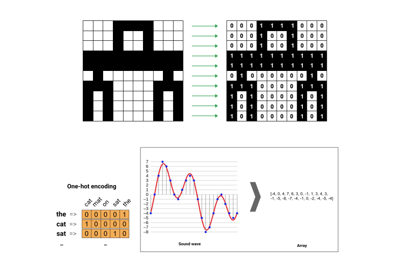</center>

## Tensors: Tensors flow in Neurons :) Neural Network! (Mimicking the Electrical Signals)

<center>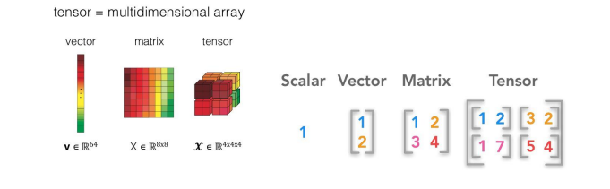</center>

Mathematics: Linear Algebra | Tool: [Python](https://www.python.org/) + [PyTorch](https://pytorch.org/)/ [TensorFlow](https://www.tensorflow.org/) | Environment: [Anaconda](https://www.anaconda.com/). 

## AI & Robotics News:

YOUTUBE CHANNELS: [2 minutes paper](https://www.youtube.com/c/K%C3%A1rolyZsolnai/videos), [StatQuest](https://www.youtube.com/c/joshstarmer/videos), [3blue1brown](https://www.youtube.com/c/3blue1brown/videos) #some2, [sentdex](https://www.youtube.com/user/sentdex), [Yannic Kilcher](https://www.youtube.com/c/YannicKilcher), [Lex Fridman](https://www.youtube.com/c/lexfridman), [stanfordonline](https://www.youtube.com/user/stanfordonline), [AI Explained](https://www.youtube.com/@ai-explained-/videos), [AI Grid](https://www.youtube.com/@TheAiGrid), [OpenAI](https://www.youtube.com/@OpenAI/videos), [Google Deepmind](https://www.youtube.com/@Google_DeepMind/videos), [freeCodeCamp](https://www.youtube.com/@freecodecamp), [WeightsBiases](https://www.youtube.com/@WeightsBiases/videos), [Aladdin Persson](https://www.youtube.com/@AladdinPersson/videos), [Patrick Loeber](https://www.youtube.com/@patloeber/videos), [Edan Meyer](https://www.youtube.com/@EdanMeyer), [Eye on AI](https://www.youtube.com/@eyeonai3425), [SerranoAcademy](https://www.youtube.com/@SerranoAcademy/videos), [Gabriel Mongaras](https://www.youtube.com/@gabrielmongaras/videos).

<table style="width:100%" >
<tr>
<th>
  <p>

  [DeepMind’s New AI Finally Enters The Real World!](https://youtu.be/zxyZSxnTrZs), [DeepMind AI Reduces Google Data Centre Cooling Bill by 40%](https://www.deepmind.com/blog/deepmind-ai-reduces-google-data-centre-cooling-bill-by-40), [Stable Diffusion : Art with AI](https://www.behance.net/gallery/150137177/Art-with-AI), [Art with AI 2](https://www.behance.net/gallery/152560407/Art-with-AI-2-Midjourney), [AI music vid](https://youtu.be/0fDJXmqdN-A), [AI music vid 2](https://youtu.be/qXghXywioeM), [Voyage through time](https://youtu.be/Bo3VZCjDhGI), [Dream Textures](https://youtu.be/5WboPlU9c6I), Ai generated paintings : [1](https://youtu.be/AB48K0VDlRA), [2](https://youtu.be/85l961MmY8Y), [3](https://youtu.be/d8jFMKNy9EI), [2D to 3D](https://twitter.com/JunGao33210520/status/1573310606320484352?t=3WR3mJWR-0S20HxTuLuAoA&s=19), Music by AI : [1](https://youtu.be/Emidxpkyk6o), [2](https://youtu.be/qf6eOSJgN0Y), A different logistics system : [Olivio](https://www.youtube.com/c/OlivioSarikas), [3d printed house](https://youtu.be/qWBA-6NgIJg), [3D printed rockets](https://youtu.be/kz165f1g8-E), Boston Dynamics : [Atlas](https://youtu.be/tF4DML7FIWk), [Search for Life](https://youtu.be/qTW-dbZr4U8), [Spot](https://youtu.be/XnZH4izf_rI), [Spot's on it!](https://youtu.be/7atZfX85nd4), [Warp drive](https://youtu.be/jhvW9CLhReM), [future concepts](https://youtu.be/AIrH01N9AsE), [Artificial General Intelligence](https://www.youtube.com/results?search_query=agi+artificial+general+intelligence), [Stable Diffusion Got Supercharged - For Free!](https://youtu.be/1RvZWHtFXuY), [OpenAI GPT-4 Function Calling: Unlimited Potential](https://youtu.be/0lOSvOoF2to), [GPT-4 solves MIT Exam with 100% ACCURACY | OpenLLaMA 13B released](https://youtu.be/Tkijsu129M0).
  </p>

</th>


<th>
  <p>
  
  Lenia : [Lenia - Mathematical Life Forms](https://youtu.be/iE46jKYcI4Y), [Neat AI does Lenia - Conway's game of life arrives in the 21st century](https://youtu.be/7-97RhAZhXI), [Artificial Life uses Machine Learning to learn how to survive](https://youtu.be/mSy4z8nDLno), [Learning Sensorimotor Agency in Cellular Automata](https://developmentalsystems.org/sensorimotor-lenia/), [Stanford Seminar - Lenia: Biology of Artificial Life, Bert Wang-Chak Chan](https://www.youtube.com/watch?v=G5P8eu6gUSo), [LLaMA2 Released | LLMs for Robots | Multimodality on the Rise](https://youtu.be/xs-0cp1hSnY?si=xMaLrpEWqKGcOOS-), [Yannic Kilcher - Papers Explained!](https://www.youtube.com/watch?v=fvctpYph8Pc&list=PL1v8zpldgH3pR7LPuidEZK68kS6AaU1y7), [Gemini: ChatGPT-Like AI From Google DeepMind!](https://youtu.be/ex1GeX0IhJQ?si=byb9s5FaS1phc57V), [Stable Video AI Watched 600,000,000 Videos!](https://youtu.be/XwDaQKOxgFY?si=p3FlpmxqrQ93MCB7), [NVIDIA’s Neuralangelo AI: Gaming Anywhere on Earth!](https://youtu.be/bSHz0NexLBU?si=HhY5TFDozbC19SRZ), [Video Poet](https://sites.research.google/videopoet/).
  </p>

</th>
</tr>

<tr>
<th>
  <p>
  
  Deepmind : [Alphafold](https://www.youtube.com/watch?v=G5P8eu6gUSo), [Alphacode](https://www.deepmind.com/blog/competitive-programming-with-alphacode), [Gopher](https://youtu.be/aPiHhJjN3hI), [GPT-3](https://www.technologyreview.com/2020/07/20/1005454/openai-machine-learning-language-generator-gpt-3-nlp/), [animation with dl](https://youtu.be/4lQkQSmA8nA), [real time render](https://www.youtube.com/watch?v=QqHchIFPE7g&feature=youtu.be), [game physics](https://youtu.be/atcKO15YVD8), [virtual characters](https://youtu.be/kie4wjB1MCw), [physics based animation](https://youtu.be/8oIQy6fxfCA), Deepfakes : [Everybody Dance Now](https://youtu.be/PCBTZh41Ris), [re-write videos by editing text](https://youtu.be/2xWnOL5bts8), [clone voice in 5 sec](https://youtu.be/0sR1rU3gLzQ), [Seeing cell divisions like never before](https://youtu.be/RxHTaTmPlwQ), [Detecting Signs of Disease from External Images of the Eye](https://ai.googleblog.com/2022/03/detecting-signs-of-disease-from.html), [Training Real-World Self-Driving Cars with Video Games](https://www.synopsys.com/designware-ip/technical-bulletin/training-self-driving-cars-video-games-2019q3.html), [AR Presentations](https://youtu.be/wVtOuvFlczg), [MIT slime robot](https://youtu.be/VmV3m0QqNOY), Google's AI [see through dark](https://youtu.be/7iy0WJwNmv4), [Next level video editing](https://youtu.be/MCq0x01Jmi0), [AI in chemical engineering](https://youtu.be/UgusRy8Oz3c), [flying through Giga Berlin](https://youtu.be/7-4yOx1CnXE).
  </p>
</th>

<th>
  <p>

  [Ameca facial motion capture](https://youtu.be/3OHILYjsW7c), [Ameca conversation using GPT 3 - Will robots take over the world?](https://youtu.be/EWACmFLvpHE), [Boston Dynamics](https://youtu.be/fn3KWM1kuAw), [Robo Threads](https://youtu.be/INSyV4dgqu8), [Festo Bionic Robots](https://youtu.be/_qRGIRvr06w),  Swarm drones : [1](https://youtu.be/P9ZbipO8vxM), [2](https://youtu.be/zq1ud7CBOaU), [3](https://youtu.be/DK6IGG5zRU8), [4](https://youtu.be/L0fJ0EHHfOA), [deep sea soft robotics](https://youtu.be/shr6sJy_29E), [OceanOneK](https://youtu.be/h2CLLBUpPZg), [snake robots](https://youtu.be/FWr-MvOOOYU), [cyborg insects](https://youtu.be/awG09liCMD4), [insect robot](https://youtu.be/loHzoeFP9Io), [soft robotics clothing](https://youtu.be/OoXCO8NB9B8), [soft robotic fish](https://youtu.be/JPabeUxSfAw), [sensitive skin for robotics](https://youtu.be/M-Y2HW6JcGI), [nanobots](https://youtu.be/2TjdGuBK9mI), [bionic arms](https://youtu.be/F_brnKz_2tI), [Xenobot 2.0](https://youtu.be/JPFRUZGqUFA), [stretch self heal electronics](https://youtu.be/mWKb_CMmwXw), [ultrasonic sticker](https://youtu.be/Kn2J8W4csNc), [stretchy color shifting material](https://youtu.be/3-BH7164GaM), [OpenAI Sora: A Closer Look!](https://youtu.be/8RbP4GlTM3o?si=LULVFWORb6atqkHA), [Claude 3 AI: Smarter Than OpenAI's ChatGPT?](https://youtu.be/9b7bx423SWk?si=T2jNbKnROTqBGNzs), [The First AI Software Engineer Is Here!](https://youtu.be/SdZiYRfGdKU?si=uQAvesgAEaRWB2iW), [Unitree Introducing | Unitree G1 Humanoid Agent](https://youtu.be/GzX1qOIO1bE?si=4sgzQCyCXL6PmgMv), [Introducing Pulsar: Family of Electromagnetic Warfare Systems](https://youtu.be/tnsyM3NPy1c?si=C2PsmM24SLWIez1g).
  </p>
</th>


</tr>

</table>


resources : [basic nn](https://youtu.be/bfmFfD2RIcg), [neural networks - 3b1b](https://www.youtube.com/playlist?list=PLZHQObOWTQDNU6R1_67000Dx_ZCJB-3pi), [how are memories stored in neural network?](https://youtu.be/piF6D6CQxUw), [loss function](https://www.section.io/engineering-education/understanding-loss-functions-in-machine-learning/), [LF 2](https://www.section.io/engineering-education/understanding-loss-functions-in-machine-learning/), [Optimizers](https://towardsdatascience.com/optimizers-for-training-neural-network-59450d71caf6) / adaptive learning rate ([Gradient Descent](https://youtu.be/sDv4f4s2SB8),  Adam, adagrad, adadelta, RMSProp etc), [Activation Function](https://towardsdatascience.com/activation-functions-neural-networks-1cbd9f8d91d6), ML interview ques: [article 1](https://www.simplilearn.com/tutorials/machine-learning-tutorial/machine-learning-interview-questions), [article 2](https://www.mygreatlearning.com/blog/machine-learning-interview-questions/), [article 3](https://www.interviewbit.com/machine-learning-interview-questions/), [ML design interview](https://github.com/khangich/machine-learning-interview), [article 5](https://www.interviewbit.com/machine-learning-interview-questions/), 3b1b - [But what is a GPT? Visual intro to transformers](https://youtu.be/wjZofJX0v4M?si=WNiHvrLk349wLPke), [Attention in transformers, visually explained](https://youtu.be/eMlx5fFNoYc?si=4O7b32HAnP9wm6Fy), [What Do Neural Networks Really Learn?](https://youtu.be/jGCvY4gNnA8?si=8JsUZOiPyU_j8lX4), [The moment we stopped understanding AI [AlexNet]](https://youtu.be/UZDiGooFs54?si=PZydqbn32wkRIEjt), [The future of AI looks like THIS (& it can learn infinitely)](https://youtu.be/biz-Bgsw6eE?si=87KKA_WvkD4zYwDB), [Neural Networks: Zero to Hero](https://www.youtube.com/playlist?list=PLAqhIrjkxbuWI23v9cThsA9GvCAUhRvKZ), [Watching Neural Networks Learn](https://youtu.be/TkwXa7Cvfr8?si=2FFlgXDXdINFT9Jj), [Backpropagation from the ground up](https://youtu.be/SmZmBKc7Lrs?si=D2e8qUJ8Hck0vE6N), [The moment we stopped understanding AI [AlexNet]](https://youtu.be/UZDiGooFs54?si=S2shT7sRC4EVJQMQ), [A Secret Weapon for Predicting Outcomes: The Binomial Distribution](https://youtu.be/6YzrVUVO9M0?si=3NfZ-rt_Cd7CT260).


#### Into AI Courses: [ML Specialization](https://www.coursera.org/specializations/machine-learning-introduction), [Deep Learning Specialization](https://www.coursera.org/specializations/deep-learning), [Mathematics for ML](https://www.coursera.org/specializations/mathematics-machine-learning), [Machine Learning Engineering for Production (MLOps) Specialization](https://www.coursera.org/specializations/machine-learning-engineering-for-production-mlops), DeepLearningAI [courses](https://www.coursera.org/deeplearning-ai).

## AI BOOKS:


<table style="width:100%" >
<tr>
<th>
  <p>
  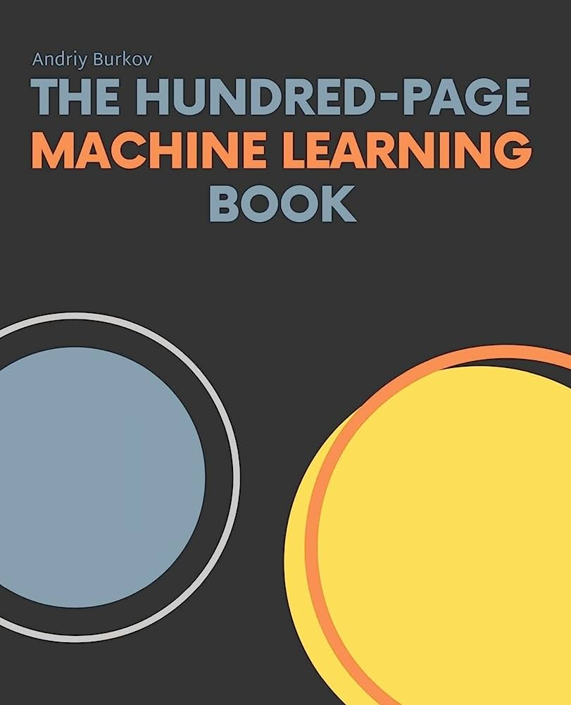
  <br />

  100 page Machine Learning book ([book](https://www.amazon.de/-/en/Martin-Anthony/dp/052157353X))<br />
  
  </p>

</th>
<th>
  <p>
  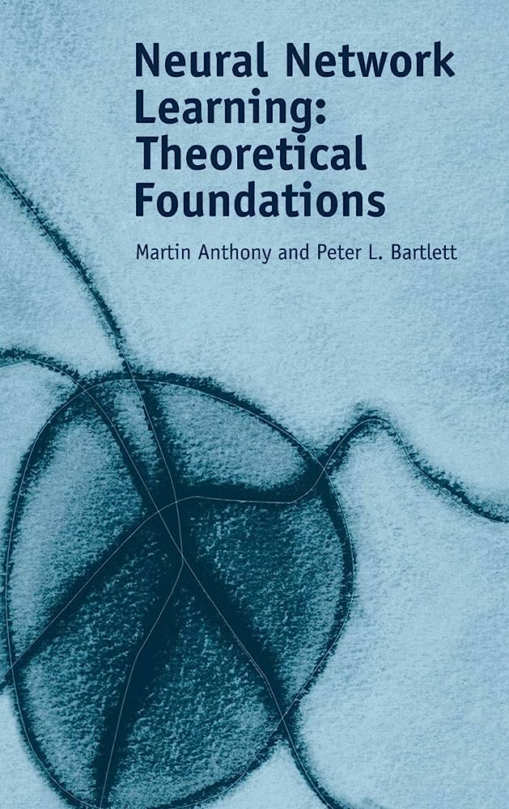
  <br />
  
Neural Network Learning: Theoretical Foundations ([book](https://www.amazon.de/-/en/Andriy-Burkov/dp/199957950X))<br />
  
  </p>
</th>
<th>
  <p>
  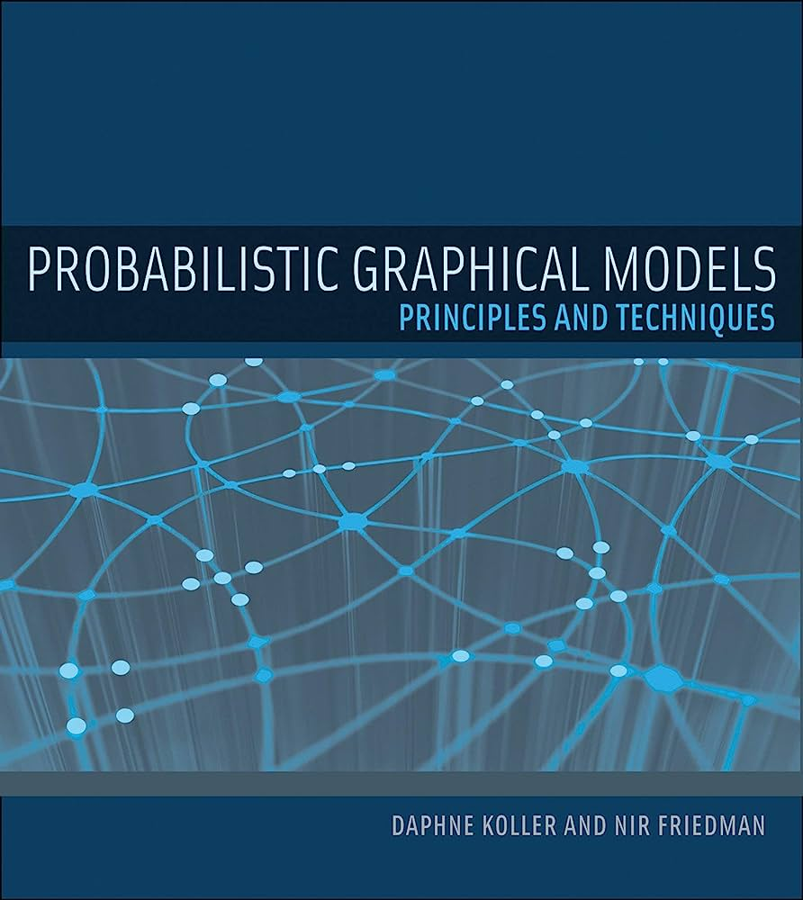
  <br />
  
Probabilistic Graphical Models: Principles and Techniques([book](https://www.amazon.de/dp/0387848576/))<br />
  
  </p>
</th>
<th>
  <p>
  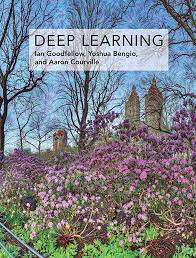
  <br />
  
Deep Learning (Adaptive Computation and Machine Learning series([book](https://www.amazon.de/-/en/Ian-Goodfellow/dp/0262035618/))<br />
  
  </p>
</th>
<th>
  <p>
  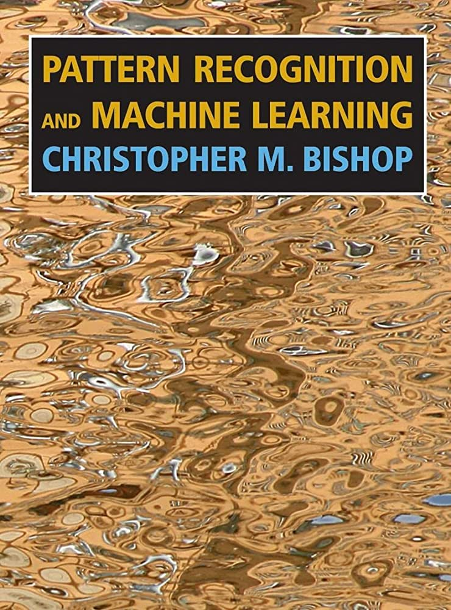
  <br />
  
Pattern Recognition and Machine Learning (Information Science and Statistics)([book](https://www.amazon.de/-/en/Christopher-M-Bishop/dp/0387310738))<br />
  
  </p>
</th>
</tr>


<tr>
<th>
  <p>
  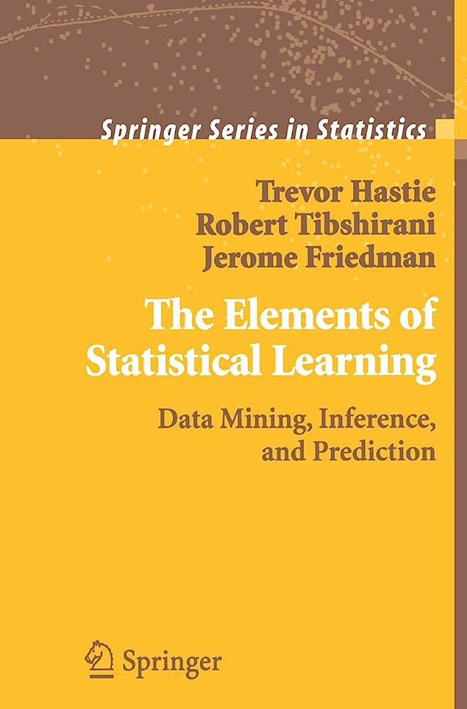
  <br />

 The Elements of Statistical Learning: Data Mining, Inference, and Prediction ([book](https://www.amazon.de/-/en/Martin-Anthony/dp/052157353X))<br />
  
  </p>

</th>
<th>
  <p>
  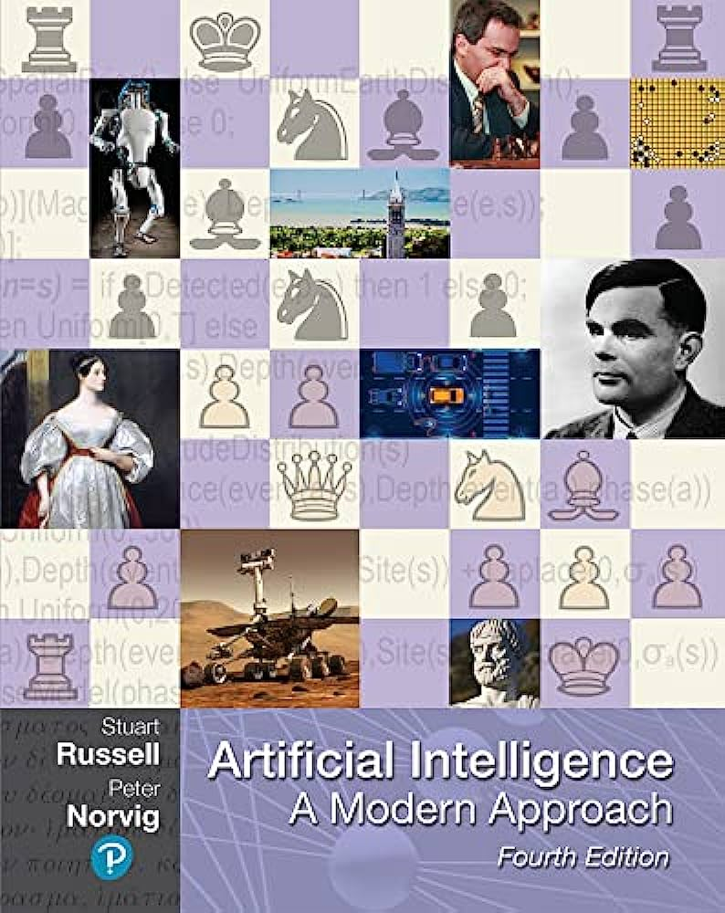
  <br />
  
Artificial Intelligence: A Modern Approach ([book](https://www.amazon.de/-/en/Stuart-J-Russell/dp/1292153962/))<br />
  
  </p>
</th>
<th>
  <p>
  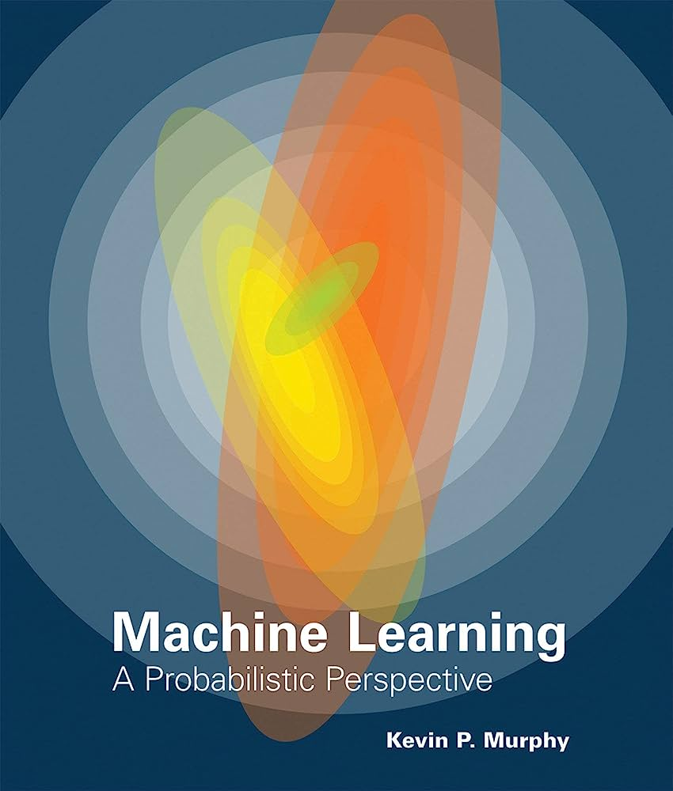
  <br />
  
Machine Learning: A Probabilistic Perspective([book](https://www.amazon.de/-/en/Marc-Peter-Deisenroth/dp/110845514X))<br />
  
  </p>
</th>
<th>
  <p>
  
  <br />
  
Mathematics for Machine Learning ([book](https://www.amazon.de/-/en/Ian-Goodfellow/dp/0262035618/))<br />
  
  </p>
</th>
<th>
  <p>
  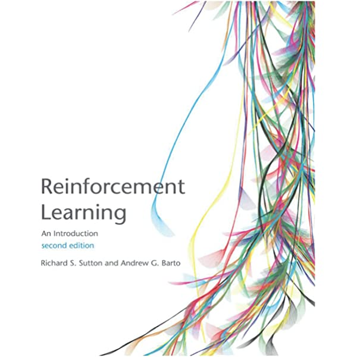
  <br />
  
Reinforcement Learning: An Introduction (Adaptive Computation and Machine Learning series)([book](https://www.amazon.de/-/en/Richard-S-Sutton/dp/0262039249/))<br />
  
  </p>
</th>
</tr>
</table>

Extra: [Sentdex Neural Network from Scratch](https://nnfs.io/), [Machine Learning Mastery](https://machinelearningmastery.com/products/), [Statista In-depth AI 2021](https://de.statista.com/statistik/studie/id/50489/dokument/in-depth-report-artificial-intelligence/).

## STANFORD AI COURSES:


<table style="width:100%" >
<tr>
<th>
  <p>
  <br />

  CS221 : Artificial Intelligence: Principle & Techniques ([CLASS](https://bulletin.stanford.edu/courses/1057301))<br />
  
  </p>

</th>
<th>
  <p>
  <br />

  EE 364A : Convex Optimization I ([CLASS](https://bulletin.stanford.edu/courses/2066521))<br />
  
  </p>
</th>
<th>
  <p>
  <br />

  EE 364B :Convex Optimization II ([CLASS](https://bulletin.stanford.edu/courses/2066541))<br />
  
  </p>
</th>
<th>
  <p>
  <br />

  CS 149 : Parallel Computing ([CLASS](https://bulletin.stanford.edu/courses/1056791))<br />
  
  </p>
</th>
<th>
  <p>
  <br />

  CS 229 : Machine Learning ([CLASS](https://bulletin.stanford.edu/courses/1057501)-[cs229m(theory)](https://www.youtube.com/watch?v=I-tmjGFaaBg&list=PLoROMvodv4rP8nAmISxFINlGKSK4rbLKh))<br />
  
  </p>
</th>
</tr>


<tr>
<th>
  <p>
  <br />

  CS 224N : Natural Language Processing with Deep Learning ([CLASS](https://bulletin.stanford.edu/courses/1209041))<br />
  
  </p>

</th>
<th>
  <p>
  <br />

  CS 224W : Machine Learning with Graphs ([CLASS](https://bulletin.stanford.edu/courses/1058241))<br />
  
  </p>
</th>
<th>
  <p>
  <br />

  CS 228 : Probabilistic Graphical Models: Principles and Techniques([CLASS](https://bulletin.stanford.edu/courses/1057481))<br />
  
  </p>
</th>
<th>
  <p>
  <br />

  CS 234 : Reinforcement Learning ([CLASS](https://bulletin.stanford.edu/courses/2190451))<br />
  
  </p>
</th>
<th>
  <p>
  <br />

  CS 231N : Convolutional Neural Networks for Visual Recognition([CLASS](https://bulletin.stanford.edu/courses/2164531))<br />
  
  </p>
</th>
</tr>


<tr>
<th>
  <p>
  <br />

  CS 330 Deep Multi-task and Meta Learning ([CLASS](https://bulletin.stanford.edu/courses/2215371):[vid](https://www.youtube.com/playlist?list=PLoROMvodv4rMIJ-TvblAIkw28Wxi27B36))<br />
  
  </p>

</th>
<th>
  <p>
  <br />

  CS 237A : Principles of Robot Autonomy I ([CLASS](https://bulletin.stanford.edu/courses/2185453))<br />
  
  </p>
</th>
<th>
  <p>
  <br />

 CS 237B : Principles of Robot Autonomy II ([CLASS](https://bulletin.stanford.edu/courses/2215361))<br />
  
  </p>
</th>
<th>
  <p>
  <br />

  CS 238 : Decision Making under Uncertainty ([CLASS](https://bulletin.stanford.edu/courses/2158402))<br />
  
  </p>
</th>
<th>
  <p>
  <br />

  CS 233 : Geometric and Topological Data Analysis([CLASS](https://bulletin.stanford.edu/courses/2170091))<br />
  
  </p>
</th>


</tr>


</table>

Notes: [shervine](https://stanford.edu/~shervine/teaching/cs-221/), [cs109-probability](https://www.youtube.com/watch?v=2MuDZIAzBMY&list=PLoROMvodv4rOpr_A7B9SriE_iZmkanvUg), Stanford [CS 25: Transformers United V4](https://web.stanford.edu/class/cs25/), Stanford [CS 109 - Introduction to Probability](https://www.youtube.com/watch?v=2MuDZIAzBMY&list=PLoROMvodv4rOpr_A7B9SriE_iZmkanvUg).

Good AI courses:


<table style="width:100%" >
<tr>
<th>
  <p>
  <br />

  CMU : Multimodal ML ([class](https://www.youtube.com/watch?v=VIq5r7mCAyw&list=PLTLz0-WCKX616TjsrgPr2wFzKF54y-ZKc))<br />
  
  </p>

</th>
<th>
  <p>
  <br />

  CMU : Neural Nets for NLP ([class](https://youtu.be/vnx6M7N-ggs))<br />
  
  </p>

</th>
<th>
  <p>
  <br />

  CS 233 : Geometric & Topological Data Analysis ([class](http://graphics.stanford.edu/courses/cs233-21-spring/))<br />
  
  </p>

</th>
<th>
  <p>
  <br />

  MIT 18.065 : Matrix Methods in Data Analysis, Signal Processing, and Machine Learning ([class](https://www.youtube.com/watch?v=Cx5Z-OslNWE&list=PLUl4u3cNGP63oMNUHXqIUcrkS2PivhN3k))<br />
  
  </p>

</th>
<th>
  <p>
  <br />

  MIT : Deep Learning for Life Sciences ([class](https://www.youtube.com/watch?v=0jWOZoTsYzI&list=PLypiXJdtIca5sxV7aE3-PS9fYX3vUdIOX))<br />
  
  </p>

</th>
<th>
  <p>
  <br />

  MIT 6.S192: Deep Learning for Art, Aesthetics, and Creativity ([class](https://www.youtube.com/watch?v=MABLFo7IV3I&list=PLCpMvp7ftsnIbNwRnQJbDNRqO6qiN3EyH))<br />
  
  </p>

</th>
</tr>


<tr>
<th>
  <p>
  <br />

  MIT : Machine Vision ([class](https://www.youtube.com/watch?v=tY2gczObpfU&list=PLUl4u3cNGP63pfpS1gV5P9tDxxL_e4W8O))<br />
  
  </p>

</th>
<th>
  <p>
  <br />

  MIT : ML for Genomics ([class](https://www.youtube.com/watch?v=dPlcQnWtjeo&list=PLypiXJdtIca6U5uQOCHjP9Op3gpa177fK))<br />
  
  </p>

</th>
<th>
  <p>
  <br />

  MIT : Underactuated Robotics ([class](https://www.youtube.com/watch?v=3g-w88nNW6E&list=PLkx8KyIQkMfXyKku6DstXjD9xU93ptDyc))<br />
  
  </p>

</th>
<th>
  <p>
  <br />

  UC Berkeley 287 : Advanced Robotics ([class](https://www.youtube.com/watch?v=xWPViQ6LI-Q&list=PLwRJQ4m4UJjNBPJdt8WamRAt4XKc639wF))<br />
  
  </p>

</th>
<th>
  <p>
  <br />

  MIT : Deep Learning ([class](https://www.youtube.com/watch?v=7sB052Pz0sQ&list=PLtBw6njQRU-rwp5__7C0oIVt26ZgjG9NI))<br />
  
  </p>

</th>

<th>
  <p>
  <br />

  TinyML and Efficient Deep Learning Computing | MIT 6.S965 Fall 2022 ([class](https://www.youtube.com/watch?v=5HpLyZd1h0Q&list=PL80kAHvQbh-ocildRaxjjBy6MR1ZsNCU7))<br />
  
  </p>

</th>
</tr>

</table>

More : [Quantum Machine Learning MOOC - Quantum ML](https://www.youtube.com/watch?v=QtWCmO_KIlg&list=PLmRxgFnCIhaMgvot-Xuym_hn69lmzIokg), [Parallel Computing and Scientific Machine Learning](https://www.youtube.com/watch?v=3IoqyXmAAkU&list=PLCAl7tjCwWyGjdzOOnlbGnVNZk0kB8VSa), [Optimization](https://www.youtube.com/watch?v=9hToSoZXM9s&list=PL7y-1rk2cCsDOv91McLOnV4kExFfTB7dU), [18.409 Algorithmic Aspects of Machine Learning Spring 2015 MIT ](https://www.youtube.com/watch?v=nsHbkVMaUGk&list=PLB3sDpSRdrOvI1hYXNsa6Lety7K8FhPpx), [Advanced NLP - CMU](https://www.youtube.com/watch?v=rVht4eK3EZw&list=PL8PYTP1V4I8D0UkqW2fEhgLrnlDW9QK7z), [Convex Optimization : CMU](https://www.youtube.com/watch?v=Di9f47LAzHQ&list=PLRPU00LaonXQ27RBcq6jFJnyIbGw5azOI), [MIT Generative AI Summit](https://www.youtube.com/watch?v=i3O1S6VcwCw&list=PLtBk2p55R5TsQuxhjoAaStAir-0N0nCVG), [MIT - EfficientML.ai Lecture, Fall 2023, MIT 6.5940](https://www.youtube.com/playlist?list=PL80kAHvQbh-pT4lCkDT53zT8DKmhE0idB), [MIT 6.036 : Introduction to Machine Learning](https://www.youtube.com/playlist?list=PLxC_ffO4q_rW0bqQB80_vcQB09HOA3ClV), [MIT 6.S192: Deep Learning for Art, Aesthetics, and Creativity](https://www.youtube.com/playlist?list=PLCpMvp7ftsnIbNwRnQJbDNRqO6qiN3EyH), [Stanford CS25: V2 I Introduction to Transformers w/ Andrej Karpathy](https://youtu.be/XfpMkf4rD6E?si=_Ti-hM52WTiug3wd), [The Most Important Algorithm in Machine Learning](https://youtu.be/SmZmBKc7Lrs?si=_KoaWTNh7pIJkeA1), Stanford Playlist : [ [Stanford CS236: Deep Generative Models](https://www.youtube.com/playlist?list=PLoROMvodv4rPOWA-omMM6STXaWW4FvJT8), [Stanford EE364A Convex Optimization](https://www.youtube.com/playlist?list=PLoROMvodv4rMJqxxviPa4AmDClvcbHi6h), [Stanford CS109 Introduction to Probability for Computer Scientists](https://www.youtube.com/playlist?list=PLoROMvodv4rOpr_A7B9SriE_iZmkanvUg), [Stanford EE259: Principles of Sensing for Autonomy](https://www.youtube.com/playlist?list=PLoROMvodv4rOhE007XQu707Dy52qXiZGV), [Stanford CS25 - Transformers United](https://www.youtube.com/playlist?list=PLoROMvodv4rNiJRchCzutFw5ItR_Z27CM), [Stanford CS224W Machine Learning with Graphs](https://www.youtube.com/playlist?list=PLoROMvodv4rOP-ImU-O1rYRg2RFxomvFp), [Stanford AA289 - Robotics and Autonomous Systems Seminar](https://www.youtube.com/playlist?list=PLoROMvodv4rMeercb-kvGLUrOq4HR6BZD) ].


## Premier AI conferences:

<table style="width:100%" >
<tr>
<th>
Conference
</th>
<th>
Description
</th>
</tr>
<tr>
<td>

[CVPR](https://cvpr2022.thecvf.com/)
</td>
<td>IEEE / CVF Computer Vision and Pattern
Recognition Conference (CVPR)</td>
</tr>
<tr>
<td>

[ICML](https://icml.cc/)
</td>
<td>International Conference on Machine
Learning (ICML)</td>
</tr>
<tr>
<td>

[NeurIPS](https://nips.cc/)
</td>
<td>Neural Information Processing Systems
(abbreviated as NeurIPS)</td>
</tr>
<tr>
<td>

[ECCV](https://eccv2022.ecva.net/)
</td>
<td>European Conference on Computer Vision
(ECCV)</td>
</tr>
<tr>
<td>

[ICRA](https://www.ieee-ras.org/conferences-workshops/fully-sponsored/icra)
</td>
<td>IEEE International Conference on Robotics and Automation (ICRA)</td>
</tr>
<tr>
<td>

[ICLR](https://iclr.cc/)
</td>
<td>The International Conference on Learning
Representations (ICLR)</td>
</tr>
<tr>
<td>

[IROS](https://iros2022.org/)
</td>
<td>IEEE/RSJ International Conference on
Intelligent Robots and Systems (IROS)</td>
</tr>
<tr>
<td>

[RSS](https://roboticsconference.org/)
</td>
<td>Robotics: Science and Systems (RSS)</td>
</tr>
<tr>
<td>

[NVIDIA GTC](https://www.nvidia.com/gtc/)
</td>
<td>(GPU Technology Conference) is a
global AI conference.</td>
</tr>
<tr>
<td>

[Google Cloud Applied ML Summit](https://cloudonair.withgoogle.com/events/summit-applied-ml-2022)
</td>
<td>Google Cloud AI technologies</td>
</tr>
<tr>
<td>

[AAMAS](https://aamas2022-conference.auckland.ac.nz/)
</td>
<td>ACM AAMAS (International Conference on
Autonomous Agents and Multiagent Systems) is the
largest and most influential conference in the area of
agents and multiagent systems.</td>
</tr>

</table>


[ [CVPR papers](#) ] : [2023 all day](https://openaccess.thecvf.com/CVPR2023?day=all), [2022 all day](https://openaccess.thecvf.com/CVPR2022?day=all), [2021 all day](https://openaccess.thecvf.com/CVPR2021?day=all) |  [NeurIPS papers](#), [neurips2023.vizhub](https://neurips2023.vizhub.ai/), [neurips2023.paperdigest](https://www.paperdigest.org/data/neurips-2023-full.html), [rss 2022 papers](https://roboticsconference.org/2022/program/papers/), [nips 2022 outstanding papers](https://nips.cc/virtual/2022/awards_detail), [2021 outstanding papers](https://nips.cc/virtual/2021/awards_detail).

There are also good platforms to find research
publications : [arXiv](https://arxiv.org/), google scholar : [robotics](https://scholar.google.de/citations?view_op=top_venues&hl=en&vq=eng_robotics), [artificial intelligence](https://scholar.google.de/citations?view_op=top_venues&hl=en&vq=eng_artificialintelligence), [computer vision and pattern recognition](https://scholar.google.de/citations?view_op=top_venues&hl=en&vq=eng_computervisionpatternrecognition), [Google Quantum AI summer symposium](https://quantumai.google/research/conferences) etc.


### Premier AI challenges and competitions:
+ [ICRA competitions](https://2024.ieee-icra.org/), [CVPR competitions](https://cvpr.thecvf.com/), [NeurIPS competitions](https://neurips.cc/), [IROS competitions](https://irmv.sjtu.edu.cn/iros2025/index.html), [NASA Space ROS Sim Summer Sprint Challenge](https://www.freelancer.com/contest/NASA-Space-ROS-Sim-Summer-Sprint-Challenge-2417552/timeline), [Autoware Challenge 2024](https://discourse.ros.org/t/announcing-autoware-challenge-2024/38653).
+ [mlcontests](https://mlcontests.com/) : ml challenges and competitions list, [kaggle competitions](https://www.kaggle.com/competitions), [AICrowd](https://www.aicrowd.com/) : runs a combination of supervised ML
competitions as well as RL competitions.
+ [AWS deepracer](https://aws.amazon.com/deepracer/) : AWS DeepRacer is a
beginner-friendly 3D racing simulator aimed at helping
developers get started with RL.
+ [SC2 AI Arena](https://aiarena.net/) : Starcraft II AI arena for RL algorithms, [Gocoder.one](https://www.gocoder.one/) : Coder One is an AI competition based
on the classic console game, bomberman, [flatland](https://www.aicrowd.com/challenges/flatland-3) : The goal is to construct the best schedule that minimizes the delay in the requested arrival time of all trains, [MineRL](https://minerl.io/) : MineRL is concerned with the development of sample-efficient deep RL algorithms which can solve hierarchical, sparse reward environments using human demonstrations in Minecraft, [nethack](https://nethackchallenge.com/), [CompilerGym](https://github.com/facebookresearch/CompilerGym) : CompilerGym is actually a toolkit for applying reinforcement learning to compiler
optimizations, rather than a competition.
+ [ods.ai](https://ods.ai/competitions) : ml competition platform,  [bitGrid](https://bitgrit.net/competition/) : Bitgrit is a data science competition
platform, [numer.ai](https://numer.ai/), [drivendata](https://www.drivendata.org/), [battlecode](https://battlecode.org/) : The MIT 6.147 (formerly 6.370)
Battlecode programming competition is a unique
challenge that combines battle strategy, software
engineering, and artificial intelligence.
There are also lot of [conference competitions](https://github.com/skrish13/ml-contests-conf)
happening every year.
+ [xeek.ai](https://xeek.ai/challenges), [dPhi](https://dphi.tech/challenges/#active), [dataCrunch](https://www.crunchdao.com/), [challenge data](https://challengedata.ens.fr/challenges/year/2021), [signate.jp](https://signate.jp/competitions), [grand-challenge](https://grand-challenge.org/challenges/).

Hackathons: [HackZurich](https://hackzurich.com/), [HackTUM](https://hack.tum.de/), [Stanford Treehacks](https://www.treehacks.com/), [HackMIT](https://hackmit.org/),  [NASA Space app
challenge](https://www.spaceappschallenge.org/), [pytorch
summer hack](https://pytorchmpk.devpost.com/), [esa socis](https://www.esa.int/Enabling_Support/Space_Engineering_Technology/SOCIS_The_ESA_Summer_of_Code_in_Space) etc.


# AI Summer Schools & Training: 

Summer Schools are focused
training camps for different [AI methods](https://paperswithcode.com/methods) and this [list](https://github.com/sshkhr/awesome-mlss)
has very popular and good AI summer schools. Some
additional summer schools (mostly European):
+ [Princeton Machine Learning Theory Summer School](https://mlschool.princeton.edu/), [LogML : London Geometry and ML](https://www.logml.ai/), [Nordic Probabilistic AI school](https://probabilistic.ai/), [Summer schools in Europe](https://www.summerschoolsineurope.eu/search/discipline;ArtInt)
+ [IDESSAI 2022 - SECOND JOINT SUMMER SCHOOL
OF INRIA AND DFKI](https://www.dfki.de/en/web/news/idessai-2022-zweite-gemeinsame-summer-school-von-inria-und-dfki), [The European AI Summit 2022](https://www.eventbrite.ie/e/the-european-ai-summit-2022-tickets-303391370757), [NORA.ai Summer School](https://www.nora.ai/)


additionally, [Google events](https://developers.google.com/events), [IEEE](https://cis.ieee.org/activities/professional-development/summer-schools) & [ACM Summer
Schools](https://europe.acm.org/2022-hpc-summer-school), AI Residency programs: [this list](https://github.com/dangkhoasdc/awesome-ai-residency) + [Microsoft](https://www.microsoft.com/en-us/research/academic-program/microsoft-ai-residency-program/),
[Meta AI](https://ai.facebook.com/join-us/residency-program/), [Nvidia](https://www.nvidia.com/en-us/research/ai-research-residency/), [Apple](https://machinelearning.apple.com/updates/aiml-residency-program-application), [OpenAI](https://openai.com/blog/openai-residency/), [MIT IDSS](https://www.mygreatlearning.com/mit-idss-data-science-machine-learning-program) etc


AI Training: Several premier professional AI training
programs and certifications:
+ Stanford SCPD Graduate [AI Certificate](https://online.stanford.edu/programs/artificial-intelligence-graduate-program), [Robotics and
Autonomous Systems certificate](https://online.stanford.edu/programs/robotics-and-autonomous-systems-graduate-program).
+ [MIT Professional Certificate Program](https://professional.mit.edu/programs/certificate-programs/professional-certificate-program-machine-learning-artificial) in Machine Learning & Artificial Intelligence; [Designing and
building AI products and services](https://mit-xpro-online-education.emeritus.org/designing-building-ai-products-services).
+ [Udacity](https://www.udacity.com/) Nanodegree: > [School of Autonomous Systems](https://www.udacity.com/school-of-autonomous-systems) and > [School of Artificial Intelligence](https://www.udacity.com/school-of-ai),  Harvard Extension School : data science [graduate
certificate](https://extension.harvard.edu/academics/programs/data-science-graduate-certificate/#admissions-requirements).
+ [NVIDIA training institute](https://www.nvidia.com/en-us/training/) : Some example courses are [Building Real-Time Video AI Applications](https://courses.nvidia.com/courses/course-v1:DLI+S-IV-01+V1/), [Building
Video AI Applications at the Edge on Jetson Nano](https://courses.nvidia.com/courses/course-v1:DLI+S-IV-02+V2/) etc
+ AI resources from Google : Google Cloud ML & AI
Engineer [path](https://cloud.google.com/training/machinelearning-ai), [Grow with Google](https://grow.google/intl/en_pk/guide-ai-machine-learning/), [Google AI
Experiments](https://experiments.withgoogle.com/collection/ai), Google [AI Education](https://ai.google/education/), Google [Quantum AI](https://quantumai.google/), Google [Developer Experts](https://developers.google.com/community/experts) : AI
+ TensorFlow Learn ML [resources](https://www.tensorflow.org/resources/learn-ml) & TensorFlow [courses](https://www.deeplearning.ai/courses/), Deepmind Learning [resources](https://www.deepmind.com/learning-resources), [Using Python for Research](https://www.edx.org/course/using-python-for-research) (beginner).


There exists very good AI blogs such as: [AppliedAI: AI
in mobility](https://www.appliedai.de/hub/artificial-intelligence-in-mobility) (***), Google [AI blogs](https://ai.googleblog.com/), [machinelearning
mastery](https://machinelearningmastery.com/blog/), [c-olah blog](http://colah.github.io/), [BAIR](https://bair.berkeley.edu/blog/?_ga=2.208942610.1255165193.1662135343-1476343548.1662135343), [MIT Technology Review](https://www.technologyreview.com/?_ga=2.218676121.1255165193.1662135343-1476343548.1662135343),
Guardian's [AI section](https://www.theguardian.com/technology/artificialintelligenceai). Here is an updated list of all [AI
seminars](https://aihub.org/resources/) and this [medium article](https://medium.com/machine-learning-in-practice/my-curated-list-of-ai-and-machine-learning-resources-from-around-the-web-9a97823b8524) summarizes many
resources. Also some important youtube AI channels
with good content - [StatQuest](https://www.youtube.com/c/joshstarmer/videos), [Yannic Kilcher](https://www.youtube.com/c/YannicKilcher/videos), [2 minutes paper](https://www.youtube.com/c/K%C3%A1rolyZsolnai/videos), [3blue1brown](https://www.youtube.com/c/3blue1brown), [stanfordonline](https://www.youtube.com/user/stanfordonline/videos), [sentdex](https://www.youtube.com/c/sentdex)
etc.


Professional Certifications:
+ [EITCA - AI](https://eitca.org/eitca-ai-artificial-intelligence-academy/) : European Artificial Intelligence Certificate (***), [Google Cloud Professional ML Engineer](https://cloud.google.com/certification/machine-learning-engineer), [Microsoft Azure AI Engineer Associate](https://docs.microsoft.com/en-us/certifications/azure-ai-engineer/), [tensorflow developer certificate](https://www.tensorflow.org/certificate)


AI Product Manager: [AI Product manager
specialization](https://www.coursera.org/specializations/ai-product-management-duke), [AI product manager nanodegree](https://www.udacity.com/course/ai-product-manager-nanodegree--nd088).

Fellowships: [Government of AI Fellowship](https://www.governance.ai/post/winter-fellowship-2025), [Foresight Fellowship](https://foresight.org/foresight-fellowships/), [Pi School](https://picampus-school.com/), [OpenLab](https://openlab.cern/).

## AI Research Labs & Groups - International:

These are premier AI research labs who give out
cutting edge AI possibilities:

> [Stanford AI](https://ai.stanford.edu/), [MIT CSAIL](https://www.csail.mit.edu/) , Berkeley AI Research ([BAIR](https://bair.berkeley.edu/)),
[CMU AI](https://ai.cs.cmu.edu/), [CMU Robotics](https://www.ri.cmu.edu/).
> [Laboratory for Vision and Artificial Intelligence](https://en.etsmtl.ca/unites-de-recherche/livia/accueil?lang=en-CA)
(LIVIA), UPenn [GRASP](https://www.grasp.upenn.edu/), [EPFL](https://www.epfl.ch/schools/ic/research/artificial-intelligence-machine-learning/) - [CIS](https://www.epfl.ch/research/domains/cis/), [MLO Lab](https://www.epfl.ch/labs/mlo/), [MIT SparkLab](https://web.mit.edu/sparklab/).
> JP Morgen [AI Research Lab](https://www.jpmorgan.com/technology/artificial-intelligence), [Elkanio Research Labs](https://www.elkanio.com/), [Tesla AI](https://www.tesla.com/AI).
> [Microsoft AI Research](https://www.microsoft.com/en-us/research/lab/microsoft-research-redmond/), Meta AI ([FAIR](https://ai.facebook.com/)), [Deepmind](https://www.deepmind.com/), [OpenAI](https://openai.com/)
Many premier AI research labs provide courses via
[coursera](https://www.coursera.org/courses?query=artificial%20intelligence), [edX](https://www.edx.org/), [udemy](https://www.udemy.com/) etc. 

> Europe : [ETH-Z](https://ethz.ch/en/news-and-events/artificial-intelligence.html), [inria](https://www.inria.fr/en), [IDSIA](https://www.idsia.ch/), Norwegian AI research
consortium ([NORA](https://www.nora.ai/nora-eu/)), [Google AI Zurich](https://research.google/locations/zurich/), [Apple AI Zurich](https://www.apple.com/careers/chde/teams/machine-learning-and-ai.html),
[ETH-Z AI](https://ai.ethz.ch/), [ETH-Z Robotic System Lab](https://rsl.ethz.ch/), ETH-Z [drone projects](https://asl.ethz.ch/research/flying-robots.html).
> {NaverLabs Europe](https://europe.naverlabs.com/), [Vision4AI.eu](https://www.vision4ai.eu/community/), [ellis.eu](https://ellis.eu/) (European Laboratory for Learning and Intelligent Systems), [Institute of ethical AI and ML](https://ethical.institute/), [Alan Turing Institute](https://www.turing.ac.uk/),
[sustainable-ai.eu](https://sustainable-ai.eu/), HPE HPC/AI EMEA RESEARCH LAB ([ERL](https://www.hpe.com/emea_europe/en/compute/hpc/emea-research-lab.html)), [EUROPEAN AI LANDSCAPE](https://ec.europa.eu/jrc/communities/sites/jrccties/files/reportontheeuropeanailandscapeworkshop.pdf), Zurich [NLP
group](https://zurich-nlp.ch/), [IDIAP](https://www.idiap.ch/en/scientific-research/researchgroups).
> CLAIRE AI Network : All the best EU AI research labs
are listed [here](https://claire-ai.org/research-network/) in this document! (***)
> [ALL EU AI startups](https://www.ai-startups-europe.eu/): check this! it lists all AI startups
in EU solving problems from different industries. We
can also check AI use cases in different industries via
[AMAI AI experts](https://www.am.ai/en/applications?size=n_21_n).


AI Research Labs & Groups in Germany:

> [German Research Center for Artificial Intelligence](https://www.dfki.de/web) (
Deutsches Forschungszentrum für Künstliche
Intelligenz ) : [DFKI](https://en.wikipedia.org/wiki/German_Research_Centre_for_Artificial_Intelligence) is the federal government body for
KI : This DFKI - [Robotics Innovation Center](https://www.dfki.de/en/web/research/research-departments/robotics-innovation-center) is nearby
in Bremen.
x Several other important AI centres : [TÜBINGEN AI
CENTER](https://tuebingen.ai/) , [KI-Berlin](https://ki-berlin.de/en/), [KI.NRW](https://www.ki.nrw/en/), [appliedAI.de](https://www.appliedai.de/), [Network of National Centres of Excellence for AI Research](https://mcml.ai/news/flyer_1.pdf).
This is such a beautiful [document](https://www.dfg.de/download/pdf/dfg_im_profil/internationales/forschungsmarketing/plakat_rig_artificial_intelligence.pdf) to understand ai
research in germany.
also [cyber-valley](https://cyber-valley.de/en) : is Europe's largest research
consortium in the field of artificial intelligence The
state of Baden-Württemberg, the Max Planck Society
with the Max Planck Institute for Intelligent Systems,
the Universities of Stuttgart and Tübingen as well as
Amazon, BMW AG, IAV GmbH, Mercedes-Benz Group
AG, Dr. Ing. hc F. Porsche AG, Robert Bosch GmbH and
ZF Friedrichshafen AG are the founding partners of
this initiative. In addition, the Fraunhofer-Gesellschaft
is a Cyber Valley partner. Cyber Valley is also
supported by the Christian Bürkert Foundation, the
Gips-Schüle Foundation, the Vector Foundation and
the Carl Zeiss Foundation.

> TUM [Vision groups](https://cvai.in.tum.de/), AI4EO (Artificial Intelligence for
Earth Observation), [Bosch AI](https://www.bosch-ai.com/), [IBM research](https://research.ibm.com/), [Uni-Freiburg](https://ml.informatik.uni-freiburg.de/), [LeibnizAI Lab](https://leibniz-ai-lab.de/), [DLR Institute for Robotics
and Mechatronics](https://www.dlr.de/rm/en/desktopdefault.aspx/tabid-3755/17612_read-77766/), TUD [AIML group](https://ml-research.github.io/). Saarbrücken and
Tübingen seems to have lot of AI institutes.

AI Research Labs & Groups in Hamburg:
> ARtificial Intelligence Center Hamburg ([ARIC](https://aric-hamburg.de/)),
[AI.hamburg](https://ai.hamburg/de/about/), TUHH AI [research publications](https://deepai.org/organization/university-of-hamburg), Universität Hamburg [AI & Robotics group](https://www.inf.uni-hamburg.de/en/inst/ab/wtm/research.html).

## Datasets : 

PUBLIC datasets:
- [Google dataset search](https://datasetsearch.research.google.com/) | [kaggle dataset](https://www.kaggle.com/datasets) | [paperswithcode dataset](https://paperswithcode.com/datasets) | [openml-dataset](https://www.openml.org/search?type=data&sort=runs&status=active) | [nasa earth dataset](https://www.earthdata.nasa.gov/) (largest collection of geo-related
datasets about the earth, climate and water bodies.) | [AWS opendata](https://registry.opendata.aws/) |  [Azure opendata](https://docs.microsoft.com/en-us/azure/open-datasets/dataset-catalog) | [data.world](https://data.world/) | [huggingface](https://huggingface.co/datasets) | [UCI ML dataset](https://archive.ics.uci.edu/ml/datasets.php) | [datahub.io](https://datahub.io/search)
- [github/awesome-public-dataset](https://github.com/awesomedata/awesome-public-datasets) | [govdata.de](https://www.govdata.de/) | [destatis.de](https://www.destatis.de/EN/Service/OpenData/_node.html) | [data.gov](https://data.gov/) | [visualdata.io](https://visualdata.io/discovery) (Computer Vision datasets) |  [CMU library dataset](https://guides.library.cmu.edu/machine-learning/datasets) , [TUHH](https://www.fdr.uni-hamburg.de/)
x COMPUTER VISION datasets: [xView](http://xviewdataset.org/#dataset), [ImageNet](https://image-net.org/),
[google open images](https://ai.googleblog.com/2016/09/introducing-open-images-dataset.html), [IMDB-wiki](https://data.vision.ee.ethz.ch/cvl/rrothe/imdb-wiki/) (annotated face
images), [dog-breed dataset](http://vision.stanford.edu/aditya86/ImageNetDogs/), [TUM](https://vision.in.tum.de/data/datasets)
- [kinetic 700-2020](https://www.deepmind.com/open-source/kinetics) (human poses from YT videos), [cityscape](https://www.cityscapes-dataset.com/) (semantic segmentation)
- [colors with RGB values](https://github.com/codebrainz/color-names/blob/master/output/colors.csv).
x NLP datasets: [quantumstat](https://datasets.quantumstat.com/), [QA](https://hotpotqa.github.io/), [amazon reviews](https://snap.stanford.edu/data/web-Amazon.html),
[rotten tomato reviews](https://drive.google.com/file/d/1w1TsJB-gmIkZ28d1j7sf1sqcPmHXw352/view)
x Sentiment analysis: [IMDB reviews](https://www.kaggle.com/datasets/lakshmi25npathi/imdb-dataset-of-50k-movie-reviews), [stanford sentiment](https://nlp.stanford.edu/sentiment/code.html), [twitter US airlines](https://www.kaggle.com/datasets/crowdflower/twitter-airline-sentiment)
x Self Driving car dataset: [waymo](https://waymo.com/open/), [berkeley deepdrive](https://bdd-data.berkeley.edu/),
[WPI dataset](http://computing.wpi.edu/dataset.html) (traffic lights, pedestrian, and lane
detection), [bosch small traffic light](https://hci.iwr.uni-heidelberg.de/content/bosch-small-traffic-lights-dataset), [comma.ai](https://archive.org/details/comma-dataset) (car’s
speed, acceleration, steering angle, and GPS
coordinates), [MIT driveseg](https://agelab.mit.edu/methods/mit-driveseg-dataset-for-dynamic-driving-scene-segmentation), [UCSD-LISA](http://cvrr-nas.ucsd.edu/LISA/lisa-traffic-sign-dataset.html).
x geo & satellite datasets::
- [URBAN DATA PLATFORM](http://www.urbandataplatform.hamburg/daten-finden/) : [MetaVER](https://metaver.de/freitextsuche?f=type:metadata;metadata:map;provider:hh), [geoportal](https://geoportal.metropolregion.hamburg.de/mrhportal/index.html),
[transparenzportal](https://sdg-portal.de/de/tipps-praxis/praxisbeispiele/open-data-im-transparenzportal-hamburg), [dlr eoc](https://geoservice.dlr.de/web/), [GIS data](https://freegisdata.rtwilson.com/), [UCSC](https://guides.library.ucsc.edu/opensourcegis), [geodaten](https://www.hamburg.de/bsw/geodaten/)
- Satellite data: [Copernicus](https://scihub.copernicus.eu/), [DLR](https://www.dlr.de/eoc/en/desktopdefault.aspx/tabid-8799/)
PRIVATE datasets |  [planet](https://www.planet.com/), [arcGIS](https://www.esri.com/en-us/arcgis/products/imagery-remote-sensing/capabilities/analysis) etc.


# ML Services:

### [allthingsai](https://allthingsai.com/):

A curated directory of the latest AI tools & services. Discover the best tools, services and resources at the forefront of AI.

### [paperswithcode](https://paperswithcode.com/):

This is a very amazing platform
where you get access to categorized state of the art
research along with open source code (if available /
published by authors in github). Based on the problem
statement and requirement, we can filter the best
research work done for the problem and get the open
source code for applied ml.


    + paperswithcode/[vision](https://paperswithcode.com/area/computer-vision)
    + paperswithcode/[nlp](https://paperswithcode.com/area/natural-language-processing)

 ### [weights and biases](https://wandb.ai/site):

 The developer-first MLOps
platform Build better models faster with experiment
tracking, dataset versioning, and model management

 ### [firecrawl.dev](https://www.firecrawl.dev/) :

 Turn websites into LLM-ready data. Power your AI apps with clean data crawled from any website.
 
 ### [AWS Sagemaker](https://aws.amazon.com/sagemaker/)

 Build, train, and deploy machine
learning (ML) models for any use case with fully
managed infrastructure, tools, and workflows.
 
 ### [IBM Watson Studio](https://www.ibm.com/cloud/watson-studio)

Build and scale trusted AI on
any cloud. Automate the AI lifecycle for ModelOps.

 ### [neptune.ai](https://neptune.ai/home)

 Log, organize, compare, register, and
share all your ML model metadata in a single place.
Automate and standardize as your modeling team
grows

 ### [Google Vertex AI](https://cloud.google.com/vertex-ai)

 Build, deploy, and scale ML
models faster, with pre-trained and custom tooling
within a unified artificial intelligence platform. Google
provides a lot of ML services like AutoML, diagflow,
deep learning containers etc, [here](https://cloud.google.com/products/ai) is the list.

### [Google Veo and Imagen 3](https://blog.google/technology/ai/google-generative-ai-veo-imagen-3/) :

Generative AI from Google.


 ### [HuggingFace](https://huggingface.co/)

 Build, train and deploy state of the art
models powered by the reference open source in
machine learning.

Research : [ [An Image is Worth 16x16 Words: Transformers for Image Recognition at Scale](https://arxiv.org/abs/2010.11929), [CSWin Transformer: A General Vision Transformer Backbone with Cross-Shaped Windows](https://arxiv.org/abs/2107.00652), [Active Vision Reinforcement Learning under Limited Visual Observability](https://arxiv.org/abs/2306.00975), Mixture-of-Experts (MoE) - [Outrageously Large Neural Networks: The Sparsely-Gated Mixture-of-Experts Layer](https://arxiv.org/abs/1701.06538), [GShard: Scaling Giant Models with Conditional Computation and Automatic Sharding](https://arxiv.org/abs/2006.16668), [Switch Transformers: Scaling to Trillion Parameter Models with Simple and Efficient Sparsity](https://arxiv.org/abs/2101.03961); [GraphCast: AI model for faster and more accurate global weather forecasting](https://deepmind.google/discover/blog/graphcast-ai-model-for-faster-and-more-accurate-global-weather-forecasting/), [Swashplateless-elevon Actuation for a Dual-rotor Tail-sitter VTOL UAV](https://arxiv.org/abs/2309.13559), [DynIBaR: Neural Dynamic Image-Based Rendering](https://arxiv.org/abs/2211.11082), [CrossLoco: Human Motion Driven Control of Legged Robots via Guided Unsupervised Reinforcement Learning](https://arxiv.org/abs/2309.17046), [Pearl: A Production-ready Reinforcement Learning Agent](https://arxiv.org/abs/2312.03814), [Depth Anything: Unleashing the Power of Large-Scale Unlabeled Data](https://arxiv.org/abs/2401.10891), [Learning to Fly in Seconds](https://arxiv.org/abs/2311.13081), [Graph neural networks in TensorFlow](https://research.google/blog/graph-neural-networks-in-tensorflow/?m=1), [BlackMamba: Mixture of Experts for State-Space Models](https://arxiv.org/abs/2402.01771), [YOLO-World: Real-Time Open-Vocabulary Object Detection](https://arxiv.org/abs/2401.17270), [Cached Transformers: Improving Transformers with Differentiable Memory Cache](https://arxiv.org/abs/2312.12742), [Exphormer: Sparse Transformers for Graphs](https://arxiv.org/abs/2303.06147), [Solving olympiad geometry without human demonstrations](https://www.nature.com/articles/s41586-023-06747-5), [Lumiere: A Space-Time Diffusion Model for Video Generation](https://arxiv.org/abs/2401.12945), [Medusa: Simple LLM Inference Acceleration Framework with Multiple Decoding Heads](https://arxiv.org/abs/2401.10774), [Mamba: Linear-Time Sequence Modeling with Selective State Spaces](https://arxiv.org/abs/2312.00752) ]

News & Resources: [Hands-on with Gemini: Interacting with multimodal AI](https://youtu.be/UIZAiXYceBI?si=gis3wD3iTkPr6JBz), [Gemini: Excelling at competitive programming](https://youtu.be/LvGmVmHv69s?si=jC46xWYxjGIbJMwy), [Gemini: Unlocking insights in scientific literature](https://youtu.be/sPiOP_CB54A?si=1LkFYXasVES2etal), [Andrej Karpathy - Neural Networks: Zero to Hero](https://www.youtube.com/playlist?list=PLAqhIrjkxbuWI23v9cThsA9GvCAUhRvKZ), [MIT 8.962 General Relativity, Spring 2020](https://www.youtube.com/playlist?list=PLUl4u3cNGP629n_3fX7HmKKgin_rqGzbx), [MIT 18.100A Real Analysis, Fall 2020](https://www.youtube.com/playlist?list=PLUl4u3cNGP61O7HkcF7UImpM0cR_L2gSw), [MIT 6.006 Introduction to Algorithms, Spring 2020](https://www.youtube.com/playlist?list=PLUl4u3cNGP63EdVPNLG3ToM6LaEUuStEY), [Why Neural Networks can learn (almost) anything](https://youtu.be/0QczhVg5HaI?si=11aGbjgHjfsNH6ph), [Watching Neural Networks Learn](https://youtu.be/TkwXa7Cvfr8?si=TYWMSNI8I9M8F7sV), [Deriving the Transformer Neural Network from Scratch #SoME3](https://youtu.be/kWLed8o5M2Y?si=lrINnOcFfwNSzPsy), [MIT 6.S191: Recurrent Neural Networks, Transformers, and Attention](https://youtu.be/ySEx_Bqxvvo?si=UX9vxPI68GyArvcL), [Mamba: Linear-Time Sequence Modeling with Selective State Spaces (Paper Explained)](https://youtu.be/9dSkvxS2EB0?si=zQEXYJauFwikPGM8), [Efficient Streaming Language Models with Attention Sinks (Paper Explained)](https://youtu.be/409tNlaByds?si=7z_11UkxbalrZR3k), [Mamba - a replacement for Transformers?](https://youtu.be/ouF-H35atOY?si=dTWJd0-y6JBRYTaj), [Reinforced Self-Training (ReST) for Language Modeling (Paper Explained)](https://youtu.be/V4dO2pyYGgs?si=WcouKS2LmMOHKFHa), [The math behind Attention: Keys, Queries, and Values matrices](https://youtu.be/UPtG_38Oq8o?si=VssealG6cPnEgKVt), [Stanford Seminar - Robot Learning in the Era of Large Pretrained Models](https://youtu.be/zggAEHm8dXc?si=dPmcdQndsa0TLIK4), [Stanford Seminar - Robot Skill Acquisition: Policy Representation and Data Generation](https://youtu.be/V6y3E0r4bMo?si=gozQA4V6ikB1Z1kp).


