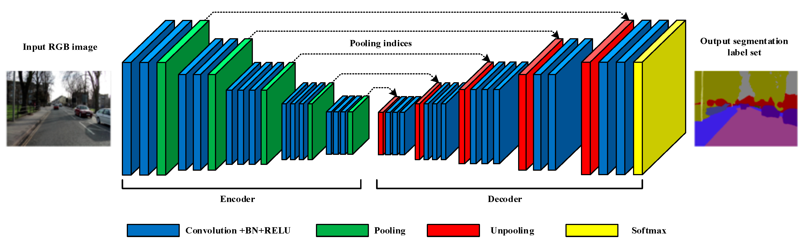

# CNN in PyTorch

Convolutional Neural Network (CNN) is the extended version of artificial neural networks (ANN) which is predominantly used to extract the feature from the grid-like matrix dataset. For example visual datasets like images or videos where data patterns play an extensive role. Convolutional Neural Network consists of multiple layers like the input layer, Convolutional layer, Pooling layer, and fully connected layers. 

 

+ Input Layers: It’s the layer in which we give input to our model. In CNN, Generally, the input will be an image or a sequence of images. This layer holds the raw input of the image.
+ Convolutional Layers: This is the layer, which is used to extract the feature from the input dataset. It applies a set of learnable filters known as the kernels to the input images. The filters/kernels are smaller matrices usually 2×2, 3×3, or 5×5 shape. it slides over the input image data and computes the dot product between kernel weight and the corresponding input image patch. The output of this layer is referred ad feature maps.
+ Activation Layer: By adding an activation function to the output of the preceding layer, activation layers add nonlinearity to the network. it will apply an element-wise activation function to the output of the convolution layer. Some common activation functions are RELU: max(0, x),  Tanh, Leaky RELU, etc.
+ Pooling layer: This layer is periodically inserted in the covnets and its main function is to reduce the size of volume which makes the computation fast reduces memory and also prevents overfitting. Two common types of pooling layers are max pooling and average pooling.
+ Flattening: The resulting feature maps are flattened into a one-dimensional vector after the convolution and pooling layers so they can be passed into a completely linked layer for categorization or regression.
+ Fully Connected Layers: It takes the input from the previous layer and computes the final classification or regression task.


 

Segmentation with PyTorch:


```python

import torch
import torch.nn as nn
import torchvision.transforms.functional as TF

class DoubleConv(nn.Module):
    def __init__(self, in_channels, out_channels):
        super(DoubleConv, self).__init__()
        self.conv = nn.Sequential(
            nn.Conv2d(in_channels, out_channels, 3, 1, 1, bias=False),
            nn.BatchNorm2d(out_channels),
            nn.ReLU(inplace=True),
            nn.Conv2d(out_channels, out_channels, 3, 1, 1, bias=False),
            nn.BatchNorm2d(out_channels),
            nn.ReLU(inplace=True),
        )

    def forward(self, x):
        return self.conv(x)

class UNET(nn.Module):
    def __init__(
            self, in_channels=3, out_channels=1, features=[64, 128, 256, 512],
    ):
        super(UNET, self).__init__()
        self.ups = nn.ModuleList()
        self.downs = nn.ModuleList()
        self.pool = nn.MaxPool2d(kernel_size=2, stride=2)

        # Down part of UNET
        for feature in features:
            self.downs.append(DoubleConv(in_channels, feature))
            in_channels = feature

        # Up part of UNET
        for feature in reversed(features):
            self.ups.append(
                nn.ConvTranspose2d(
                    feature*2, feature, kernel_size=2, stride=2,
                )
            )
            self.ups.append(DoubleConv(feature*2, feature))

        self.bottleneck = DoubleConv(features[-1], features[-1]*2)
        self.final_conv = nn.Conv2d(features[0], out_channels, kernel_size=1)

    def forward(self, x):
        skip_connections = []

        for down in self.downs:
            x = down(x)
            skip_connections.append(x)
            x = self.pool(x)

        x = self.bottleneck(x)
        skip_connections = skip_connections[::-1]

        for idx in range(0, len(self.ups), 2):
            x = self.ups[idx](x)
            skip_connection = skip_connections[idx//2]

            if x.shape != skip_connection.shape:
                x = TF.resize(x, size=skip_connection.shape[2:])

            concat_skip = torch.cat((skip_connection, x), dim=1)
            x = self.ups[idx+1](concat_skip)

        return self.final_conv(x)

def test():
    x = torch.randn((3, 1, 161, 161))
    model = UNET(in_channels=1, out_channels=1)
    preds = model(x)
    assert preds.shape == x.shape

if __name__ == "__main__":
    test()

```


resources : [PyTorch Compzter Vision](https://www.learnpytorch.io/03_pytorch_computer_vision/), I really liked adeshpande's cnn blog series meant for beginners : [CNN 1](https://adeshpande3.github.io/A-Beginner's-Guide-To-Understanding-Convolutional-Neural-Networks/), [CNN 2](https://adeshpande3.github.io/A-Beginner's-Guide-To-Understanding-Convolutional-Neural-Networks-Part-2/), [CNN 3](https://adeshpande3.github.io/The-9-Deep-Learning-Papers-You-Need-To-Know-About.html), [Writing CNNs from Scratch in PyTorch](https://blog.paperspace.com/writing-cnns-from-scratch-in-pytorch/), [from AlexNet to EfficientNet](https://theaisummer.com/cnn-architectures/), [Image Classification with Convolutional Neural Networks](https://www.youtube.com/watch?v=d9QHNkD_Pos), [Convolutional Neural Nets Explained and Implemented in Python (PyTorch)](https://youtu.be/ZBfpkepdZlw), [Vision Transformers (ViT) Explained + Fine-tuning in Python](https://youtu.be/qU7wO02urYU), [Deep Learning for Computer Vision with Python and TensorFlow ](https://youtu.be/IA3WxTTPXqQ), [PyTorch Image Segmentation Tutorial with U-NET](https://youtu.be/IHq1t7NxS8k), [Building a Convolutional Neural Network in PyTorch](https://machinelearningmastery.com/building-a-convolutional-neural-network-in-pytorch/).