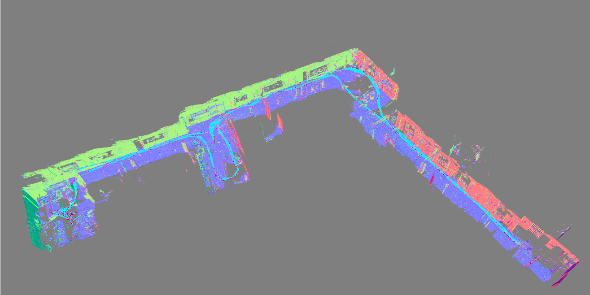

# Visual SLAM

Ok, let's code a visual SLAM systems from scratch in c++. I am learning from my notes @github/[autonomy_perception](https://github.com/florist-notes/aicore_s/blob/main/notes/perc.MD),  @github/[robotics-slam](https://github.com/florist-notes/aicore_s/blob/main/notes/robotics_ee_hardware/roboticsmech.MD) and companion guide '[Introduction to Visual SLAM](https://link.springer.com/book/10.1007/978-981-16-4939-4)' : [ [code](https://github.com/gaoxiang12/slambook2/tree/master) & [booken](https://github.com/gaoxiang12/slambook-en) ]. Example: [ORB SLAM 3](https://github.com/UZ-SLAMLab/ORB_SLAM3).

 

## Introduction to SLAM 

Monocular vs Stereo : The trajectory and map obtained from monocular SLAM estimation will differ from the actual rajectory and map with an unknown factor, which is called the scale. Since monocular SLAM can not determine this real scale purely based on images, this is also called the scale ambiguity. In monocular SLAM, depth can only be calculated with translational movement, and the real scale cannot be determined. These two things could cause significant trouble when applying monocular SLAM into real-world applications. The fundamental cause is that depth can not be determined from a single image. So, in order to obtain real-scaled depth, we start to use stereo and RGB-D cameras. A stereo camera consists of two synchronized monocular cameras, displaced with a known distance, namely the baseline. Because the physical distance of the baseline is
known, we can calculate each pixel’s 3D position in a very similar way to our human eyes.

The disadvantage of stereo cameras or multi-camera systems is that the configuration and calibration process is complicated. Their depth range and accuracy are limited by baseline length and camera resolution. Moreover, stereo matching and disparity
calculation also consume many computational resources and usually require GPU or FPGA to accelerate to generate real-time depth maps. Therefore, in most state-ofthe-art algorithms, the computational cost is still one of the major problems of stereo
cameras.

Depth camera (also known as RGB-D camera), similar to laser scanners, RGB-D cameras adopt infrared structure of light or Time-of-Flight (ToF) principles and measure the distance between objects and the camera by actively emitting light to the object and
receive the returned light. Most of the RGB-D cameras still suffer from issues including narrow measurement range, noisy data, small field of view, susceptibility to sunlight interference, and unable to measure transparent material. For SLAM purposes, RGB-D cameras are mainly used in indoor environments and are not suitable
for outdoor applications.

#### Classical Visual SLAM Framework:

A typical visual SLAM workflow includes the following steps:

 1. Sensor data acquisition. In visual SLAM, this mainly refers to for acquisition and preprocessing of camera images. For a mobile robot, this will also include the acquisition and synchronization with motor encoders, IMU sensors, etc.
   
2. Visual Odometry (VO). VO’s task is to estimate the camera movement between adjacent frames (ego-motion) and generate a rough local map. VO is also known as the frontend.
   
3. Backend filtering/optimization. The backend receives camera poses at different time stamps from VO and results from loop closing, and then applies optimization to generate a fully optimized trajectory and map. Because it is connected after the VO, it is also known as the backend.
   
4. Loop Closing. Loop closing determines whether the robot has returned to its previous position in order to reduce the accumulated drift. If a loop is detected, it will provide information to the backend for further optimization.
   
5. Reconstruction. It constructs a task-specific map based on the estimated camera trajectory. 

<b> Visual Odometry :</b> In order to quantify a camera’s movement, we must first understand the geometric relationship between a camera and the spatial points. VO can estimate camera motions from images of adjacent frames and restore the 3D structures of the scene. Now, assuming that we have the visual odometry, we are able to estimate camera movements between every two successive frames. If we connect the adjacent movements, this naturally constitutes the robot trajectory movement and addresses the localization problem.

<b>Backend Optimization :</b> Generally speaking, backend optimization mainly refers to the process of dealing with the noise in SLAM systems.  The backend optimization solves
the problem of estimating the state of the entire system from noisy input data and calculate their uncertainty. The state here includes both the robot’s own trajectory and the environment map.

SLAM problem: the estimation of the uncertainty of the self-movement and the surrounding environment.

 In order to solve the SLAM problem, we need state estimation theory to express the uncertainty of localization and map construction and then use filters or nonlinear optimization to estimate the mean and uncertainty (covariance) of the states.

<b>Loop Closing :</b> Loop Closing, also known as loop closure detection, mainly addresses the drifting problem of position estimation in SLAM. In this way, if we have sufficient and reliable loop detection, we can eliminate cumulative errors and
get globally consistent trajectories and maps.

<b>Mapping :</b> Mapping means the process of building a map, whatever kind it is. A collection of spatial points can be called a map.  The form of the map depends on the application of SLAM. In general, they can be divided into to categories: metrical maps and topological maps.

 + Metric Maps: Metrical maps emphasize the exact metrical locations of the objects in maps. They are usually classified as either sparse or dense. Sparse metric maps store the scene into a compact form and do not express all the objects. For example, we can construct a sparse map by selecting representative landmarks such as the lanes and traffic signs and ignore other parts. In contrast, dense metrical maps focus on modeling all the things that are seen. A sparse map would be enough for localization, while for navigation, a dense map is usually needed (otherwise, we may hit a wall between two landmarks). 
  
+ Topological Maps: A topological map is a graph composed of nodes and edges, only considering the connectivity between nodes. For instance, we only care about that point A and point B are connected, regardless of how we could travel from point A to point B. 

#### Mathematical Formulation of SLAM Problems:

motion equation :  x is position, u is the input, w is noise.

$$    x_k = f( x_k-_1, u_k, w_k ) $$

The presence of noise turns this model into a stochastic model. 

observation equation :  landmark point y at x and generates an observation data z. v is the noise.

$$    z_k,_j = h( y_j, x_k, v_k,_j ) $$

Suppose our robot moves in a plane, then its pose is described by two x − y coordinates and an angle. i.e, :

$$    x_k = [ x_1, x_2, θ ]^T_k $$

At the same time, the input command is the position and angle change between the time interval: 

$$    u_k = [ \Delta x_1, \Delta x_2, \Delta θ ]^T_k $$

so the motion equation can be parameterized as:

$$  \begin{bmatrix} x_1 x_2 θ \end{bmatrix}_k $$ 

equals

$$ \begin{bmatrix} x_1  x_2  θ  \end{bmatrix}_{k-1} + \begin{bmatrix} \Delta x_1  \Delta x_2 \Delta θ \end{bmatrix}_k + W_k  $$

where w_k is noise.

We know that a laser observes a 2D landmark by measuring two quantities: the distance r between the landmark point and the robot, and the angle φ.   Let’s say the landmark is at

$$ y_j = [y_1, y_2]^T_j $$

 the pose is 

$$ x_k = [x_1, x_2]^T_k $$

, and the observed data is 

$$ z_{k,j} = [r_{k,j}, φ_{k,j}]^T $$

, then the observation equation is written as:

$$ \begin{bmatrix} r_{k,j}   φ_{k,j} \end{bmatrix}  $$ 

equals

$$ \begin{bmatrix} \sqrt{(y_{1,j}-x_{1,k})^2 - (y_{2,j}-x_{2,k})^2} ;  arctan ( \frac{(y_{2,j}-x_{2,k})}{(y_{1,j}-x_{1,k})} )  \end{bmatrix}  $$

SLAM process can be summarized into two basic equations: 

$$  \begin{cases} x_k = f (x_{k−1}, u_k , w_k ), k = 1,..., K ; z_{k,j} = h(y_j, x_k , v_{k,j}), (k, j) ∈ O \end{cases} $$

where O is a set that contains the information at which pose the landmark was
observed. These two equations together describe a basic SLAM problem: how to solve the estimate x (localization) and y (mapping) problem with the noisy control input u and the sensor reading z data?  we have modeled the SLAM problem as a state estimation problem. How to estimate the internal, hidden state variables through the noisy measurement data?

The solution to the state estimation problem is related to the two equations’ specific form and the noise probability distribution. Whether the motion and observation equations are linear and whether the noise is assumed to be Gaussian, it is divided into linear/nonlinear and Gaussian/non-Gaussian systems. The Linear Gaussian (LG system) is the simplest, and its unbiased optimal estimation can be given by the Kalman Filter (KF). In the complex nonlinear non-Gaussian (NLNG system), we basically rely on two methods: Extended Kalman Filter (EKF) and nonlinear optimization. Today, the mainstream of visual SLAM uses state-of-the-art optimization techniques represented by graph optimization [[Visual SLAM: Why Filter?](https://www.doc.ic.ac.uk/~ajd/Publications/strasdat_etal_ivc2012.pdf)]. [Past, Present, and Future of Simultaneous Localization And Mapping: Towards the Robust-Perception Age](https://arxiv.org/pdf/1606.05830.pdf).

### 3D Rigid Body Motion : ([NOTES](./3drigid.MD))

Overview of a SLAM system. It describes each module of a
typical SLAM system and explains what to do and how to do it. 
### Lie Group and Lie Algebra : ([NOTES](./lieg.MD))

Lie group and Lie algebra. Lie group manipulation with [Sophus](https://github.com/strasdat/Sophus).

### Cameras and Images : ([NOTES](./cami.MD))

Pinhole camera model and image expression in computer. [OpenCV](https://opencv.org/) to retrieve the camera’s intrinsic and extrinsic parameters and
generate a point cloud using the depth information through [Point Cloud Library](https://pointclouds.org/) (PCL) .
### Nonlinear Optimization :  ([NOTES](./nonlinop.MD))

 Nonlinear optimization, including state estimation, least squares, and gradient descent methods, e.g., Gauss-Newton and Levenburg-Marquardt method. Curve-fitting problem using the [Ceres](http://ceres-solver.org/) and [g2o](https://github.com/RainerKuemmerle/g2o) library.

## SLAM Technologies 

### Visual Odometry :

Feature-based visual odometry, which is currently the mainstream
in VO. Feature extraction and matching, epipolar geometry calculation, Perspective-n-Point (PnP) algorithm, Iterative Closest Point (ICP) algorithm, and Bundle Adjustment (BA), etc. OpenCV functions or constructing our own optimization problem in Ceres and g2o.

 Direct (or intensity-based) method for VO ; Optical flow principle and the direct method. Writing single layer and multi-layer optical flow and direct method to implement a two-view VO.

### Filters and Optimization Approaches :

Bundle Adjustment in detail and show the relationship between its sparse structure and the corresponding graph model. Ceres and g2o separately to solve the same BA problem.

Pose graph in the backend optimization. Pose graph is a more
compact representation for BA, which converts all map points into constraints between keyframes. g2o to optimize a pose graph.

### Loop Closure :

Loop closure detection, mainly Bag-of-Word (BoW) based method.
Use DBoW3 to train a dictionary from images and detect loops in
videos.

### Dense Reconstruction :

 Estimate the depth of pixels in monocular SLAM (and show why they are unreliable). Compared with monocular depth estimation, building a dense map with RGB-D cameras is much easier. Write programs for epipolar line search and patch matching to estimate depth from monocular images and then build a point cloud map and octagonal treemap from RGB-D data.

### SLAM Discussion:

 Open source SLAM systems : MonoSLAM, PTAM, ORB-SLAM Series, LSD-SLAM, SVO, RTAB-MAP ; IMU-Integrated VSLAM, Semantic SLAM.

 <table width=100%>
  <tr>
  <th>Name (Sensors∗)</th>
  <th>Name (Sensors∗)</th>
  </tr>
  <tr>
  <td>

  [MonoSLAM](https://github.com/hanmekim/SceneLib2) (M)
  </td>
  <td>

  [PTAM](http://www.robots.ox.ac.uk/~gk/PTAM/) (M)
  </td>
  </tr>
 

 
  <tr>
  <td>

  [ORB-SLAM](http://webdiis.unizar.es/~raulmur/orbslam/) (M/S/R)
  </td>
  <td>

  [LSD-SLAM](http://vision.in.tum.de/research/vslam/lsdslam) (M)
  </td>
  </tr>
  <tr>
  <td>

  [SVO](https://github.com/uzh-rpg/rpg_svo) (M)
  </td>
  <td>

  [DTAM](https://github.com/anuranbaka/OpenDTAM) (R)
  </td>
  </tr>

  
  <tr>
  <td>

  [DVO](https://github.com/tum-vision/dvo_slam) (R)
  </td>
  <td>

  [DSO](https://github.com/JakobEngel/dso) (M)
  </td>
  </tr>
  <tr>
  <td>

  [VINS](https://github.com/HKUST-Aerial-Robotics/VINS-Mono) (M+IMU)
  </td>
  <td>

  [RTAB-MAP](https://github.com/introlab/rtabmap) (S/R)
  </td>
  </tr>

  
  <tr>
  <td>

  [RGBD-SLAM-V2](https://github.com/felixendres/rgbdslam_v2) (R)
  </td>
  <td>

  [Elastic fusion](https://github.com/mp3guy/ElasticFusion) (R)
  </td>
  </tr>
  <tr>
  <td>

  [Hector SLAM](http://wiki.ros.org/hector_slam) (L)
  </td>
  <td>

  [GMapping](http://wiki.ros.org/gmapping) (L)
  </td>
  </tr>

  
  
  <tr>
  <td>

  [OKVIS](https://github.com/ethz-asl/okvis) (M/S+IMU)
  </td>
  <td>

  [ROVIO](https://github.com/ethz-asl/rovio) (M+IMU)
  </td>
  </tr>

 </table>

 ∗M=Monocular, S=Stereo, R=RGB-D, L=Lidar

 When the movement is too fast, the rolling shutter camera will have a motion
blur. The overlapping area between two frames is too small to perform any feature
matching, so pure visual SLAM is very weak against the fast movement. With
IMU, we can still maintain the pose estimation even when the camera images are
invalid, which is not possible with pure visual SLAM. In summary, we see that IMU provides a better solution for fast motion, and the camera can solve the drift problem of IMU under slow motion. 

 Semantics help SLAM. Traditional object recognition and segmentation algorithms often only consider one image, while in SLAM, we have a moving camera.
If we put object labels on all the pictures during the movement, we can get a labeled
map. Also, object information can bring more conditions for loop detection and
BA optimization.