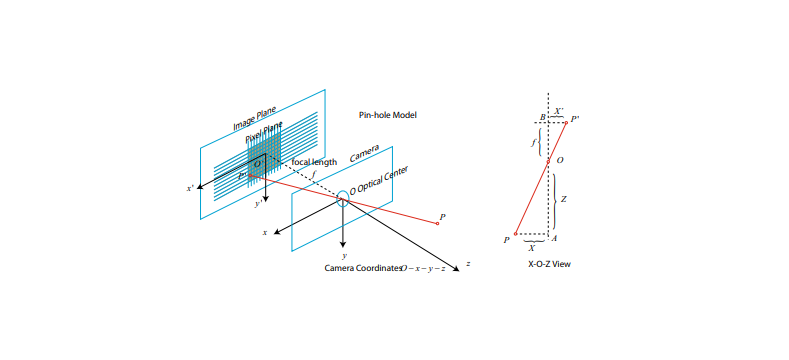

# Cameras and Images :

Goal: Learn the models of the pinhole camera, intrinsics, extrinsics, and distortion.  Learn how to project a spatial point into image planes and  basic image process in OpenCV.


Pinhole Camera Geometry:

 

Stereo Cameras : The pinhole camera model describes the imaging model of a single camera. However, we cannot determine the specific location of a spatial point only by a single pixel. This is because all points on the line from the camera’s optical center to the normalized plane can be projected onto that pixel. Only when the depth of P is determined (such as through a binocular or RGB-D camera) can we know exactly its spatial location. We need Stereo camera.

RGB-D Cameras :  The current RGB-D cameras can be divided into two categories according to their principles.

1. The first kind of RGB-D sensor uses structured infrared light to measure pixel
distance. Many of the old RGB-D sensors are belong to this kind, for example,
the Kinect 1st generation, Project Tango 1st generation, Intel RealSense, etc.
2. The second kind measures pixel distance using the time-of-flight (ToF). Examples
are Kinect 2 and some existing ToF sensors in cellphones

Regardless of the type, the RGB-D camera needs to emit a light beam (usually infrared light) to the target object. In the structured light principle, the camera calculates the distance between the object and itself based on the returned structured light pattern. In the ToF principle, the camera emits a light pulse to the target and then determines the distance according to the beam’s time of flight. The ToF principle is very similar to the laser sensor, except that the laser obtains the distance by scanning point by point (or line by line). The ToF camera can obtain the entire image’s pixel depth, which is also the RGB-D camera’s main advantage. So, if you take apart an RGB-D camera, you will usually find that there will be at least one transmitter and one receiver in addition to the ordinary camera.


Practice: 3D Vision  ( Stereo Vision ):

We start from the left and right images, calculate the disparity map corresponding to the left eye, and then calculate each pixel’s coordinates in the camera coordinate system, which will form a point cloud. SGBM (Semi-global Batch Matching) algorithm implemented by OpenCV to calculate the disparity of the left and right images and
then transform it into the 3D space of the camera through the geometric model of the binocular camera.

```cpp

#include <opencv2/opencv.hpp>
#include <vector>
#include <string>
#include <Eigen/Core>
#include <pangolin/pangolin.h>
#include <unistd.h>

using namespace std;
using namespace Eigen;

// file path
string left_file = "./left.png";
string right_file = "./right.png";

// Drawing in pangolin, already written, no need to adjust
void showPointCloud(
     const vector<Vector4d, Eigen::aligned_allocator<Vector4d>> &pointcloud);

int main(int argc, char **argv) {

     // internal reference
     double fx = 718.856, fy = 718.856, cx = 607.1928, cy = 185.2157;
     // baseline
     double b = 0.573;

     // read image
     cv::Mat left = cv::imread(left_file, 0);
     cv::Mat right = cv::imread(right_file, 0);
     cv::Ptr<cv::StereoSGBM> sgbm = cv::StereoSGBM::create(
         0, 96, 9, 8 * 9 * 9, 32 * 9 * 9, 1, 63, 10, 100, 32); // magic parameter
     cv::Mat disparity_sgbm, disparity;
     sgbm->compute(left, right, disparity_sgbm);
     disparity_sgbm.convertTo(disparity, CV_32F, 1.0 / 16.0f);

     // generate point cloud
     vector<Vector4d, Eigen::aligned_allocator<Vector4d>> pointcloud;

     // If your machine is slow, please change the following v++ and u++ to v+=2, u+=2
     for (int v = 0; v < left.rows; v++)
         for (int u = 0; u < left.cols; u++) {
             if (disparity.at<float>(v, u) <= 0.0 || disparity.at<float>(v, u) >= 96.0) continue;

             Vector4d point(0, 0, 0, left.at<uchar>(v, u) / 255.0); 
             // The first three dimensions are xyz, and the fourth dimension is color

             // Calculate the position of the point according to the binocular model
             double x = (u - cx) / fx;
             double y = (v - cy) / fy;
             double depth = fx * b / (disparity. at<float>(v, u));
             point[0] = x * depth;
             point[1] = y * depth;
             point[2] = depth;

             pointcloud.push_back(point);
         }

     cv::imshow("disparity", disparity / 96.0);
     cv::waitKey(0);
     // draw point cloud
     showPointCloud(pointcloud);
     return 0;
}

void showPointCloud(const vector<Vector4d, Eigen::aligned_allocator<Vector4d>> &pointcloud) {

     if (pointcloud. empty()) {
         cerr << "Point cloud is empty!" << endl;
         return;
     }

     pangolin::CreateWindowAndBind("Point Cloud Viewer", 1024, 768);
     glEnable(GL_DEPTH_TEST);
     glEnable(GL_BLEND);
     glBlendFunc(GL_SRC_ALPHA, GL_ONE_MINUS_SRC_ALPHA);

     pangolin::OpenGlRenderState s_cam(
         pangolin::ProjectionMatrix(1024, 768, 500, 500, 512, 389, 0.1, 1000),
         pangolin::ModelViewLookAt(0, -0.1, -1.8, 0, 0, 0, 0.0, -1.0, 0.0)
     );

     pangolin::View &d_cam = pangolin::CreateDisplay()
         .SetBounds(0.0, 1.0, pangolin::Attach::Pix(175), 1.0, -1024.0f / 768.0f)
         .SetHandler(new pangolin::Handler3D(s_cam));

     while (pangolin::ShouldQuit() == false) {
         glClear(GL_COLOR_BUFFER_BIT | GL_DEPTH_BUFFER_BIT);

         d_cam.Activate(s_cam);
         glClearColor(1.0f, 1.0f, 1.0f, 1.0f);

         glPointSize(2);
         glBegin(GL_POINTS);
         for (auto &p: pointcloud) {
             glColor3f(p[3], p[3], p[3]);
             glVertex3d(p[0], p[1], p[2]);
         }
         glEnd();
         pangolin::FinishFrame();
         usleep(5000); // sleep 5 ms
     }
     return;
}

```

RGB-D Vision (RGB-D):

Below we write a program to accomplish two things: (1) We calculate the point cloud corresponding to each pair of RGB-D images based on internal parameters; (2) According to the camera pose of each image, we put the points to a global cloud
by the camera poses.

```cpp

#include <iostream>
#include <fstream>
using namespace std;
#include <opencv2/core/core.hpp>
#include <opencv2/highgui/highgui.hpp>
#include <Eigen/Geometry>
#include <boost/format.hpp> // for formatting strings
#include <pcl/point_types.h>
#include <pcl/io/pcd_io.h>
#include <pcl/visualization/pcl_visualizer.h>

int main( int argc, char** argv )
{
     vector<cv::Mat> colorImgs, depthImgs; // color image and depth image
     vector<Eigen::Isometry3d, Eigen::aligned_allocator<Eigen::Isometry3d>> poses; // camera pose
    
     ifstream fin("./pose.txt");
     if (!fin)
     {
         cerr<<"Please run this program in the directory with pose.txt"<<endl;
         return 1;
     }
    
     for ( int i=0; i<5; i++ )
     {
         boost::format fmt( "./%s/%d.%s" ); //image file format
         colorImgs.push_back( cv::imread( (fmt%"color"%(i+1)%"png").str() ));
         depthImgs.push_back( cv::imread( (fmt%"depth"%(i+1)%"pgm").str(), -1 )); 
         // use -1 to read the original image
        
         double data[7] = {0};
         for ( auto& d:data )
             fin>>d;
         Eigen::Quaterniond q( data[6], data[3], data[4], data[5] );
         Eigen::Isometry3d T(q);
         T.pretranslate( Eigen::Vector3d( data[0], data[1], data[2] ));
         poses. push_back( T );
     }
    
     // Calculate the point cloud and stitch it
     // internal parameters of the camera
     double cx = 325.5;
     double cy = 253.5;
     double fx = 518.0;
     double fy = 519.0;
     double depthScale = 1000.0;
    
     cout<<"Converting image to point cloud..."<<endl;
    
     // Define the format used by the point cloud: XYZRGB is used here
     typedef pcl::PointXYZRGB PointT;
     typedef pcl::PointCloud<PointT> PointCloud;
    
     // Create a new point cloud
     PointCloud::Ptr pointCloud( new PointCloud );
     for ( int i=0; i<5; i++ )
     {
         cout<<"Conversion image: "<<i+1<<endl;
         cv::Mat color = colorImgs[i];
         cv::Mat depth = depthImgs[i];
         Eigen::Isometry3d T = poses[i];
         for ( int v=0; v<color.rows; v++ )
             for ( int u=0; u<color.cols; u++ )
             {
                 unsigned int d = depth.ptr<unsigned short> ( v )[u]; // depth value
                 if ( d==0 ) continue; // 0 means not measured
                 Eigen::Vector3d point;
                 point[2] = double(d)/depthScale;
                 point[0] = (u-cx)*point[2]/fx;
                 point[1] = (v-cy)*point[2]/fy;
                 Eigen::Vector3d pointWorld = T*point;
                
                 PointT p ;
                 p.x = pointWorld[0];
                 p.y = pointWorld[1];
                 p.z = pointWorld[2];
                 p.b = color.data[ v*color.step+u*color.channels() ];
                 p.g = color.data[ v*color.step+u*color.channels()+1 ];
                 p.r = color.data[ v*color.step+u*color.channels()+2 ];
                 pointCloud->points.push_back( p );
             }
     }
    
     pointCloud->is_dense = false;
     cout<<"The point cloud has a total of "<<pointCloud->size()<<" points."<<endl;
     pcl::io::savePCDFileBinary("map.pcd", *pointCloud);
     return 0;
}

```

We can see the point cloud in Pangolin after building it.