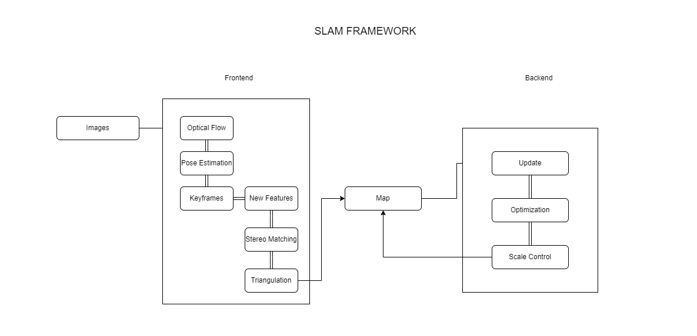

# End-to-End SLAM System :

Knowing the principles of bricks and cement does not mean that you can build a
grand palace. We will implement a simplified version of stereo VO and then see its running effect in the [Kitti dataset](https://www.cvlibs.net/datasets/kitti/eval_odometry.php). This VO consists of a frontend of optical flow tracking and a backend of sliding window BA.

Goal :
+ Implement a stereo visual SLAM from scratch.
+ Understand the problems that are prone to occur in VO and how to fix them.

Framework of the system:

1. `bin` stores the compiled binary file;
2. `include/myslam` stores the header files of the SLAM module.
3. `src` stores the source code files, mainly .cpp files.
4. `test` stores the files used for testing, which are also .cpp files.
5. `config` stores the configuration files.
6. `cmake_modules` saves the cmake files of third-party libraries, which are used by
libraries such as g2o.


We just determined the location of the code file.

+ The most basic unit we deal with is the image. In stereo VO, that is a pair of
images. We might as well call it a frame.
+ We will detect visual features on the frame. These features are many 2D pixels.
+ If we see a feature multiple times, we use the triangulation method to calculate its 3D position, which forms the landmarks or map points.

### System  Pipeline :

 So overall, our program has two essential modules:

 

  + <b> Frontend : </b> We get an image frame from the sensor, and the frontend is responsible
for extracting the features in the image. It then performs optical flow tracking or
feature matching with the previous frame and calculates the frame’s position based
on the optical flow result. If necessary, new feature points should be added and
triangulated. The result of the frontend processing will be used as the initial value
of the backend optimization.
  + <b> Backend </b> The backend is a slower thread. It gets the processed keyframes and landmark points, optimizes them, and then returns the optimized results. The backend
should control the optimization problem’s scale within a certain range and cannot
keep growing over time.

We put a map module between the front and backends to handle the data flow between them. Since the front and backends process data in separate threads, the interaction process should be: (1)
The frontend adds new data to the map after finding a new keyframe. (2) When the
backend detects that the map has new data, it runs an optimization routine and then
resets the map scale. The old keyframes and map points are removed if necessary.


We have determined the general system flow, which will help the subsequent coding realization. Of course, in addition to the core algorithm, we also need some small peripheral modules to make the system more convenient, such as:

  + We should have a camera class to manage the intrinsic and extrinsics as well as the projection functions.
  + We need a configuration file management class to facilitate reading content from configuration files. Some critical parameters can be store in the configuration file for quick debugging;
  + Because the algorithm runs on the Kitti dataset, we need to read the image data according to Kitti’s storage format, which should also be handled by a separate class.
  + We need a visualization module to observe the running status of the system. Otherwise, we have to scratch our heads against a series of numeric values.


## Implement the Basic Data Structure :

The frame struct is : 

```cpp

#pragma once

#ifndef MYSLAM_FRAME_H
#define MYSLAM_FRAME_H

#include "myslam/camera.h"
#include "myslam/common_include.h"

namespace myslam {

// forward declare
struct MapPoint;
struct Feature;

/**
  * frame
  * Each frame is assigned an independent id, and the key frame is assigned a key frame ID
  */
struct Frame {
    public:
     EIGEN_MAKE_ALIGNED_OPERATOR_NEW;
     typedef std::shared_ptr<Frame> Ptr;

     unsigned long id_ = 0; // id of this frame
     unsigned long keyframe_id_ = 0; // id of keyframe
     bool is_keyframe_ = false; // Whether it is a keyframe
     double time_stamp_; // Timestamp, not used yet
     SE3 pose_; // Tcw form Pose
     std::mutex pose_mutex_; // Pose data lock
     cv::Mat left_img_, right_img_; // stereo images

     // extracted features in left image
     std::vector<std::shared_ptr<Feature>> features_left_;
     // corresponding features in right image, set to nullptr if no corresponding
     std::vector<std::shared_ptr<Feature>> features_right_;

    public: // data members
     Frame() {}

     Frame(long id, double time_stamp, const SE3 &pose, const Mat &left,
           const Mat &right);

     // set and get pose, thread safe
     SE3 Pose() {
         std::unique_lock<std::mutex> lck(pose_mutex_);
         return pose_;
     }

     void SetPose(const SE3 &pose) {
         std::unique_lock<std::mutex> lck(pose_mutex_);
         pose_ = pose;
     }

     /// Set the keyframe and assign and keyframe id
     void SetKeyFrame();

     /// Factory construction mode, assign id
     static std::shared_ptr<Frame> CreateFrame();
};

} // namespace myslam

#endif // MYSLAM_FRAME_H

```

The feature struct:

```cpp

#pragma once

#ifndef MYSLAM_FEATURE_H
#define MYSLAM_FEATURE_H

#include <memory>
#include <opencv2/features2d.hpp>
#include "myslam/common_include.h"

namespace myslam {

struct Frame;
struct MapPoint;

/**
  * 2D feature points
  * will be associated with a map point after triangulation
  */
struct Feature {
    public:
     EIGEN_MAKE_ALIGNED_OPERATOR_NEW;
     typedef std::shared_ptr<Feature> Ptr;

     std::weak_ptr<Frame> frame_; // frame holding this feature
     cv::KeyPoint position_; // 2D extraction position
     std::weak_ptr<MapPoint> map_point_; // associated map point

     bool is_outlier_ = false; // Whether it is an outlier point
     bool is_on_left_image_ = true; // Whether the logo is on the left image, false is the right image

    public:
     Feature() {}

     Feature(std::shared_ptr<Frame> frame, const cv::KeyPoint &kp)
         : frame_(frame), position_(kp) {}
};
} // namespace myslam

#endif // MYSLAM_FEATURE_H

```

Finally the map point, or the landmark:

```cpp

#pragma once
#ifndef MYSLAM_MAPPOINT_H
#define MYSLAM_MAPPOINT_H

#include "myslam/common_include.h"

namespace myslam {

struct Frame;

struct Feature;

/**
  * Waypoint class
  * Feature points form landmark points after triangulation
  */
struct MapPoint {
    public:
     EIGEN_MAKE_ALIGNED_OPERATOR_NEW;
     typedef std::shared_ptr<MapPoint> Ptr;
     unsigned long id_ = 0; //ID
     bool is_outlier_ = false;
     Vec3 pos_ = Vec3::Zero(); // Position in world
     std::mutex data_mutex_;
     int observed_times_ = 0; // being observed by feature matching algo.
     std::list<std::weak_ptr<Feature>> observations_;

     MapPoint() {}

     MapPoint(long id, Vec3 position);

     Vec3 Pos() {
         std::unique_lock<std::mutex> lck(data_mutex_);
         return pos_;
     }

     void SetPos(const Vec3 &pos) {
         std::unique_lock<std::mutex> lck(data_mutex_);
         pos_ = pos;
     };

     void AddObservation(std::shared_ptr<Feature> feature) {
         std::unique_lock<std::mutex> lck(data_mutex_);
         observations_.push_back(feature);
         observed_times_++;
     }

     void RemoveObservation(std::shared_ptr<Feature> feat);

     std::list<std::weak_ptr<Feature>> GetObs() {
         std::unique_lock<std::mutex> lck(data_mutex_);
         return observations_;
     }

     // factory function
     static MapPoint::Ptr CreateNewMappoint();
};
} // namespace myslam

#endif // MYSLAM_MAPPOINT_H

```

The most important thing about MapPoint is its 3D position, which is the pos_
variable, also needs to be locked. Its observation_ variable records the features that
observed this map point. Because the feature may be judged as an outlier, it needs to
be locked when the observation part is changed.
So far, we have realized the basic data structure. In the framework, we let the map
class actually hold these frame and map point objects, so we also need to define a
map class:

```cpp

#pragma once
#ifndef MAP_H
#define MAP_H

#include "myslam/common_include.h"
#include "myslam/frame.h"
#include "myslam/mappoint.h"

namespace myslam {

/**
  * @brief map
  * Interaction with the map: the front end calls InsertKeyframe and InsertMapPoint to insert new frames and map points, the back end maintains the structure of the map, determines outlier/elimination, etc.
  */
class Map {
    public:
     EIGEN_MAKE_ALIGNED_OPERATOR_NEW;
     typedef std::shared_ptr<Map> Ptr;
     typedef std::unordered_map<unsigned long, MapPoint::Ptr> LandmarksType;
     typedef std::unordered_map<unsigned long, Frame::Ptr> KeyframesType;

     Map() {}

     /// Add a keyframe
     void InsertKeyFrame(Frame::Ptr frame);
     /// Add a map vertex
     void InsertMapPoint(MapPoint::Ptr map_point);

     /// Get all map points
     LandmarksType GetAllMapPoints() {
         std::unique_lock<std::mutex> lck(data_mutex_);
         return landmarks_;
     }
     /// Get all keyframes
     KeyframesType GetAllKeyFrames() {
         std::unique_lock<std::mutex> lck(data_mutex_);
         return keyframes_;
     }

     /// Get the active map point
     LandmarksType GetActiveMapPoints() {
         std::unique_lock<std::mutex> lck(data_mutex_);
         return active_landmarks_;
     }

     /// Get the active keyframe
     KeyframesType GetActiveKeyFrames() {
         std::unique_lock<std::mutex> lck(data_mutex_);
         return active_keyframes_;
     }

     /// Clear the points in the map where the number of observations is zero
     void CleanMap();

    private:
     // set the old keyframe as inactive
     void RemoveOldKeyframe();

     std::mutex data_mutex_;
     LandmarksType landmarks_; // all landmarks
     LandmarksType active_landmarks_; // active landmarks
     KeyframesType keyframes_; // all key-frames
     KeyframesType active_keyframes_; // all key-frames

     Frame::Ptr current_frame_ = nullptr;

     // settings
     int num_active_keyframes_ = 7; // number of active keyframes
};
} // namespace myslam

#endif // MAP_H

```

The map stores all keyframes and corresponding landmarks in a hash form and
maintains an activated keyframe and map point set. Here the concept of activation
is what we call the sliding window before. The backend will optimize the activated
keyframes and landmark points and fix the rest to control the optimization scale.

## Implement the Frontend

## Implement the Backend


