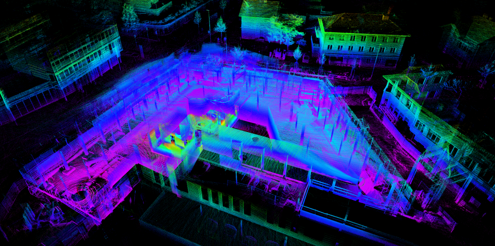

# SLAM Algorithms:

Visual SLAM (VSLAM) has been developing rapidly due to its advantages of low-cost sensors, the easy fusion of other sensors, and richer environmental information. Traditional visionbased SLAM research has made many achievements, but it may fail to achieve wished results in challenging environments. Deep learning has promoted the development of computer vision, and the combination of deep learning and SLAM has attracted more and more attention. Semantic information, as high-level environmental information, can enable robots to better understand the surrounding environment.

<table width=100%>
<tr>
<th> MonoSLAM </th>
<th> PTAM </th>
</tr>
<tr>
<td>

J. Davison’s monocular SLAM [ [paper](https://ieeexplore.ieee.org/document/4160954) and [paper 2](https://ieeexplore.ieee.org/document/1238654) ] was proposed in 2007 as the first real-time monocular visual SLAM system. MonoSLAM uses the extended Kalman filter as the backend to track very sparse feature points shi-Tomasi corner point for feature point matching on the frontend. Since EKF occupies a prominent dominant position in early SLAM, MonoSLAM is also based on EKF, using the current state of the camera and all
landmark points as the state quantity, and updating the mean and covariance of the states.

The monocular camera tracks very sparse feature points in an image using active tracking technology. In EKF, each feature’s position obeys the Gaussian distribution, so we can express its mean value and uncertainty as an ellipsoid. In the right half of the picture, we can find some small ellipsoids distributed in 3D space. If the ellipsoid looks long in a specific direction, the landmark corresponding to it is more uncertain in that direction. We can imagine
that if a feature point converges, we should see it change from a very long ellipsoid
(initially very uncertain in the Z axis of the camera system) to a small point.

This approach seems to have many drawbacks today. Still, it was already a milestone work at that time because most of the previous visual SLAM systems could
not run online.

</td>
<td>

In 2007, Klein’s team proposed PTAM (Parallel Tracking and Mapping) [ [paper](https://ieeexplore.ieee.org/document/4538852) ], which
is also an important event in the development of visual SLAM. The important significance of PTAM lies in the following two points:

+ PTAM proposed and realized the parallelization of the tracking and mapping
process. Most people think it is clear that the tracking part needs to respond to
image data in real-time, and the optimization does not need to be calculated in
real-time. Backend optimization can be done slowly in the background, and then
thread synchronization can be performed when necessary. This is the first time the concept of front and backends have been distinguished in visual SLAM, leading to the structure of many later visual SLAM systems (most of the SLAMs we see now are divided into front and backends).

+ PTAM is the first real-time solution that uses nonlinear optimization instead of
traditional filters in the backend. It introduces the keyframe mechanism: we don’t
need to process each image carefully but string together several key images and
optimize its trajectory and map. Early SLAM mostly used EKF filters or their
variants. After PTAM, visual SLAM research gradually turned to the backend
dominated by nonlinear optimization.

However, from a modern perspective, PTAM can be regarded as one of the early
SLAM work combined with AR.

</td>
</tr>

<tr>
<th>ORB-SLAM Series</th>
<th>LSD-SLAM</th>
</tr>
<tr>
<td>

ORB-SLAM [ [paper](https://arxiv.org/abs/1502.00956) ] is a very famous and it was proposed in 2015 and is one of the most complete and easy-to-use systems in modern SLAM systems (if not the most complete and easy-to-use). . ORBSLAM is a peak of the mainstream feature-based open-source SLAM. Compared
with previous work, ORB-SLAM has the following obvious advantages:

+  It supports various sensor settings: monocular, binocular, and RGB-D. For most of
the sensors, it is almost possible to test it on ORB-SLAM. It has good versatility..

+ The entire system is calculated with ORB features, including the ORB dictionary for visual odometry and loop detection. It reflects that the ORB feature is
an excellent compromise between the computing platform’s efficiency and accuracy at this stage. ORB is not as time-consuming as SIFT or SURF and can be
calculated in real-time on the CPU; compared to simple corner features such as
Harris corners, it has good rotation and scaling invariance. Also, ORB provides
descriptors that enable us to perform loop detection and relocation in a large range
of motion.

+  ORB’s loop detection is its highlight. The excellent loop closure detection algorithm ensures that ORB-SLAM effectively prevents accumulated errors and can
be quickly retrieved after being lost. Many existing SLAM systems are not perfect in the relocalization point. For this reason, ORB-SLAM needs to load a large
ORB dictionary file.

+ ORB-SLAM innovatively uses the three threads structure in SLAM: Tracking
thread for real-time tracking of feature points, optimization thread for local bundle
adjustment (co-visibility Graph, commonly known as the small graph), and global
pose graph optimization thread (essential graph, known as the big graph). The
tracking thread is responsible for extracting ORB feature points for each new
image, comparing it with the most recent keyframe, calculating the feature points’
location, and roughly estimating the camera pose. The small graph solves a local
bundle adjustment problem, including the feature points in the local space and
the camera pose. This thread is responsible for refining camera poses and spatial
locations of feature points. The tracking and local mapping threads construct good
visual odometry. The third thread, the big graph thread, performs loop detection
on the global map and keyframes to eliminate accumulated errors.
Following the two-thread structure of PTAM, the three-thread design of ORBSLAM has achieved excellent tracking and mapping effects, ensuring the global
consistency of the trajectory and the map. This three-thread structure will also be
accepted and adopted by subsequent researchers.

+  ORB-SLAM has carried out many optimizations around feature points. For example, based on OpenCV feature extraction, ORB-SLAM uniforms the distribution
of image features. When optimizing the pose, a four-iteration optimization routine is used to obtain better matches. A more relaxed keyframe selection strategy
than PTAM is also used. These small improvements make ORB-SLAM far more
robust than other solutions: even for poor scenarios and poor calibration parameters, ORB-SLAM can work smoothly.

The advantages mentioned above make ORB-SLAM reach the state-of-the-art
open-source visual SLAM system. Of course, ORB-SLAM also has some shortcomings. Since the entire SLAM system uses feature points for calculation, we must detect the ORB feature for each
image, which is very time-consuming.

</td>
<td>

LSD-SLAM (Large Scale Direct monocular SLAM) is a SLAM work [ [paper](https://link.springer.com/chapter/10.1007/978-3-319-10605-2_54), [paper 2](https://openaccess.thecvf.com/content_iccv_2013/papers/Engel_Semi-dense_Visual_Odometry_2013_ICCV_paper.pdf) ] proposed by J. Engel et al. in 2014. Analogous to ORB-SLAM to feature points, LSDSLAM marks the direct method’s successful application in monocular SLAM. The
core contribution of LSD-SLAM is to apply the direct method to semi-dense monocular SLAM. It does not need to calculate the features but can also construct a semidense map. The semi-dense means estimating the pixel position with an obvious
gradient. Its main advantages are as follows:

+ The direct method of LSD-SLAM is for pixels. The authors creatively proposed
the relationship between pixel gradient and the direct method. And also, they
note the angular relationship between pixel gradient and epipolar direction in
dense reconstruction.

+ LSD-SLAM realizes the semi-dense reconstruction on CPU. The method based on feature points can only be sparse, and most of the dense reconstruction schemes use RGB-D sensors or use GPU to build dense maps.

+ The semi-dense tracking of LSD-SLAM uses some subtle tricks to ensure the
tracking’s real-time efficiency and stability. For example, LSD-SLAM does not
use a single-pixel or image block for epipolar searching but takes five points on
the epipolar line at equal distances to measure its SSD. In the depth estimation,
LSD-SLAM first initializes the depth with random numbers and then normalizes
the depth estimation after converges. When measuring the depth uncertainty, it
considers the triangle’s geometric relationship and the angle between the epipolar
line and the image gradient. The loop closure thread uses the similarity transformation group SE(3) to express the scale explicitly, which can be used to reduce
the scale drift in monocular SLAM.

Since LSD-SLAM uses the direct tracking method, it has both the direct method’s
advantages and disadvantages. For example, LSD-SLAM is very sensitive to camera
intrinsics and exposure time and is easily lost when the camera moves quickly. Also,
in the loop detection part, LSD-SLAM still relies on the feature point method for
loop detection and has not entirely eliminated the calculation of feature points.

</td>
</tr>

<tr>
<th>SVO</th>
<th>RTAB-MAP</th>
</tr>
<tr>
<td>

SVO is the abbreviation of Semi-direct Visual Odometry [[paper](https://rpg.ifi.uzh.ch/docs/ICRA14_Forster.pdf)]. It is visual odometry
based on the sparse direct method proposed by Forster et al. in 2014. The meaning of semi-direct in the original text refers to the mixed-use of feature points and direct methods: SVO tracks some key points (corner points, no descriptors), and then, like the direct method, uses the information of these key points to estimate camera movement and the map point’s position. 
SVO uses small blocks of 4 × 4 around the key points for block matching to estimate the camera’s motion. Compared with other programs, SVO’s most significant advantage is high-speed.
Due to the use of the sparse direct method, it does not have to laboriously calculate the
descriptor, nor does it need to process as much information as dense and semi-dense approaches. So, it can achieve real-time performance even on low-level computing
platforms.
Another SVO innovation is that it puts forward the concept of depth filter and
derives a depth filter based on uniform-Gaussian mixture distribution.

</td>
<td>

RTAB-MAP (Real-Time Appearance-Based Mapping) [[paper](https://www.semanticscholar.org/paper/Online-global-loop-closure-detection-for-SLAM-Labb%C3%A9-Michaud/533d8c11c8e533c34774eff76fcbab6559ee67e4)] is a classic scheme
in RGB-D SLAM. It implements everything that should be included in RGB-D
SLAM: feature-based visual odometry, bag-of-words-based loop detection, backend
pose map optimization, and point cloud and triangular mesh maps. Therefore, RTABMAP provides a complete (but somewhat huge) RGB-D SLAM solution. At present,
we can obtain the binary program directly from ROS
</td>
</tr>

</table>

 

VSLAM has the advantage of richer environmental information and is considered to be able to give mobile robots stronger perceptual ability and be applied in some specific scenarios.

 In Section 1, this note introduces the characteristics of traditional VSLAM in detail, including the direct method and the indirect method based on the front-end vision odometer, and makes a comparison between the depth camera-based VSLAM and the classical VSLAM integrated with IMU. In Section 2, this note is divided into two parts. We firstly go through the combination of deep learning and VSLAM from two neural networks, CNN and RNN. So this note summarizes the development direction of semantic VSLAM from three aspects of localization, mapping, and elimination of dynamic objects. 

 VSLAM can be divided into Traditional VSLAM ( Monocular / Stero vSLAM, RGB-D vSLAM { vSLAM based on feature based method and vSLAM based on direct method } , Visual Inertial SLAM { Loosely Coupled Visual Inertial and Tightly Coupled Visual Inertial } ) and Semantic VSLAM.

 The sensors used in the VSLAM typically include the monocular camera, stereo camera, and RGB-D camera. The monocular camera and the stereo camera have similar principles and can be used in a wide range of indoor and outdoor environments. As a special form of camera, the RGB-D camera can directly obtain image depth mainly by actively emitting infrared structured light or calculating time-of-flight (TOF). It is convenient to use, but sensitive to light, and can only be used indoors in most cases. Events camera as appeared in recent years, a new camera sensor, a picture of a different from the traditional camera. Events camera is “events”, can be as simple as “pixel brightness change”. The change of events camera output is pixel brightness, SLAM algorithm based on the event camera is still only in the preliminary study stage. TE (Absolute Trajectory Error) and RPE (Relative Pose Error) are the two most important indicators used to evaluate the accuracy of SLAM. The relative pose error is used to calculate the difference of pose changes in the same two-time stamps, which is suitable for estimating system drift. The absolute trajectory error directly calculates the difference between the real value of the camera pose and the estimated value of the SLAM system. 

 <b> ATE:</b> The absolute trajectory error is the direct difference between the estimated pose and the real pose, which can directly reflect the accuracy of the algorithm and the global trajectory consistency. It should be noted that the estimated pose and ground truth are usually not in the same coordinate system, so we need to pair them first: For stereo SLAM and RGB-D SLAM, the scale is uniform, so we need to calculate a transformation matrix from the estimated pose to the real pose by the least square method S ∈ SE (3). For monocular cameras with scale uncertainties, we need to calculate a similar transformation matrix S∈ Sim (3) from the estimated pose to the real pose. 

 
###  Traditional VSLAM:

#### Monocular/Stereo VSLAM: 

VSLAM can be divided into the direct method and indirect method according to the different image information collected by the front-end visual odometer. The indirect method needs to select a certain number of representative points from the collected images, called key points, and detect and match them in the following images to gain the camera pose. It not only saves the key information of the image but also reduces the amount of calculation, so it is widely used. The direct method uses all the information of the image without preprocessing and directly operates on pixel intensity, which has higher robustness in an environment with sparse texture. 

##### VSLAM Based on the Feature-Based Method : 

The core of indirect VSLAM is to detect, extract and match geometric features( points, lines, or planes), estimate camera pose, and build an environment map while retaining important information, it can effectively reduce calculation.

Feature extraction mostly adopted corner extraction methods in the early, such as Harris [[paper](https://citeseerx.ist.psu.edu/document?repid=rep1&type=pdf&doi=88cdfbeb78058e0eb2613e79d1818c567f0920e2)], FAST [[paper](https://link.springer.com/chapter/10.1007/11744023_34%C2%A0)], GFTT [[paper](https://cir.nii.ac.jp/crid/1570009751070388480)], etc. However, in many scenarios, simple corners cannot provide reliable features, which prompts researchers to seek more stable local image features. Nowadays, typical VSLAM methods based on point features firstly use feature detection algorithms, such as SIFT [[paper](https://link.springer.com/article/10.1023/B:VISI.0000029664.99615.94)], SURF [[paper](https://www.sciencedirect.com/science/article/abs/pii/S1077314207001555)], and ORB [[paper](https://ieeexplore.ieee.org/abstract/document/6126544/)], to extract key points in the image for matching. Then gain pose after minimizing reprojection error. Feature points and corresponding descriptors in the image are employed for data association.

Comparison table of commonly used feature extraction algorithms:

<table width=100%>
<tr>
<th>Method</th>
<th>Year</th>
<th>Type</th>
<th>Speed</th>
<th>Rotation Invariance</th>
<th>Scale Invariance</th>
<th>Illumination Invariance</th>
<th>Anti Invariance</th>
</tr>
<tr>
<td>

ORB [[paper](https://ieeexplore.ieee.org/abstract/document/6126544)]
</td>
<td>2011</td>
<td>Point</td>
<td>High</td>
<td>Yes</td>
<td>Yes</td>
<td>Yes</td>
<td>Stronger</td>
</tr>
<tr>
<td>

SURF [[paper](https://www.sciencedirect.com/science/article/abs/pii/S1077314207001555)]
</td>
<td>2008</td>
<td>Point</td>
<td>Middle</td>
<td>Yes</td>
<td>Yes</td>
<td>No</td>
<td>Weak</td>
</tr>
<tr>
<td>

FAST [[paper](https://link.springer.com/chapter/10.1007/11744023_34%C2%A0)]
</td>
<td>2006</td>
<td>Point</td>
<td>High</td>
<td>No</td>
<td>Yes</td>
<td>No</td>
<td>Weak</td>
</tr>
<tr>
<td>

SIFT [[paper](https://link.springer.com/article/10.1023/B:VISI.0000029664.99615.94)]
</td>
<td>2004</td>
<td>Point</td>
<td>Low</td>
<td>Yes</td>
<td>Yes</td>
<td>Yes</td>
<td>Strong</td>
</tr>
<tr>
<td>

Shi Tomasi / GFTT [[paper](https://cir.nii.ac.jp/crid/1570009751070388480)]
</td>
<td>1994</td>
<td>Corner</td>
<td>Middle</td>
<td>Yes</td>
<td>No</td>
<td>Yes</td>
<td>Week</td>
</tr>
<tr>
<td>

Harris [[paper](https://citeseerx.ist.psu.edu/document?repid=rep1&type=pdf&doi=88cdfbeb78058e0eb2613e79d1818c567f0920e2)]
</td>
<td>1988</td>
<td>Corner</td>
<td>Low</td>
<td>Yes</td>
<td>No</td>
<td>Yes</td>
<td>Weak</td>
</tr>
<tr>
<td>

LSD [[paper](https://jakobengel.github.io/pdf/engel14eccv.pdf)]
</td>
<td>2010</td>
<td>Line</td>
<td>Middle</td>
<td>Yes</td>
<td>Yes</td>
<td>Yes</td>
<td>Stronger</td>
</tr>
</table>

The commonly used line feature extraction algorithm is LSD.

SLAM Algorithms : MonoSLAM [[paper](https://ieeexplore.ieee.org/abstract/document/4160954)] in 2007, PTAM [[paper](https://ieeexplore.ieee.org/abstract/document/4538852)] in 2007, LineSLAM [[paper](https://link.springer.com/chapter/10.1007/978-3-319-03413-3_49)] in 2014, ORB-SLAM [[paper](https://ieeexplore.ieee.org/abstract/document/7219438)] in 2015, ORB SLAM 2 [[paper](https://ieeexplore.ieee.org/abstract/document/7946260)] in 2017, monocular PL SLAM [[paper](https://ieeexplore.ieee.org/abstract/document/7989522)] in 2017, stereo PL SLAM [[paper](https://ieeexplore.ieee.org/abstract/document/8680013)] in 2017, ORB SLAM 3 [[paper](https://ieeexplore.ieee.org/abstract/document/9440682)] in 2021.

 The ORB-SLAM family is one of the most widely used visual SLAM solutions due to its real-time CPU performance and robustness. However, the ORB-SLAM series relies heavily on environmental features, so it may be difficult to obtain enough feature points in an environment without texture features

##### VSLAM Based on Direct Method : 

#### RGB-D SLAM

#### Visual-Inertial SLAM

##### Loosely Coupled Visual-Inertial
##### Tightly Coupled Visual-Inertial

There are several new SLAM methods like - HKU-MaRS-HBA, Pharos SLAm and few of them can be found at [Hilti SLAM Challenge leaderboard](https://hilti-challenge.com/).