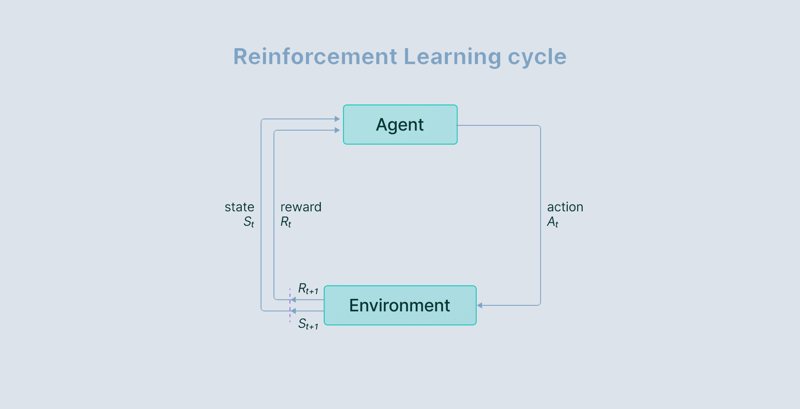

# Deep Reinforcement Learning


 

## Model-based algorithms: 

Model-based algorithm use the transition and reward function to estimate the optimal policy. 
+ They are used in scenarios where we have complete knowledge of the environment and how it reacts to different actions.
+ In Model-based Reinforcement Learning the agent has access to the model of the environment i.e., action required to be performed to go from one state to another, probabilities attached, and corresponding rewards attached.
+ They allow the reinforcement learning agent to plan ahead by thinking ahead.
+ For static/fixed environments,Model-based Reinforcement Learning is more suitable.


## Model-free algorithms
Model-free algorithms find the optimal policy with very limited knowledge of the dynamics of the environment. They do no thave any transition/reward function to judge the best policy.

+ They estimate the optimal policy directly from experience i.e., interaction between agent and environment without having any hint of the reward function.
+ Model-free Reinforcement Learning should be applied in scenarios involving incomplete information of the environment.
+ In real-world, we don't have a fixed environment. Self-driving cars have a dynamic environment with changing traffic conditions, route diversions etc. In such scenarios, Model-free algorithms outperform other techniques

Markov Decision Process (MDP) : [Markov Decision Processes](https://youtu.be/2iF9PRriA7w)

### Bellman Equations : 

➔ State is a numerical representation of what an agent observes at a particular point in an environment.

➔ Action is the input the agent is giving to the environment based on a policy.

➔ Reward is a feedback signal from the environment to the reinforcement learning agent reflecting how the agent has performed in achieving the goal.

Bellman Equations aim to answer these questions: 
The agent is currently in a given state ‘s’. Assuming that we take best possible actions in all subsequent timestamps,what long-term reward the agent can expect?

or What is the value of the state the agent is currently in? Bellman Equations are a class of Reinforcement Learning algorithms that are used particularly for deterministic environments.

$$ V(s) = max_a ( R ( s , a ) + γ V ( s ´ ))  $$


Dynamic Programming :  There are two classes of Dynamic Programming:

1. Value Iteration : The optimal policy (optimal action for a given state) is obtained by choosing the action that maximizes optimal state-value function for the given state.

2. Policy Iteration : This algorithm has two phases in its working:

   Policy Evaluation—It computes the values for the states in the environment using the policy provided by the policy improvement phase.

   Policy Improvement—Looking into the state values provided by the policy evaluation part, it improves the policy so that it can get higher state values.


```python

import torch 
import torch.nn as nn
import torch.nn.functional as F


class QNetwork(nn.Module):
    """ Actor (Policy) Model."""
    def __init__(self, state_size,action_size, seed, fc1_unit=64,
                 fc2_unit = 64):
        """
        Initialize parameters and build model.
        Params
        =======
            state_size (int): Dimension of each state
            action_size (int): Dimension of each action
            seed (int): Random seed
            fc1_unit (int): Number of nodes in first hidden layer
            fc2_unit (int): Number of nodes in second hidden layer
        """
        super(QNetwork,self).__init__() ## calls __init__ method of nn.Module class
        self.seed = torch.manmual_seed(seed)
        self.fc1= nn.Linear(state_size,fc1_unit)
        seed.fc2 = nn.Linear(fc1_unit,fc2_unit)
        seed.fc3 = nn.Linear(fc2_unit,action_size)
        
    def forward(self,x):
        # x = state
        """
        Build a network that maps state -> action values.
        """
        x = F.relu(self.fc1(x))
        x = F.relu(self.fc2(x))
        return self.fc3(x)

```


resources: [An Introduction to Deep Reinforcement Learning](https://huggingface.co/blog/deep-rl-intro), [A Beginner's Guide to Deep Reinforcement Learning](https://wiki.pathmind.com/deep-reinforcement-learning), [Key concepts in RL - OpenAI](https://spinningup.openai.com/en/latest/spinningup/rl_intro.html), [Key papers in RL - OpenAI](https://spinningup.openai.com/en/latest/spinningup/keypapers.html), @github/[Deep-Reinforcement-Learning-Algorithms-with-PyTorch](https://github.com/p-christ/Deep-Reinforcement-Learning-Algorithms-with-PyTorch), @github/[cleanrl](https://github.com/vwxyzjn/cleanrl), [Implementing Deep Reinforcement Learning Models with Tensorflow + OpenAI Gym](https://lilianweng.github.io/posts/2018-05-05-drl-implementation/), paperswithcode/[rl](https://paperswithcode.com/methods/area/reinforcement-learning), [Python Reinforcement Learning using Gymnasium](https://youtu.be/vufTSJbzKGU), [Reinforcement Learning Course: Intro to Advanced Actor Critic Methods](https://youtu.be/K2qjAixgLqk), [@MachineLearningwithPhil](https://www.youtube.com/@MachineLearningwithPhil/playlists), [Deep Reinforcement Learning in Python Tutorial - A Course on How to Implement Deep Learning Papers](https://youtu.be/GJJc1t0rtSU).