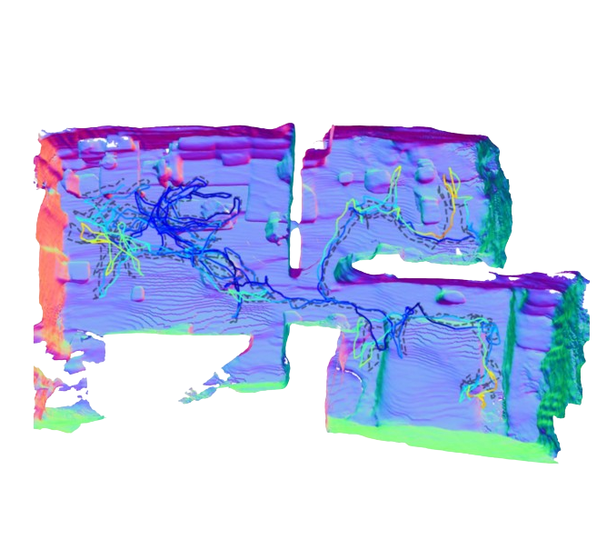
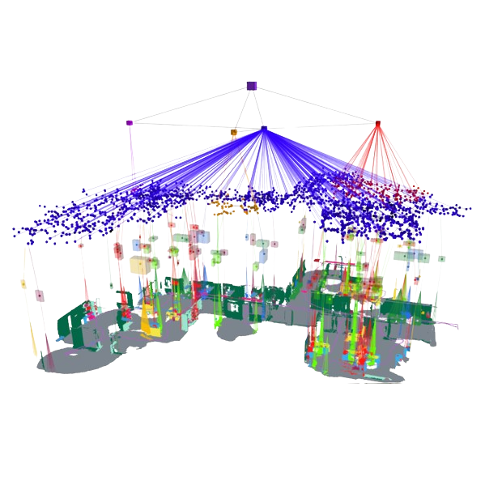
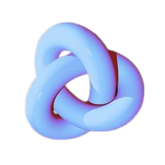
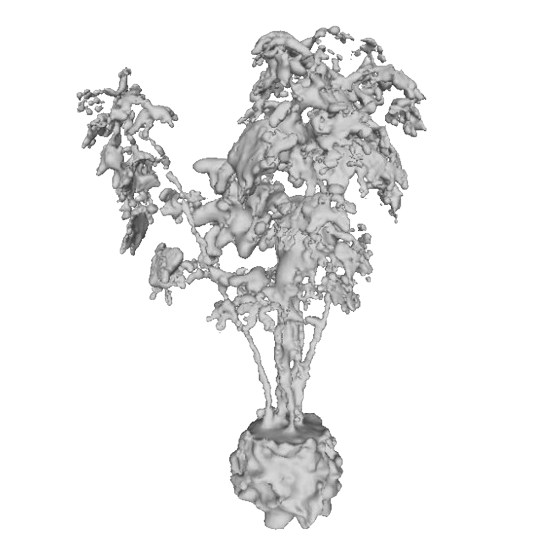

# Deep Learning Code

```python
    import numpy as np

```

+  Gradient Descent Optimization with numpy | ([grad.py](code/grad.py))
+  Support Vector Machines (SVM) with numpy | ([svm.py](code/svm.py))
+  Convolutional Neural Network (CNN) in c++ with TF | ([cnn.cpp](./code/cnn.cpp))
+  Neural Network with numpy | ([neuralnet.py](./code/neuralnet.py))
+  Principal Component Analysis (PCA) with numpy | ([pca.py](./code/pca.py))

<table width=100%>
<tr>
<th>
Computer Vision (py/PyTorch)

 

[ [code](./cnn_py.MD) ]

</th>
<th>
Deep Reinforcement Learning (py/PyTorch)

 

[ [code](./deeprl.MD) ]

</th>
<th>
Transformers (py/PyTorch)

 

[ [code](./transformers.MD) ]

</th>
</tr>
<tr>
<th>
Visual SLAM (c++)

 

[ [code](./code/slam/README.MD) ]

</th>
<th>Multi Agent System : Crazyflie 2.1 (c++)

 

</th>
<th>
Optical Flow : Neural Structure-from-Motion (c++)

 

</th>
</tr>
</table>


<table width=100%>
<tr>
<th>
Monocular Dense Reconstruction

 

[ [code](https://github.com/florist-notes/monodense) ]

</th>
<th>
3D Dynamic Scene Graphs

 

[ [code](https://github.com/florist-notes/3dscenegraphs) ]

</th>
<th>
Characterizing Performance of Edge AI Accelerators

 


</th>
</tr>
<tr>
<th>
Geometric Deep Learning

 


</th>
<th>Vision-Based Navigation in Dynamic Environment


 

</th>
<th>
3D Gaussian Splatting


 

</th>
</tr>
</table>

Find state of the art deep learning model code via [paperswithcode](https://paperswithcode.com/sota), example : [semantic segmentation](https://paperswithcode.com/task/semantic-segmentation).