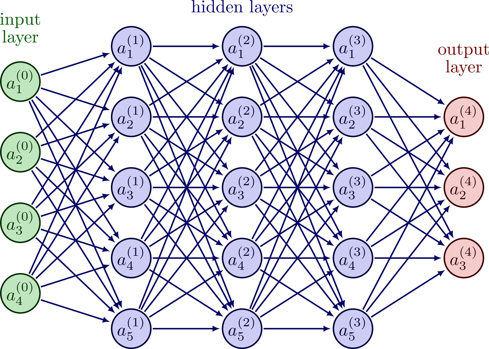

# Deep Learning Theory

I took AEC : CS 872 ( Machine Learning ) and AEC : CS771 ( Artificial Intelligence ) classes at ug and few related courses via online programs : { [classes 1](https://twitter.com/florist_notes/status/1641001006581383168), [classes 2](https://twitter.com/florist_notes/status/1641003166744313856), [classes 3](https://twitter.com/florist_notes/status/1659689325376983040) } along with few noteworthy ML projects { [proj 1](https://twitter.com/florist_notes/status/1640149371936276482), [proj 2](https://twitter.com/florist_notes/status/1639864034244657155), [proj 3](https://twitter.com/florist_notes/status/1652428726032904192) }. 

<table>
<tr>
<th>

[Computer Vision](./cv.MD)
</th>
<th>

[Deep Reinforcement Learning](./drl.MD)

</th>
<th>

[Graph Neural Networks](./gnn.MD)

</th>
</tr>

<tr>
<td>

[SLAM](#)
</td>
<td>

[Meta Learning](#)</td>
</tr>
</table>

notes on tools: [[PyTorch](./pyt.MD)], [[TensorFlow](./tf.MD)], [[INT 1](./int1.MD)], [[INT 2](./int2.MD)], [[INT 3](./int3.MD)], [[INT 4](./int4.MD)], [[INT 5](./int5.MD)], [[INT 6](./int6.MD)], [[INT 7](./int7.MD)].

