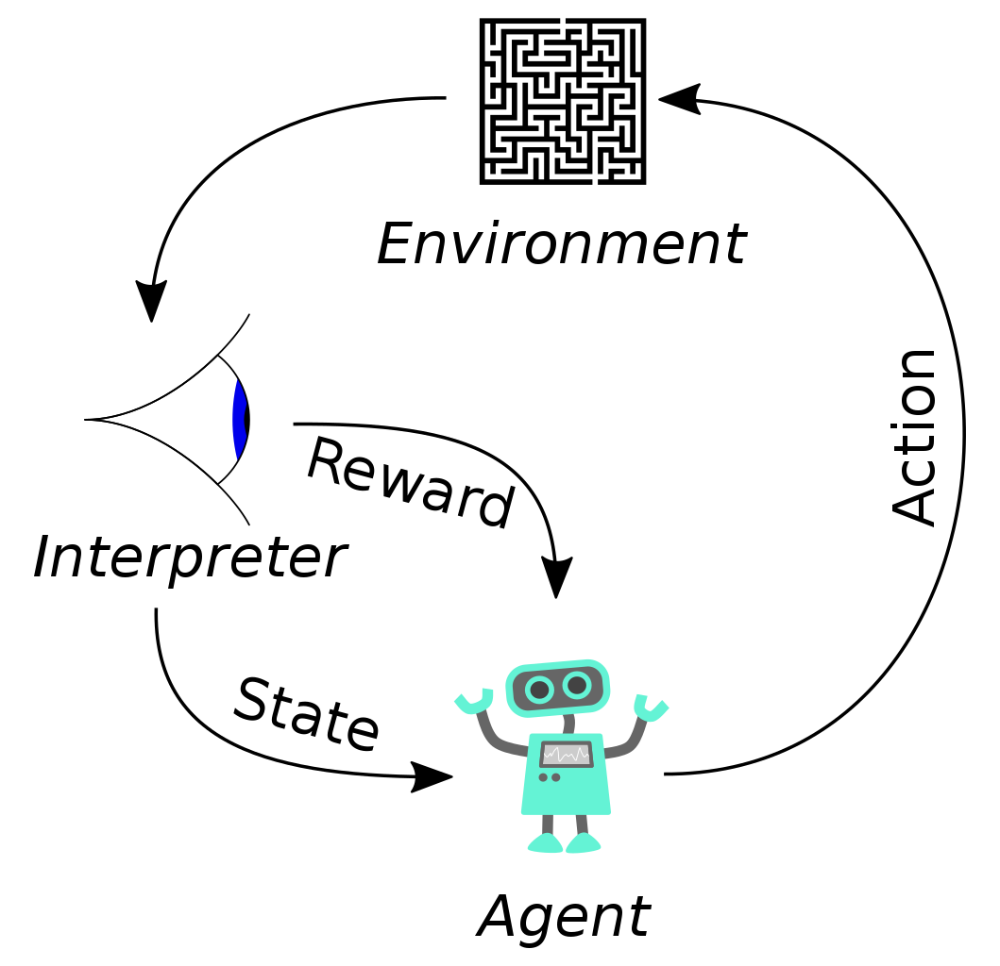
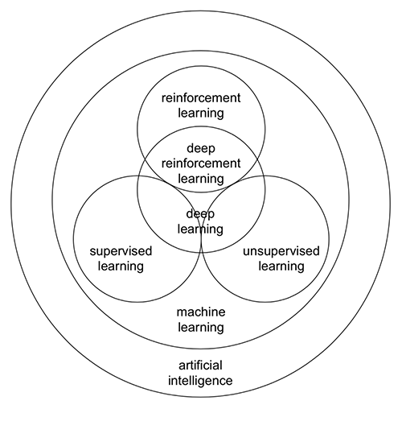

# Deep Reinforcement Learning

 

I made a video on Reinforcement Learning  - "A.I. learns to play Mario " [ [video](https://youtu.be/0EGWbqH3Li0) ] few years back and my bachelor thesis was : "Actor-Critic and Q-value reinforcement learning with GANs for autonomous driving" where I compared performance of
DRL algorithms - DQN, A2C, A3C, DDPG and PPO in [CARLA](https://carla.org/). I also [graduated](https://graduation.udacity.com/confirm/W4DQ2JCV) from Udacity's Deep Reinforcement Learning Nanodegree.

Some important resources on RL:

+ [Evolving Reinforcement Learning Algorithms](https://ai.googleblog.com/2021/04/evolving-reinforcement-learning.html)
+ [Human-level control through deep reinforcement learning](https://www.nature.com/articles/nature14236)
+ [Model-Based Reinforcement Learning: Theory and Practice](https://bair.berkeley.edu/blog/2019/12/12/mbpo/)
+ [An Introduction to Deep Reinforcement Learning](https://arxiv.org/pdf/1811.12560.pdf)
+ Class : [Stanford CS234: Reinforcement Learning | Winter 2019](https://www.youtube.com/playlist?list=PLoROMvodv4rOSOPzutgyCTapiGlY2Nd8u), [MIT 6.S191: Reinforcement Learning](https://youtu.be/AhyznRSDjw8) and freeCodeCamp : [Deep Reinforcement Learning in Python Tutorial - A Course on How to Implement Deep Learning Papers](https://youtu.be/GJJc1t0rtSU), [Reinforcement Learning Course](https://youtu.be/ELE2_Mftqoc)
+ [Deep Reinforcement Learning: CS 285 Fall 2021 (UC Berkeley)](https://www.youtube.com/playlist?list=PL_iWQOsE6TfXxKgI1GgyV1B_Xa0DxE5eH)
+ [DeepMind x UCL | Deep Learning Lecture Series 2021](https://www.youtube.com/playlist?list=PLqYmG7hTraZDVH599EItlEWsUOsJbAodm)
+ Key Papers in Deep RL : [OpenAI blog](https://spinningup.openai.com/en/latest/spinningup/keypapers.html)

resources : [rl blog 101](https://www.javatpoint.com/reinforcement-learning), [Reinforcement Learning algorithms — an intuitive overview](https://smartlabai.medium.com/reinforcement-learning-algorithms-an-intuitive-overview-904e2dff5bbc), [ScienceDirect - Reinforcement Learning](https://www.sciencedirect.com/topics/computer-science/reinforcement-learning), [github/reinforcement-learning](https://github.com/dennybritz/reinforcement-learning), [Reinforcement Learning, Second Edition An Introduction By Richard S. Sutton and Andrew G. Barto](https://mitpress.mit.edu/9780262039246/reinforcement-learning/), [Deepmind : Reinforcement Learning Lecture Series 2021](https://www.deepmind.com/learning-resources/reinforcement-learning-lecture-series-2021), @github/[awesome-rl](https://github.com/aikorea/awesome-rl), @github/[stable-baselines-3](https://github.com/DLR-RM/stable-baselines3), [A (Long) Peek into Reinforcement Learning](https://lilianweng.github.io/posts/2018-02-19-rl-overview/), [An Introduction to Deep Reinforcement Learning](https://huggingface.co/blog/deep-rl-intro), Stanford AI Lab [blog](https://ai.stanford.edu/blog/rl/), [lilianweng.github.io/](https://lilianweng.github.io/), [Deepmind blog](https://www.deepmind.com/blog), [Multi Agent Reinforcement Learning (MARL)](https://arxiv.org/abs/1911.10635), [Imitation Learning](https://paperswithcode.com/task/imitation-learning).