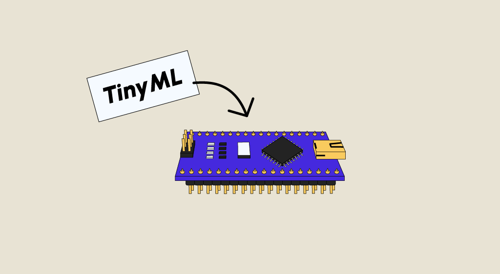

# Edge AI 🦙

[ 🦙 @[tinyML](https://www.youtube.com/@MITHANLab/live) ]

Edge AI refers to the process of running artificial intelligence (AI) algorithms directly on devices at the edge of the network (e.g., IoT devices, smartphones, or sensors) rather than relying on cloud servers. Edge AI allows data processing and inference to happen locally, which reduces latency, improves privacy, and minimizes bandwidth usage. TinyML (Tiny Machine Learning) is a subset of Edge AI focusing on deploying machine learning models on extremely resource-constrained devices (with memory as low as a few kilobytes and processing power in milliwatts).

Key benefits of Edge AI and TinyML:

+ `Low latency`: Since data doesn't need to be sent to the cloud for processing, decisions are made instantly.
+ `Reduced energy consumption`: TinyML models are designed to run on low-power devices.
+ `Privacy and security`: Sensitive data stays on the device, reducing the risk of privacy breaches.
Offline operation: No need for constant internet connectivity since models run on local devices.

## Quantization in Edge AI and TinyML
Quantization is a process of reducing the precision of numbers used in models, which helps shrink the model's size and reduce the computational load without significantly impacting accuracy.

### Types of Quantization
`Post-training quantization`: After training a model, it is converted into a lower precision format, such as 8-bit integers instead of 32-bit floating-point numbers.
+ Example: Converting a neural network model trained in 32-bit floating-point precision to 8-bit integers.

`Quantization-aware training (QAT)`: In this method, quantization is considered during training itself, allowing the model to adapt to reduced precision and maintain better accuracy.
+ Example: Training a model with simulated quantized operations during backpropagation to ensure it performs well when deployed in a quantized form.

[ [Which Quantization Method is Right for You? (GPTQ vs. GGUF vs. AWQ)](https://youtu.be/mNE_d-C82lI?si=z7fG7D0emFOPL8Ra), [Quantization vs Pruning vs Distillation: Optimizing NNs for Inference](https://youtu.be/UcwDgsMgTu4?si=HG7S2HIZSZeWA2aN), [Transformer Neural Networks Derived from Scratch](https://youtu.be/kWLed8o5M2Y?si=MePvovtqR2RZG9kG) ]

## Pruning for Efficient Model Deployment
Pruning is the process of removing parts of a model (e.g., unnecessary weights, filters, or neurons) that are not critical for its performance. The goal is to reduce the model's complexity and size while maintaining as much accuracy as possible.

### Types of Pruning
`Weight pruning`: Pruning small or unimportant weights from the neural network, essentially setting them to zero.

+ Example: After training, weights below a certain threshold in a neural network are pruned, reducing the number of parameters.

`Neuron pruning`: Removing entire neurons or channels in the network that contribute little to the output.

+ Example: During pruning, neurons with minimal activations are pruned away, reducing the number of computations in each layer.

`Structured pruning`: Pruning entire filters or layers, reducing the complexity of the model in a structured manner.

+ Example: In a convolutional neural network (CNN), some filters are identified as redundant, and they are pruned to reduce the model's size and computation time.

## Knowledge Distillation for Edge AI
Knowledge distillation is a technique where a smaller, less complex model (called the "student") is trained to mimic a larger, more complex model (the "teacher"). The teacher model, which is often too large for edge deployment, passes knowledge to the student, resulting in a smaller, more efficient model suitable for resource-constrained environments.

### Benefits of Knowledge Distillation
+ `Smaller model size`: The student model is much smaller and lighter than the teacher.
+ `Comparable accuracy`: Even though the student model is smaller, it can retain a high level of accuracy by learning from the more complex teacher model.
+ `Faster inference`: The student model is optimized for edge devices, providing faster inference times.

Example of Knowledge Distillation in TinyML:
A large pre-trained model for image classification is too big to deploy on a microcontroller. By applying knowledge distillation, a smaller version of the model is created that achieves 95% of the teacher model's accuracy but is small enough to run efficiently on the microcontroller.

[ [Knowledge Distillation: A Good Teacher is Patient and Consistent](https://youtu.be/gZPUGje1PCI?si=Xz04x9SNj-yS7IXi), [How ChatGPT Cheaps Out Over Time](https://youtu.be/vyJy-0zBSQ0?si=h0p6bGSGFu3Mhm13) ]

### Popular TinyML Frameworks and Libraries :
+ [LiteRT](https://ai.google.dev/edge/litert) / TensorFlow Lite for Microcontrollers (TFLite Micro): A version of TensorFlow Lite designed to run on microcontrollers with limited resources. TFLite Micro enables the deployment of machine learning models directly on tiny, low-power devices.

+ [Edge Impulse](https://edgeimpulse.com/): A development platform for building, training, and deploying TinyML models. It includes tools for collecting data from edge devices, training machine learning models, and optimizing them for deployment.

+ [CMSIS-NN](https://github.com/ARM-software/CMSIS-NN): A library of neural network kernels optimized for ARM Cortex-M microcontrollers. It allows TinyML models to leverage the processing power of ARM-based devices efficiently.

+ [uTensor](https://github.com/uTensor/uTensor): A lightweight machine learning framework for embedded systems, providing an optimized implementation of common machine learning operations for microcontrollers.

Resources : [MIT HanLab projects](https://hanlab.mit.edu/projects/tinyml), [tinyml.org](https://www.tinyml.org/), [harvard@tinyML](https://pll.harvard.edu/course/fundamentals-tinyml), [Tiny Machine Learning: Progress and Futures](https://arxiv.org/abs/2403.19076), [Building a TinyML Application with TF Micro and SensiML](https://blog.tensorflow.org/2021/05/building-tinyml-application-with-tf-micro-and-sensiml.html), @github/[bitsandbytes](https://github.com/bitsandbytes-foundation/bitsandbytes), [tinyML EMEA](https://www.youtube.com/watch?v=NY4cCLw5C_o&list=PLeisuBi-nfBO6Lgt98eBjM52Byu1GrI9p), [ @github/[tinyml-projects-papers](https://github.com/gigwegbe/tinyml-papers-and-projects), [Seedstudio blog - TinyML](https://www.seeedstudio.com/blog/2021/06/14/everything-about-tinyml-basics-courses-projects-more/?srsltid=AfmBOoqOe6H6cuw3rRDSI_QC36Ps77GYg9pavzENaX2PNQq4XzlNBGZY), [openmv.io](https://openmv.io/), [Harvard TinyML](https://sites.google.com/g.harvard.edu/tinyml/finalprojects): [discuss](https://discuss.tinyml.seas.harvard.edu/c/projects/5) ].