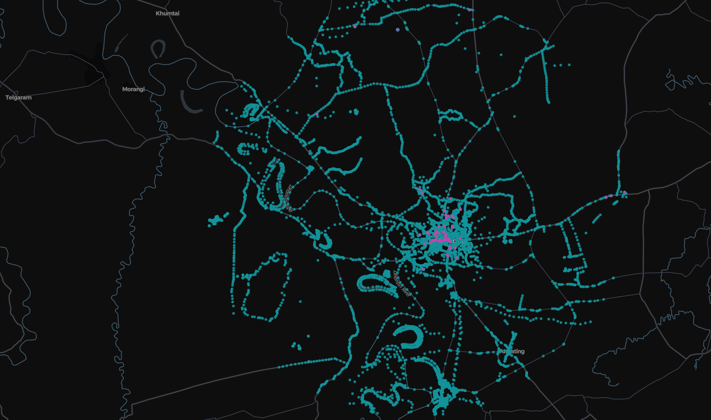

# AI Hackathon with Meta Llama 🦙

## Travelling Llama 🦙:

<p align="justify">

<b>Theme </b>: AI on Edge - Develop AI solutions optimised for edge devices, ensuring real-time processing without cloud reliance.
</p>

### Problem:

<p align="justify">
Travelers in remote areas, such as hikers, or people living in regions with limited or no regular internet connectivity, often struggle to access real-time travel information like route suggestions, locality information from locals, weather updates, or local cultural knowledge. This issue is even more critical during natural disasters, when internet infrastructure may fail entirely, leaving people without access to vital information. Traditional travel apps, which depend on cloud services, become unusable without a stable internet connection and may compromise user privacy.
</p>

### Solution:

<p align="justify">
Travelling Llama is an offline, edge-powered travel companion app that provides personalized travel recommendations and real-time information about everything within a 10 km radius of a geolocation, even in areas without internet access. By using Meta’s Llama 3.2 model, optimized for edge devices, the app offers localized route suggestions, locality information from locals, weather forecasts, cultural insights, and safety alerts tailored to individual user preferences. It operates entirely offline, ensuring data privacy through on-device processing. This solution is perfect for hikers, people living in remote areas, and regions affected by natural disasters.
</p>

<p align="justify">

<b>Key Technologies</b>: Python, JavaScript, Streamlit, PyTorch,  TensorFlow Lite, OpenWeatherMap API (offline storage), Geopandas, OpenStreetMap.

</p>


## Impact:

### Target Audience:

+ Hikers and Travelers in Remote Areas: Ideal for those needing travel information within a 10 km radius in regions without internet connectivity.
+ People Living in Remote Areas: Provides real-time local information for individuals in places with unreliable or no internet access.
+ Regions Affected by Natural Disasters: Delivers essential real-time information, weather alerts, and safety updates when internet services are disrupted due to calamities.


### Benefits:

+ `Increased Safety`: Real-time weather alerts and route suggestions within a 10 km radius, ensuring safer travel decisions, even in hazardous or remote areas.
+ `Enhanced Privacy`: Data remains on the device, protecting user privacy while enabling personalized recommendations and learning without cloud processing.
+ `Uninterrupted Service`: Functions offline, making it ideal for travel in areas without internet access or during natural disasters when communication infrastructure is compromised.
+ `Scalability & Future Plans`:
Travelling Llama can be expanded to support more languages, additional edge devices (e.g., wearables, smart cars), and future features such as AR-based navigation for offline route exploration and real-time IoT-based environmental data.

<p align="justify">
`Travelling Llama` offers a groundbreaking travel assistance experience, providing real-time, personalized information within a 10 km radius, even without internet connectivity. By leveraging AI on the edge, it ensures privacy, safety, and accessibility, making it indispensable for travelers, residents of remote areas, and those affected by natural disasters.
</p>

## Implementation : Travelling Llama - Edge AI Travel Companion Using Llama 3.2 with RAG

<p align="justify">
To implement the solution using Meta’s Llama 3.2 1-bit model with 1 billion parameters, we integrate Retrieval-Augmented Generation (RAG) to handle custom queries, improve the personalization of responses, and create an offline travel assistant. 
</p>


## Data Scraping:

```json
        {
            "type": "Feature",
            "properties": {
                "tags": {
                    "addr:city": "Golaghat",
                    "addr:district": "Golaghat",
                    "addr:full": "Jagat Goswami Road",
                    "addr:postcode": "785621",
                    "addr:state": "Assam",
                    "addr:street": "Jagat Goswami Road",
                    "amenity": "hospital",
                    "emergency": "yes",
                    "healthcare": "hospital",
                    "healthcare:speciality": "general",
                    "name": "Lifeline Hospital and Research Centre",
                    "operator:type": "private",
                    "source": "OpenGovernmentData"
                },
                "name": "Lifeline Hospital and Research Centre"
            },
            "geometry": {
                "type": "Point",
                "coordinates": [
                    93.9748279,
                    26.5159925
                ]
            }
```

</> 




