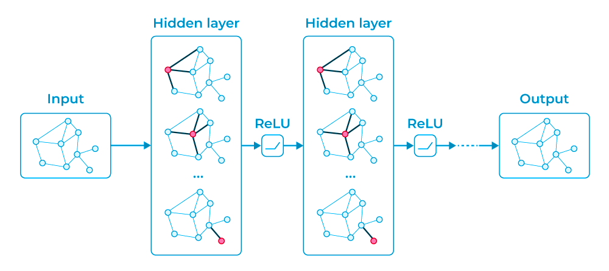

# Graph Neural Networks:

Graph neural networks apply the predictive power of deep learning to rich data structures that depict objects and their relationships as points connected by lines in a graph. In GNNs, data points are called nodes, which are linked by lines — called edges — with elements expressed mathematically so machine learning algorithms can make useful predictions at the level of nodes, edges or entire graphs.

PyG (PyTorch Geometric) [[repo](https://pytorch-geometric.readthedocs.io/en/latest/)] ( Geometric Computer Vision) | @github/[pytorch_geometric](https://github.com/pyg-team/pytorch_geometric), @github/[GNNpapers](https://github.com/thunlp/GNNPapers) | [Learning on Graphs (LoG)](https://logconference.org/)

resources: [A Gentle Introduction to Graph Neural Networks](https://distill.pub/2021/gnn-intro/), [Understanding Convolutions on Graphs](https://distill.pub/2021/understanding-gnns/),  [Graph neural networks: A review of methods and applications](https://arxiv.org/ftp/arxiv/papers/1812/1812.08434.pdf), [Theoretical Foundations of Graph Neural Networks](https://youtu.be/uF53xsT7mjc), Deep Learning on Graphs : [(book)], [The basics of spatio-temporal graph neural networks](https://youtu.be/RRMU8kJH60Q), [Stanford CS224W: Machine Learning with Graphs](https://www.youtube.com/watch?v=JDW82csukhE&list=PLoROMvodv4rPLKxIpqhjhPgdQy7imNkDn&index=58), [Microsoft Research : An Introduction to Graph Neural Networks: Models and Applications](https://youtu.be/zCEYiCxrL_0), [Graph Neural Networks and Diffusion PDEs | Benjamin Chamberlain & James Rowbottom](https://www.youtube.com/watch?v=9SMbH18nMUg), [The ultimate intro to Graph Neural Networks. Maybe.](https://www.youtube.com/watch?v=me3UsMm9QEs), [DeepFindr : GNN](https://www.youtube.com/watch?v=fOctJB4kVlM&list=PLV8yxwGOxvvoNkzPfCx2i8an--Tkt7O8Z), [TensorFlow : Intro to graph neural networks (ML Tech Talks)](https://youtu.be/8owQBFAHw7E), [Theoretical Foundations of Graph Neural Networks](https://www.youtube.com/watch?v=uF53xsT7mjc), [WelcomeAIOverlords : Graph Neural Networks](https://www.youtube.com/watch?v=OI0Jo-5d190&list=PLSgGvve8UweGx4_6hhrF3n4wpHf_RV76_&index=1), [Tutorial: Graph Neural Networks in TensorFlow: A Practical Guide](https://youtu.be/JqWROPYeqjA), @github/[gbdll](https://github.com/naganandy/graph-based-deep-learning-literature), @github/[dgl](https://github.com/dmlc/dgl), [gnn-blog](https://www.datacamp.com/tutorial/comprehensive-introduction-graph-neural-networks-gnns-tutorial).