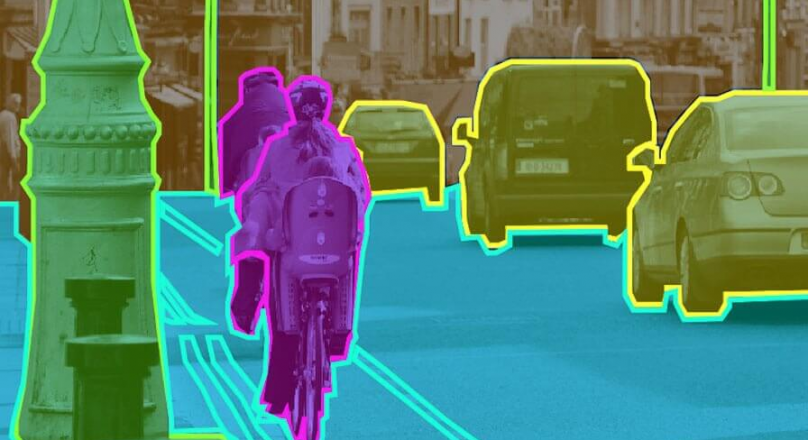

# Image Segmentation

Image segmentation is a critical task in computer vision that involves partitioning an image into multiple segments to simplify its representation and facilitate meaningful analysis. Unlike object detection, which identifies objects and their bounding boxes, image segmentation assigns a label to each pixel in the image, thereby providing a fine-grained understanding of its content.

[ Image Segmentation, Semantic Segmentation, Instance Segmentation, and Panoptic Segmentation ] → [[self-driving car perception](https://github.com/florist-notes/aicore_s/blob/main/notes/perc.MD)]

Image segmentation is the process of partitioning an image into multiple segments or regions to simplify its representation and facilitate analysis. Image segmentation can be broadly categorized into two types:

+ `Semantic Segmentation`: In semantic segmentation, each pixel in the image is classified into a particular class or category. It assigns a label to each pixel, indicating the class it belongs to. For example, in a scene containing a cat, a dog, and a car, semantic segmentation would label each pixel as belonging to one of these classes.
+ `Instance Segmentation`: Instance segmentation goes a step further than semantic segmentation. It not only labels each pixel with a class but also distinguishes between different instances of the same class. For example, in an image containing two cats, instance segmentation would label each cat separately.

Various types of models have been developed to tackle this task, each with its own architecture, advantages, and limitations. Here are some of the different types of semantic segmentation models:

### Fully Convolutional Networks (FCNs):
+ FCNs were among the pioneering architectures for semantic segmentation, extending the success of convolutional neural networks (CNNs) for image classification to segmentation tasks.
+ FCNs replace fully connected layers with convolutional layers to preserve spatial information, enabling pixel-wise predictions.
+ They often employ upsampling layers or transposed convolutions to increase the spatial resolution of feature maps, producing dense predictions.
+ FCNs are computationally efficient and have been widely used in various applications due to their simplicity and effectiveness.

### U-Net:
+ U-Net is a popular architecture specifically designed for biomedical image segmentation, although it has been adapted to other domains as well.
+ It consists of a contracting path for capturing context and a symmetric expanding path for precise localization.
+ Skip connections between corresponding encoder and decoder layers facilitate the flow of detailed spatial information, helping to overcome the vanishing gradient problem and enabling better localization.
+ U-Net has shown excellent performance, especially in medical image segmentation tasks where precise localization is crucial.

### DeepLab:
+ DeepLab is a family of semantic segmentation models developed by Google Research, known for their effective use of atrous (dilated) convolutions and powerful context aggregation mechanisms.
+ Atrous convolutions allow the model to capture multi-scale context without increasing the number of parameters, enabling efficient dense prediction.
+ DeepLab employs various variants, including DeepLabv1, DeepLabv2, DeepLabv3, and DeepLabv3+, each introducing improvements in terms of performance and efficiency.
+ DeepLab models have achieved state-of-the-art results on benchmark datasets and are widely used in both research and industry applications.

### PSPNet (Pyramid Scene Parsing Network):
+ PSPNet introduces a pyramid pooling module that captures contextual information at multiple scales, enabling the model to make more informed predictions.
+ The pyramid pooling module aggregates global context from different sub-regions of the feature map, allowing the model to handle objects of varying sizes effectively.
+ By incorporating multi-scale features, PSPNet achieves improved segmentation accuracy, especially for objects at different scales within the scene.
  
### ENet (Efficient Neural Network):
+ ENet is designed for real-time semantic segmentation applications, focusing on efficiency and computational speed without compromising performance.
+ It employs a series of lightweight operations, such as depth-wise separable convolutions, to reduce the computational complexity while maintaining segmentation accuracy.
+ ENet's architecture includes several innovative components, such as the initial bottleneck layer and the asymmetric encoder-decoder structure, optimizing both speed and accuracy.

Resources : [PyTorch Image Segmentation Tutorial with U-NET](https://youtu.be/IHq1t7NxS8k?si=eXITY3p7K9_HCvFC), [The U-Net (actually) explained in 10 minutes](https://youtu.be/NhdzGfB1q74?si=FFUX5JpVOYs4QW_a), [Understanding U-Net architecture and building it from scratch](https://youtu.be/GAYJ81M58y8?si=Q1qaNHTTjtZo_nfT), [Train Mask R-CNN for Image Segmentation](https://youtu.be/WuvY0wJDl0k?si=lVm7odG3N9NwuznY).