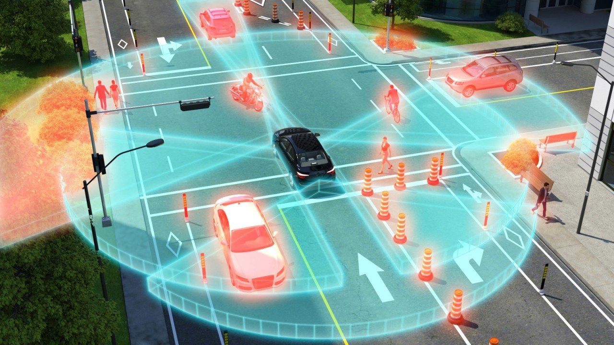

# Autonomous Driving (AI) : Vehicle Cut-in Detection [INT 1]

Artificial Intelligence (AI) based Machine Learning (ML) techniques are widely becoming used and
deployed in real-world applications. Autonomous driving is a technology that highly depends on a large
volume and variety of data for training and testing. India Driving Dataset (IDD) is an open dataset,
publicly available for research, and can be used for tasks like object detection and segmentation.
Download IDD Temporal from <a href="http://idd.insaan.iiit.ac.in/">idd.insaan.iiit.ac.in</a> and develop new (or better) machine learning
models for:

+ Detection of sudden cut-in of vehicles (two/three/four wheelers, pushcarts etc) into the direction of driving.

Research Focus :

+ Perform the below using the [IDD dataset](http://idd.insaan.iiit.ac.in/). Use any extra data from other sources to augment training ML models.
+ Detect and tag objects as soon as they appear partially or fully in front of the driver.
+ Estimate distance and TTC. Provide a warning when the TTC is below a predefined threshold.
  + Recommended 0.5 - 0.7 secs.

Success Criteria :

+ A working ML model for detecting cut-in
+ 99%+ true positives for cut-in detection

`Outcomes`:
   + ▪ Train a new ML model for detecting cut-in.  
   + ▪ Use any extra data from other sources to augment training ML models.  
   + ▪ Calculate the accuracy of performance in detection.  
   + ▪ Create a 3-page report on the chosen problem, technical approach, and results.  

[ [official-document](./doc/PS-8%20Vehicle%20Cut-in%20Detection.pdf) ]

## Resources Section:

[[ VIDEO : ]] - [Detect vehicles speed from CCTV Cameras with Opencv and Deep Learning](https://youtu.be/j10j8IuKSBI?si=sPW_nXkNpCpLIeC0), [Traffic Analysis with YOLOv8 and ByteTrack - Vehicle Detection and Tracking](https://youtu.be/4Q3ut7vqD5o?si=LCqD_4qjJxE1Yo-8), [Determining other vehicle distances & collision warning (object detection)](https://youtu.be/o3Ky_EdHVrA?si=eaR6fsWBJJyhJTDM), [Classified Directional Traffic Count [Vehicle Detection and Tracking]](https://youtu.be/i0yqhHKWY0A?si=lZiEQ_x1eRXn-Kew), [Perfect traffic data from video even in complex scenes with small objects and irregular movements!](https://youtu.be/aiBfJ02eeGE?si=jApTlEDos8nRNHtq), [Vehicle detection, tracking and speed estimation from car's front view Validation](https://youtu.be/4iqX4ZQ2l1s?si=tBJMB8rH2Gr-c2dY), [Real-time AI traffic video analytics from Drone - OD Matrix, Section speed and more](https://youtu.be/6grp-JOV6Qo?si=phQp89LGC9Ha4B4d), [Vehicle speed detection | Step by step tutorial](https://youtu.be/ab5mBmXX0mQ?si=xea3lVBGnEsbwVLa), [Vehicle Detection on Video Sequence](https://youtu.be/2Ltv0DwAobE?si=1S0OToLMOZxA-2mI), [Vehicle and Pedestrian Detection Using YOLOv8 and Kitti dataset](https://youtu.be/g4Q1tW988eI?si=Zepd56twlwAwsu3A), [How Tesla Autopilot Detects Cars About to Cut You Off](https://youtu.be/4bZFmWFyAac?si=Qln6H1T5Dq6l5TQi) - [reddit](https://www.reddit.com/r/teslamotors/comments/d3aimu/how_tesla_autopilot_detects_cars_about_to_cut_you/), [3D-Net: Monocular 3D object recognition for traffic monitoring](https://youtu.be/FdiQ_EGbZe0?si=DQadY0GTTnOewlCk), [Deep Learning for Computer Vision with Python and TensorFlow](https://youtu.be/IA3WxTTPXqQ?si=GKjYe95-eSCq2NvE), [Computer Vision and Perception for Self-Driving Cars](https://youtu.be/cPOtULagNnI?si=JilVZv26CI-2byxL).

[[ READ : ]] - [Detection of a Cut-in Scenario and Collision Avoidance in KTH PlatoonSim](https://www.diva-portal.org/smash/get/diva2:1342449/FULLTEXT01.pdf), [Cut-in vehicle recognition system](https://ieeexplore.ieee.org/document/821196), [Cut-in vehicle recognition system](https://www.semanticscholar.org/paper/Cut-in-vehicle-recognition-system-Morizane-Takenaga/a7b2cc917e49ccf69fa85e1fdd732330e8c953fc), [Trajectory Tracking Control for Intelligent Vehicles Based on Cut-In Behavior Prediction](https://www.mdpi.com/2079-9292/10/23/2932), [Analysis of cut-in behavior based on naturalistic driving data](https://www.davidhurwitz.org/wp-content/uploads/2019/01/AAP-Wang-et-al.-2019.pdf), [Cut-in Detection from Videos - Chalmers](https://odr.chalmers.se/items/c4199839-8941-4be0-9e3b-269a059f744a), [Method for Detecting Cars Cutting in to Change Lanes by Using Image Frames Played in Reverse](https://link.springer.com/chapter/10.1007/978-3-642-41671-2_14), [Predicting Cut-Ins in Traffic Using a Neural Network - Chalmers](https://publications.lib.chalmers.se/records/fulltext/252178/252178.pdf), [Monocular Vision-based Prediction of Cut-in Maneuvers with LSTM Networks](https://arxiv.org/abs/2203.10707), [Vehicle Detection and Counting System using OpenCV](https://www.analyticsvidhya.com/blog/2021/12/vehicle-detection-and-counting-system-using-opencv/), [Deep Learning Techniques for Vehicle Detection and Classification from Images/Videos: A Survey](https://www.mdpi.com/1424-8220/23/10/4832), [Vehicle Detection for Vision-Based Intelligent Transportation Systems Using Convolutional Neural Network Algorithm](https://www.hindawi.com/journals/jat/2022/9189600/), @github/[RoboFlow](https://github.com/roboflow/notebooks).

## NOTES :

### Detect vehicles speed from CCTV Cameras with Opencv and Deep Learning :
 
* [Speed Detection From CCTV With OpenCV And Deep Learning](https://pysource.com/2021/10/26/speed-detection-from-cctv-with-opencv-and-deep-learning/), Perspective Distortion ; Flow Prediction : @githu/[supervision](https://github.com/roboflow/supervision) - [supervision track objects](https://supervision.roboflow.com/how_to/track_objects/), RNNs with sequence of images - [Recurrent Neural Network in Autonomous Vehicles](https://ritik12.medium.com/recurrent-neural-network-in-autonomous-vehicles-1274a8ac98d), Multi Task Attention Network (MTAN) | Multi Task Learning, Depth Estimation, [Analysis and Evaluation of Recurrent Neural Networks in Autonomous Vehicles](https://www.edgeimpulse.com/blog/content/files/smash/get/diva2:1155735/fulltext01.pdf), [Vehicle Detection and Tracking From a Front-Face Camera](https://towardsdatascience.com/vehicle-detection-and-tracking-from-a-front-face-camera-a9b83c842f58), [Object Tracking](https://www.v7labs.com/blog/object-tracking-guide#deep-learning-based-approaches-to-object-tracking).

### Autonomous Driving Datasets :

* [IDD - Indian Driving Dataset](https://idd.insaan.iiit.ac.in/), [Waymo Open Dataset](https://waymo.com/open/), [nuscenes](https://www.nuscenes.org/), [Audi A2D2](https://www.a2d2.audi/a2d2/en.html), [ApolloScape Dataset](https://apolloscape.auto/), [argoverse](https://www.argoverse.org/), [CityScapes Dataset](https://www.cityscapes-dataset.com/), [Berkeley DeepDrive](http://bdd-data.berkeley.edu/), [Comma 2k19](https://github.com/commaai/comma2k19), [Google-Landmarks](https://research.google/blog/google-landmarks-a-new-dataset-and-challenge-for-landmark-recognition/), [KITTI-360](https://www.cvlibs.net/datasets/kitti-360/), [Leddar Pixset](https://leddartech.com/solutions/leddar-pixset-dataset/), [Oxford RobotCar Dataset](https://robotcar-dataset.robots.ox.ac.uk/), [Pandaset](https://pandaset.org/), [Udacity Self Driving Car Dataset](https://public.roboflow.com/object-detection/self-driving-car), [Semantic KITTI](http://semantic-kitti.org/index.html), [A*3D](https://github.com/I2RDL2/ASTAR-3D), [comma.ai](https://archive.org/details/comma-dataset), [Honda H3D](https://usa.honda-ri.com/h3d), RoboFlow/[self-driving-car](https://universe.roboflow.com/browse/self-driving), [ONCE](https://once-for-auto-driving.github.io/), [WADD](https://digitalcommons.mtu.edu/wads/), [SeeingThroughFog](https://github.com/princeton-computational-imaging/SeeingThroughFog), [Toronto-3D](https://github.com/WeikaiTan/Toronto-3D), [JRDB](https://jrdb.erc.monash.edu/dataset/).

* Paper: [ [A Survey on Autonomous Driving Datasets: Statistics, Annotation Quality, and a Future Outlook](https://arxiv.org/abs/2401.01454) ] : [github](https://github.com/MingyuLiu1/autonomous_driving_datasets) ; [ [A Survey on Datasets for Decision-making of
Autonomous Vehicle](https://arxiv.org/abs/2306.16784) ]

* Models : [ [DEFT](https://github.com/MedChaabane/DEFT), [CenterTrack](https://github.com/xingyizhou/CenterTrack), [KITTI - Multi Object Tracking Accuracy (MOTA)](https://paperswithcode.com/sota/multiple-object-tracking-on-kitti-tracking?p=mots-multi-object-tracking-and-segmentation), [Monocular Quasi-Dense 3D Object Tracking](https://arxiv.org/pdf/2103.07351) ]

## Sample Approach:

* #### How to detect vehicle cut in and measure accuracy of its performance with Deep Learning?
  [ [Predicting Cut-Ins in Traffic Using a Neural Network](./252178.pdf), [Cut-in Detection from Videos](./CSE23-143AUAPV.pdf), [Monocular Vision-based Prediction of Cut-in Maneuvers with LSTM Networks](./2203.10707v1.pdf) ]

