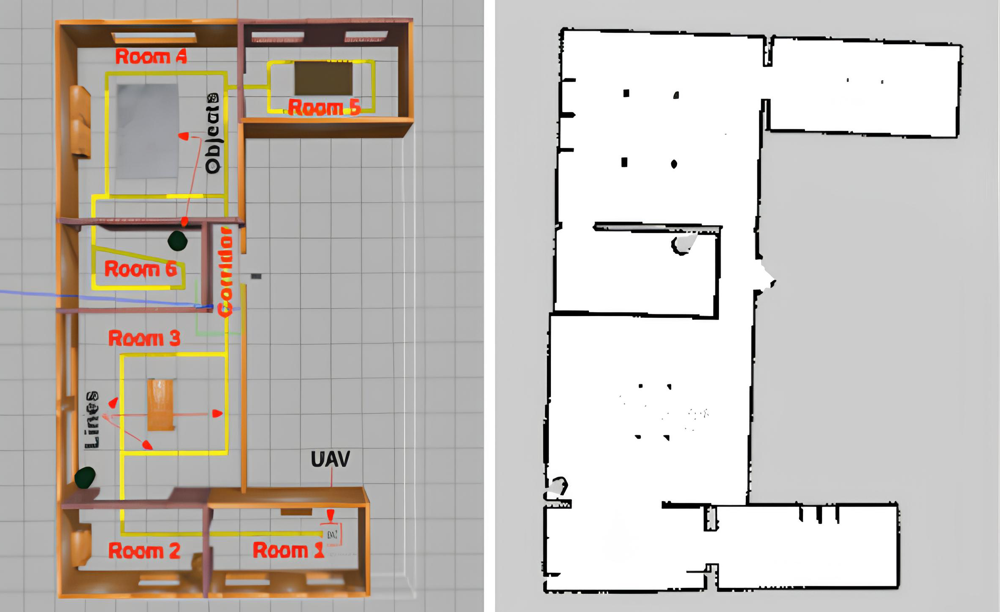

# Robotics : Develop a 2D Occupancy Grid Map of a Room using Overhead Cameras [INT 2]

The primary objective of this project is to develop a 2D occupancy grid map of a room using overhead cameras, similar to the map created by a ROS2-based SLAM algorithm typically used by autonomous mobile robots (AMRs).

 

Description:
+ In the initial phase, you will need to equip a room or area with four overhead RGB cameras
arranged in a 2x2 pattern, ensuring some overlap in their fields of view. The room should contain
static objects such as chairs, tables, stools, and boxes. Using the images from these cameras, and
by stitching the views together, you will create a 2D occupancy grid map of the room. The goal is
to demonstrate that this map can be effectively used by AMRs for path-planning and navigation.

+ In the second phase, the room environment will become dynamic, meaning objects like tables and
chairs can be moved around. The 2D occupancy grid map should be able to dynamically update
itself to reflect these changes, providing a new, accurate map for AMRs to navigate. Additionally,
you will add semantic labels to the map (e.g., "table", "chair", "other AMR") to provide further
context for the AMRs. This will likely require the implementation of simple object detection.

Outcomes:

Initially, you can model and simulate the room environment, objects, and overhead cameras in the
Gazebo simulator. Gazebo will also support the addition of an AMR equipped with an on-board camera
or LiDAR for SLAM map generation and navigation using the ROS2 navigation stack. This will allow for a
comparison between the map generated from the overhead cameras and the map created by the AMR
using SLAM.

<hr />

## Resources Section:

 [[ VIDEO : ]] [Occupancy Grid Maps (Cyrill Stachniss)](https://youtu.be/v-Rm9TUG9LA?si=9emLvh3xzSyXKKNx), [UMich - Occupancy Grid Mapping](https://youtu.be/1f_m5aJFIj4?si=mnTasA3epEQcLFzv), [ROS2 Occupancy Grid Node for Nav2](https://youtu.be/suqhnzIyq7w?si=UthlawxajggnYC4v), [Nav 2 in ROS 2 for autonomous Navigation using SLAM for Indoor Mobile Robots](https://youtu.be/GSuqO0p2mIk?si=lFT4TSL3CrzO9pc_), [2D grid mapping and navigation with ORB-SLAM 2- indoor](https://youtu.be/HoE22wMhuKA?si=yenfgj4CrC-nV7EX), [Occupancy Grid Mapping with Known Poses](https://youtu.be/x_Ah685BFEQ?si=FXeitP2XzmE08WBz), [Occupancy Grid Mapping Simulation Using Sensor Laser In ROS](https://youtu.be/v3Y2PJcUTKE?si=-CCmY7JLZ-FUvBhk), [Robotic Mapping - Occupancy Grid Mapping](https://youtu.be/QFJehL9-pNo?si=grohiew6gVKJgA1j), [CH10 SLAM for Robotics - Occupancy Grid Mapping](https://youtu.be/VcFsY4lY_cI?si=Zp3UC4Incuv5OpVV), [ROG-Map](https://youtu.be/eDkwGXCea7w?si=JCnEQJXPFHXN8Soj), [Matlab - Lab2: Occupancy grid map](https://youtu.be/tWeLWoHHC5Q?si=jIlZlU_NATX602Kq), [2D grid mapping and navigation with ORB-SLAM 2- KITTI Dataset](https://youtu.be/FCd6p25131I?si=T4gI3yVXVH9SWCwZ), [Mobile robotics - C8: Mapping and occupancy grid](https://youtu.be/rcEFRrgmScw?si=Z4-AMVW89l5_xg4L), [Mapping for Mobile Robots and UGV](https://youtu.be/OCoVCYnCkeI?si=0L5EpcHGIcHeFudd), [NanoSLAM](https://youtu.be/XUSVLHJ87J0?si=uSyJ9vnIrPvKLJ48), [Presentation: Occupancy Grid Map Estimation Based on Visual SLAM and Image Segmentation](https://youtu.be/1i5CfddAzHk?si=hqYoXGzTQTrGRVrz), [MCMC Occupancy Grid Mapping with a Data-Driven Patch Prior](https://youtu.be/x0_8nix1HKA?si=FC0GkbGeyn7cAAPf).
 
 [[ READ : ]] [wiki-Occupancy Grid Mapping](https://en.wikipedia.org/wiki/Occupancy_grid_mapping), [CMU - Occupancy Maps](https://www.cs.cmu.edu/~16831-f14/notes/F14/16831_lecture06_agiri_dmcconac_kumarsha_nbhakta.pdf), Matlab - [occupancyMap](https://in.mathworks.com/help/nav/ref/occupancymap.html) & [Occupancy Grids](https://www.mathworks.com/help/robotics/ug/occupancy-grids.html), [CMU - Learning Occupancy Grid Maps With Forward Sensor Models
](https://faculty.iiit.ac.in/~mkrishna/ThrunOccGrid.pdf), [Occupancy grid mapping: An empirical evaluation](https://ieeexplore.ieee.org/document/4433772), [Occupancy grid for static environment perception in series automotive applications](https://www.sciencedirect.com/science/article/pii/S2405896319303945), [Grid Maps and Mapping With Known Poses](http://ais.informatik.uni-freiburg.de/teaching/ss16/robotics/slides/12-occupancy-mapping.pdf), [VoxFormer](https://github.com/NVlabs/VoxFormer), [ETH-Z ASL : wavemap](https://github.com/ethz-asl/wavemap), [dynamic-occupancy-grid-map](https://github.com/TheCodez/dynamic-occupancy-grid-map), [SSCBench](https://github.com/ai4ce/SSCBench), [Occ4cast](https://github.com/ai4ce/Occ4cast), [Dynamic Occupancy Grid Map with Semantic Information Using Deep Learning-Based BEVFusion Method with Camera and LiDAR Fusion](https://www.mdpi.com/1424-8220/24/9/2828), [An Approach for 2D Visual Occupancy Grid Map Using Monocular Vision](https://www.sciencedirect.com/science/article/pii/S1571066111001824), [Semantic Evidential Grid Mapping Using Monocular and Stereo Cameras](https://www.mdpi.com/1424-8220/21/10/3380), [OGM NOTES](./ogm.MD).

3D Scene Graphs (Spatial Perception): [3dscenegraph.stanford.edu](https://3dscenegraph.stanford.edu/), [Hydra: A Real-time Spatial Perception System for 3D Scene Graph Construction and Optimization](https://youtu.be/qZg2lSeTuvM?si=NKzPApvUPAP_6HsJ), [Foundations of spatial perception for robotics: Hierarchical representations and real-time systems](https://journals.sagepub.com/doi/10.1177/02783649241229725), [3D Dynamic Scene Graphs: Actionable Spatial Perception with Places, Objects, and Humans](https://roboticsconference.org/2020/program/papers/79.html), [Scene Graph Generation: A comprehensive survey](https://www.sciencedirect.com/science/article/pii/S092523122301175X), [SGRec3D: Self-Supervised 3D Scene Graph Learning via Object-Level Scene Reconstruction](https://openaccess.thecvf.com/content/WACV2024/papers/Koch_SGRec3D_Self-Supervised_3D_Scene_Graph_Learning_via_Object-Level_Scene_Reconstruction_WACV_2024_paper.pdf), [Learning 3D Semantic Scene Graphs From 3D Indoor Reconstructions](https://ieeexplore.ieee.org/document/9156565), [A Survey on 3D Scene Graphs: Definition, Generation and Application](https://www.researchgate.net/publication/368919812_A_Survey_on_3D_Scene_Graphs_Definition_Generation_and_Application), [3D Scene Graph Generation From Point Clouds](https://ieeexplore.ieee.org/document/10313987), [GraphDreamer: Compositional 3D Scene Synthesis from Scene Graphs](https://github.com/GGGHSL/GraphDreamer), [CURB-SG: Collaborative Dynamic 3D Scene Graphs for Automated Driving](https://youtu.be/qbzQNz7_i8c?si=8BnhmBRc80IRdMXW), [Unbiased 3D Semantic Scene Graph Prediction in Point Cloud Using Deep Learning](https://www.mdpi.com/2076-3417/13/9/5657), [A Survey on 3D Scene Graphs: Definition, Generation and Application](https://ouci.dntb.gov.ua/en/works/7qBkWwe4/), [Learning 3D Semantic Scene Graphs with Instance Embeddings](https://link.springer.com/article/10.1007/s11263-021-01546-9), [Stanford Seminar - Foundations of Spatial Perception for Robotics](https://youtu.be/L3cdMDIJqWs?si=7CpxdrWr-m3HZ34j), [[ICCV'23] Luca Carlone: From SLAM to Spatial Perception](https://youtu.be/jDume0pA2-Q?si=XjvB-VeBJ71dfsA4), [Foundations of spatial perception for robotics: Hierarchical representations and real-time systems](https://journals.sagepub.com/doi/abs/10.1177/02783649241229725), [Spatial Perception for Robots and Autonomous Vehicles](https://www.ieee-ras.org/about-ras/ras-calendar/event/1787-spatial-perception-for-robots-and-autonomous-vehicles), [Open3DSG: Open-Vocabulary 3D Scene Graphs from Point Clouds with Queryable Objects and Open-Set Relationships](https://kochsebastian.com/media/open3dsg/open3dsg_camera.pdf).

<hr />

## Sample Approach:

 Stitching images from multiple cameras involves several steps such as feature detection, matching, and blending. OpenCV library provides functions to perform these tasks efficiently. Below is a Python code example to stitch images from four overhead cameras:

 ```python
import cv2
import numpy as np

def stitch_images(images, overlap=100):
    # Determine the output dimensions
    max_width = max(image.shape[1] for image in images)
    max_height = max(image.shape[0] for image in images)
    total_width = max_width * 2 - overlap
    total_height = max_height * 2 - overlap

    # Create an empty canvas
    canvas = np.zeros((total_height, total_width, 3), dtype=np.uint8)

    # Calculate offsets for each image
    offsets = [(0, 0), (max_width - overlap, 0), (0, max_height - overlap), (max_width - overlap, max_height - overlap)]

    # Paste images onto the canvas
    for i, image in enumerate(images):
        offset_x, offset_y = offsets[i]
        canvas[offset_y:offset_y+image.shape[0], offset_x:offset_x+image.shape[1]] = image

    return canvas

# Load images from four cameras
image1 = cv2.imread("camera1_image.jpg")
image2 = cv2.imread("camera2_image.jpg")
image3 = cv2.imread("camera3_image.jpg")
image4 = cv2.imread("camera4_image.jpg")

# Stitch images
result_image = stitch_images([image1, image2, image3, image4])

# Display the stitched image
cv2.imshow("Stitched Image", result_image)
cv2.waitKey(0)
cv2.destroyAllWindows()
 ```
Creating a 2D occupancy grid map from the stitched image involves segmenting the image into occupied and free space regions based on certain criteria. Here's a simplified approach to accomplish this using OpenCV:

```python
import cv2
import numpy as np

def create_occupancy_grid_map(image):
    # Convert the image to grayscale
    gray_image = cv2.cvtColor(image, cv2.COLOR_BGR2GRAY)
    # Threshold the grayscale image to obtain a binary image
    _, binary_image = cv2.threshold(gray_image, 127, 255, cv2.THRESH_BINARY)
    # Invert the binary image (occupied pixels become white)
    binary_image = cv2.bitwise_not(binary_image)
    # Convert the binary image to a 2D occupancy grid map
    occupancy_grid_map = binary_image // 255  # Convert from [0, 255] to [0, 1]
    return occupancy_grid_map

# Load the stitched image
stitched_image = cv2.imread("stitched_image.jpg")
# Create the occupancy grid map
occupancy_grid_map = create_occupancy_grid_map(stitched_image)
# Display the occupancy grid map
cv2.imshow("Occupancy Grid Map", occupancy_grid_map * 255)  # Convert back to [0, 255] for display
cv2.waitKey(0)
cv2.destroyAllWindows()
```

To convert the occupancy grid map into a format compatible with ROS2, we'll need to package it into a nav_msgs/OccupancyGrid message. Below is the code to achieve this:

```python
import cv2
import numpy as np
from nav_msgs.msg import OccupancyGrid
import rclpy
from rclpy.node import Node

class OccupancyGridMapPublisher(Node):
    def __init__(self):
        super().__init__('occupancy_grid_map_publisher')
        self.publisher_ = self.create_publisher(OccupancyGrid, 'occupancy_grid_map', 10)
    def publish_occupancy_grid_map(self, occupancy_grid_map):
        # Create an OccupancyGrid message
        occupancy_grid_msg = OccupancyGrid()
        occupancy_grid_msg.header.stamp = self.get_clock().now().to_msg()
        occupancy_grid_msg.info.width = occupancy_grid_map.shape[1]
        occupancy_grid_msg.info.height = occupancy_grid_map.shape[0]
        occupancy_grid_msg.info.resolution = 1.0  # Assuming each pixel corresponds to 1 meter
        occupancy_grid_msg.info.origin.position.x = 0.0
        occupancy_grid_msg.info.origin.position.y = 0.0
        occupancy_grid_msg.info.origin.position.z = 0.0
        occupancy_grid_msg.info.origin.orientation.x = 0.0
        occupancy_grid_msg.info.origin.orientation.y = 0.0
        occupancy_grid_msg.info.origin.orientation.z = 0.0
        occupancy_grid_msg.info.origin.orientation.w = 1.0
        # Flatten the occupancy grid map and set the data field of the message
        occupancy_grid_msg.data = occupancy_grid_map.flatten().tolist()
        # Publish the message
        self.publisher_.publish(occupancy_grid_msg)
        self.get_logger().info('Occupancy grid map published.')

def create_occupancy_grid_map(image):
    # Convert the image to grayscale
    gray_image = cv2.cvtColor(image, cv2.COLOR_BGR2GRAY)
    # Threshold the grayscale image to obtain a binary image
    _, binary_image = cv2.threshold(gray_image, 127, 255, cv2.THRESH_BINARY)
    # Invert the binary image (occupied pixels become white)
    binary_image = cv2.bitwise_not(binary_image)
    # Convert the binary image to a 2D occupancy grid map
    occupancy_grid_map = binary_image // 255  # Convert from [0, 255] to [0, 1]
    return occupancy_grid_map

def main():
    # Initialize ROS2 node
    rclpy.init()
    node = OccupancyGridMapPublisher()
    # Load the stitched image
    stitched_image = cv2.imread("stitched_image.jpg")
    # Create the occupancy grid map
    occupancy_grid_map = create_occupancy_grid_map(stitched_image)
    # Publish the occupancy grid map
    node.publish_occupancy_grid_map(occupancy_grid_map)
    rclpy.spin(node)
    # Destroy the node explicitly
    node.destroy_node()
    rclpy.shutdown()

if __name__ == '__main__':
    main()
```

Creating a dynamic 3D spatial scene graph from a 2D image requires a combination of computer vision techniques and 3D rendering. Here's a simplified outline of how you could approach this:

+ `Object Detection`: Use computer vision techniques (e.g., deep learning-based object detection models like YOLO or Faster R-CNN) to detect objects in the image. This step involves identifying the table, chair, plant pot, and traffic cone.

+ `3D Reconstruction`: Convert the 2D image into a 3D representation of the scene. This can be done using structure-from-motion (SfM) or multi-view stereo (MVS) techniques to estimate the 3D positions of objects based on their appearance in multiple images or viewpoints.

+ `Spatial Scene Graph`: Once you have the 3D representation of the scene, construct a spatial scene graph to represent the relationships between objects and their positions in 3D space. Each node in the graph corresponds to an object, and edges represent spatial relationships (e.g., adjacency, containment).

+ `Dynamic Updates`: Implement a mechanism to dynamically update the scene graph when objects are removed from the image. This involves re-detecting objects in the updated image, updating the 3D representation of the scene, and modifying the spatial scene graph accordingly.
  
Here's a high-level Python pseudo-code example to illustrate the process:

```python
# Step 1: Object Detection
detected_objects = detect_objects(image)

# Step 2: 3D Reconstruction
point_cloud = reconstruct_3d_scene(image)

# Step 3: Spatial Scene Graph Construction
scene_graph = construct_scene_graph(detected_objects, point_cloud)

# Step 4: Dynamic Updates
def remove_object(object_id):
    # Remove object from detected_objects list
    detected_objects.remove(object_id)
    
    # Reconstruct 3D scene
    updated_point_cloud = reconstruct_3d_scene(updated_image)
    
    # Update scene graph
    update_scene_graph(scene_graph, detected_objects, updated_point_cloud)

# Example usage
remove_object("traffic_cone")

```
<hr />