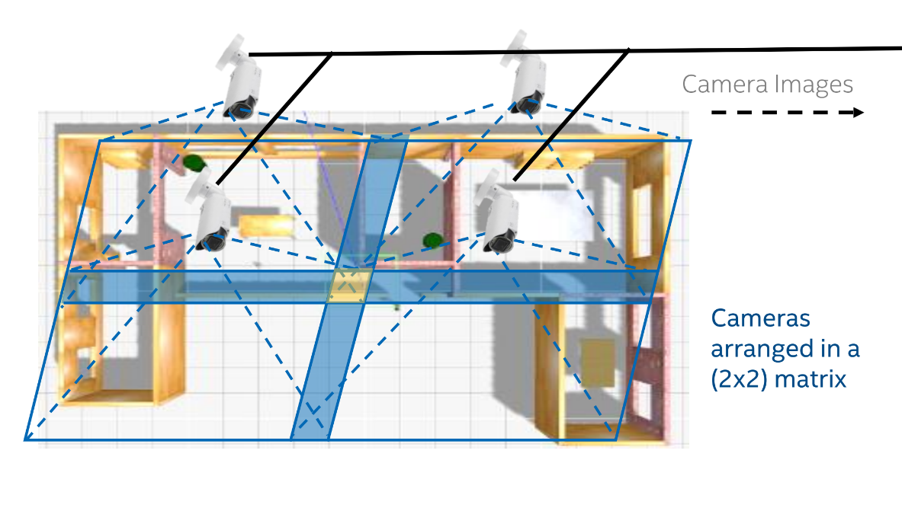
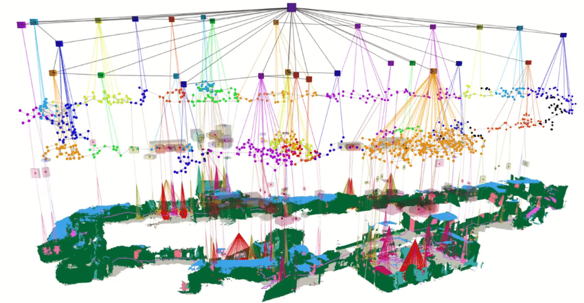
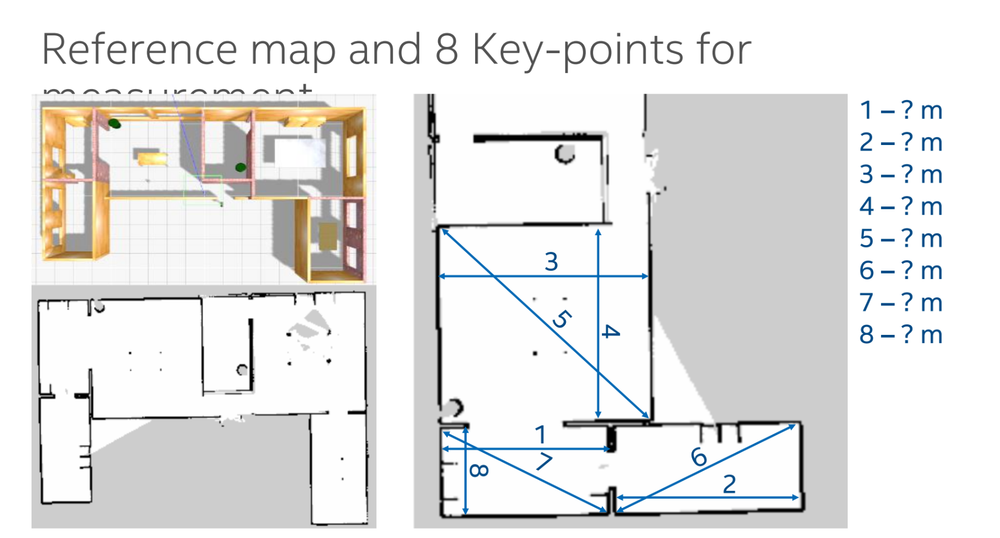

# Robotics : Develop a 2D Occupancy Grid Map of a Room using Overhead Cameras [INT 2]

The primary objective of this project is to develop a 2D occupancy grid map of a room using overhead cameras, similar to the map created by a ROS2-based SLAM algorithm typically used by autonomous mobile robots (AMRs).

 

Description:
+ In the initial phase, you will need to equip a room or area with four overhead RGB cameras
arranged in a 2x2 pattern, ensuring some overlap in their fields of view. The room should contain
static objects such as chairs, tables, stools, and boxes. Using the images from these cameras, and
by stitching the views together, you will create a 2D occupancy grid map of the room. The goal is
to demonstrate that this map can be effectively used by AMRs for path-planning and navigation.

+ In the second phase, the room environment will become dynamic, meaning objects like tables and
chairs can be moved around. The 2D occupancy grid map should be able to dynamically update
itself to reflect these changes, providing a new, accurate map for AMRs to navigate. Additionally,
you will add semantic labels to the map (e.g., "table", "chair", "other AMR") to provide further
context for the AMRs. This will likely require the implementation of simple object detection.

Motivation:
+ Map entire environment in one shot 
+ Map moving obstacles in real-time 
+ Reduce AMR cost – don’t need expensive LiDAR or depth cams
+ Provide non line of sight to AMRs
+ Better multi-robot path planning and coordination

Project Scope
+ Add the 4 RGB cameras in Gazebo simulation environment [[infraCam](./infraCam/)] in a 2x2 matrix (birds eye view) covering the environment 
with marginal overlap of FoVs at a height of ~ 8 meters.
+ Use 640x480 image resolution and acquire images from the simulated cameras
+ Explore techniques for multi-camera calibration to automatically calibrate and align FoVs or all overhead cameras
+ Create a composite 2D occupancy grid map with accurate physical dimensions by fusing images from 4 cameras. The map 
should be in a form (.pgm and 512x512 pixel resolution) such that it can be used in ROS navigation stack.
+ Benchmark accuracy/error of infra-cam derived (dimensionally accurate) composite map v/s the Gazebo environment (refer 
slides 12-14) and Measure the computing latency to run the algorithm.

Outcomes:

Initially, you can model and simulate the room environment, objects, and overhead cameras in the
Gazebo simulator. Gazebo will also support the addition of an AMR equipped with an on-board camera
or LiDAR for SLAM map generation and navigation using the ROS2 navigation stack. This will allow for a comparison between the map generated from the overhead cameras and the map created by the AMR
using SLAM.

Expected deliverables :

+ Word document describing your solution, approach, novelty, pros/cons/limitations of your approach and comparison to 
state-of –the-art. Detailed block diagram and writeup describing your algorithm and approach.
+ Fused map of the environment with detailed dimensions (derived via your infra-cam fusion algorithm) v/s the ground truth 
map from Gazebo (provided)
+ Error estimates: Measure positions/distances between various key points in the composite map and identify % absolute 
avg, min and max errors. Provide details on how the algorithm was rigorously tested and the map accuracy results.
+ Computing latency: Characterize computing latency of the algorithm on an Intel i5 (10th Gen) computer. Provide 
measurement procedure and detailed test results.
+ Source code and algos to be shared for evaluation.

Evaluation criteria :

+ Accuracy (absolute avg, min, max error) of generated fused map v/s distances of key￾point in simulation. The expectation is that the avg error should be < 10% (lesser the 
better). 
    + The algo and code will be tested on a modified map to verify accuracy of the algorithm

+ Computational Complexity (Computational latency in milliseconds to process each 
set of images from camera and convert them to a composite map) as measured on 
an Intel Core i5 (10th gen CPU, iGPU can be used). The expectation it that the overall 
computational latency should be < 1000ms (lesser the better).

+ Novelty, practicality and efficiency of the solution – this is a subjective metric

[ [official-document](./doc/PS-10%20Develop%20a%202D%20Occupancy%20Grid%20Map%20of%20a%20Room%20using%20Overhead%20Cameras.pdf) ] | [[turtlebot3](https://emanual.robotis.com/docs/en/platform/turtlebot3/simulation/)], [[ros2-for-beginners](https://www.udemy.com/course/ros2-for-beginners/?couponCode=OF52424)], [[ros2-in-python](https://www.udemy.com/course/ros2-robotics-developer-course-using-ros2-in-python/?couponCode=OF52424)] [ My [ROS notes](https://github.com/florist-notes/aicore_s/blob/main/notes/ros.MD) ].

<hr />

## Resources Section:

 [[ VIDEO : ]] [Occupancy Grid Maps (Cyrill Stachniss)](https://youtu.be/v-Rm9TUG9LA?si=9emLvh3xzSyXKKNx), [UMich - Occupancy Grid Mapping](https://youtu.be/1f_m5aJFIj4?si=mnTasA3epEQcLFzv), [ROS2 Occupancy Grid Node for Nav2](https://youtu.be/suqhnzIyq7w?si=UthlawxajggnYC4v), [Nav 2 in ROS 2 for autonomous Navigation using SLAM for Indoor Mobile Robots](https://youtu.be/GSuqO0p2mIk?si=lFT4TSL3CrzO9pc_), [2D grid mapping and navigation with ORB-SLAM 2- indoor](https://youtu.be/HoE22wMhuKA?si=yenfgj4CrC-nV7EX), [Occupancy Grid Mapping with Known Poses](https://youtu.be/x_Ah685BFEQ?si=FXeitP2XzmE08WBz), [Occupancy Grid Mapping Simulation Using Sensor Laser In ROS](https://youtu.be/v3Y2PJcUTKE?si=-CCmY7JLZ-FUvBhk), [Robotic Mapping - Occupancy Grid Mapping](https://youtu.be/QFJehL9-pNo?si=grohiew6gVKJgA1j), [CH10 SLAM for Robotics - Occupancy Grid Mapping](https://youtu.be/VcFsY4lY_cI?si=Zp3UC4Incuv5OpVV), [ROG-Map](https://youtu.be/eDkwGXCea7w?si=JCnEQJXPFHXN8Soj), [Matlab - Lab2: Occupancy grid map](https://youtu.be/tWeLWoHHC5Q?si=jIlZlU_NATX602Kq), [2D grid mapping and navigation with ORB-SLAM 2- KITTI Dataset](https://youtu.be/FCd6p25131I?si=T4gI3yVXVH9SWCwZ), [Mobile robotics - C8: Mapping and occupancy grid](https://youtu.be/rcEFRrgmScw?si=Z4-AMVW89l5_xg4L), [Mapping for Mobile Robots and UGV](https://youtu.be/OCoVCYnCkeI?si=0L5EpcHGIcHeFudd), [NanoSLAM](https://youtu.be/XUSVLHJ87J0?si=uSyJ9vnIrPvKLJ48), [Presentation: Occupancy Grid Map Estimation Based on Visual SLAM and Image Segmentation](https://youtu.be/1i5CfddAzHk?si=hqYoXGzTQTrGRVrz), [MCMC Occupancy Grid Mapping with a Data-Driven Patch Prior](https://youtu.be/x0_8nix1HKA?si=FC0GkbGeyn7cAAPf).
 
 [[ READ : ]] [wiki-Occupancy Grid Mapping](https://en.wikipedia.org/wiki/Occupancy_grid_mapping), [CMU - Occupancy Maps](https://www.cs.cmu.edu/~16831-f14/notes/F14/16831_lecture06_agiri_dmcconac_kumarsha_nbhakta.pdf), Matlab - [occupancyMap](https://in.mathworks.com/help/nav/ref/occupancymap.html) & [Occupancy Grids](https://www.mathworks.com/help/robotics/ug/occupancy-grids.html), [CMU - Learning Occupancy Grid Maps With Forward Sensor Models
](https://faculty.iiit.ac.in/~mkrishna/ThrunOccGrid.pdf), [Occupancy grid mapping: An empirical evaluation](https://ieeexplore.ieee.org/document/4433772), [Occupancy grid for static environment perception in series automotive applications](https://www.sciencedirect.com/science/article/pii/S2405896319303945), [Grid Maps and Mapping With Known Poses](http://ais.informatik.uni-freiburg.de/teaching/ss16/robotics/slides/12-occupancy-mapping.pdf), [VoxFormer](https://github.com/NVlabs/VoxFormer), [ETH-Z ASL : wavemap](https://github.com/ethz-asl/wavemap), [dynamic-occupancy-grid-map](https://github.com/TheCodez/dynamic-occupancy-grid-map), [SSCBench](https://github.com/ai4ce/SSCBench), [Occ4cast](https://github.com/ai4ce/Occ4cast), [Dynamic Occupancy Grid Map with Semantic Information Using Deep Learning-Based BEVFusion Method with Camera and LiDAR Fusion](https://www.mdpi.com/1424-8220/24/9/2828), [An Approach for 2D Visual Occupancy Grid Map Using Monocular Vision](https://www.sciencedirect.com/science/article/pii/S1571066111001824), [Semantic Evidential Grid Mapping Using Monocular and Stereo Cameras](https://www.mdpi.com/1424-8220/21/10/3380), [OGM NOTES](./ogm.MD).

3D Scene Graphs (Spatial Perception): [3dscenegraph.stanford.edu](https://3dscenegraph.stanford.edu/), [Hydra: A Real-time Spatial Perception System for 3D Scene Graph Construction and Optimization](https://youtu.be/qZg2lSeTuvM?si=NKzPApvUPAP_6HsJ), [Foundations of spatial perception for robotics: Hierarchical representations and real-time systems](https://journals.sagepub.com/doi/10.1177/02783649241229725), [3D Dynamic Scene Graphs: Actionable Spatial Perception with Places, Objects, and Humans](https://roboticsconference.org/2020/program/papers/79.html), [Scene Graph Generation: A comprehensive survey](https://www.sciencedirect.com/science/article/pii/S092523122301175X), [SGRec3D: Self-Supervised 3D Scene Graph Learning via Object-Level Scene Reconstruction](https://openaccess.thecvf.com/content/WACV2024/papers/Koch_SGRec3D_Self-Supervised_3D_Scene_Graph_Learning_via_Object-Level_Scene_Reconstruction_WACV_2024_paper.pdf), [Learning 3D Semantic Scene Graphs From 3D Indoor Reconstructions](https://ieeexplore.ieee.org/document/9156565), [A Survey on 3D Scene Graphs: Definition, Generation and Application](https://www.researchgate.net/publication/368919812_A_Survey_on_3D_Scene_Graphs_Definition_Generation_and_Application), [3D Scene Graph Generation From Point Clouds](https://ieeexplore.ieee.org/document/10313987), [GraphDreamer: Compositional 3D Scene Synthesis from Scene Graphs](https://github.com/GGGHSL/GraphDreamer), [CURB-SG: Collaborative Dynamic 3D Scene Graphs for Automated Driving](https://youtu.be/qbzQNz7_i8c?si=8BnhmBRc80IRdMXW), [Unbiased 3D Semantic Scene Graph Prediction in Point Cloud Using Deep Learning](https://www.mdpi.com/2076-3417/13/9/5657), [A Survey on 3D Scene Graphs: Definition, Generation and Application](https://ouci.dntb.gov.ua/en/works/7qBkWwe4/), [Learning 3D Semantic Scene Graphs with Instance Embeddings](https://link.springer.com/article/10.1007/s11263-021-01546-9), [Stanford Seminar - Foundations of Spatial Perception for Robotics](https://youtu.be/L3cdMDIJqWs?si=7CpxdrWr-m3HZ34j), [[ICCV'23] Luca Carlone: From SLAM to Spatial Perception](https://youtu.be/jDume0pA2-Q?si=XjvB-VeBJ71dfsA4), [Foundations of spatial perception for robotics: Hierarchical representations and real-time systems](https://journals.sagepub.com/doi/abs/10.1177/02783649241229725), [Spatial Perception for Robots and Autonomous Vehicles](https://www.ieee-ras.org/about-ras/ras-calendar/event/1787-spatial-perception-for-robots-and-autonomous-vehicles), [Open3DSG: Open-Vocabulary 3D Scene Graphs from Point Clouds with Queryable Objects and Open-Set Relationships](https://kochsebastian.com/media/open3dsg/open3dsg_camera.pdf).

<hr />

# Step-by-Step Guide to Developing a 2D Occupancy Grid Map Using Overhead Cameras (Sample Approach)

## Phase 1: Static Environment Mapping :
### + `Step 1`: Setup Environment and Tools

+ Install ROS2 and Gazebo: ROS2 (Robot Operating System 2) is essential for simulation and robotic control, while Gazebo provides a realistic 3D simulation environment.

+ Setup Python Environment: Create a virtual environment and install necessary Python packages.
```python
python3 -m venv ros2_env
source ros2_env/bin/activate
pip install opencv-python numpy
```
### Setting up the ROS2 environment :

+ Ubuntu 20.04
+ Install ROS2 foxy, packages – [3.1.2-3.1.4](https://emanual.robotis.com/docs/en/platform/turtlebot3/quick-start/)
+ Check `“ros2 topic list”`
+ export TURTLEBOT3_MODEL=waffle_pi
+ Steps to create ros2 workspace
    + `“mkdir –p ~/turtlebot3_ws/src”`
    + Install turtlebot3 packages – [6.1.1,6.1.2](https://emanual.robotis.com/docs/en/platform/turtlebot3/simulation/)
    + Run the house simulation 
+ Check `“ros2 topic list”`
+ Locations Overhead cameras
[C1: (-5,-2,8) C2:(-5,3,8) C3:(1,-2,8) C4:(1,3,8)]

### Adding Overhead Cameras :
+ Download the [infraCam.zip](./infraCam/)
+ Extract the folder `“turtlebot3_camera_house”` 
and place in the `“……/turtlebot3_ws/src/turtlebot3_simulations/turtlebot3_gazebo/models”` directory.
+  Replace the `waffle_pi.model` in 
`“…../turtlebot3_ws/src/turtlebot3_simulations/turtlebot3_gazebo/worlds/turtlebot3_houses/”` with the downloaded version.
+  Change path in lines 6,11,16,21
+  Source and build the workspace - `"$ source install/setup.bash"`.
+  Run house simulation: 
`“ros2 launch turtlebot3_gazebo 
turtlebot3_house.launch.py”`
+  Topics related overhead camera are now 
visible.

### How to acquire data from camera : [[image_listener.py](./image_listener.py)]

+ ROS works as a pub-sub model 
+ The images are being streamed on the topics.
+ The images can be accessed through the 
python script.
+ Always `“source /opt/ros/foxy/setup.bash”` 
before running the python script.
+ 1 – Initiates the nodes (script will be given 
unique name) and waits for user to 
interrupt the program.
+ 2 – Creates subscription to camera topic.
+ 3 – Every time the camera image is 
published, listener_callback function is 
executed.

### How to evaluate the generated map?

[[Evaluation_of_gen_map](./Evaluation_of_gen_map/)]
+ Run command below (replace path in 
yaml file)

```bash
$ ros2 launch turtlebot3_navigation2 
$ navigation2.launch.py use_sim_time:=True 
$ map:=$HOME/map_house.yaml
```

+ Rviz: a visualization tool for ROS
+ We have 8 key point to point 
measurements as benchmarks.
+ A map generated with cartographer will 
be provided for reference.



#### How to evaluate the generated map?
#### Using Rviz to find distance between key points

<hr />

## 🌸 extra notes :


### + `Step 2`: Capture and Stitch Images

+ Capture Images from Cameras (Image Stitching Node):

Write a ROS2 node to capture images from the overhead cameras.
```python
#!/usr/bin/env python

import rospy
import cv2
import numpy as np
from sensor_msgs.msg import Image
from cv_bridge import CvBridge

class ImageStitchingNode:
    def __init__(self):
        rospy.init_node('image_stitching_node', anonymous=True)
        
        self.bridge = CvBridge()
        self.images = {}
        self.subscribers = []
        
        camera_topics = ["/camera1/image_raw", "/camera2/image_raw", "/camera3/image_raw", "/camera4/image_raw"]
        
        for i, topic in enumerate(camera_topics):
            self.subscribers.append(rospy.Subscriber(topic, Image, self.image_callback, callback_args=i))
        
        self.stitched_image_pub = rospy.Publisher('/stitched_image', Image, queue_size=10)
        
        rospy.spin()

    def image_callback(self, msg, camera_index):
        try:
            cv_image = self.bridge.imgmsg_to_cv2(msg, "bgr8")
            self.images[camera_index] = cv_image
            
            if len(self.images) == 4:
                self.stitch_images()
        except Exception as e:
            rospy.logerr(f"Error in image_callback: {e}")

    def stitch_images(self):
        images = [self.images[i] for i in sorted(self.images.keys())]
        
        stitcher = cv2.Stitcher.create()
        (status, stitched) = stitcher.stitch(images)
        
        if status == cv2.Stitcher_OK:
            stitched_msg = self.bridge.cv2_to_imgmsg(stitched, "bgr8")
            self.stitched_image_pub.publish(stitched_msg)
        else:
            rospy.logerr(f"Image stitching failed with status {status}")

if __name__ == '__main__':
    try:
        ImageStitchingNode()
    except rospy.ROSInterruptException:
        pass
```
Make the script executable : `$ chmod +x src/image_processing/src/image_stitching.py`.

### + `Step 3`: Generate 2D Occupancy Grid Map (Create the Occupancy Grid Map Node)

+ Convert Image to Grayscale and Threshold:

Convert the stitched image to a binary occupancy grid.

+ Generate Occupancy Grid:

Create an occupancy grid from the binary image.

```python
#!/usr/bin/env python

import rospy
import cv2
import numpy as np
from sensor_msgs.msg import Image
from nav_msgs.msg import OccupancyGrid
from cv_bridge import CvBridge

class OccupancyGridMapNode:
    def __init__(self):
        rospy.init_node('occupancy_grid_map_node', anonymous=True)
        
        self.bridge = CvBridge()
        
        rospy.Subscriber("/stitched_image", Image, self.image_callback)
        self.occupancy_grid_pub = rospy.Publisher('/occupancy_grid', OccupancyGrid, queue_size=10)
        
        rospy.spin()

    def image_callback(self, msg):
        try:
            cv_image = self.bridge.imgmsg_to_cv2(msg, "bgr8")
            gray_image = cv2.cvtColor(cv_image, cv2.COLOR_BGR2GRAY)
            _, binary_image = cv2.threshold(gray_image, 127, 255, cv2.THRESH_BINARY)
            
            occupancy_grid = self.create_occupancy_grid(binary_image)
            self.occupancy_grid_pub.publish(occupancy_grid)
        except Exception as e:
            rospy.logerr(f"Error in image_callback: {e}")

    def create_occupancy_grid(self, binary_image):
        occupancy_grid = OccupancyGrid()
        
        occupancy_grid.header.stamp = rospy.Time.now()
        occupancy_grid.header.frame_id = "map"
        
        occupancy_grid.info.resolution = 0.05
        occupancy_grid.info.width = binary_image.shape[1]
        occupancy_grid.info.height = binary_image.shape[0]
        occupancy_grid.info.origin.position.x = 0
        occupancy_grid.info.origin.position.y = 0
        occupancy_grid.info.origin.position.z = 0
        occupancy_grid.info.origin.orientation.w = 1.0
        
        data = []
        for i in range(binary_image.shape[0]):
            for j in range(binary_image.shape[1]):
                if binary_image[i, j] == 255:
                    data.append(0)
                else:
                    data.append(100)
        
        occupancy_grid.data = data
        
        return occupancy_grid

if __name__ == '__main__':
    try:
        OccupancyGridMapNode()
    except rospy.ROSInterruptException:
        pass
```

Make the script executable : `$ chmod +x src/image_processing/src/occupancy_grid_map.py`.

### + `Step 4`: Simulate in Gazebo and Validate

Create a launch file to run both nodes.

Create a launch file image_processing.launch: 

```xml
<launch>
    <node name="image_stitching_node" pkg="image_processing" type="image_stitching.py" output="screen"/>
    <node name="occupancy_grid_map_node" pkg="image_processing" type="occupancy_grid_map.py" output="screen"/>
</launch>
```

Run the launch file : ` $ roslaunch image_processing image_processing.launch`.

## Phase 2: Dynamic Environment Mapping

### + `Step 5`: Detect and Update Moving Objects

+ Implement Object Detection:

Use a pre-trained model (e.g., YOLO, SSD) to detect objects and update the occupancy grid.

```python
import cv2
import numpy as np

def detect_objects(image):
    # Use a pre-trained model to detect objects
    net = cv2.dnn.readNet('yolov3.weights', 'yolov3.cfg')
    layer_names = net.getLayerNames()
    output_layers = [layer_names[i[0] - 1] for i in net.getUnconnectedOutLayers()]
    blob = cv2.dnn.blobFromImage(image, 0.00392, (416, 416), (0, 0, 0), True, crop=False)
    net.setInput(blob)
    detections = net.forward(output_layers)
    return detections

detections = detect_objects(stitched_image)
```

+ Update Occupancy Grid:

Adjust the occupancy grid based on detected objects.

```python
def update_occupancy_grid(grid, detections):
    for detection in detections:
        x, y, w, h = detection
        grid[y:y+h, x:x+w] = 1  # Mark detected object area as occupied
    return grid

updated_grid = update_occupancy_grid(occupancy_grid, detections)
```

+ Publish Updated Occupancy Grid:

Continuously update and publish the new occupancy grid.

```python
while True:
    detections = detect_objects(stitched_image)
    updated_grid = update_occupancy_grid(occupancy_grid, detections)
    publish_occupancy_grid(updated_grid)
```

### + `Step 6`: Add Semantic Labels

+ Add Semantic Information:
Label detected objects with semantic information.

```python
def add_semantic_labels(grid, detections):
    labels = ["table", "chair", "stool", "box"]
    for detection, label in zip(detections, labels):
        x, y, w, h = detection
        grid[y:y+h, x:x+w] = label  # Annotate grid with labels
    return grid

labeled_grid = add_semantic_labels(occupancy_grid, detections)
```

### + `Step 7`: Validate and Compare with AMR-generated Map
+ Simulate AMR with SLAM:
  
Use the ROS2 navigation stack to simulate an AMR generating its own map.
Compare the AMR-generated map with the overhead camera map.

By following these steps, we will be able to develop a 2D occupancy grid map using overhead cameras, dynamically update it with object detection, and add semantic labels for improved navigation and path-planning in a simulated environment.

Creating a dynamic 3D spatial scene graph from a 2D image requires a combination of computer vision techniques and 3D rendering. Here's a simplified outline of how you could approach this:

+ `Object Detection`: Use computer vision techniques (e.g., deep learning-based object detection models like YOLO or Faster R-CNN) to detect objects in the image. This step involves identifying the table, chair, plant pot, and traffic cone.

+ `3D Reconstruction`: Convert the 2D image into a 3D representation of the scene. This can be done using structure-from-motion (SfM) or multi-view stereo (MVS) techniques to estimate the 3D positions of objects based on their appearance in multiple images or viewpoints.

+ `Spatial Scene Graph`: Once you have the 3D representation of the scene, construct a spatial scene graph to represent the relationships between objects and their positions in 3D space. Each node in the graph corresponds to an object, and edges represent spatial relationships (e.g., adjacency, containment).

+ `Dynamic Updates`: Implement a mechanism to dynamically update the scene graph when objects are removed from the image. This involves re-detecting objects in the updated image, updating the 3D representation of the scene, and modifying the spatial scene graph accordingly.
  
Here's a high-level Python pseudo-code example to illustrate the process:

```python
# Step 1: Object Detection
detected_objects = detect_objects(image)

# Step 2: 3D Reconstruction
point_cloud = reconstruct_3d_scene(image)

# Step 3: Spatial Scene Graph Construction
scene_graph = construct_scene_graph(detected_objects, point_cloud)

# Step 4: Dynamic Updates
def remove_object(object_id):
    # Remove object from detected_objects list
    detected_objects.remove(object_id)
    
    # Reconstruct 3D scene
    updated_point_cloud = reconstruct_3d_scene(updated_image)
    
    # Update scene graph
    update_scene_graph(scene_graph, detected_objects, updated_point_cloud)

# Example usage
remove_object("traffic_cone")

```
<hr />