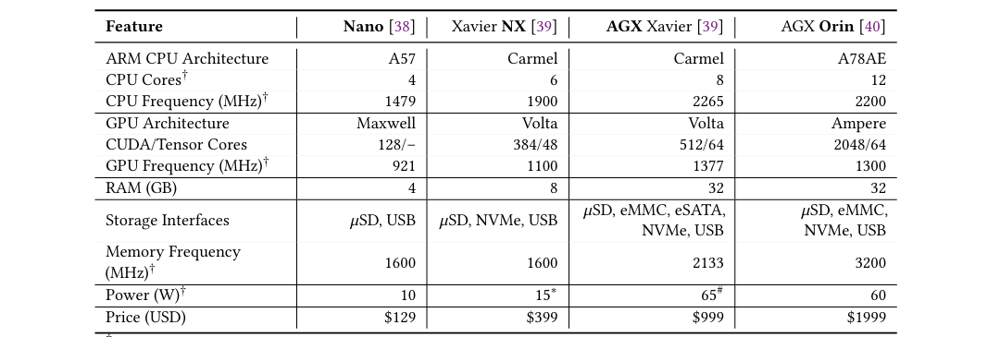
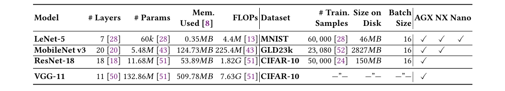

## Characterizing the Performance of Accelerated Jetson Edge Devices for Training Deep Learning Models 

🌸 [ paper : [https://doi.org/10.1145/3570604](https://dl.acm.org/doi/10.1145/3570604) ] | DL for [autonomous vehicles](https://arxiv.org/abs/1912.10773), [smart cities](https://ieeexplore.ieee.org/document/8704334) | DNN model training on the edge - [P1](https://ieeexplore.ieee.org/document/8763885/), [P2](https://ieeexplore.ieee.org/document/8778327) | [ [PRACTICALS](./int3_practicals.MD), [CODE_BRK](./int3_codebreakdown.MD) ].

Abstract : Deep Neural Networks (DNNs) have had a significant impact on domains like autonomous vehicles and smart cities through low-latency inferencing on edge computing devices close to the data source. However, DNNtraining on the edge is poorly explored. Techniques like federated learning and the growing capacity of GPU-accelerated edge devices like NVIDIA Jetson motivate the need for a holistic characterization of DNN training on the edge. Training DNNs is resource-intensive and can stress an edge’s GPU, CPU, memory and storage capacities. Edge devices also have different resources compared to workstations and servers, such as slower shared memory and diverse storage media. Here, we perform a principled study of DNN training on individual devices of three contemporary Jetson device types: AGX Xavier, Xavier NX and Nano for three diverse DNN model–dataset combinations. We vary device and training parameters such as I/O pipelining and parallelism, storage media, mini-batch sizes and power modes, and examine their effect on CPU and GPU utilization, fetch stalls, training time, energy usage, and variability. Our analysis exposes several resource inter-dependencies and counter-intuitive insights, while also helping quantify known wisdom. Our rigorous study can help tune the training performance on the edge, trade-off time and energy usage on constrained devices, and even select an ideal edge hardware for a DNN workload, and, in future, extend to federated learning too. As an illustration, we use these results to build a simple model to predict the training time and energy per epoch for any given DNN across different power modes, with minimal additional profiling.

Federated & Geo Distributed Learning [[paper](https://arxiv.org/abs/1905.10083)], Flower: A Friendly Federated Learning Research Framework [[paper](https://arxiv.org/abs/2007.14390)]

`Study` : Impact of hardware resources such as the number of CPU cores, CPU/GPU/memory frequency, storage media and power modes on the training time and energy usage. Examine how PyTorch settings such as the number of concurrent data loaders, and the DNN model and data  sizes, affect the performance. 

`Takeaways` : Purchasing a faster and more expensive storage may not necessarily improve the training speed if pipelining and caching are able to hide the GPU stalls; a slower and  cheaper hard disk could give the same performance. Similarly, a power mode with the highest GPU  frequency but a lower CPU frequency may not give benefits for smaller DNN models like LeNet which are CPU bound due to pre-processing costs.

 + `(1)` We understand the effect of disk caching, pipelining and parallelizing data fetch and pre
processing on the stall time and epoch training time, and the interplay between CPU and
 GPU performance.
 + `(2)` We study the impact of storage medium and mini-batch sizes on stalls, GPU compute time
 and end-to-end times, and confirm the deterministic performance of these
 devices across time and instances when training.
 + `(3)` We investigate the consequence of Dynamic Voltage and Frequency Scaling (DVFS) and various
 power modes on the training time, energy usage and their trade-off.
 + `(4)` Lastly, we use these results to train simple models to predict the epoch training time and the energy usage per epoch of a given DNN for any power mode with limited profiling.

NVIDIA AGX Orin is comparable to a RTX 3080 Ti workstation GPU, but with a power consumption of ≤ 60𝑊 and no larger than a paperback novel. LPDDR RAM shared between CPU and GPU of AGX Orin vs GDDR RAM in regular GPUs. Edge devices offer several inbuilt and user-defined power modes, each with different cores, CPUfrequency, GPU frequency and memory frequency. This offers a large parameter space (> 29𝑘 combinations for AGX) with interesting power–performance trade-offs. They support a wide variety of storage media including eMMC, Micro SD card, NVME  Solid State Drive (SSD), Hard Disk Drive (HDD), which have different I/O performance and monetary costs.

This study enables accurate modeling of DNN training time and energy usage for the diverse power modes of these devices. This is key for federated learning when devices in a training round need to complete at about the same time.

`DNN Training`: DNN training happens iteratively. In each iteration, we fetch a “mini-batch” of samples from disk to memory, and perform pre-processing on the mini-batch, such as deserialization, cropping, resize, flipping and normalization of the input images using the CPU. Then, the CPU launches kernels on the GPU to perform the forward and backward passes of training. This repeats for the next mini-batch and so on until all the input samples are consumed. This forms one epoch of training. Epochs are repeated using different mini-batch samplings till the model converges. Fetching a mini-batch from disk is I/O intensive, pre-processing is CPU intensive and the training is GPUintensive.

Performing these three stages sequentially will cause the GPU to remain idle while it waits for the disk and CPU to finish fetching and pre-processing a mini-batch. PyTorch’s `DataLoader` and input pipelines constructed from TensorFlow’s `tf.data` API help pipeline the fetch and pre-process stages with the compute stage. The fetch and pre-process stages can also be parallelized to operate on multiple mini-batches so that a fast GPU does not have to wait, or “stall”, for a mini-batch to be ready. 

`Setup` : All devices of the AGX, NX and Nano run Linux for Tegra (L4T) 𝑣32.5.1 with 𝑣4.9.201-tegra kernel. They have CUDA 𝑣10.2 with Jetpack 𝑣4.5.1. We use PyTorch 𝑣1.8 and Torchvision 𝑣0.9 as the DNN training framework. However, Orin requires a more recent OS and library version: CUDA 𝑣11.2, Jetpack 𝑣5.0.1 running on L4T 𝑣34.1.1, Pytorch 𝑣1.12 and Torchvision 𝑣0.13.

Research uses the PyTorch framework for training with the `Dataloader` to fetch and pre
process data. We use the `num_workers` flag to vary the number of fetch and pre-process workers.
When `num_workers=0`, a single process performs fetch, pre-process and GPU compute sequen
tially, without pipelining. When `num_workers ≥ 1`, PyTorch spins up that many processes for
fetch/pre-process, each operating on a different batch of data in parallel, and a separate process invokes the GPUcomputeoneachpre-processedbatchsequentially. This forms a two-stage pipeline  of fetch/pre-process followed by compute

`Default Configuration : `  The default power mode is the highest rated for all devices:
 MAXN for the AGX and Nano, and 15𝑊 for NX (modes 𝑔, 𝑀𝐴𝑋𝑁 and 15𝑊). DVFS is turned off. The fan speed is set to maximum to avoid resource throttling due to overheating. By default, we store the training data on SSD for the AGX and NX, and on SD card for the Nano. In experiments where we need the same storage media type across all three device classes, we use HDD over USB for the training data as it is present on all. 
 The prefetch factor in PyTorch DataLoader is set to its default value of 2. The number of
 worker processes in the DataLoader is set to𝑤 = 4. Number of worker processes in the DataLoader is set to𝑤 = 4. Previous works have shown that large mini-batch sizes adversely affect convergence and therefore we use a mini-batchsize of 𝑏𝑠 = 16 images when training.  The learning rate and momentum are set to 0.01 and 0.9 respectively. We use Stochastic Gradient Descent (SGD) as the optimizer, and cross-entropy as the loss function. We clear the page cache at the start of every experiment run to avoid any cross-experiment effects, but it is retained across epochs within a single training run.  In each experiment, we train the DNN models for 6 epochs (15h). By default, we report the results averaged over epochs 1–5 (90 min for each epoch) since epoch 0 has bootstrapping overheads.

 `Performance Metrics `:
 + CPU, GPU and RAM utilization, and average and instantaneous power are measured using the `jtop` Python module, which internally uses the `tegrastats` utility from NVIDIA, at ≈ 1 𝑠 sampling. The power measurements are from on-board sensors in the Jetsons, which capture the power load from the module but not the carrier board and peripherals. The socket load can be captured by using an external power monitor, which we use for baseload studies. The module load reported by the on-board sensors are used in our analysis, unless noted otherwise.
 The sampling interval deviates by up to 200 𝑚𝑠 due to delays introduced by the rest of the
 monitoring harness:  `iostat` takes 1𝑠 when run periodically.
 + The total energy for training in a duration 𝑇 is calculated as a sum of the instantaneous power (𝑝_{𝑡_𝑖} in watts) measured at time 𝑡_𝑖, weighted by the duration between successive samples (𝑡_𝑖 − 𝑡_{𝑖−1}), given as
  

$$ \sum_{t_i \in T} (p_{t_i} (t_i - t_{i-1})) $$

+  The read IOPS and bytes read per second (throughput) are measured using `iostat`.
+  The fraction of the dataset that is present in the Linux (in-memory) disk cache is measured using `vmtouch`.
+  We measure the fetch stall time and the GPU compute time for every mini-batch. Fetch stall time is the visible time taken to fetch and pre-process data, and does not overlap with the GPU compute time, i.e., max((fetch time + pre-process time − GPU compute time),0). GPU compute
 time is the time taken by the mini-batch to execute the training on the GPU. It includes the kernel launch time, and the forward and backward passes of training. We measure these times using the `torch.cuda.event` with the `synchronize` option so that time captured is accurate.
+ We sum the fetch stall and GPU compute times over all mini-batches in an epoch to obtain
 their average time per epoch. We also measure and report the End-to-End (E2E) time to process all
 mini-batches of each epoch, including the fetch stall time, GPU compute time and any framework
 overheads.

 ## RESULTS AND ANALYSIS:

 ### 🌸 Pipelined Training and Disk Caching :

`Disk Caching`: The Linux page cache uses available free memory to retain recently fetched file pages in memory. So some of the training data used in previous epoch(s) may be available in the cache for future epochs, reducing disk access.
For epoch 0, all training data will be accessed from the disk, whereas for epochs 1+, a subset of the data may be present in and fetched from RAM, depending on the memory pressure from applications and the Least Recently Used (LRU) cache eviction policy.

We get caching benefits only in a sweet spot when: (1) the training data is small enough to fully fit in the cache, i.e., within the available RAM after loading the DNN model, and yet (2) the training data also is large enough that the fetch I/O time dominates over the pre-processing time. 
Pipelining reduces the stall time. When pipelining is enabled by increasing the workers from 𝑤 =0 to 𝑤 =1 for epochs 1+, the stall time per epoch sharply reduces.

The stall time and its reduction due to pipelining are decided by the relative speeds of CPU, GPU and disk. With pipelining enabled (𝑤 = 1), a stall is avoided when the sum of the fetch time from disk (or cache) and pre-processing time on CPU is smaller than or comparable to the GPU compute time for a mini-batch.  Parallelizing the fetch and pre-process may give benefits beyond pipelining. When we increase the number of workers to𝑤 > 1, we can fetch and pre-process multiple mini-batches in parallel. This may further reduce the stall time, but is not guaranteed.

Pipelining can reduce the energy consumption for training. Pipelining increases the instanta
neous power load across all models and devices, but the total energy consumed for the epoch is the same or lower. As fetch stalls reduce, the GPU and the CPU are utilized better and this increases the power load. However, this is offset by a drop in the training time for the epoch due to pipelining.
 ### 🌸 Effect of Storage Media :

Any drop in stall time due to a faster storage media depends on the I/O pressure during fetch. When the mini-batch size for a model is small, such as MNIST and CIFAR, the I/O over heads of fetch are small. Caching and pipelining can hide the stall times of a slower storage media, and a faster disk may not offer benefits. For an expected training configuration of epoch 1+ using 𝑤=4 pipelined and parallelized workers, the benefit of a faster disk is minimal.

Storage media does not directly affect the energy per epoch, but the energy used changes due to the difference in training times.

 ### 🌸 Effect of Mini-batchSize :
Mini-batch size is a well-studied hyper-parameter in DNN training, and it affects the statistical efficiency and rate of convergence. Their sizes range from 1–100𝑠 of samples, though smaller sizes of 2–32 give better results. The maximum mini-batch size is limited by the GPU memory.

Increasing the mini-batch size reduces the training time per epoch until the parallelism of the GPU cores saturate. As the mini-batch size increases, the data-parallelism of the GPU is better exploited as the samples in the mini-batch are independently processed on the different cores, and there are more rounds of data-parallel work per mini-batch. As a result, the compute time per mini-batch only gradually increases with larger batches until the GPU hits maximum utilization.

Increasing the mini-batch size increases the stall time per mini-batch but reduces the overall stall time per epoch.

 ### 🌸 Variability across Device Instances and Epoch :

 Inferencing workloads that run in milliseconds, training workloads run for minutes or hours and are likely to be less sensitive across devices. There is minimal variability in the end-to-end training time per epoch, for different epochs trained on a given device type. There is minimal variability in the end-to-end training time per epoch across devices of the same type. There is minimal variability in the energy consumed per epoch across time and across devices of the same type.

 Significant variability is observed when there is a difference in the software configurations of devices. Anecdotally, we observe that any changes to the OS kernel, PyTorch, or NVIDIA Jetpack versions lead to variability in the performance of different instances of the same device type.

 ### 🌸 Effect of DVFS :

 Enabling Dynamic Voltage and Frequency Scaling (DVFS) allows the CPU governor to dynamically alter the CPU, GPU, and memory frequencies depending on the system load, to conserve energy. DVFS can be changed using the `jetson_clocks` utility. We disable DVFS by setting the CPU, GPU, and memory frequencies to a static value. We set this to the maximum frequency allowed for the default MAXN(𝑔) power mode and do not change it.

    + Enabling DVFS has negligible effect on the end-to-end time or the energy consumed per epoch.
    + Enabling DVFS does change the frequencies of CPU, GPU, and memory, despite not affecting the training performance.

 ### 🌸 Baseload and Effect of Power Modes :

 #### + Baseload under Idle States:

 + (i) A clean-start of the device with no applications running, but with the logging of performance and energy metrics turned on and DVFS turned off. This setting mimics our default
experiment harness but without actually running any training workloads. 
 + (ii) No applications or logging harness running, but DVFS turned off. 
 + (iii) No applications or logging running, but DVFS turned on. 
 + (iv) Device in Wake on LAN (WoL) state, where it can be activated by a network command but is otherwise suspended. The last is helpful when devices have to be occasionally woken up for training but can otherwise remain turned off.

  WoL has the lowest power consumption of all the idle states for all devices, and is
 substantially lower than the next lowest idle state with DVFS on. Wake-on-LAN can be used to reduce the energy footprint for periodic or on-demand workloads like federated learning.

 #### + Impact of Power Modes:
The Jetson devices come with a number of pre-defined power modes that users can choose from. Additionally, we can also configure a custom power mode by specifying the number of CPU cores enabled, and the frequencies of CPU, GPU, and RAM (External Memory Controller (EMC)). The power mode can be changed on the fly, without any system downtime. 

This can help define an ideal power mode for each DNN model training, which balances the training time and the energy used by the constrained edge device, e.g., to stay within a daily energy budget or to avoid overheating of enclosures, while still minimizing the training time. The range of values for the frequencies is also wide, and choosing one power mode over another can result in an order of magnitude performance difference in time and energy.

The default power mode may not be Pareto optimal. For all models, the peak power mode𝑔
 (MAXN; ♦) with the highest core counts and frequencies has the fastest time, and is on Pareto front. The energy consumed is often dominated by the baseload rather than the incremental load due to training.

 The variation in energy consumed per epoch is modest across power modes for larger DNN
 models. The GPU compute time is inversely proportional to the GPU frequency for larger DNNs.  Increasing the CPU frequency and number of cores reduce the stall time. Increasing the CPU frequency and number of cores reduces the GPU compute time, and more so for light models. GPU compute time and stall times are affected by the memory frequency. 

 ### 🌸 Predicting Training Time and Energy Usage for Custom Power Modes :

 Model Training to Predict E2E Time per Epoch : Linear Regression with Root Mean Square Error (RMSE).

