# Zeus: Understanding and Optimizing GPU Energy Consumption of DNN Training

🌸 [ paper : [web](https://www.usenix.org/conference/nsdi23/presentation/you), [pdf](https://www.usenix.org/system/files/nsdi23-you.pdf) ], [code](https://github.com/ml-energy/zeus) | [ [video](https://youtu.be/aZoD-jgO3fE?si=WhcxloaeZDnFAgvo) ]


<p class="ex1" align="justify" style="padding: 5px 5px 5px 5px">
Abstract:  Training deep neural networks (DNNs) is becoming increasingly more resource- and energy-intensive every year. Unfortunately, existing works primarily focus on optimizing DNN training for faster completion, often without considering the impact on energy efficiency.
In this paper, we observe that common practices to improve training performance can often lead to inefficient energy usage. More importantly, we demonstrate that there is a tradeoff between energy consumption and performance optimization. To this end, we propose Zeus, an optimization framework to navigate this tradeoff by automatically finding optimal job- and GPU-level configurations for recurring DNN training jobs. Zeus uses an online exploration-exploitation approach in conjunction with just-in-time energy profiling, averting the need for expensive offline measurements, while adapting to data drifts over time. Our evaluation shows that Zeus can improve the energy efficiency of DNN training by 15.3%–75.8% for diverse workloads.

</p>

Deep neural networks (DNNs) have seen widespread adoption in various data-driven domains, including computer vision, natural language processing, personalized recommendation, and speech recognition. To support this growth, DNN models are primarily trained on clusters of highly parallel and powerful GPUs . However, the increasing computational demand has led to greater energy consumption. For example, training the GPT-3 model requires 1,287 megawatt-hours (MWh) [[source](https://arxiv.org/abs/2104.10350)], equivalent to the electricity used by an average U.S. household over 120 years. Despite efforts to reduce operational power footprints, like Meta's 28.5% reduction, the energy demand for AI continues to rise. Existing literature on DNN training largely overlooks energy efficiency [[paper](https://dl.acm.org/doi/10.1145/3381831)].

Our research highlights that common performance optimization practices for DNN training often result in inefficient energy usage. Recent works suggest using large batch sizes to enhance training throughput [[paper](https://arxiv.org/abs/1711.00489), [paper](https://arxiv.org/abs/1706.02677)], but this can lower energy efficiency. We found that setting appropriate batch sizes and GPU power limits can reduce energy consumption by 23.8%–74.7% across different workloads.

Reducing energy consumption, however, involves tradeoffs. We discovered a balance between energy use and training time for achieving target accuracy. Our analysis of the energy-time Pareto frontier reveals two key insights: first, all Pareto-optimal configurations offer varying degrees of energy savings compared to using maximum batch sizes and GPU power limits indiscriminately. Second, the reduction in energy consumption often exhibits a non-linear relationship with the increase in training time. This raises the question: how can we automatically identify and manage the tradeoff between energy consumption and training time for DNN training?

In this paper, the author present Zeus, a plug-in optimization framework designed to minimize both energy consumption and training time for DNN training jobs by automatically configuring batch size and GPU power limits. Unlike recent approaches that only consider GPU-specific configurations [[paper](https://www.semanticscholar.org/paper/DUB%3A-Dynamic-Underclocking-and-Bypassing-in-NoCs-Bharadwaj-Das/96e34f96673cca9f118b0bdf5970df5202d4fe84), [paper](https://arxiv.org/pdf/1905.11012)], Zeus addresses both job- and GPU-related configurations without requiring per-job offline profiling or prediction model training [[paper](https://arxiv.org/abs/2201.01684), [paper](https://ieeexplore.ieee.org/document/9139663)]. This makes it particularly suitable for large clusters with heterogeneous hardware and time-varying workloads [[paper](https://www.usenix.org/conference/nsdi22/presentation/weng)].

Zeus employs an online exploration-exploitation approach tailored to DNN training workflows, which need periodic re-training as new data arrives [[paper](https://research.facebook.com/publications/applied-machine-learning-at-facebook-a-datacenter-infrastructure-perspective/) : [pdf](https://systems.cs.columbia.edu/private-systems-class/papers/Hazelwood2018Applied.pdf)]. By automatically exploring various configurations and continuously adjusting based on measured gains or losses, Zeus efficiently navigates the configuration space.

The design of Zeus overcomes two significant challenges: the stochastic nature of DNN training, where energy consumption varies even with identical configurations due to randomness in parameter initialization and data loading [[paper](https://arxiv.org/abs/1806.01427), [paper](https://wires.onlinelibrary.wiley.com/doi/abs/10.1002/widm.1200)], and the diversity in DNN and GPU architectures, which makes offline profiling results non-transferable [[paper](https://arxiv.org/pdf/1909.06842v6)]. Given the vast configuration space, Zeus decouples batch size and power limit optimization, using a Multi-Armed Bandit (MAB) approach with Thompson Sampling policy for batch size optimization and a just-in-time (JIT) energy profiler for power limit adjustment.

Implemented within the PyTorch framework, Zeus has been evaluated across various workloads, including speech recognition, image classification, NLP, and recommendation tasks. The results show that Zeus reduces energy consumption by 15.3%–75.8% and training time by 60.6% compared to using maximum batch size and GPU power limit settings. Additionally, Zeus quickly converges to the optimal configuration and adapts effectively to data drift, extending its benefits to multi-GPU settings as well.

In summary, the paper's contributions are:

+ Characterizing the energy consumption vs. performance tradeoff for DNN training in terms of job- and GPU-specific configuration parameters.
+ Developing an online optimization framework that adapts to workload dynamics over time.
+ Implementing and evaluating Zeus, which integrates with existing DNN training workflows with minimal code changes and negligible overhead, offering significant benefits.
+ Zeus is open-source and available on [GitHub](https://github.com/ml-energy/zeus).

### `Motivation` : 
In this section, they provide an overview of the energy consumption characteristics of DNN training on GPUs, explore opportunities for reducing energy consumption, and characterize the tradeoff between reducing energy consumption and improving training performance.

### `DNN Training` : 
Modern DNNs are trained by iterating over a large dataset multiple times, with each complete pass called an epoch. One epoch involves thousands of gradient descent iterations over equally sized mini-batches. The batch size affects model accuracy, training throughput, and energy consumption. DNN training performance is typically measured by time-to-accuracy (TTA) for a given target accuracy, where increasing training throughput (or goodput) reduces TTA.

DNNs are predominantly trained on increasingly powerful GPUs, which consume significant energy. Recent benchmarks indicate that GPUs account for approximately 70% of the total energy consumption during DNN training [[paper](https://arxiv.org/abs/2206.05229), [paper](https://ieeexplore.ieee.org/document/9005632)]. In production GPU clusters, as new data flows into the machine learning pipeline, DNNs need periodic re-training, sometimes as frequently as every hour, resulting in recurring jobs in the GPU cluster.

### + Opportunities for Improving Energy Efficiency
The authors identify two key job and hardware configurations that significantly impact energy efficiency in DNN training: (1) batch size and (2) GPU power limit.

+ `Impact of Batch Size on Energy Efficiency` : The size of each mini-batch during DNN training determines how many samples are processed in one iteration. Larger batch sizes enable faster processing of the entire dataset. However, we observe that common choices of batch size can lead to higher energy consumption for achieving the same target accuracy. We conducted a sweep over a wide range of valid batch sizes (from 8 to the maximum that fits in GPU memory) for six deep learning workloads, including computer vision (CV), natural language processing (NLP), recommendation, and speech recognition on an NVIDIA V100 GPU.
  
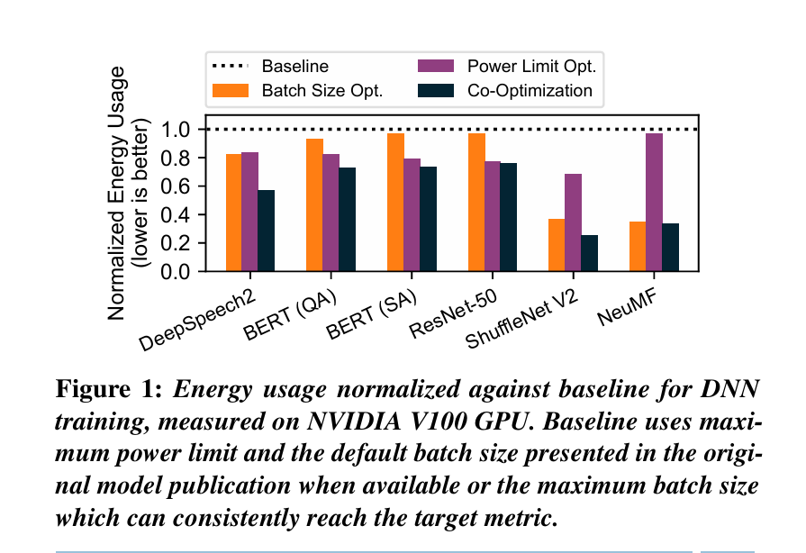 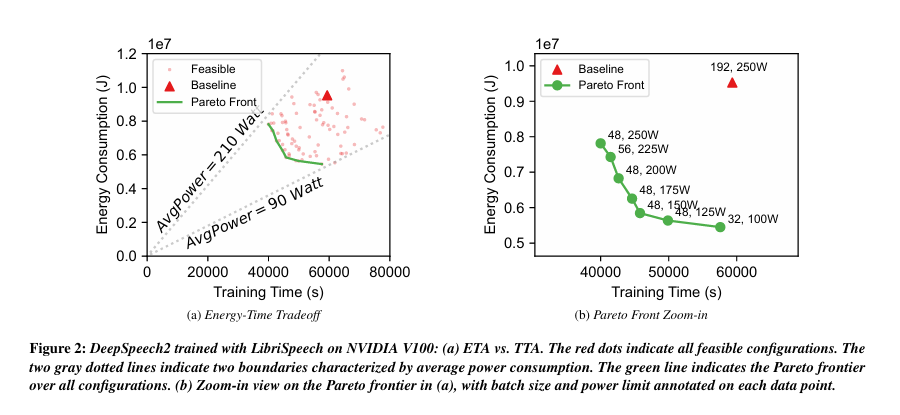

Author's findings indicate that the energy-optimal batch size (Batch Size Opt.) can reduce energy consumption by 3.4%–65.0% compared to the default batch size for the same target accuracy.

## Impact of GPU Power Limit on Energy Efficiency
Setting a GPU's power limit triggers dynamic voltage and frequency scaling (DVFS) to ensure that the power draw does not exceed the set limit [[paper](https://www.sciencedirect.com/science/article/pii/S2352864816300736)]. If not manually configured, the power limit defaults to the maximum setting. We conducted a sweep over various GPU power limits for the previously described setup. Our findings reveal that the optimal energy consumption (Power Limit Opt. in Figure 1) often occurs at a lower power limit than the maximum, resulting in energy savings of 3.0%–31.5%.

## Joint Optimization
Figure 1 illustrates that even greater energy savings (23.8%–74.7%) can be achieved by jointly optimizing both batch size and power limit configurations. Similar opportunities for energy reduction were observed across other GPU generations as well.

### Energy-Performance Tradeoffs :
Optimizing DNN training for energy efficiency typically comes with a tradeoff: a potential increase in training time (TTA). The authors characterize and explore this tradeoff between energy consumption (ETA) and TTA using DeepSpeech2 trained on the LibriSpeech dataset as an example (Figure 2). Similar results were observed for other workloads.

#### + Tradeoff Between ETA and TTA :
The author defines the energy consumption of DNN training until it reaches its target accuracy as the energy-to-accuracy (ETA):

$$ ETA (b,p) = TTA (b,p) . AvgPower (b,p) $$

where 𝑝 denotes the GPU power limit, 𝑏 the batch size, and AvgPower ( 𝑏 , 𝑝 ) the average power consumption during training with configuration (b,p). Like TTA, ETA captures the end-to-end goal of DNN training.

Figure 2a shows a scatter plot of (TTA, ETA) for batch size and power limit sweep experiments. Each data point represents the (TTA, ETA) for a specific configuration. We focus on the boundary of all feasible (TTA, ETA) pairs, which are bounded by two straight lines indicating average GPU power consumption. When the GPU is under heavy load, the (TTA, ETA) data points tend towards 210W. Under lighter load, power consumption approaches 90W, close to the GPU’s idle power of 70W.

Importantly, there exists a curve along which all (TTA, ETA) pairs achieve Pareto optimality, we identify a Pareto frontier along which all (TTA, ETA) pairs achieve Pareto optimality [[paper](https://link.springer.com/article/10.1007/BF01442131)]. On this curve, improving ETA without sacrificing TTA is not possible, and vice versa.

Examining the Pareto frontier in Figure 2b, with configurations annotated along each data point, we highlight two key takeaways:

+ Baseline configurations can lead to suboptimal energy efficiency. Furthermore, blindly selecting high batch size and power limit configurations can result in suboptimal TTA.
+ There is a distinct tradeoff between ETA and TTA, with different optimal configurations for each. The configuration optimizing ETA (b=32, p=100W) differs from that optimizing TTA (b=48, p=250W).

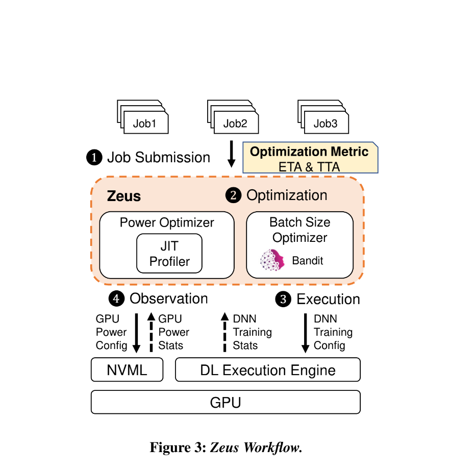 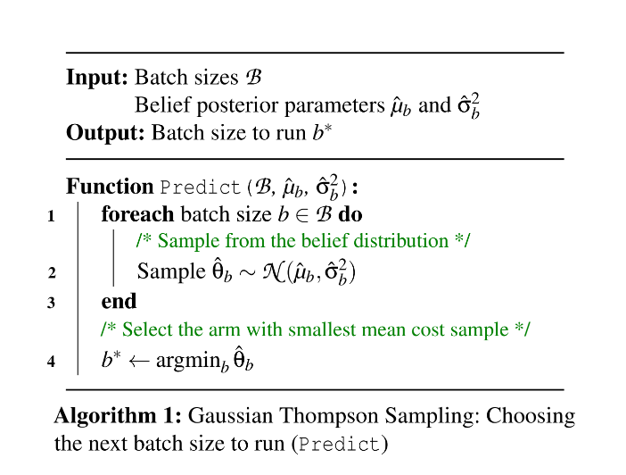

## Zeus Overview
Zeus is an optimization framework designed to navigate the tradeoff between energy-to-accuracy (ETA) and time-to-accuracy (TTA) by automatically configuring the batch size and GPU power limit for recurring DNN training jobs. It enables developers to optimize energy and/or performance metrics using a single parameter.

### Optimization Metric :
A critical aspect of designing Zeus is defining a cost metric that allows users to express their preference in the ETA-TTA tradeoff. We propose a simple cost metric:

$$ C(b,p;\eta)=\eta⋅ETA(b,p)+(1−\eta)⋅MAXPOWER⋅TTA(b,p)  $$

Here, η is a user-specified parameter indicating the relative importance of energy efficiency versus training performance (throughput). When η=0, the focus is solely on optimizing for time consumption, while η=1 prioritizes energy consumption. MAXPOWER is the maximum power limit supported by the GPU, introduced to unify the units of measure in the cost metric.

## Challenges in Picking the Optimal Configuration
Combining Equations 1 and 2, we have:

$$ C=(\eta⋅AvgPower(b,p)+(1−\eta)⋅MAXPOWER)⋅TTA(b,p) $$

Selecting the optimal configuration(s) to minimize the energy-time cost C for DNN training is challenging due to the large search space [b×p] and the difficulty in efficiently determining the values of both AvgPower(b,p) and TTA(b,p). This complexity arises from the following factors:

+ `Complex Power Consumption Model`: The total energy consumption of a GPU is non-linearly influenced by workload characteristics such as the number of instructions and memory accesses, as well as GPU hardware configurations including core and memory frequency and voltage [[paper](https://dl.acm.org/doi/10.1145/3387902.3392613), [paper](https://dl.acm.org/doi/fullHtml/10.1145/3466752.3480063)]. Existing efforts to estimate GPU energy consumption rely on instruction- or kernel-level information [[paper](https://faculty.cc.gatech.edu/~hyesoon/hong_isca10.pdf), [paper](https://ieeexplore.ieee.org/document/6118939)], which are specific to the architecture and workload.

+ `Stochastic Nature of DNN Training`: Modeling and predicting the duration required to train a specific model to target accuracy (TTA) is inherently difficult [[paper](https://www.usenix.org/conference/nsdi19/presentation/gu)]. Additionally, randomness in model initialization and data loading leads to TTA variations, even when the same job is executed on the same GPU with the same configuration—such variations can be as large as 14% [[paper](https://arxiv.org/abs/1806.01427)].

Fortunately, DNN training jobs often recur in production clusters [[paper](https://ieeexplore.ieee.org/document/8327042), [paper](https://www.usenix.org/conference/nsdi22/presentation/weng)]. This recurrence provides opportunities for empirical estimation through repeated measurements across instances of the same training job.

## Architectural Overview
Zeus employs an online exploration-exploitation approach to minimize the aggregate cost of recurrent DNN training jobs. It addresses the challenges of optimizing energy and performance tradeoffs through two key components:

+ `Just-in-Time (JIT) Online Profiler`: This component efficiently profiles the energy characteristics of the training job in real-time.
+ `Multi-Armed Bandit (MAB) with Thompson Sampling`: This component handles the stochastic nature of deep learning training and optimizes under uncertainty, adapting to changing workloads such as data drift.

The combination of the JIT profiler and MAB makes Zeus a fully online solution, allowing immediate optimization for incoming jobs.

### Workflow of Zeus :
Figure 3 provides an overview of the high-level workflow of Zeus:

+ `Job Submission`: In a production environment, users submit recurrent DNN training jobs to Zeus. Each job is a tuple consisting of data, model, optimizer, and the target validation metric, along with a set of feasible batch sizes B and power limits P to explore.
+ `Configuration Prediction`: Zeus predicts the optimal batch size and power limit configuration based on past execution history.
+ `Job Launch`: The training job is launched with the predicted configuration.
+ `Data Collection and Feedback`: During and after the training process, statistics about DNN training (e.g., validation metric) and GPU power consumption are collected and fed back to the Zeus optimizer. The optimizer learns from the feedback and adjusts its internal states.

The training job will be terminated upon either reaching the target metric or exceeding a stopping threshold determined by Zeus. This automated feedback loop minimizes the key objective of energy-time cost.

Building Zeus requires both algorithm design and systems support. The next sections describe the core optimization algorithm details and the implementation highlights of Zeus.

## Zeus Algorithm Design
This section details how Zeus selects the optimal batch size and GPU power limit to minimize the overall cost of recurrent DNN training tasks. We start with the problem formulation and describe the decoupling of batch size and power limit optimizations. We then explain the optimization of the power limit and batch size within this decoupled framework, concluding with a discussion on addressing common challenging scenarios.

#### Problem Formulation :
Zeus aims to minimize the cost of a recurring job by exploring the feasible set of batch sizes B and power limits P. The goal is to balance the tradeoff between exploration and exploitation to find the optimal configuration without incurring excessive costs. The objective, based on the cost function from Equation 2, is to:

$$ min_{b,p} \sum_{t=1}^{T} C(b_t, p_t; \eta) $$
$$ subject to b_t \epsilon B, p_t \epsilon P, \forall t \epsilon[1,T] $$

Here, b_t and p_t are the batch size and power limit chosen at the t-th recurrence of the job, and b and p are vectors of length T.

The problem is complex due to the vast search space and the requirement to run DNN training to obtain each value of C(b,p;η). However, by expanding the cost function (Equation 3), we can decouple the exploration of batch size and power limit, making the problem more tractable:

$$ C(b,p;\eta)=(\eta⋅AvgPower(b,p)+(1−\eta)⋅MAXPOWER)⋅TTA(b,p) $$
$$ = Epochs(b) \frac{\eta⋅AvgPower(b,p)+(1−\eta)⋅MAXPOWER}{Throughput(b,p)} $$

where Epochs(b) denotes the number of epochs needed to reach the target, and Throughput(b,p) is the number of epochs per second.

Two key insights allow the decoupling of batch size b and power limit p:

Profiling Efficiency: Given b, AvgPower(b,p) and Throughput(b,p) can be quickly profiled during training for all possible choices of p. This is due to the iterative nature of DNN training, yielding stable power and throughput estimations with a small number of iterations.

Independence of Epochs: Epochs(b) is unaffected by the choice of p since changing the power limit does not change what is computed.

Thus, the optimal power limit for any batch size can be determined independently through online profiling. Each choice of batch size is automatically paired with the optimal power limit, reducing the search space to the set of batch sizes B.

Formally, the problem is decoupled into a two-level optimization problem:

$$ min_{b \epsilon B^T} \sum_{t=1}^{T} Epochs(b_t)⋅EpochCost(b_t; \eta) $$

where,

$$ EpochCost(b_t;\eta) = min_{p_t \epsilon P} \frac{\eta⋅AvgPower(b_t,p_t)+(1−\eta)⋅MAXPOWER}{Throughput(b_t,p_t)} $$


When a job arrives, Zeus first decides the batch size to use. Then, based on the selected batch size, Zeus determines the optimal power limit.

### Optimizing Power Limit
To optimize the power limit for a given batch size b:

$$ EpochCost(b;\eta) = min_{p \epsilon P} \frac{\eta⋅AvgPower(b,p)+(1−\eta)⋅MAXPOWER}{Throughput(b,p)} $$

Zeus profiles the power consumption and throughput for all possible power limits during the initial iterations of the training process, enabling the selection of the optimal power limit that minimizes the cost for the given batch size.

To determine the optimal power limit for a given batch size, Zeus utilizes a just-in-time (JIT) profiling method, leveraging the iterative nature of DNN training and the recurrent nature of production DNN training jobs. Here's how it works:

+ `Profiling Phase`:

    + When a job with a specific batch size b is submitted, the JIT profiler checks if this batch size has been profiled before.
    + For an unseen batch size, the profiler collects data on AvgPower(b,p) and Throughput(b,p) across all possible power limits p during the first epoch of the job. This is achieved by partitioning the epoch into slices at iteration boundaries and dynamically adjusting the GPU power limit for each slice.
    + The gathered profile information is then fed back to Zeus.

+ `Optimization Phase`:

    + Using the profile information, Zeus determines the optimal power limit for the batch size.
    + The remaining epochs of the job are executed with this optimal power limit.

This JIT profiling approach is more efficient than offline profiling, as the profiling process itself contributes to training without affecting accuracy. Section 6.5 demonstrates that JIT profiling incurs negligible overhead.

### Optimizing Batch Size

Zeus determines the batch size b_t for each job recurrence t. EpochCost(b_t ;η) is a deterministic function that identifies the optimal power limit for any batch size b_t and returns the optimal cost of one epoch. Thus, Zeus needs to focus only on choosing the optimal batch size.

+ Challenges and Approach :
The stochastic nature of DNN training makes it difficult to pick the optimal batch size without adequate exploration. Therefore, a good solution must:

    + `Incorporate Stochasticity`: Factor in the unpredictable nature of DNN training.
    + `Balance Exploration and Exploitation`: Smartly trade off the cost of exploring potentially better batch sizes against the benefit of exploiting known good batch sizes.

Grid search is not ideal due to the high exploration cost and the inability to quickly rule out suboptimal batch sizes. Instead, Zeus formulates the problem as a Multi-Armed Bandit (MAB) with Thompson Sampling, which is well-suited for this scenario.

To optimize the batch size:

$$ min_{b \epsilon B^T} \sum_{t=1}^{T} Epochs(b_t)⋅EpochCost(b_t; \eta) $$

Zeus utilizes a Multi-Armed Bandit (MAB) approach with Thompson Sampling to explore and exploit batch sizes, adapting to the stochastic nature of DNN training and varying workloads. The MAB framework helps balance the tradeoff between exploring new configurations and exploiting known good configurations.

### Addressing Common Challenges :
Zeus addresses several common challenges in optimizing DNN training configurations:

+ `Handling Stochasticity`: By using Thompson Sampling in the MAB framework, Zeus adapts to the inherent randomness in DNN training, such as variations in TTA due to model initialization and data loading.
+ `Dynamic Workloads`: Zeus continuously profiles and adapts to changing workloads, such as data drift, ensuring optimal configurations over time.
+ `Scalability`: The decoupled optimization approach reduces the complexity of the search space, allowing Zeus to scale efficiently with larger clusters and more diverse hardware configurations.

Through these mechanisms, Zeus effectively minimizes the energy-time cost for recurrent DNN training tasks in dynamic production environments.

### Multi-Armed Bandit Formulation :
Zeus aims to explore different batch sizes and converge to the optimal one, while minimizing exploration cost. The problem is formulated as an MAB with T trials (job recurrences) and B arms (batch sizes). Each batch size is modeled as a random variable with an unknown cost distribution. The objective is to minimize the cumulative cost regret:

$$ \sum_{t=1}^{T} Regret(b_t; \eta)  $$

where the regret of choosing b_t is:

$$ Regret(b_t; \eta) = Epochs(b_t). EpochCost(b_t; \eta) - min_{b,p} Cost(b,p; \eta) $$

Minimizing cumulative cost regret aligns with the objective.

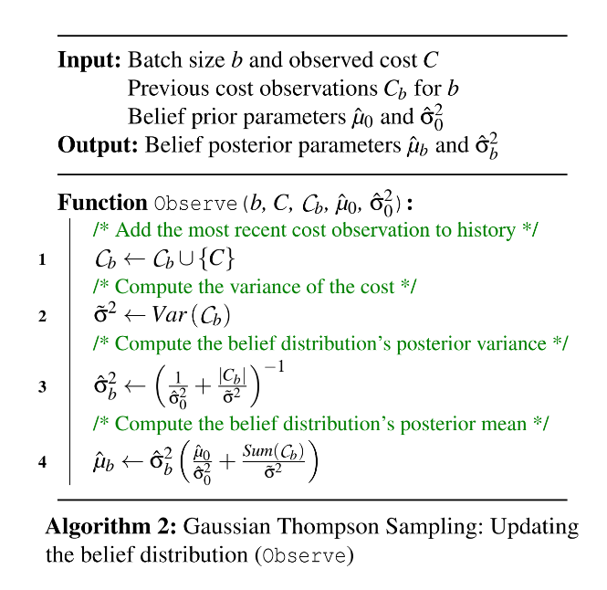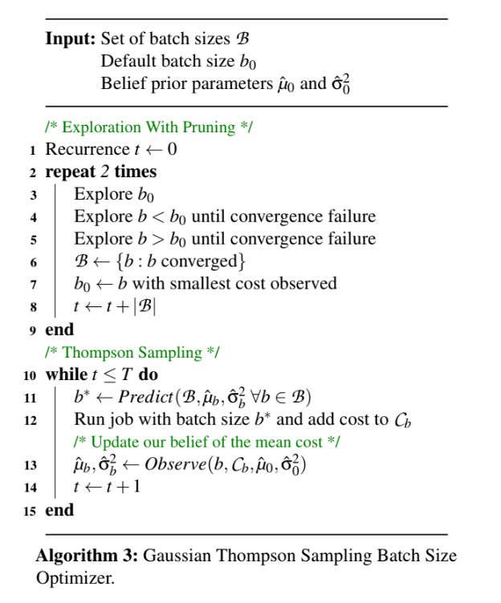

### Thompson Sampling : 
Zeus adopts Thompson Sampling for the MAB formulation due to its practical performance and suitable modeling assumptions. Thompson Sampling refines its belief about the mean cost of each batch size based on experience. At each recurrence, it:

+ `Sample Selection (Algorithm 1)`: Uses the current belief to pick the batch size with the lowest estimated mean cost.
+ `Belief Update (Algorithm 2)`: Updates the belief based on the observed cost.

The cost distribution for each batch size is modeled as a Gaussian distribution with an unknown mean θ_b, which is modeled with a Gaussian prior 𝜃_𝑏 ∼ 𝑁(𝜇^𝑏, 𝜎^𝑏^2). The confidence in this belief increases with more observations.

Thompson Sampling balances exploration and exploitation by choosing the batch size with the smallest mean cost sample 𝜃^𝑏 ∼ 𝑁(𝜇^𝑏,𝜎^_{𝑏}^{2}). The variance 𝜎^_{𝑏}^2 decreases with more observations, allowing for exploitation of batch sizes known to be good, while still exploring potentially better ones.

If no prior knowledge is available, arms are initialized with a Gaussian distribution with zero mean and infinite variance. This formulation inherently incorporates the stochastic nature of DNN training and efficiently rules out suboptimal batch sizes.

In summary, Zeus's use of MAB with Thompson Sampling allows it to dynamically adapt and optimize batch size selections in a stochastic environment, efficiently balancing exploration and exploitation to minimize overall cost.

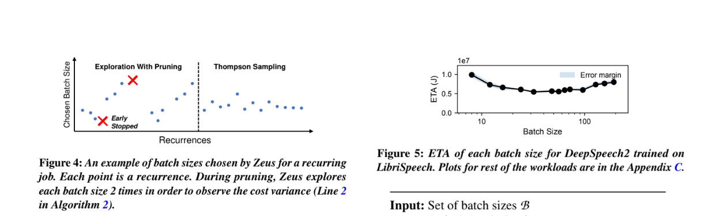

### Extensions for Challenging Scenarios

#### + Handling Unknown Cost Variance :

In many applications of Gaussian Thompson Sampling, the variance of the cost of each arm is assumed to be known. However, in DNN training, the cost variance—how much the cost fluctuates even with the same batch size—is not known beforehand. This variance is influenced by the robustness of the DNN to randomness in parameter initialization and data loading, making it difficult to quantify initially. Therefore, Zeus learns the cost variance dynamically as it observes cost samples during the training process (refer to Line 2 in Algorithm 2).

#### + Handling Stragglers During Exploration :

Sometimes, an exploratory job may not reach the target metric within a reasonable cost, particularly in the early stages of exploration. To manage this, Zeus employs early stopping and pruning strategies:

+ `Early Stopping` : If the cost of a current job exceeds a threshold (set as 𝛽 ⋅ min_𝑡 . 𝐶_𝑡), where β is a parameter to account for the stochastic nature of DL training (default β=2), the job is stopped and another batch size is tried. This threshold helps tolerate variations in TTA between runs of the same configuration, typically less than 14%.

+ `Pruning` : Zeus begins with a default batch size provided by the user and tests smaller batch sizes until reaching the minimum batch size or encountering a batch size that fails to meet the target metric within the early stopping threshold. The same process is repeated for larger batch sizes. Batch sizes that meet the target metric are retained for further exploration. The default batch size is then updated to the one with the smallest observed cost, and the pruning process is repeated starting from this new default batch size.

The convexity of the batch size-energy-time (BS-ETA) curve around the optimal batch size supports this approach, allowing Zeus to quickly eliminate obviously suboptimal batch sizes (either too large or too small). This reduces exploration costs significantly.

#### + Handling Concurrent Job Submissions :

In DNN training clusters, jobs often overlap, meaning that the MAB may need to decide on a batch size for a later job before the earlier job's cost is observed. Deterministic policies can lead to redundant exploration of the same batch size consecutively, reducing exploration efficiency. However, Thompson Sampling mitigates this issue naturally because it randomly selects batch sizes based on sampled estimated mean costs. During the early stages, when the belief distributions have large variances (low confidence), different batch sizes are explored even without updated information between invocations. During the initial pruning phase, concurrent jobs run with the best-known batch size at the time, which is continually updated as more information is gathered.

#### + Handling Data Drift :

Data drift, where the data on which a model is trained shifts over time, necessitates re-training. This shift means the cost distribution for each batch size is non-stationary. To handle this, Zeus implements a sliding window of the N most recent cost observations, ignoring older data. This approach, unlike exponential decay, allows direct estimation of the cost variance from recent observations. When old history entries are evicted, the new parameters of the arm can be computed efficiently due to the conjugate prior property, enabling Zeus to adapt to data drifts in an online manner effectively.

In summary, these extensions ensure that Zeus can handle real-world complexities such as unknown cost variance, early job termination, concurrent job handling, and data drift, making it a robust solution for optimizing the energy-time cost of recurrent DNN training tasks.

## Zeus Implementation :
Zeus is implemented as a Python library designed to integrate seamlessly with DNN training scripts. Its primary component, the `ZeusDataLoader` class, integrates with the PyTorch framework to profile power consumption and throughput in real-time. This profiling is achieved by slicing epochs at iteration boundaries and leveraging the NVIDIA Management Library (NVML) for power limit configuration and monitoring.

### Key Components and Features
### + Power and Throughput Profiling:

+ The `ZeusDataLoader` class profiles the power consumption and throughput for different power limits by partitioning the epochs into slices and dynamically adjusting the GPU power limits.
+ Empirical observations indicate that five seconds of profiling per power limit are sufficient to achieve stable results. This profiling data is used to determine and apply the optimal power limit for the rest of the training process.
### + Cost Monitoring and Early Stopping:

+ `ZeusDataLoader` continuously monitors the cost incurred during training and implements early stopping mechanisms to terminate jobs that exceed predefined cost thresholds, optimizing resource usage and reducing unnecessary expenditures.

### + Observer Mode:

+ Zeus includes an Observer Mode that profiles power consumption and throughput without altering the power limit settings.
+ In this mode, the `ZeusDataLoader` reports hypothetical time and energy consumption metrics as if the optimal power limit had been applied. This feature helps users understand the potential benefits of adopting Zeus without impacting the current training process.


Zeus Integration Example : 

```python
from zeus import ZeusDataLoader

 train_loader = ZeusDataLoader(
 train_set, batch_size, max_epochs, target_metric)
 eval_loader = ZeusDataLoader(eval_set, batch_size)

 for epoch in train_loader.epochs(): # may early stop
 for batch in train_loader:
 # Learn from batch
 for batch in eval_loader:
 # Evaluate on batch
 train_loader.report_metric(validation_metric)
```

### Encouraging Adoption
The Observer Mode feature is particularly useful for promoting Zeus's adoption. By providing users with detailed reports on potential time and energy savings without modifying the actual power consumption during profiling, users can make informed decisions about integrating Zeus into their workflows. This transparency and the potential for significant resource savings are compelling reasons for DNN practitioners to consider adopting Zeus.

Overall, Zeus's implementation focuses on minimal disruption to existing workflows, robust profiling capabilities, and user-friendly features, making it a practical and powerful tool for optimizing the cost of DNN training tasks.

## Evaluation
We evaluate Zeus’s effectiveness in optimizing the energy-time tradeoff for recurrent DNN training tasks. Our key findings demonstrate significant reductions in energy consumption, quick convergence to optimal configurations, adaptability to data drift, low overhead, scalability to multi-GPU settings, and consistent savings across different GPU generations.

#### Key Findings:
+ `Energy and Time Savings`:
    + Zeus reduces energy consumption by 15.3% to 75.8%.
    + It achieves training time reductions of up to 60.1% for non-throughput-optimal jobs.

+ `Convergence Speed`:
    + Zeus quickly converges to optimal configurations, demonstrating efficiency in exploration and exploitation.
+ `Handling Data Drift`:
    + Zeus can manage workloads with data drift effectively, maintaining performance and cost-efficiency.
+ `Low Overhead`:
    + The implementation of Zeus incurs minimal overhead.
+ `Scalability`:
    + Zeus scales efficiently to multi-GPU setups.
+ `Cross-Generational GPU Performance`:
    + Zeus provides consistent savings across four generations of NVIDIA GPUs.

## Experimental Setup :

Testbed Setup:

Evaluated on four generations of NVIDIA GPUs as detailed in Table 2.

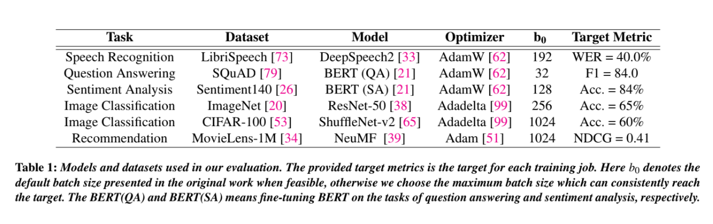
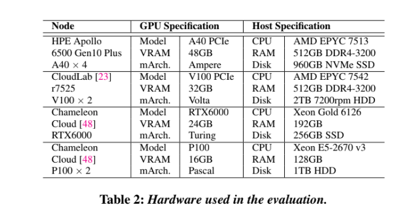

+ `Workloads`:

    + Table 1 summarizes the workloads used.
    + The default batch size (b0) is sourced from the model's original publication or set to the maximum batch size achieving target accuracy.
    + For models using the Adadelta optimizer, no initial learning rate is needed.
    + For other optimizers, we selected batch sizes and learning rates that achieve reasonable accuracy, following guidelines from original model publications and popular DL frameworks.
    + Batch sizes were scaled using Square Root Scaling for adaptive optimizers like Adam.

+ `Baselines`:

    + `Default`: Uses the default batch size and maximum power limit (b = b0, p = MAXPOWER), with no exploration.
    + `Grid Search with Pruning`: Tries one configuration of (b, p) per job recurrence, selecting the best one and pruning out batch sizes that fail to reach the target metric.

+ `Metrics`:

    + Primary metrics are ETA (Energy to Target Accuracy) and TTA (Time to Target Accuracy), aiming to reduce both but acknowledging their tradeoff.

+ `Defaults`:

    + Experiments are primarily conducted on NVIDIA V100 GPUs.
    + Default balance parameter η = 0.5 to balance ETA and TTA.
    + The early-stopping threshold β is set to 2, with sweeps from 1.5 to 5.

+ `Methodology`:

    + Resource and environmental constraints limit the ability to train all workloads with various configurations end-to-end multiple times.
    + We employ a trace-driven approach, collecting two types of trace data:
        + `Training Trace`: Records the number of epochs to reach target accuracy for all model and batch size combinations, repeated with four random seeds to capture stochasticity.
        + `Power Trace`: Uses JIT profiling to collect throughput and average power consumption for all combinations of model, batch size, and power limit.
    + Traces are replayed to evaluate Zeus and baseline decisions, reconstructing TTA and ETA values to measure regret.
    + This approach avoids offline profiling, ensuring Zeus learns in an online manner.
    + For data drift evaluation (§6.4), Zeus is run end-to-end due to the complexity of constructing traces for drifting datasets.

### `Detailed Evaluation : `
The detailed evaluation section will expand on the metrics, methodology, and results to provide comprehensive insights into Zeus's performance. This includes:

+ `Energy and Time Reduction Analysis`: Detailed breakdown of energy and time savings across different workloads and GPU generations.

+ `Convergence Speed`: Analysis of how quickly Zeus converges to optimal configurations compared to baselines.
+ `Data Drift Handling`: Evaluation of Zeus's adaptability to changing data distributions.
+ `Overhead Assessment`: Measurement of the overhead introduced by Zeus's profiling and decision-making processes.
+ `Scalability`: Assessment of Zeus's performance in multi-GPU environments.
+ `Cross-Generational Performance`: Consistency of Zeus's savings across various GPU generations.

These sections will include empirical data, charts, and case studies to substantiate the findings and demonstrate the robustness and efficiency of Zeus in optimizing DNN training costs.

### Zeus Performance :
This section evaluates Zeus's performance in terms of energy consumption (ETA), training time (TTA), and convergence characteristics of its Multi-Armed Bandit algorithm. Multiple recurrences of DNN training jobs are run, selecting the recurrence number as 2⋅∣B∣⋅∣P∣ to ensure Grid Search completes exploration and exploits its choices.

#### Improvements in ETA :
+ `Energy Savings`: Zeus reduces energy consumption (ETA) by 15.3% to 75.8% compared to the Default baseline.
+ `Comparison with Grid Search`: Zeus's energy savings are comparable to exhaustive configuration searches and Grid Search.
+ `Figure 6a`: Demonstrates the energy consumption (ETA) of the last five recurrences of Zeus and Grid Search relative to the Default baseline.

#### Tradeoff with TTA :

+ `Training Time Reductions`: Zeus reduces training time (TTA) by up to 60.1%, although it can increase TTA by up to 12.8% for some workloads.
+ `Performance Variability`: For workloads optimized for minimal training time (b0 tuned), there's little room for TTA improvement.
+ `Figure 6b`: Shows the TTA of the last five recurrences of Zeus and Grid Search relative to the
Default baseline.

#### Cumulative Regret :
+ `Regret Measurement`: Regret quantifies the difference between the chosen configuration and the optimal one.
+ `Figure 7`: Depicts the cumulative regret for DeepSpeech2 and ResNet-50, showing that Zeus achieves lower cumulative regret compared to Grid Search, indicating faster convergence to optimal solutions.

#### Convergence to Pareto-optimal Configuration :
+ `Efficiency in Exploration`: Zeus efficiently explores the configuration space, quickly converging to optimal configurations.
+ `Figure 8`: Illustrates the search path of Zeus and Grid Search during training DeepSpeech2. Zeus converges faster and more reliably to optimal configurations, while Grid Search may not converge due to the stochastic nature of DNN training.

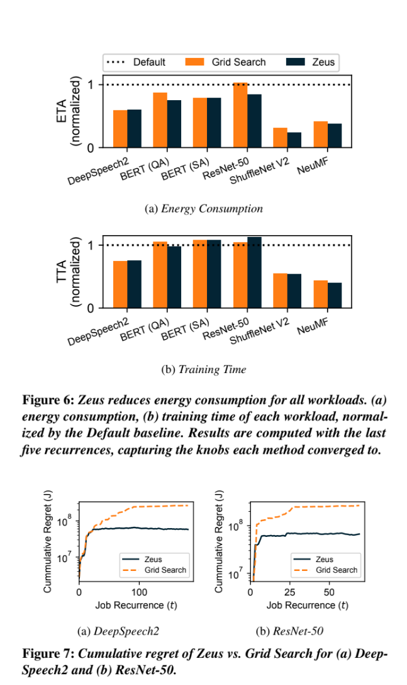
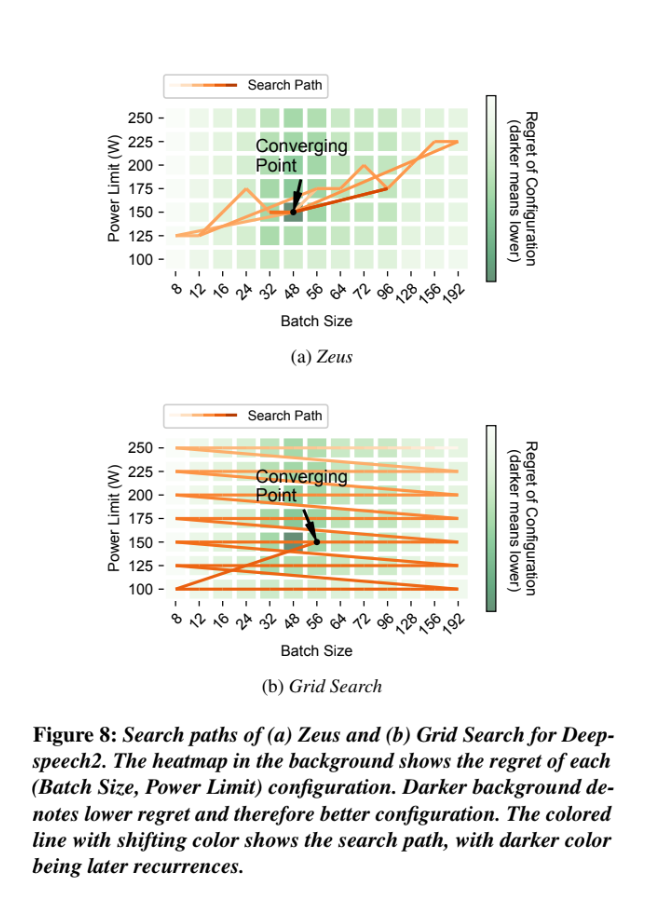

### Trace-Driven Simulation Using the Alibaba Trace

#### Evaluation Context:

+ `Dataset`: Alibaba GPU cluster trace, containing over 1.2 million jobs over two months.
+ `Recurrent Jobs`: Trace identifies recurring jobs and their overlap, useful for evaluating Zeus's handling of concurrent job submissions.

#### Methodology:

+ `Clustering Jobs`: K-Means clustering on job runtimes forms six clusters, matched to six workloads.
+ `Simulation`: Scales job runtime based on the ratio of job’s original runtime to cluster's mean runtime.

#### Results:

+ `Energy Consumption`: Figure 9a shows Zeus reduces training energy usage by 7%–52%.
+ `Training Time`: Figure 9b shows training time increases by at most 16% and decreases by up to 33%.
+ `Cumulative Regret`: Zeus has significantly lower cumulative regret compared to Grid Search.

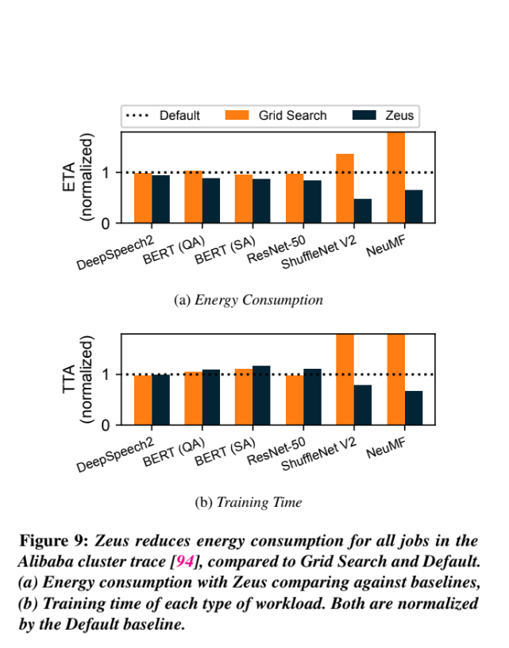
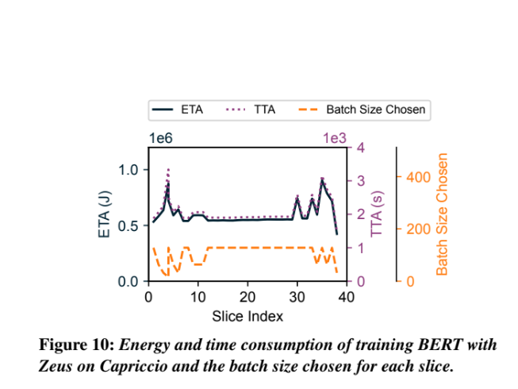