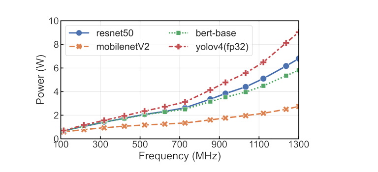

# Energy Time Fairness: Balancing Fair Allocation of Energy and Time for GPU Workloads

🌸 [ paper : DOI[10.1145/3583740.3628435](https://www.computer.org/csdl/proceedings-article/sec/2023/012300a053/1UlmMhdN732) ]

Abstract : Traditionally, multi-tenant cloud and edge platforms use fair-share schedulers to fairly multiplex resources across applications. These schedulers ensure applications receive processing time proportional to a configurable share of the total time. Unfortunately, enforcing time-fairness across applications often violates energy-fairness, such that some applications consume more than their fair share of energy. This occurs because applications either do not fully utilize their resources or operate at a reduced frequency/voltage during their time-slice. The problem is particularly acute for machine learning (ML) applications using GPUs, where model size largely dictates utilization and energy usage. Enforcing energy-fairness is also important since energy is a costly and limited resource. For example, in cloud platforms, energy dominates operating costs and is limited by the power delivery infrastructure, while in edge platforms, energy is often scarce and limited by energy harvesting and battery constraints. To address the problem, we define the notion of Energy-Time Fairness (ETF), which enables a configurable tradeoff between energy and time fairness, and then design a scheduler that enforces it. We show that ETF satisfies many well-accepted fairness properties. ETF and the new tradeoff it offers are important, as some applications, especially ML models, are time/latency-sensitive and others are energy-sensitive. Thus, while enforcing pure energy-fairness starves time/latency-sensitive applications (of time) and enforcing pure time-fairness starves energy-sensitive applications (of energy), ETF is able to mind the gap between the two. We implement an ETF scheduler, and show that it improves fairness by up to 2x, incentivizes energy efficiency, and exposes a configurable knob to operate between energy- and time-fairness.

### `KEYWORDS` : FairShare, Energy-aware, Energy-efficiency, Scheduling, Resource Management

Over the past decade, cloud and edge platforms have significantly reduced the cost of large-scale computing and storage, enabling a variety of applications such as web services, batch processing, machine learning, and mobile augmented reality. This cost reduction is achieved through the efficient sharing of resources among diverse users and applications, increasing utilization and efficiency. This is particularly crucial for high-cost resources like GPUs, which are in high demand due to growing AI workloads. For instance, edge platforms in small autonomous vehicles, such as delivery robots, use shared onboard systems for tasks like obstacle detection and traffic monitoring. However, resource sharing introduces challenges, requiring operators to balance resources across different applications, especially when constrained by limited computational capacity and energy.

Multi-tenant cloud and edge platforms traditionally use fair-share schedulers to allocate server resources equitably among multiple applications. These schedulers ensure each application receives a proportional share of processing time, preventing any application from monopolizing resources or being starved. Over the past three decades, numerous scheduling policies have been developed, such as [Weighted Fair Queuing](https://dl.acm.org/doi/10.1145/75247.75248), [max-min fairness](https://www.jstor.org/stable/3010473), [Start-Time Fair Queueing](https://ieeexplore.ieee.org/document/649569/), [lottery scheduling](https://www.usenix.org/legacy/publications/library/proceedings/osdi/full_papers/waldspurger.pdf), and [Dominant Resource Fairness](https://www.usenix.org/conference/nsdi11/dominant-resource-fairness-fair-allocation-multiple-resource-types). Fair-share scheduling is widely implemented in modern operating systems, hypervisors, batch schedulers, container orchestration platforms, and data-processing platforms like Linux, Xen, VSphere, Slurm, Kubernetes, Spark, and Hadoop.

Enforcing energy-fairness can reduce energy consumption and carbon footprint, while encouraging users to improve the energy efficiency of their applications, crucial in both cloud and edge environments. However, there is an inherent conflict between time-fairness and energy-fairness, making it difficult to enforce both simultaneously. For instance, systems with dynamic voltage and frequency scaling (DVFS) minimize energy usage by lowering frequency and voltage when demand is low. Modern GPUs allow each application to set custom frequency/voltage settings for its time-slice, but this can lead to fewer computations during that time, penalizing energy-efficient applications. Consequently, applications using lower frequency/voltages consume much less energy than their share of processing time, a disparity also seen in GPUs due to varying model sizes and complexities, as most GPUs time-share rather than space-share, loading and running only one model at a time.

Previous research has recognized the conflict between time-fairness and energy-fairness and developed schedulers to enforce energy-fairness across multi-tenant applications. Our key insight is that an application’s time and energy allocations are fundamentally interdependent, so enforcing fairness in one will inherently lead to unfairness in the other. Given that both time-fairness and energy-fairness offer crucial benefits, cloud and edge platforms should aim to balance these two types of fairness.

 To address the problem, we define a novel notion of Energy Time Fairness (ETF), which enables a configurable tradeoff between energy and time fairness, and then design a scheduler that enforces
 it. We show that ETF satisfies many well-accepted and desirable fairness properties, including an energy-efficiency and sharing in centive, strategy-proofness, and [pareto efficiency](https://www.usenix.org/conference/nsdi11/dominant-resource-fairness-fair-allocation-multiple-resource-types).

 More generally, while previous research has demonstrated how to enforce fairness in allocating multiple independent resources like cores and memory, ETF addresses enforcing fairness for multiple dependent resources such as processing time and energy. ETF acknowledges the impossibility of simultaneously achieving both time-fairness and energy-fairness across applications. Instead, it defines a smooth and configurable tradeoff between these two competing dimensions of fairness.

 Our hypothesis is that using ETF can bridge the gap between pure time and energy fairness, thereby supporting both a configurable incentive for energy-efficient operation and the execution of time/latency-sensitive applications. In evaluating this hypothesis, we make the following contributions.

+ `Fairness Conflict`: To motivate our work, we experimentally demonstrate the conflict between time-fairness and energy-fairness by showing that enforcing time-fairness starves some applications of energy and enforcing energy-fairness starves some applications of time. To our knowledge, this paper is the first to highlight this conflict.

+ `Energy-Time Fairness (ETF)`: We introduce the concept of Energy-Time Fairness (ETF), which allows for a configurable tradeoff between energy and time fairness. We demonstrate that ETF satisfies many desirable fairness properties, including Pareto efficiency and strategy-proofness, while balancing the competing dimensions of fairness for dependent resources.

+ `Implementation and Evaluation`: We implement ETF in a new scheduling framework called ETFS, designed for edge and cloud GPUs. Our evaluation shows that ETF improves fairness by up to 2×, incentivizes energy efficiency, and allows for a configurable tradeoff between energy-fair and time-fair scheduling for multi-tenant GPU model serving workloads.

## BACKGROUND

+ `Cloud and Edge Multitenancy` : Focus is on typical cloud and edge platforms serving multiple customers and applications. These platforms host various applications from different customers on servers using virtual machines or containers, enhancing resource utilization and providing isolation.

+ `Fair-share Scheduling Overview` : Fair-share schedulers allocate resources to applications based on predefined shares or weights, ensuring proportional resource allocation. Early schemes like [Weighted Fair Queuing](https://dl.acm.org/doi/10.1145/75247.75248) and [Generalized Processor Sharing](https://ieeexplore.ieee.org/document/234856) laid the foundation, while modern variants such as [Dominant Resource Fairness](https://www.usenix.org/conference/nsdi11/dominant-resource-fairness-fair-allocation-multiple-resource-types) and [Dominant Resource Fair Queuing](https://dl.acm.org/doi/10.1145/2342356.2342358) extend this concept to multi-resource environments.

+ `Energy Optimization` : Energy efficiency in cloud and edge systems is crucial for sustainability. Techniques include algorithmic improvements and system-level configurations like dynamic voltage and frequency scaling (DVFS), which adjust CPU or GPU energy usage by varying voltage or frequency. DVFS has become commonplace, allowing for application-specific frequency settings, impacting fair-sharing. Lowering the voltage or frequency slows down the execution speed of the application, while also reducing the energy consumption. In  particular, the power dissipated by the CPU or GPU is governed by the CMOS chip presented in this well-known equation:
 
                                             𝑃 = 𝛼𝐶𝑓.(𝑉^2) 

     where 𝛼 is a proportional constant indicating the percentage of the system that is active or switching, 𝐶 represents the system’s capacitance, 𝑓 is the frequency at which the system is switching, and 𝑉 denotes the voltage swing across 𝐶.

+ `Model Serving Workloads` : Our work focuses on energy-time fairness with a particular emphasis on model serving workloads, where multiple deep learning models are executed on shared resources like GPUs. This choice aligns with the increasing energy demands of AI applications and the pursuit of energy-efficient designs in edge and cloud systems. Researchers have proposed various algorithmic and post-training methods to enhance energy efficiency while sharing resources efficiently.

### MOTIVATIONFORENERGY-TIMEFAIRNESS :

 This section discusses some key assumptions made by traditional fair schedulers and why the assumptions do not hold for emerging hardware, such as modern GPUs and heterogeneous processors, resulting in unfairness problems

 +  `Fair-Share Scheduling Basics` :

Classical fair-share schedulers operate under three implicit assumptions, which are becoming outdated with emerging CPU and GPU architectures in edge and cloud servers. Firstly, they allocate CPU or GPU resources in time slices, assuming applications are time-shared. Secondly, these schedulers presume all applications execute at the same speed across time slices, ensuring equal progress. Thirdly, they assume an application's energy usage is directly proportional to its execution time. However, with the advent of heterogeneous core processors and multi-core GPUs, these assumptions are no longer valid. DVFS technology allows applications to run at different frequencies, leading to varying cycles and power consumption. Heterogeneous multi-core processors further complicate matters, as equal time execution no longer guarantees equal energy consumption. These trends pose challenges for fair-share schedulers in edge environments.

+ `Unfairness in Classical Fair-share Schedulers` :

+  `Unfairness due to Application Heterogeneity`: Consider a scenario where two applications, each with different deep learning models, share a GPU for inference tasks, a common case in edge computing. Despite using the same GPU frequency and time slices, differences in model size and architecture lead to varying energy consumption. GPUs comprise multiple processing units, each utilized differently by diverse models, resulting in unequal energy usage, favoring smaller models and potentially starving larger ones.

[  Figure: Power consumption of different ML models when run under different frequencies on an Nvidia TX2. ]

+ `Unfairness of Time-based Fair Schedulers`: Conventional time-based fair-share schedulers allocate time slices in proportion to weights. However, applications running at higher speeds consume more energy, favoring them despite receiving equal time allocations. This implicit bias toward higher-energy-consuming applications renders the allocation unfair in terms of energy.

+ `Unfairness of Energy-based Fair Schedulers`: Energy fair-share scheduling allocates resources based on energy consumption rather than time. While this ensures equal energy usage, it may result in unfair time allocation. Applications running at lower frequencies receive more time to equalize energy consumption, potentially starving those running at higher frequencies. Thus, unfairness persists in the time dimension despite equalizing energy usage.

### Desirable Fairness Properties :

Our examples illustrate the tight coupling between time, energy, and cycles, leading to unfairness in conventional fair schedulers within heterogeneous cloud and edge servers. Traditional fairness techniques struggle to maintain fairness across multiple dimensions simultaneously. To address this disparity, we propose Energy-Time Fairness (ETF), a new notion of fairness that reconciles traditional techniques' shortcomings while preserving key properties:

+ 1. `Pareto-efficiency`: Ensures high resource utilization by preventing applications from increasing their share without reducing others.

+ 2. `Strategy-proofness`: Prevents applications from benefitting by misrepresenting their resource demands.

+ 3. `Sharing incentives`: Encourages dynamic resource sharing over static allocations.

Moreover, ETF introduces additional desirable properties:

+ 1. `Efficiency incentives`: Reward energy-efficient applications with more resource time.

+ 2. `Time guarantees`: Ensures applications receive a minimum time slice regardless of their energy efficiency.

+ 3. `MAX-MIN energy fairness`: Maximizes the minimum energy allocation among applications, promoting fairness.

## ENERGY-TIME FAIRNESS

Energy-Time Fairness (ETF) introduces a novel fairness concept aimed at addressing starvation concerns while prioritizing energy fairness in multi-tenant scenarios with applications of varying energy consumption rates.

ETF ensures minimum time guarantees to prevent starvation, allocating a configurable portion of the scheduling quantum (T) in a time-fair manner. This allocation ensures that even resource-intensive applications, which might starve under pure energy fairness, receive a minimum guaranteed time slice.

However, ETF's primary objective is energy fairness. It achieves this by adjusting rates for the remaining segment of the time quantum, thus balancing energy fairness while preventing starvation.

### +  Defining Energy-Time Fairness :
 Assume there are 𝑁 applications denoted by 𝐴 and indexed by 𝑖, where application 𝐴_𝑖 uses power 𝑃_𝑖 and has weight 𝑤_𝑖.

 + `Energy Fairness (EF)` : The time allocation of the application 𝐴_𝑖
 under a perfect EF scenario, 𝑇^{𝐸𝐹}_𝑖 duration 𝑇 is computed as,

 $$ T_{i}^{EF} = (1-\frac{w_i . P_i}{\sum_{k=0}^{N}. w_k . P_k}). T. $$ 

    
The energy consumption 𝐸_𝑖^{𝐸𝐹} of a given application 𝐴_𝑖 is then computed as,

 $$ 𝐸_𝑖^{𝐸𝐹} = P_i . T_{i}^{EF} $$

 Finally, the energy consumption normalized by weight of all applications under EF, should be the same, as shown below.

 $$ 𝐸_𝑖^{𝐸𝐹} / w_i = 𝐸_j^{𝐸𝐹} / w_j,  ∀ 𝑖, 𝑗 ∈ [[1,𝑁]]. $$

  + `Time Fairness (TF)` : The energy consumption, 𝐸_𝑖, under a purely
 time fair share (TF) scenario can be computed as,

  $$ E_{i}^{TF} = (P_i . \frac{w_i}{\sum_{k=0}^{N}. w_k}). T. $$ 

   The time allocation for an application under time fair share (TF)
 scenario is,

   $$ T_{i}^{TF} = (\frac{w_i}{\sum_{k=0}^{N}. w_k}). T. $$ 

   The energy consumption across applications differs under TF and deviates from the perfect energy fair-share allocation. The difference between the two can be computed as,

   $$  Δ 𝐸_{i}^{𝑢𝑛𝑓𝑎𝑖𝑟} = 𝐸_{i}^{𝑇𝐹} − 𝐸_{i}^{E𝐹} $$

   `Energy-Time Fairness (ETF)` aims to prevent starvation of resource-hungry applications while pursuing energy fairness by maximizing the minimum energy consumption across applications. To achieve this, we introduce the notion of a time-fair factor, denoted by 𝜙, which configures the minimum time guarantees to each application as a fraction of time allocated under the Time-Fair (TF) scenario. It is computed as:

   $$ min . T_{i}^{𝐸𝑇𝐹}  = \phi × 𝑇_{i}^{𝑇𝐹} $$

   During this time period, the energy consumption of an application A_i is expressed as:

   $$ min . E_{i}^{𝐸𝑇𝐹}  = min . 𝑇_{i}^{E𝑇𝐹} . P_i $$

   The total time allocated to provide minimum time guarantees is 𝜙×𝑇. Our approach utilizes the rest of the time, (1−𝜙)×𝑇, to improve energy fairness. We target this improvement using a two-step process. First, we allocate the remainder of the time based on EF, which is computed as:

   $$ \Delta^{'} . T_{i}^{𝐸𝑇𝐹}  = (1 - \phi) × 𝑇_{i}^{𝑇𝐹} $$

   While this ensures that the remainder of the time slot is allocated in an energy fair share manner, it does not correct the unfairness caused while providing minimum time guarantees. The extent of energy unfairness depends on the value of 𝜙 and the power difference across applications. If an application runs under TF for 𝜙×𝑇 duration, the deviation of its energy consumption from fair energy fraction can be computed as:

   $$  Δ 𝐸_{\phi, i}^{𝑢𝑛𝑓𝑎𝑖𝑟} = \phi . 𝐸_{i}^{unfair} = EEE $$

   Prior work on fair allocations has explored keeping track of unfairness and allowing disadvantaged applications to catch up later. Inspired by this work, we enable applications to catch up by updating Δ' 𝑇_{i}^{𝐸𝑇𝐹} proportional to the unfairness to mitigate existing unfairness. The updated rate is computed as:

   $$ \Delta T_{i}^{ETF} = \Delta^{'} T_{i}^{ETF} - \frac{  Δ 𝐸_{\phi, i}^{𝑢𝑛𝑓𝑎𝑖𝑟} }{ \sum_{k=0}^{N}  Δ 𝐸_{\phi, k}^{𝑢𝑛𝑓𝑎𝑖𝑟}} $$

   If an application's EEE is positive, it means that the application disproportionally used more energy than EF, and its rate would further decrease, and vice versa. The total time allocated to an application is a function of 𝜙, weights, and power consumption of all the applications. It can be computed as:

   $$ T_{i}^{ETF} = min . T_{i}^{ETF} + \Delta T_{i}^{ETF} $$

   Similarly, the total energy consumed by the applications is expressed as:

   $$ E_{i}^{ETF} =  P_i . T_{i}^{ETF} $$ 

   The energy repatriated during the remainder of the catch-up period is the difference between the energy fair assignment and the new allocation. It can be computed as:

   $$  Δ 𝐸_{\phi, i}^{repat} = \phi . 𝐸_{i}^{EF} - \Delta E_{i}^{ETF} $$

   Achieving Energy Fairness with ETF: At the extreme values of 𝜙, ETF devolves to either energy fairness (𝜙=0) or time fairness (𝜙=1). As we increase the value of 𝜙, our approach deviates from energy fairness. If the value of 𝜙 increases beyond a certain value, the energy unfairness increases to an extent that it cannot catch up in the remainder of the time. We denote this value as 𝜙𝑓𝑎𝑖𝑟, and at this point, the energy unfairness caused during the time-fair period is equal to the energy repatriated during the catch-up period.

   $$  Δ 𝐸_{\phi, i}^{unfair} = Δ 𝐸_{\phi, i}^{repat} $$

   This equation can be solved to compute the value of 𝜙𝑓𝑎𝑖𝑟. For values between 0 and 𝜙𝑓𝑎𝑖𝑟, our approach is able to achieve perfect energy fairness while providing the minimum time guarantees.

Finally, it is worth noting that the ETF model can effectively be utilized to guarantee a minimum energy share while also prioritizing the equitable distribution of time.

