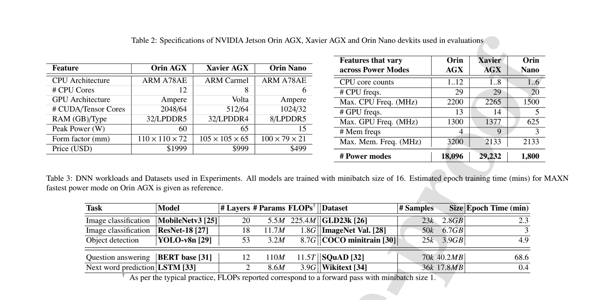
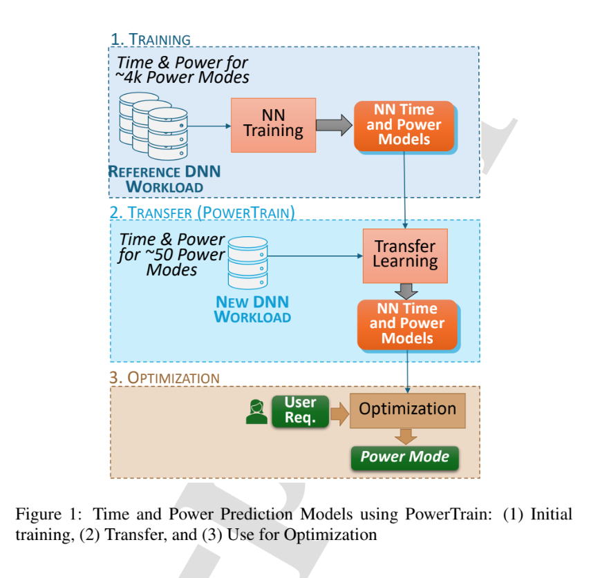
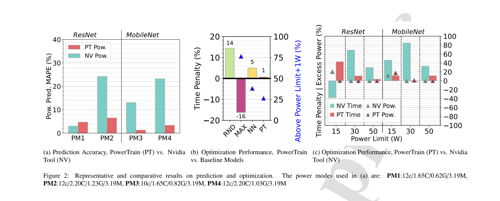
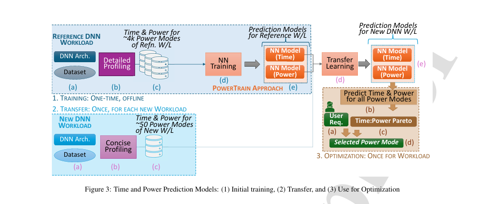
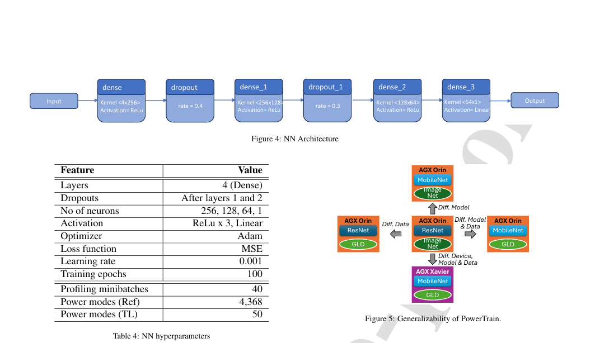
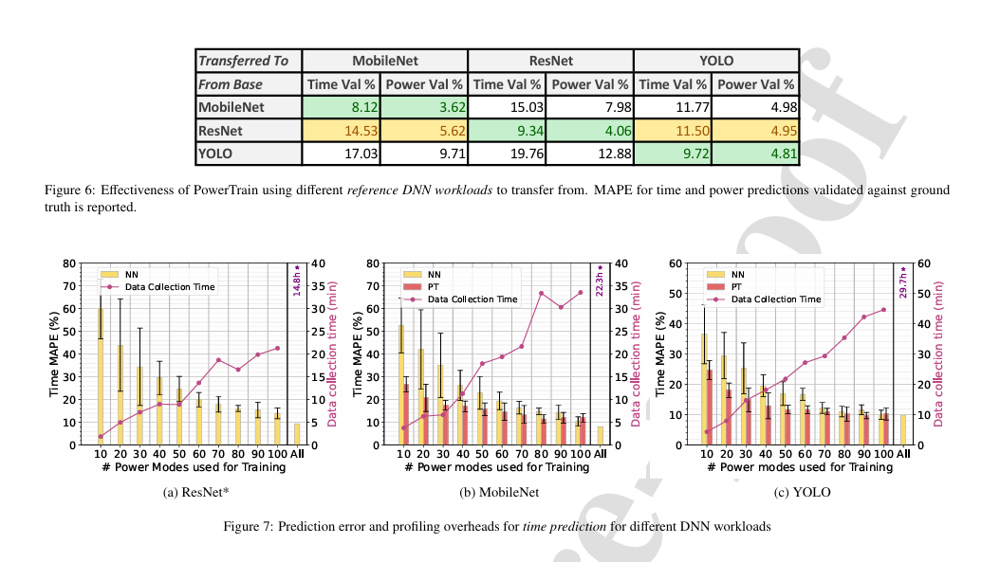
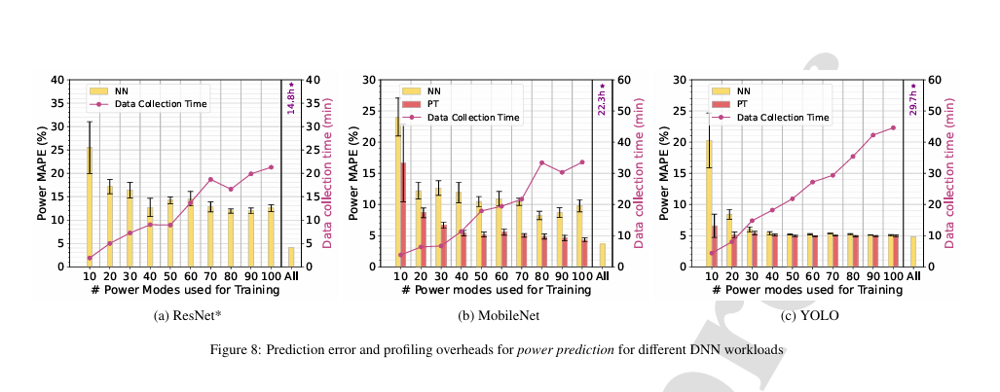
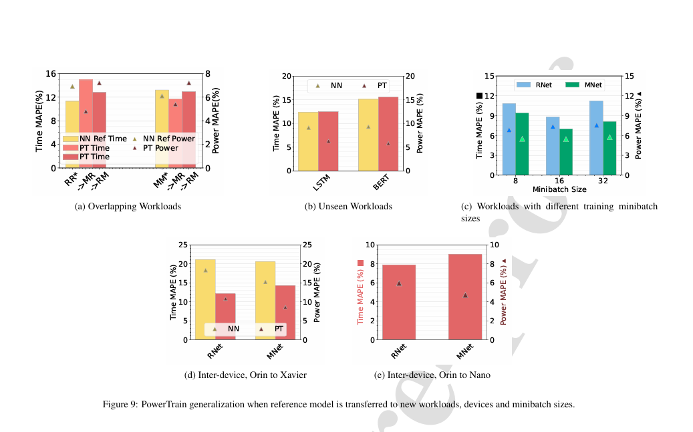
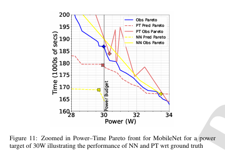
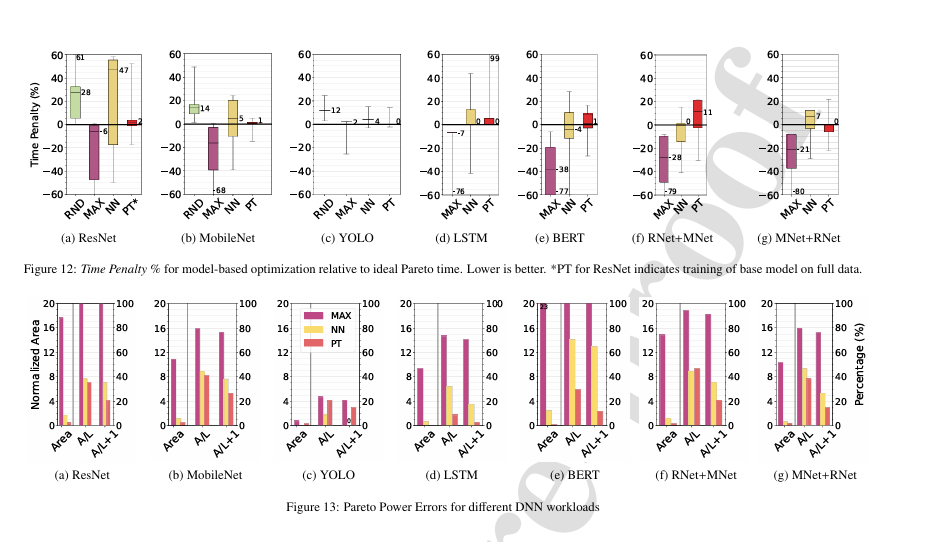

# PowerTrain: Fast, generalizable time and power prediction models to optimize DNN training on accelerated edges 🌸

[paper](https://www.sciencedirect.com/science/article/abs/pii/S0167739X24003649?via%3Dihub) | [https://doi.org/10.1016/j.future.2024.07.001](https://doi.org/10.1016/j.future.2024.07.001)  

Accelerated edge devices, like Nvidia’s Jetson with 1000+ CUDA cores, are increasingly used for DNN training and federated learning, rather than just for inferencing workloads. A unique feature of these compact devices is their fine-grained control over CPU, GPU, memory frequencies, and active CPU cores, which can limit their power envelope in a constrained setting while throttling the compute performance. Given this vast 10k+ parameter space, selecting a power mode for dynamically arriving training workloads to exploit power–performance trade-offs requires costly profiling for each new workload, or is done ad hoc. We propose PowerTrain, a transfer-learning approach to accurately predict the power and time that will be consumed when we train a given DNN workload (model + dataset) using any specified power mode (CPU/GPU/memory frequencies, core-count). It requires a one-time offline profiling of 1000s of power modes for a reference DNN workload on a single Jetson device (Orin AGX) to build Neural Network (NN) based prediction models for time and power. These NN models are subsequently transferred (retrained) for a new DNN workload, or even a different Jetson device, with minimal additional profiling of just 50 power modes to make accurate time and power predictions. These are then used to rapidly construct the Pareto front and select the optimal power mode for the new workload, e.g., to minimize training time while meeting a power limit. PowerTrain’s predictions are robust to new workloads, exhibiting a low MAPE of <6% for power and <15% for time on six new training workloads (MobileNet, YOLO, BERT, LSTM, etc.) for up to 4400 power modes, when transferred from a ResNet reference workload on Orin AGX. It is also resilient when transferred to two entirely new Jetson devices (Xavier AGX and Jetson Orin Nano) with prediction errors of <14.5% and <11%. These outperform baseline predictions by more than 10% and baseline optimizations by up to 45% on time and 88% on power.

 

Given the vast parameter space, selecting an optimal power mode to make such trade-offs for training workloads that arrive dynamically is non-trivial. A wrong power mode choice can cause high power and performance penalties, violating time and power load constraints or, in the worst case, destroying the device due to overheating.

It takes 16.3 h to profile even 25% of power modes for Orin AGX for the ResNet model on ImageNet data, and this will not scale for every workload, specially if it arrives dynamically and has time constraints.

                  energy (mWh) = power (mW) × time (h)

PowerTrain :

 

### Proposed Approach :

The authors propose two data-driven approaches to address the challenge. First, they train two Neural Network (NN) models—one for time predictions and one for power predictions—on a subset of power modes for a given DNN workload. These models make predictions for unseen power modes within the same workload.

Our second approach, PowerTrain, trains NN models on a large corpus of power modes measured from a reference DNN workload. When a new DNN workload arrives, PowerTrain uses transfer learning on telemetry from profiling approximately 50 power modes to retrain the models. These updated models estimate training time and power for all possible power modes, enabling quick Pareto front analysis across time and power to meet optimization goals, such as the fastest training time within a power limit or the lowest power within a time budget.

PowerTrain has lower profiling overheads than NN for new workloads and offers competitive prediction accuracy. It requires a one-time profiling overhead on the reference workload to train the initial NN models, but incremental overhead for new workloads is limited to profiling tens of power modes. PowerTrain generalizes to new DNN workloads, datasets, and even new device types, such as transitioning from Orin AGX to Xavier AGX. In contrast, NN models trained from scratch for new workloads need twice as much profiling data to achieve similar accuracy as PowerTrain.

### Representative Results Against Baselines:

<b>Predictions </b>:
Nvidia offers a PowerEstimator tool (NPE) to estimate the power usage by Orin AGX for a specific power mode. We used NPE and our PowerTrain (PT) approach, with ResNet as the reference workload on Orin AGX, to predict the power usage for three DNN workloads across two diverse power modes each. We reported the Mean Average Percentage Error (MAPE %) relative to the actual observed power usage. Except for PM1 for ResNet, where PT's error (5%) was slightly higher than NPE's (4%), PT provided better predictions in all other cases while NPE consistently overestimated.

<b>Optimization </b>:
Having predictions for power and training time for a DNN workload for any given power mode helps users optimize the system to meet different goals. Nvidia recommends three default power modes: 15W, 30W, and 50W. We used the best of these three to meet the optimization goal and compared it to our PowerTrain models, which discovered a Pareto front to select a custom power mode. PowerTrain (PT) had the fewest solutions exceeding the optimal for 5 out of 6 cases (except ResNet 15W) compared to Nvidia’s suggestions (NV), while generally remaining within power limits.

 

PT-based optimization also outperformed simpler baselines like choosing the default MAXN power mode and random profiling (RND) of 50 power modes. For optimization problems with power limits from 17W to 50W, PT had the lowest time penalty of 1% above the optimal while also having the lowest percentage (26.5%) of solutions exceeding the power limit by over 1W. This low time penalty is beneficial for long training runs over several epochs. For instance, training YOLO takes 200 epochs (~49 hours) on the Orin, and PT's 12% time benefit reduces this by 5.88 hours. Similarly, MobileNet's 148 epochs (~50 hours) see a 6.5-hour reduction when optimized using PT.

#### Discussion :

For instance, a one-time training workload on an edge service that runs a new and large DNN model on a vast corpus of user data may benefit from a brute force approach. Even if profiling time is costly, the perfect power mode is crucial for time-consuming tasks, which could span days. However, this is impractical for edge workloads.

More common on the edge is fine-tuning a pre-trained DNN on a smaller dataset, such as model personalization on a private edge device, where training typically lasts a few hours. Here, using our NN approach with profiling over hundreds of power modes is feasible due to the longer training time.

In continuous learning scenarios, where the same DNN is retrained regularly with small batches of new data to address data drift, PowerTrain is ideal due to its smaller data collection time. For edge devices in a federated learning setup or a private edge-cloud supporting multiple applications, with frequent and unknown duration DNN training workloads, PowerTrain minimizes data collection time and meets optimization criteria before workload changes.

### Contributions :
The authors make the following contributions:

+ `Neural Network (NN) Prediction Approach`: Developed an NN-based approach to estimate time and power for DNN training workloads on the Nvidia Jetson Orin AGX for any given power mode using a large profiling corpus. Extended this into PowerTrain (PT), a transfer learning-based approach that significantly reduces online profiling overheads for new DNN workloads on Orin or other Jetson devices.

+ `Validation Across Multiple Workloads and Devices`: Validated NN and PT for accuracy and generalizability across 7 different DNN workloads and three Jetson edge devices (Orin AGX, Xavier AGX, and Orin Nano), as well as across 3 different training minibatch sizes on 2 workloads.

+ `Optimization of Training Time and Power Limits`: Applied PT predictions to optimize training time and power limit trade-offs for several DNN workloads, demonstrating superior performance compared to other baselines, including NN.

### Experiment Setup

+ #### Hardware Platform and Applications
    We use Nvidia Jetson devices, which are popular high-end accelerated edge devices leading the MLPerf benchmarks. Our models are developed and validated on these devices. To provide a point of comparison, we run our five training workloads on three additional device types (server GPU, workstation GPU, Raspberry Pi 5) and report their training times against the Nvidia Jetson Orin. The Raspberry Pi 5, being significantly slower and limited to CPU cores, is unsuitable for heavy model training and has a much smaller power footprint (1-10W), making power optimizations less relevant. Server GPUs have predefined power limit knobs that internally manage frequency scaling, rendering our methods unnecessary. The Orin, with its near server-grade compute power and multiple power modes, is ideal for our study. Our techniques can potentially be extended to other hardware platforms with similar power mode trade-offs.

+ #### Metrics and Focus
    We focus on power and time as our primary metrics, given that energy can be derived from these two components. Specifically, we measure the time taken for a minibatch of training, as this is the practical unit of training. The time for an epoch can be derived by multiplying the minibatch time by the number of minibatches in one epoch. Our study centers on DNN training workloads due to their high compute demands and the increasing prevalence of DNN training on the edge, such as in federated learning. Other non-DNN workloads may be considered in future work.

+ #### Hardware and Settings
    We use the Nvidia Jetson Orin AGX, the latest generation of Jetson edge accelerators released in March 2023. The Orin supports several custom power modes. The Orin devkit includes INA3221 power sensors, from which we read the device's power consumption during experiments. To avoid thermal throttling, we set the fan to maximum speed and disable Dynamic Voltage and Frequency Scaling (DVFS), keeping frequencies static at our configured values. The Orin also has two special purpose accelerators, DLA and PVA, which we leave in their default states and turned off. Additionally, we use the Nvidia Jetson Xavier AGX, the predecessor of the Orin AGX, and the Jetson Orin Nano, a less powerful device from the same generation, for generalizability experiments. We refer to these devices as Orin, Xavier, and Nano, respectively.

+ #### Training Framework and DNN Workloads
    The Nvidia Jetson Orin runs Ubuntu 20.04 LTS with L4T kernel version 5.10.65. It is configured with Nvidia JetPack version 5.0.1, CUDA v11.4, PyTorch 1.12, and torchvision v0.13.

    Selected Workloads
    We selected three popular computer vision DNN architectures and datasets that are compatible with the Orin's resources:

    + ResNet-18 (Image Classification):

        + Dataset: Validation subset of ImageNet (50,000 images, 6.7GB).
        + Description: A CNN featuring residual blocks and skip connections.
    
    + MobileNet v3 (Image Classification):

        + Dataset: Google Landmarks Dataset v2 (GLD-23k), consisting of 23,080 photos categorized into 203 classes.
        + Description: A lightweight vision model optimized for smartphone applications.
    
    + YOLO v8n (Object Detection):

        + Dataset: COCO minitrain subset of the MS COCO dataset (25,000 images, 3.9GB).
        + Description: The smallest model in the latest "You Only Look Once" series of real-time object detectors.
    
    Additionally, we explore the generalizability of our methods using:

    + BERT with the SQuAD dataset for query-response tasks.
    + LSTM with the Wikitext dataset for next-word prediction tasks.
    
    These workloads represent typical edge and federated learning tasks and cover a wide range of DNN architectures (CNN, LSTM, Transformer), dataset sizes (17.8MB–6.7GB), and computational requirements (3.2M–110M parameters, 225M–11.5T FLOPS).

#### Training Setup :
We use PyTorch for training, leveraging its Dataloader module to fetch and preprocess data samples. The smallest unit of data for training is a minibatch. The num_workers flag in the Dataloader is used to set the number of workers for fetching and preprocessing data.

num_workers = 0: A single process handles all data transfer and GPU compute operations, with no pipelining.
num_workers ≥ 1: Multiple processes (n processes) handle data fetching and preprocessing, while a separate process performs GPU computation on each preprocessed minibatch sequentially.
By default, we use a minibatch size of 16 samples during training and set num_workers = 4. We run an iteration of the Dataloader to prefetch all data into memory before starting the workload to avoid any disk fetch overheads during data collection.

 

### ML-driven Modeling and Prediction :

Proposed Data-Driven Approaches
To predict the power consumption and training time per minibatch for DNN training workloads, we propose two data-driven approaches based on machine learning (ML) models.

Initial Exploration and Elimination of Simpler Methods
+ `Linear Regression`: This method was found to be inaccurate due to the inherently non-linear nature of DNN workload performance.
+ `Random Forest and Decision Trees`: These methods suffered from overfitting.
+ `Multi-Layer Perceptron (MLP)`: While MLP performed well with very few samples, our final solution based on Neural Networks (PT) outperformed it with more samples and the added benefit of transfer learning to new workloads.

Key Consideration: Profiling Overhead
+ `Profiling Time`: The main overhead is the time required to profile a new DNN workload or new hardware. The actual training time for prediction models is minimal (around 15 minutes).
+ `Efficiency`: While profiling data collection can be integrated into the DNN workload's training activity, extensive data collection can diminish the benefits if it becomes a significant part of the training time.

 

#### Neural Network (NN) Prediction Model per Workload

NN Architecture
+ `Layers`: Our NN architecture consists of four dense layers with 256, 128, 64, and 1 neurons, respectively.
+ `Activation Functions`: ReLu for the first three dense layers and a linear activation function for the final layer.
+ `Input Features`: Configuration for a power mode, including CPU cores, CPU frequency, GPU frequency, and memory frequency.
+ `Normalization`: Input features are normalized between 0.0 and 1.0 using sklearn's StandardScaler.
+ `Optimizer`: Adam with a learning rate of 0.001.
+ `Loss Function`: Mean Squared Error (MSE).
+ `Dropout Layers`: Introduced after the first and second dense layers to avoid overfitting.
+ `Training`: By default, the NN is trained for 100 epochs, with model checkpointing to save the best weights based on the least validation loss.

Training Data Approaches

Full Profiling Data:
+ Uses the entire profiling data for a DNN workload (about 4.4k samples for Orin AGX) with a 90:10 training-to-test split.
+ Time-consuming (e.g., over 14 hours for ResNet), but can achieve better prediction accuracy.

Sampled Data:
+ Uses a smaller number of uniformly sampled training data (10 to 100 samples) from the 4.4k, with a 90:10 split.
+ Takes significantly less time (10s of minutes), but may suffer from lower accuracy.

Trade-Offs :
+ `Accuracy vs. Time`: The full profiling data approach provides higher accuracy but requires more time. The sampled data approach is quicker but may compromise on prediction accuracy.
+ `Profiling Overhead`: Balancing profiling time with prediction accuracy is crucial for practical deployment in edge devices.

Hyperparameters (Table 4)
+ `Dense Layers`: 4 layers with 256, 128, 64, and 1 neurons.
+ `Activation Functions`: ReLu (first 3 layers), Linear (final layer).
+ `Optimizer`: Adam.
+ `Learning Rate`: 0.001.
+ `Loss Function`: Mean Squared Error (MSE).
+ `Dropout Layers`: After the first and second dense layers.
+ `Training Epochs`: 100 by default.
+ `Normalization`: StandardScaler from sklearn.

By leveraging these approaches, our prediction models aim to optimize the power and training time trade-offs effectively for various DNN workloads on edge devices, ensuring robust performance with minimal overhead.

### PowerTrain: Generalizable Transfer Learning Model

#### Motivation : 
The standard neural network (NN) approach requires retraining for each new DNN workload on the edge device, leading to significant data collection overheads for different power modes. To address this limitation, we propose PowerTrain, a transfer learning (TL) based approach to offer a lower-overhead and more generalizable solution.

#### Transfer Learning Concept :
Transfer learning is a deep learning technique where a model trained on one task is repurposed for a related but different task. This method leverages the knowledge gained from the initial task, allowing the model to perform well on a new task with less specialized data and reduced training time.

#### PowerTrain Methodology :
+ Reference DNN Workload:

    + Perform detailed profiling on a reference DNN workload to collect a comprehensive set of profiling data.
    + Use this data to bootstrap a reference NN model for both time and power prediction.
    + This process is done once offline, creating a reference model to transfer from.

+ New DNN Workload:

    + Modify the reference NN by removing the last dense layer and adding a new layer.
    + Perform limited profiling on the new DNN workload to collect time and power data.
    + Fine-tune the reference NN using this new data through transfer learning.
    + Generate new NN models for time and power prediction for the new workload.

The key idea is to retain the representations learned in the internal layers of the neural network from the reference DNN workload and only change the final output layer based on the new workload's profiling behavior.

#### Implementation Steps
+ Train Reference NN:

    + Train the reference NN using a full corpus of 4k power modes for one of the three default DNN workloads.
    + This serves as the base model for future transfer learning tasks.

+ Fine-Tune for New Workloads:

    + Use a small number of power modes (10 to 100) for profiling the new workload.
    + Perform transfer learning to adapt the reference NN to the new workload.
    + Evaluate the trade-off between data collection overheads and the accuracy of the retrained models.

#### Performance and Evaluation

+ `Data Collection`: The full profiling data for the reference model uses 4.4k power modes. Transfer learning requires significantly fewer power modes for new workloads.
+ `Training Time`: The actual retraining time remains under 10 minutes.
+ `Generalization`: PowerTrain is tested across various generalization scenarios:
    + Same DNN Architecture or Dataset as the reference DNN workload.
    + Unseen DNN Architecture and Dataset.
    + Unseen Device from a Different Generation.
    + Unseen Device from the Same Generation.
    + Unseen Training Minibatch Sizes.

+ Results :
  
    + `Profiling Data Impact`: Increasing the number of power modes from 500 to 4368 for the reference model did not significantly affect the Mean Absolute Percentage Error (MAPE) for time or power predictions.
    + `Data Collection Overheads vs. Accuracy`: Evaluations showed a balance between the number of power modes used for transfer learning and the resulting accuracy of the retrained models.
    + `Generalizability`: PowerTrain demonstrated effective generalization across different DNN architectures, datasets, and hardware platforms, validating its robustness and efficiency.

By employing transfer learning, PowerTrain reduces the profiling overheads while maintaining high prediction accuracy for power and training time, making it a versatile tool for various DNN workloads on edge devices.

## Prediction Results :

Evaluation of PowerTrain (PT) vs. Neural Network (NN) :

We evaluate PowerTrain for time and power predictions and compare it with the NN baseline using both large and small sampling sizes. The primary metric used is the Mean Absolute Percentage Error (MAPE%) relative to the ground truth for time and power consumption in various power modes. We also assess the overheads for data collection and the generalizability of PowerTrain to new DNN workloads and devices.

Training Setup:

+ The PowerTrain reference model and the NN large sampling model are both trained on 90% of profiling data from all 4386 power modes, with 40 minibatches of telemetry entries per power mode.
+ For smaller samples, we randomly select between 10–100 power modes from the 4386 total, with 40 minibatch entries each.
+ Power data is recorded every 1s, and each power mode has varying power samples depending on the duration to profile 40 minibatches. We use the maximum power sample length and replicate minibatch entries to ensure uniform training entries.

Training Time:

+ Training the full NN for the reference DNN takes around 15 minutes on an RTX 3090 GPU, which can be done offline with the model weights saved.
+ Training the NN model with 10–100 samples takes a few seconds.
+ PowerTrain takes under 30 seconds for transfer learning.

Choice of Base DNN Workload :

The choice of the reference DNN workload influences the quality of transfer learning. We evaluated three candidate DNN workloads (ResNet, MobileNet, and YOLO) to determine the best reference model for transfer learning.

    + ResNet as Reference:
        + Time MAPE: 14.5% for MobileNet, 11.5% for YOLO
        + Power MAPE: 5.6% for MobileNet, 4.9% for YOLO
    + MobileNet as Reference:
        + Time MAPE: 15.0% for ResNet, 11.8% for YOLO
        + Power MAPE: 7.9% for ResNet, 4.9% for YOLO
    + YOLO as Reference:
        + Performed worse compared to ResNet and MobileNet
  
ResNet demonstrated the highest variation in observed power values across different power modes, making it the best candidate for generalizing to other DNNs. Thus, ResNet is used as the reference DNN in subsequent experiments.

Time and Power Prediction Accuracy vs. Profiling Overheads :

We compare the performance of the NN model trained with all profiling samples against PowerTrain trained on ResNet and transferred to other DNNs with different training sample sizes.

`Time Predictions`:

    + MobileNet:
        + PT with 10 power modes: 26.7% MAPE
        + NN with 10 power modes: 52.6% MAPE
        + PT with 30 power modes: <20% MAPE
        +NN with 30 power modes: 35% MAPE
    + YOLO:
        + PT with 30 power modes: <15% MAPE
        + NN with 10 power modes: 24.7% MAPE
  
PT consistently shows lower MAPE and less variability compared to NN, even with fewer samples. Data collection time for 30 power modes is under 15 minutes, making the overhead relatively small compared to the multi-hour training time.

`Power Predictions`:

    + MobileNet:
        + PT with 20 power modes: 8.5% MAPE
        + NN with 20 power modes: 12% MAPE
    + YOLO:
        + PT with 10 power modes: 6.8% MAPE
        + NN with 10 power modes: 21% MAPE

PowerTrain outperforms NN with fewer profiling samples, achieving lower MAPEs and maintaining consistency. With 50 power modes, PT has a 5% lower MAPE than NN for MobileNet.

`Comparison at 100 Power Modes`:

    + MobileNet:
        + PT: 11.9% MAPE (time), 4.3% MAPE (power)
        + NN: 8.1% MAPE (time), 3.6% MAPE (power)
    + YOLO:
        + PT: 10.18% MAPE (time)
        + NN: 9.7% MAPE (time)

PowerTrain reaches close to the optimum accuracy with 100 power modes, demonstrating its efficiency in providing high accuracy with fewer samples.

PowerTrain leverages transfer learning to provide accurate time and power predictions with significantly fewer profiling samples compared to traditional NN models. By using ResNet as the reference model, PowerTrain generalizes well to other DNN workloads and maintains lower overheads, making it a practical solution for edge device performance prediction.

### Generalization of PowerTrain :

A significant advantage of PowerTrain is its ability to generalize to heterogeneous DNN workloads with minimal profiling samples, achieving high accuracy. We evaluate this generalizability along three dimensions (Figure 5): (1) Different DNN architecture or dataset from the reference DNN workload, (2) Both DNN architecture and dataset being different, and (3) Different edge device and DNN workloads.

Different DNN Architecture or Dataset from Reference :
We use two reference NN models: one trained on ResNet with ImageNet (RR∗) and another on MobileNet with GLD (MM∗). PowerTrain attempts to transfer to new workloads where either the DNN architecture or dataset differs:

    + RR∗ → RM: ResNet architecture with MobileNet’s GLD dataset
    + RR∗ → MR: MobileNet architecture with ResNet’s ImageNet dataset
    + MM∗ → MR: MobileNet with ResNet’s dataset
    + MM∗ → RM: ResNet with MobileNet’s dataset

Using 50 random power mode samples for transfer and validation on 100 power modes, the results show:

    + Time MAPEs for RR∗ → RM and MM∗ → MR are comparable to the reference models, with minimal error increase (e.g., 11.3% to 12.8% for RR∗ → RM).
    + Power MAPEs exhibit less than a 1% change, indicating strong generalization when either the DNN architecture or dataset overlaps with the reference.

 

#### Unseen and Diverse DNN Workloads
Expanding to DNN architectures significantly different from ResNet, such as BERT (transformer architecture) and LSTM (RNN-based architecture), we profile 50 random power mode samples for BERT and LSTM and validate on another 50 samples:

    + LSTM: Time MAPE for PT is 12.5% vs. 12.3% for NN.
    + BERT: Time MAPEs are 15.6% for PT vs. 15.1% for NN.
    + PT outperforms NN on power predictions: LSTM (6.3% vs. 9.1%) and BERT (better by 3.5%).

#### Unseen Device from a Different Generation
Using PowerTrain to transfer from a ResNet workload trained on Orin AGX to Xavier AGX (previous Jetson generation):

    + ResNet on Xavier: Time MAPE is 12%, power MAPE is 11% for PT, compared to NN’s 21% (time) and 18% (power).
    + MobileNet on Xavier: Time MAPE is 14%, power MAPE is 9% for PT, significantly better than NN.

 

#### Unseen Device from the Same Generation
Transferring from Orin AGX to a less powerful Orin Nano (same generation):

    + Using 50 random power modes for transfer and validating on 180 modes:
        + ResNet on Nano: Time MAPE is 7.85%, power MAPE is 5.96%.
        + MobileNet on Nano: Time MAPE is 8.98%, power MAPE is 4.72%.
    + Hyperparameter tuning (changing loss metric from MSE to MAPE) was necessary to achieve these results, suggesting sufficient similarity within and across Jetson generations.

#### Unseen Workload Training Minibatch Sizes
Predicting training time and power consumption for different minibatch sizes (8, 16, 32) on ResNet and MobileNet:

+ ResNet:
    + Transferring from ResNet/16 to ResNet/8 and ResNet/32 showed time MAPEs of 10.84% and 11.2%, and power MAPEs of 6.86% and 7.28%, respectively.
  
+ MobileNet:
    + Time MAPEs ranged from 7% to 9.4%, and power MAPEs between 5.5% and 5.7%, demonstrating robust performance across different minibatch sizes.

 

PowerTrain demonstrates strong generalizability to various DNN workloads, edge devices, and training configurations with minimal profiling samples. This adaptability, combined with the ability to achieve higher accuracy and lower overheads, makes PowerTrain a robust and practical solution for diverse edge device performance prediction scenarios.

 

## Optimizing DNN Workloads using Prediction Models :

Problem Formulation
To optimize the power mode configuration of DNN workloads, we define an optimization problem:

Given a DNN workload m_tr, select a power mode pm from a set PM that minimizes training time per epoch t_tr while ensuring the power load P_tr is within a user-specified budget P_b.
​
 :
min_pm ∈ PM, t_tr
​
 
subject to: 

$$ P_{tr}  ≤  P_b $$
​
#### Workflow and Methodology :
Using the prediction models, we solve the optimization problem following these steps:

+ `Training Reference Model`: Use ResNet trained on 4368 power modes.
+ `Transfer Learning`: Apply transfer learning to other target workloads using 50 random power mode samples.
+ `Scaling Predictions`: Scale time predictions from minibatch to epoch times.
+ `Observed Pareto Front`: Construct an observed Pareto front using profiling data for 4.4k power modes to minimize time and power.
+ `Predicted Pareto Front`: Use the prediction models to estimate training time and power for all possible power modes, constructing a predicted Pareto front.
+ `Optimization`: For a given power limit, use the predicted Pareto front to find the optimal power mode and report the training time.

#### Baselines :
To contrast against PowerTrain, we use:

+ MAXN: Default power mode setting on Jetson Orin AGX, offering best time performance but high power load.
+ Random Sampling Pareto (RND): Randomly profile 50 power modes and build a Pareto front.
+ NN Model: Custom trained for each DNN workload using 50 random power modes, predicting the Pareto front for optimization.

#### Results :
We solve the optimization problem for power limits from 17W to 50W in 1W increments, comparing the results against the optimal solution from the ground-truth Pareto. Metrics reported include:

+ Time Penalty %: Excess training time spent compared to the optimal power mode.
+ Normalized Area Under the Curve (AUC): Power in excess of the budget.
+ Percentage of Solutions Exceeding Power Limit (A/L).
+ Percentage of Solutions Exceeding Power Limit by >1W (A/L+1).

#### Analysis :
+ PowerTrain vs NN: PowerTrain's observed Pareto closely follows the ground-truth Pareto, leading to better optimization results compared to NN, which is limited to a smaller region.
+ Instance Example (MobileNet at 30W):
    + Ground-truth optimal: 186 s per epoch, 29.9W.
    + NN prediction: 168.9 s, 29.7W (actual: 167.2 s, 33.5W).
    + PT prediction: 179.1 s, 29.9W (actual: 183.9 s, 30.3W).

#### Time Penalty Analysis :
+ Median Time Penalty:
    + MobileNet: PT - 0.7%, NN - 5%.
    + YOLO: PT - 0%, NN - 4%.
    + LSTM and BERT: Similar median time penalties but tighter distribution for PT.
    + MobileNet with ResNet data: PT has a lower median time penalty.
    + ResNet with MobileNet data: PT does worse than NN.

#### Power Budget Analysis :
+ `Normalized AUC`: PT has the lowest excess power AUC in 6 out of 7 DNN workloads.
+ `Power Budget Exceedance`:
    + PT exceeds the budget within a 1W threshold in <20% of solutions for 6 out of 7 DNNs.
    + For MobileNet, this is 25%.

#### Baselines Comparison :
+ `MAXN`: Offers the best time but frequently exceeds power limits.
+ `Random Sampling`: Higher time penalties with no power violations, slower than optimal by 12–28%.

PowerTrain's prediction models facilitate efficient optimization of DNN workloads, minimizing training time while adhering to power budgets. The results indicate that PowerTrain generally outperforms other approaches, including NN and simpler baselines, in terms of time penalty and power budget compliance.

 