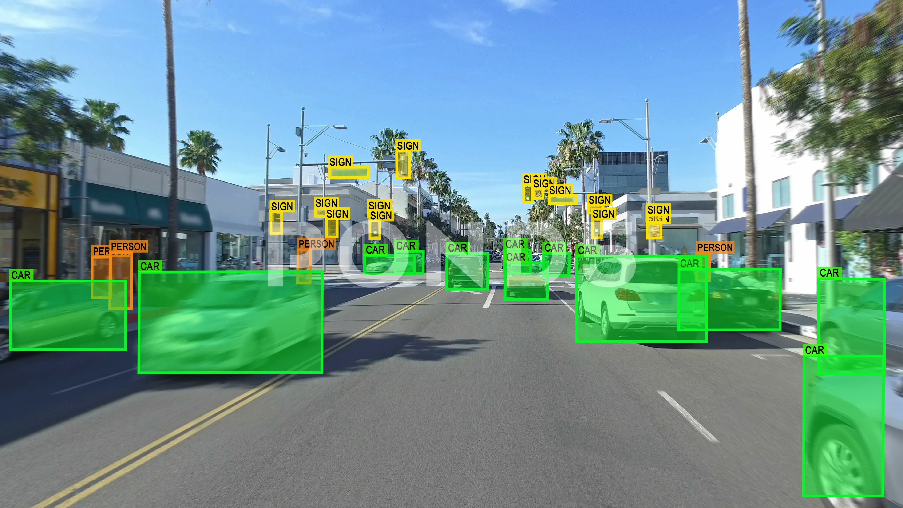

# Object Detection and Tracking
[[self-driving car perception](https://github.com/florist-notes/aicore_s/blob/main/notes/perc.MD)] | 🌸

Object detection is a fundamental task in computer vision that involves identifying and localizing objects of interest within an image or video frame. Unlike image classification, which predicts a single label for the entire image, object detection provides a more detailed understanding by not only recognizing the presence of objects but also precisely locating them with bounding boxes. 

Object detection and tracking are fundamental tasks in computer vision with numerous real-world applications ranging from surveillance and security to autonomous driving and augmented reality. 

# Object Detection Techniques:

## Traditional Approaches:

Traditionally, object detection was performed using handcrafted features and classical machine learning algorithms such as Histogram of Oriented Gradients (HOG) coupled with Support Vector Machines (SVM). However, the advent of deep learning revolutionized object detection with the introduction of Convolutional Neural Networks (CNNs).

+ `Sliding Window`: Sliding window techniques involve scanning the image at multiple scales and locations using a fixed-size window to classify potential object regions. While effective, they are computationally expensive and require manual feature engineering.
+ `Haar Cascades`: Haar cascades use a cascade of classifiers trained on Haar-like features to detect objects within predefined regions of interest. They are relatively fast but may lack accuracy and robustness in complex scenes.

## Deep Learning-Based Approaches:

Modern object detection systems predominantly rely on deep learning architectures such as Faster R-CNN, YOLO (You Only Look Once), and SSD (Single Shot Multibox Detector). These architectures leverage CNNs to simultaneously perform object localization and classification in an end-to-end manner, resulting in faster and more accurate detection.

+ `Single Shot Detectors (SSDs)` / `Few Shot Detectors`: SSDs perform object detection by predicting class labels and bounding box coordinates directly from a single pass through a neural network. They are efficient and suitable for real-time applications but may struggle with small objects.
+ `Faster R-CNN`: Faster R-CNN introduces a region proposal network (RPN) to generate object proposals, which are then refined and classified by a separate detection network. It achieves high accuracy but is slower than SSDs.
+ `YOLO (You Only Look Once)`: YOLO is a real-time object detection system that divides the input image into a grid and predicts bounding boxes and class probabilities directly from each grid cell. It balances speed and accuracy, making it suitable for real-time applications.
+ `Mask R-CNN`: Mask R-CNN extends Faster R-CNN by adding an additional branch for pixel-level segmentation, enabling instance segmentation alongside object detection. It provides detailed object masks in addition to bounding boxes and class labels.

Resources : [Introduction to Object Detection in Deep Learning](https://youtu.be/t-phGBfPEZ4?si=i5s1kJY6-Lo1Tdld), [YOLOV5: How to Train a Custom YOLOv5 Object Detector ](https://youtu.be/Ciy1J97dbY0?si=sZkpIN0MY5_sZMLG), [Build an AI/ML Tennis Analysis system with YOLO, PyTorch, and Key Point Extraction](https://youtu.be/L23oIHZE14w?si=xKazXGUkIWaaNXcv), [Identify and Measure precisely Objects distance](https://youtu.be/_gzcp8dURbU?si=YMyxSYJFuWJrxD71), [Train Yolov8 object detection on a custom dataset](https://youtu.be/m9fH9OWn8YM?si=UqSmIDIGqenkMq-I), [Tensorflow Object Detection in 5 Hours with Python](https://youtu.be/yqkISICHH-U?si=n3GCKZtHTvUJcXOa), [A Basic Introduction to Object Detection](https://www.analyticsvidhya.com/blog/2022/03/a-basic-introduction-to-object-detection/), [A Gentle Introduction to Object Recognition With Deep Learning](https://machinelearningmastery.com/object-recognition-with-deep-learning/), [A Beginner's Guide To Understanding Convolutional Neural Networks](https://adeshpande3.github.io/A-Beginner's-Guide-To-Understanding-Convolutional-Neural-Networks/).