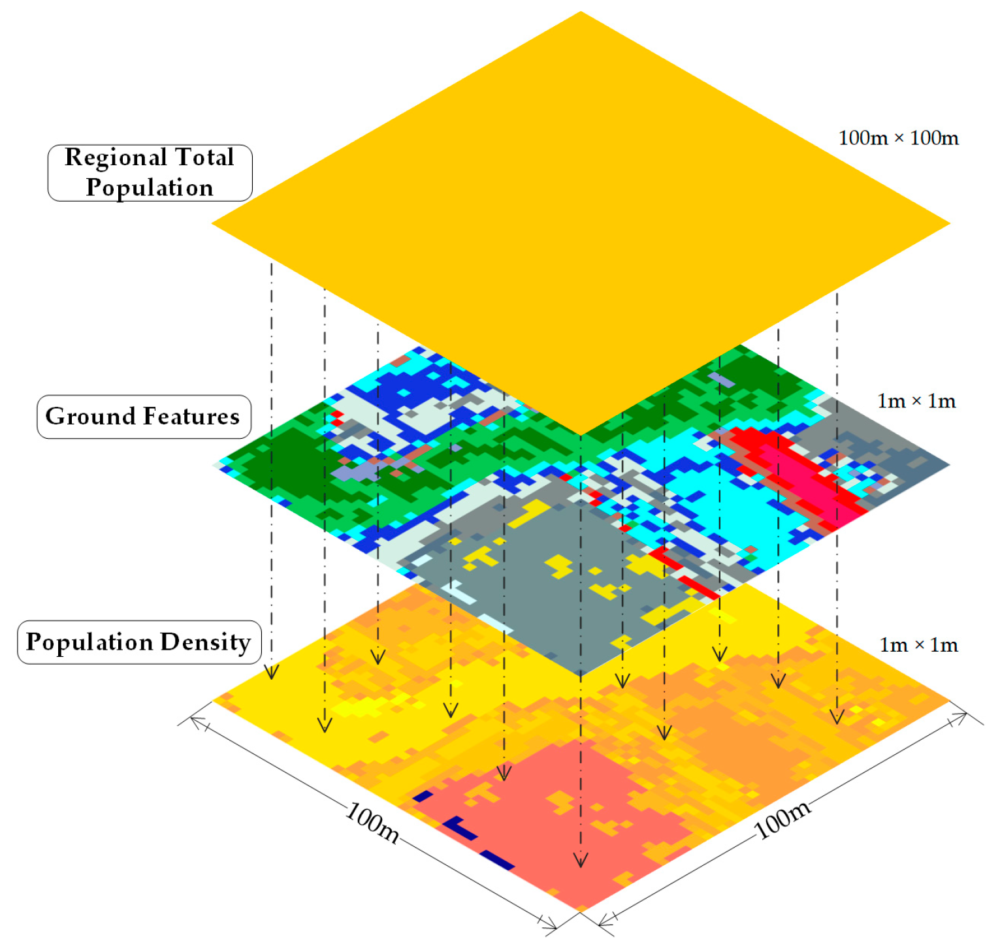

# Ground Feature Extraction

Ground feature extraction involves identifying, segmenting, and classifying specific features (e.g., roads, buildings, vegetation, or water bodies) from remotely sensed data such as satellite imagery, aerial photos, or LiDAR point clouds. This process is vital in applications like urban planning, agriculture, forestry, and disaster management. Here’s an in-depth look at ground feature extraction:

## Key Stages in Ground Feature Extraction

+ Data Acquisition:

    + High-resolution data sources, such as multispectral/hyperspectral imagery, LiDAR, or SAR, provide rich details.
    + Types of data used:
        + Optical Imagery: For visual and spectral feature detection.
        + LiDAR: For elevation and structural details.
        + SAR: For ground texture and terrain structure, especially in areas with cloud cover.

+ Preprocessing:

    + Georeferencing: Align data to a common spatial coordinate system.
    + Radiometric Correction: Remove atmospheric or sensor-induced distortions.
    + Noise Reduction: Apply filters (e.g., median, Gaussian) to reduce noise.
    + DEM/DTM Generation: Use LiDAR or stereo imagery to generate Digital Elevation Models (DEMs) or Digital Terrain Models (DTMs) for terrain corrections.

+ Feature Segmentation:

    + Segment data into homogeneous regions representing ground features.
    + Methods:
        + Pixel-based: Classify individual pixels based on spectral properties.
        + Object-based Image Analysis (OBIA): Group pixels into objects for classification.
        + Edge Detection: Use algorithms (e.g., Canny, Sobel) to detect feature boundaries.

+ Feature Extraction:

    + Spectral Features:
        + Use specific spectral bands to distinguish features (e.g., NDVI for vegetation, NDBI for buildings).
    + Textural Features:
        + Extract patterns (e.g., coarseness, smoothness) using methods like Gray-Level Co-occurrence Matrix (GLCM).
    + Geometric Features:
        + Extract shapes, lengths, and contours for roads or building footprints.
    + Elevation Features:
        + Use DEMs to separate elevated features like buildings from flat terrain.

+ Classification:

    + Assign each pixel or object a class label (e.g., road, water, vegetation).
    + Techniques:
        + Rule-Based: Use thresholds (e.g., NDVI > 0.3 for vegetation).
        + Machine Learning: Use classifiers like Random Forests, SVMs, or XGBoost.
        + Deep Learning:
            + Use Convolutional Neural Networks (CNNs) or U-Net for semantic segmentation.
            + Example: Segmenting urban features using ResNet or VGG backbones.
        + Multi-Source Fusion: Combine data (e.g., optical + LiDAR) for higher accuracy.

+ Post-Processing:

    + Apply morphological operations (e.g., dilation, erosion) to refine feature boundaries.
    + Remove noise or small misclassified regions using filters.

## Feature-Specific Techniques

+ `Roads`:

    + Use spectral differences (e.g., asphalt vs. vegetation) and linear shape detection.
    + Algorithms like Hough Transform or graph-based methods identify road networks.

+ `Buildings`:

    + Combine elevation (LiDAR) and spectral data for roof detection.
    + CNNs or OBIA methods handle complex urban environments.

+ `Vegetation`:

    + Use vegetation indices like NDVI, SAVI, or EVI for classification.
    + Time-series analysis from multispectral data detects vegetation growth trends.

+ `Water Bodies`:

    + Use indices like NDWI (Normalized Difference Water Index).
    + Thresholding or spectral unmixing methods for precise delineation.

## Here are some useful GitHub repositories and resources for ground plane segmentation and point cloud processing:

+ [3D Ground Segmentation](https://github.com/chrise96/3D_Ground_Segmentation): This repository implements a ground segmentation algorithm for 3D point clouds based on the work "Fast segmentation of 3D point clouds" by Zermas et al. It uses a plane-fitting algorithm to distinguish road and non-road points, providing a preprocessing step that reduces computational overhead by filtering ground points. The project includes detailed pseudocode and C++ implementations.

+ [SqueezeSegV3](https://github.com/chenfengxu714/squeezesegv3): SqueezeSegV3 focuses on LiDAR point cloud segmentation and includes features like ground segmentation and object detection. It is optimized for LiDAR data used in autonomous vehicles.

+ PCL (Point Cloud Library): The PCL provides comprehensive tools for point cloud processing, including filtering, feature estimation, and segmentation. A dedicated tutorial on ground plane segmentation using RANSAC is available: Ground Plane Segmentation with PCL.

+ [Open3D](https://www.open3d.org/): Open3D offers an efficient pipeline for working with 3D data and includes methods for plane fitting and segmentation. Documentation and examples can be found at Open3D.org.

These tools and libraries are designed for working with 3D point clouds, enabling tasks like ground removal, segmentation, and object detection, which are critical in fields such as autonomous navigation and environmental monitoring. Let me know if you'd like more details on any of these!

Resources :

+ @github/[satellite-image-deep-learning](https://github.com/satellite-image-deep-learning/techniques) | [PREDICTING SOIL PROPERTIES FROM HYPERSPECTRAL SATELLITE IMAGES](https://github.com/ridvansalihkuzu/hyperview_eagleeyes).
+ @github/[FrontierDevelopmentLab/sat-extractor](https://github.com/FrontierDevelopmentLab/sat-extractor)
+ [Satellite Image Time Series Analysis on Earth Observation Data Cubes](https://e-sensing.github.io/sitsbook/introduction.html)
+ [Ground segmentation based point cloud feature extraction for 3D LiDAR SLAM enhancement](https://www.sciencedirect.com/science/article/abs/pii/S0263224124007759)
+ [Ground Extraction from 3D Lidar Point Clouds with the Classification Learner App](https://ieeexplore.ieee.org/document/8442569)
+ [3D-CNN-based feature extraction of ground-based cloud images for direct normal irradiance prediction](https://www.sciencedirect.com/science/article/abs/pii/S0038092X19301082)
+ [Automated Object Based Image Feature Extraction](https://youtu.be/4XyRg4PrRjA?si=yqAGMBOaQeufCchK)
+ [GndNet: Fast ground plane estimation and point cloud segmentation for autonomous vehicles using deep neural networks.](https://github.com/anshulpaigwar/GndNet)
+ [Ground segmentation based point cloud feature extraction for 3D LiDAR SLAM enhancement](https://www.sciencedirect.com/science/article/abs/pii/S0263224124007759)