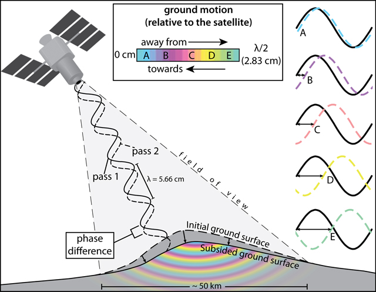
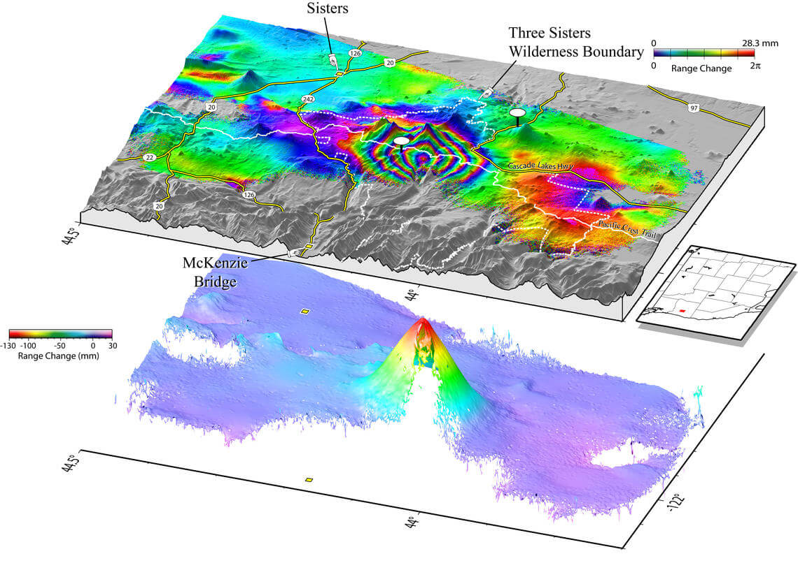

# Interferometric Synthetic Aperture Radar (InSAR)

Interferometric Synthetic Aperture Radar (InSAR) is an advanced remote sensing technique that uses phase data from Synthetic Aperture Radar (SAR) to measure surface deformations and generate high-resolution Digital Elevation Models (DEMs). It exploits the phase difference between two or more SAR images taken from slightly different positions or times over the same area.

 

## Key Principles of InSAR

+ SAR Phase Data:

    + SAR images capture both amplitude (signal strength) and phase (wave properties).
    + Amplitude is used for surface feature analysis, while phase data contains information about the distance between the sensor and the ground.

+ Interferometry:

    + The phase difference (interferogram) between two SAR images is computed to determine relative surface changes.
    + The phase difference accounts for variations in topography, deformation, and atmospheric effects.

+ Baseline Geometry:

    + Spatial Baseline: The distance between the satellite positions during the two acquisitions.
    + Temporal Baseline: The time gap between two acquisitions, critical for monitoring surface changes over time.

## Types of Interferometric Synthetic Aperture Radar (InSAR)
InSAR techniques can be broadly categorized based on how data is acquired and processed to extract surface deformation or topographic information. Below is an in-depth explanation of the main types of InSAR:

### 1. `Single-Pass InSAR`
+ Overview:
    + Single-Pass InSAR uses a single platform equipped with two SAR antennas mounted at a fixed distance (baseline) apart.
    + Both antennas acquire SAR images simultaneously, eliminating the need for temporal baseline.
+ Key Features:
    + Accuracy: High precision due to the absence of temporal decorrelation (no time gap between acquisitions).
    + Applications: Ideal for generating Digital Elevation Models (DEMs) as it measures elevation directly without atmospheric or temporal effects.

+ Challenges:
    + Requires specialized hardware with dual antennas, which increases mission complexity and costs.
    + Examples:
    Shuttle Radar Topography Mission (SRTM) used Single-Pass InSAR to create a global DEM.

### 2. `Repeat-Pass InSAR`
+ Overview:
    + SAR images are acquired at different times over the same area using the same antenna.
    + The temporal baseline between acquisitions allows for observing surface changes over time.
+ Key Features:
    + Temporal Analysis: Measures surface deformation due to phenomena like earthquakes, volcanic activity, and ground subsidence.
    + Baseline Control: A small spatial baseline (distance between two satellite positions) ensures better coherence for deformation studies.
+ Challenges:
    + Temporal Decorrelation: Changes in surface features (e.g., vegetation growth) between passes reduce coherence.
    + Atmospheric Effects: Temporal differences introduce atmospheric phase noise, which must be corrected.
+ Examples:
    + Sentinel-1 satellite missions commonly use Repeat-Pass InSAR for monitoring environmental and geological changes.

### `3. Differential InSAR (DInSAR)`
+ Overview:
    + DInSAR subtracts the topographic phase from Repeat-Pass InSAR data to isolate surface deformation.
+ Key Features:
    + Deformation Analysis: Focuses on detecting small-scale surface displacements, such as land subsidence, tectonic shifts, or mining-related deformations.
    + Enhanced Precision: Uses external DEMs or reference passes to eliminate topographic influences.
+ Challenges:
    + Phase Ambiguity: Requires accurate phase unwrapping to avoid errors.
    + Atmospheric Correction: Must account for atmospheric effects that can mask subtle deformation signals.
+ Examples:
    + Used in earthquake analysis to map ground displacement patterns with centimeter to millimeter precision.

### `4. Persistent Scatterer InSAR (PS-InSAR)`
+ Overview:
    + PS-InSAR identifies stable points (persistent scatterers) in a scene over time, which maintain coherence across multiple acquisitions.
    + These points are typically man-made structures or natural features like rocks that provide reliable phase information.
+ Key Features:
    + Long-Term Monitoring: Tracks slow-moving deformations over months or years.
    + High Precision: Detects millimeter-scale changes by analyzing phase stability across multiple acquisitions.
    + Urban Applications: Well-suited for cities and regions with stable infrastructure.
+ Challenges:
    + Requires Dense Scatterers: Works best in areas with plenty of stable features.
    + Computational Intensity: Involves processing large stacks of SAR images, requiring high computational resources.
+ Examples:
    + Monitoring subsidence in cities like Venice and tracking structural deformation in buildings or bridges.

### `5. Small Baseline Subset InSAR (SBAS-InSAR)`
+ Overview:
    + SBAS-InSAR reduces decorrelation by selecting SAR image pairs with small spatial and temporal baselines.
    + It uses multiple interferograms to improve the reliability of deformation measurements.
+ Key Features:
    + Wide Coverage: Suitable for analyzing deformation over large areas.
    + Improved Coherence: Minimizes decorrelation effects by restricting baselines.
    + Flexibility: Works in areas with moderate scatterer density.
+ Challenges:
    + Trade-Off with Coverage: Smaller baselines may limit the range of deformation detection.
    + Atmospheric Effects: Multiple acquisitions increase susceptibility to atmospheric noise.
+ Examples:
    + Used in environmental monitoring, such as glacier movement and landslide detection.

### `6. Cross-Interferometry`
+ Overview:
    + Combines SAR data from different sensors or platforms to generate interferograms.
    + Enables comparative studies using diverse datasets.
+ Key Features:
    + Sensor Interoperability: Leverages different SAR systems for greater coverage and data availability.
    + Flexibility: Allows analysis when continuous data from a single sensor is unavailable.
+ Challenges:
    + Geometric Alignment: Ensuring accurate coregistration between datasets from different platforms.
    + Radiometric Differences: Variations in SAR system parameters can affect interferometric results.
+ Examples:
    + Combining Sentinel-1 and RADARSAT-2 data to enhance monitoring of large-scale natural disasters.

### `7. Polarimetric InSAR (PolInSAR)`
+ Overview:
    + PolInSAR combines polarimetric (multi-polarization) and interferometric techniques to extract detailed information about surface structure and vegetation.
+ Key Features:
    + 3D Structural Mapping: Provides height and density information for vegetation and forests.
    + Enhanced Data: Exploits differences in scattering mechanisms to improve classification and elevation models.
+ Challenges:
    + Complex Analysis: Requires expertise in interpreting polarimetric and interferometric data.
    + Sensor Requirements: Needs polarimetric SAR systems, which are not always available.
+ Examples:
    + Mapping forest biomass for carbon studies and monitoring crop growth.

### `8. Wide-Area InSAR`
+ Overview:
    + Uses SAR images with broad swath coverage to monitor deformation over large geographic regions.
+ Key Features:
    + Scalability: Suitable for regional and national-scale applications.
    + Long-Term Monitoring: Tracks deformation trends over time across vast areas.
+ Challenges:
    + Lower Resolution: Wide swath imaging sacrifices resolution for coverage.
    + Data Volume: Processing extensive datasets requires robust computational systems.
+ Examples:
    + Monitoring tectonic plate movements across entire continents.

## `9. Tomographic InSAR (TomoSAR)`

Tomographic InSAR (TomoSAR) is an advanced form of InSAR that uses multiple SAR acquisitions to reconstruct the 3D structure of objects on the Earth's surface. Unlike traditional InSAR techniques, which primarily analyze horizontal deformation or topographic elevation, TomoSAR provides a volumetric view, making it valuable for studying vertical structures.

+ Key Features:
    + Volumetric Imaging: By analyzing multiple SAR images from slightly different perspectives, TomoSAR can reconstruct a 3D representation of targets.
    + Urban Analysis: Ideal for mapping complex urban environments, where structures like buildings can cause layover effects in traditional SAR imagery.
    + Forest Canopy Studies: Offers insights into vegetation structure, such as tree height and biomass estimation.
+ Applications:
    + Urban Monitoring: Detecting structural changes, mapping urban infrastructure, and identifying damaged buildings after disasters.
    + Environmental Studies: Understanding forest canopy density, estimating forest biomass, and analyzing vertical vegetation profiles.
+ Challenges:
    + Data Requirements: Requires a large number of acquisitions with precise baseline control for accurate 3D reconstruction.
    + Computational Complexity: Involves sophisticated algorithms for processing and interpreting volumetric data.
    + Interference and Noise: Layover and shadowing effects must be carefully managed during reconstruction.

| **Type**                     | **Advantages**                                                                                      | **Challenges**                                                                                     | **Applications**                                                                                  |
|------------------------------|----------------------------------------------------------------------------------------------------|----------------------------------------------------------------------------------------------------|---------------------------------------------------------------------------------------------------|
| **Single-Pass InSAR**        | - High accuracy due to simultaneous acquisition with dual antennas.                                 | - Requires dual-antenna systems, which increase mission complexity and cost.                      | - Generating precise Digital Elevation Models (DEMs), e.g., from Shuttle Radar Topography Mission (SRTM). |
|                              | - Eliminates temporal decorrelation and atmospheric noise.                                          |                                                                                                    |                                                                                                   |
| **Repeat-Pass InSAR**        | - Enables temporal analysis of surface deformation over time.                                       | - Temporal decorrelation due to changes in surface features (e.g., vegetation).                   | - Monitoring land subsidence, tectonic activity, volcanic deformation, and glacier movement.       |
|                              | - Suitable for monitoring dynamic processes.                                                       | - Atmospheric noise can mask deformation signals, requiring advanced corrections.                 |                                                                                                   |
| **Differential InSAR (DInSAR)** | - Focuses on precise measurement of small-scale deformation by removing topographic phase.         | - Phase unwrapping errors can introduce inaccuracies.                                              | - Studying post-earthquake surface displacement, mining-related subsidence, and urban deformation. |
|                              | - Enhanced precision using external DEMs or reference interferograms.                              | - Requires correction for atmospheric phase noise.                                                |                                                                                                   |
| **Persistent Scatterer InSAR (PS-InSAR)** | - Tracks stable points (e.g., buildings, rocks) for long-term monitoring of deformation.               | - Limited applicability in areas with few stable scatterers (e.g., forests or water bodies).       | - Monitoring urban subsidence, structural health of bridges and buildings, and fault zone movement.|
|                              | - Achieves millimeter-scale precision over extended periods.                                       | - Processing large stacks of SAR images demands significant computational resources.              |                                                                                                   |
| **Small Baseline Subset InSAR (SBAS-InSAR)** | - Reduces temporal and spatial decorrelation by using small baseline interferograms.               | - Smaller baseline may restrict detection of large deformations.                                  | - Monitoring slow-moving landslides, glacier flow, and regional-scale subsidence.                 |
|                              | - Suitable for wide-area monitoring with moderate scatterer density.                               | - Susceptible to atmospheric effects over time.                                                   |                                                                                                   |
| **Polarimetric InSAR (PolInSAR)** | - Combines interferometric and polarimetric techniques for enhanced data analysis.                 | - Requires specialized SAR systems with polarimetric capabilities.                                | - Mapping forest biomass, vegetation structure, and monitoring agricultural dynamics.             |
|                              | - Provides 3D structural information, especially for vegetation.                                  | - Complex data interpretation and high computational demands.                                     |                                                                                                   |
| **Wide-Area InSAR**          | - Allows large-scale deformation analysis over broad geographic regions.                           | - Lower resolution compared to narrow-swath SAR imaging.                                          | - Monitoring tectonic plate movements, regional subsidence, and disaster response (e.g., earthquakes). |
|                              | - Enables long-term monitoring of large regions.                                                  | - Processing large datasets requires robust computational systems.                                |                                                                                                   |
| **Cross-Interferometry**     | - Combines SAR data from multiple sensors/platforms for greater temporal and spatial coverage.      | - Geometric alignment and radiometric differences between sensors introduce challenges.           | - Multi-sensor monitoring of disasters like landslides or flooding.                              |
|                              | - Increases data availability when continuous acquisition by one sensor is unavailable.            |                                                                                                    |                                                                                                   |
| **Tomographic InSAR (TomoSAR)** | - Extends InSAR to three dimensions by combining multiple images for volumetric imaging.           | - Requires a large number of acquisitions for accurate 3D reconstruction.                         | - Mapping urban infrastructure, detecting structural changes, and vegetation canopy analysis.     |
|                              | - Provides detailed information about vertical structures, such as buildings and forests.          | - Highly computationally intensive and requires specialized algorithms for data processing.       |                                                                                                   |

## InSAR Processing Steps :

| **Step**               | **Description**                                                                                                  | **Challenges**                                                                                     |
|-------------------------|------------------------------------------------------------------------------------------------------------------|----------------------------------------------------------------------------------------------------|
| **1. SAR Data Acquisition** | SAR images are acquired from satellites or airborne sensors, usually in repeat-pass or single-pass configurations. | - Temporal decorrelation due to surface changes between acquisitions.                             |
|                         | Acquisitions must have precise baseline control for accurate interferometry.                                    | - Atmospheric conditions can vary, introducing noise.                                             |
| **2. Co-Registration**  | Aligning the SAR images to ensure pixel-to-pixel correspondence between the master and slave images.             | - Requires sub-pixel accuracy; misalignments can degrade interferogram quality.                   |
|                         | Typically involves matching features or using orbital metadata for alignment.                                   | - Computationally intensive for large datasets.                                                   |
| **3. Interferogram Generation** | Calculating the phase difference between the co-registered SAR images to create an interferogram.                    | - Phase noise from decorrelation or environmental factors can obscure meaningful signals.          |
|                         | The phase reflects the relative path difference between the two images.                                         |                                                                                                    |
| **4. Phase Filtering**  | Reducing noise in the interferogram using filtering techniques, such as Goldstein filtering.                    | - Over-filtering may smooth out meaningful deformation signals.                                   |
|                         | This step improves the signal-to-noise ratio for phase information.                                             |                                                                                                    |
| **5. Phase Unwrapping** | Converting wrapped phase values (ranging from -π to π) into continuous phase values.                            | - Unwrapping errors in areas with low coherence or large deformation gradients.                   |
|                         | Essential for extracting deformation or topographic information.                                                |                                                                                                    |
| **6. DEM Removal**      | Removing the topographic phase contribution using an external Digital Elevation Model (DEM) or reference phase. | - DEM inaccuracies can introduce errors in the deformation signal.                                |
|                         | This isolates deformation-related phase changes.                                                               |                                                                                                    |
| **7. Baseline Estimation** | Estimating the spatial baseline (distance between satellite positions during acquisitions) for accurate processing. | - Requires precise orbital data; errors affect phase interpretation.                              |
| **8. Atmospheric Corrections** | Mitigating atmospheric phase delay effects caused by variations in water vapor, temperature, and pressure.      | - Requires external weather models or multi-temporal data to estimate atmospheric contributions.   |
|                         | Often done using techniques like phase stacking or auxiliary weather data.                                     |                                                                                                    |
| **9. Geocoding**        | Converting the SAR image from radar geometry to geographic coordinates using metadata and DEMs.                 | - Accurate geolocation depends on precise sensor and DEM information.                             |
|                         | Ensures the results are interpretable in a geospatial context.                                                  |                                                                                                    |
| **10. Time-Series Analysis** | For multi-temporal studies, analyzing deformation trends over time using techniques like PS-InSAR or SBAS.       | - Requires managing large datasets and maintaining coherence over extended time periods.          |
|                         | Provides detailed insights into slow deformation processes.                                                     |                                                                                                    |
| **11. Interpretation and Visualization** | Interpreting deformation patterns, generating maps, and visualizing results for end-users.                      | - Requires domain expertise to correlate deformation signals with real-world events.              |
|                         | Often involves tools like GIS software for overlaying results with auxiliary datasets.                         |                                                                                                    |

### InSAR Tools and Software
+ SNAP (Sentinel Application Platform):

    + Widely used for Sentinel-1 data processing.
    + Provides tools for interferogram generation and phase unwrapping.

+ GMTSAR:

    + Open-source software for SAR and InSAR processing.

+ ISCE (InSAR Scientific Computing Environment):

    + Developed by NASA, suited for advanced InSAR analyses.

+ StaMPS (Stanford Method for Persistent Scatterers):

    + Specialized for PS-InSAR processing.
+ Commercial Tools:

    + ENVI, SARscape, and GAMMA are widely used for professional InSAR applications.