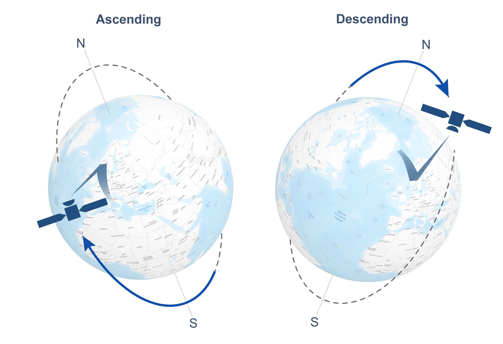

# InSAR Orbital Determination and Fusion :

Interferometric Synthetic Aperture Radar (InSAR) is a powerful remote sensing technique used to measure ground deformation and surface displacement with high precision. Central to its accuracy is the determination of orbital parameters and the fusion of data from multiple sources to enhance spatial and temporal resolution. Below is a detailed explanation of InSAR orbital determination and fusion.

## InSAR Orbital Determination

Orbital determination refers to calculating the precise positions and velocities of a satellite as it orbits Earth. For InSAR, accurate orbital information is crucial because even small errors can result in significant phase errors in the interferometric data. The orbital parameters affect the geometry of SAR imaging and the resulting interferograms.

## Key Elements
+ `Ephemeris Data`: Satellites record their trajectory using onboard systems, such as GPS receivers or Doppler tracking systems, providing a raw estimate of their position and velocity over time.

+ `Orbit Models`: Mathematical models are used to refine satellite positions, taking into account:
Gravitational forces (Earth’s oblateness, the Moon, and Sun).
    + Atmospheric drag.
    + Solar radiation pressure.
    + Perturbations due to Earth’s irregular mass distribution.

+ `Baseline Estimation`: The baseline is the spatial separation between two satellite positions during different acquisitions. It is critical for calculating interferograms. Errors in baseline estimation lead to phase artifacts.

## Techniques for Orbital Determination
+ `Ground-Based Tracking` :
    + Satellite positions are tracked using ground stations equipped with radar or laser systems.
    + These data are used to refine orbital models.

+ `Onboard Systems` :

    + Satellites carry onboard GPS or Global Navigation Satellite System (GNSS) receivers.
    + Autonomous navigation techniques reduce reliance on ground stations.

+ `Orbit Adjustment Using SAR Data` :
    + InSAR itself can provide feedback for orbital refinement. For example:
        + Cross-correlation between images.
        + Calibration using known ground control points (GCPs).

+ `Precise Orbit Determination (POD)` :
    + POD algorithms use sophisticated numerical methods to achieve centimeter-level accuracy in satellite positions.

## InSAR Data Fusion

###  `Overview` : 
Fusion in InSAR refers to the integration of data from multiple sources or acquisitions to improve measurement accuracy, spatial coverage, or temporal resolution. This is particularly valuable for applications like land subsidence monitoring, earthquake deformation studies, and infrastructure stability assessment.

###  `Types of Fusion` :
+ Multi-Temporal InSAR (MT-InSAR)
    + Combines a time series of SAR images to detect slow-moving deformation trends.
    + Techniques include Persistent Scatterer InSAR (PS-InSAR) and Small Baseline Subset (SBAS).

+ Multi-Sensor Fusion
    + Integrates data from different SAR sensors (e.g., Sentinel-1, TerraSAR-X, RADARSAT).
    + Ensures coverage across different spatial resolutions, polarizations, and frequency bands.

+ Multi-Platform Fusion
    + Combines SAR data from different orbital platforms, including low Earth orbit (LEO) and geostationary orbit (GEO) satellites.
    + Mitigates temporal gaps by leveraging complementary satellite revisit times.

+ Multi-Modal Fusion
    + Fuses SAR data with other geospatial data types, such as optical imagery, LiDAR, or GNSS observations, to provide a comprehensive understanding of deformation patterns.

### `Methods and Techniques`
+ `Image Registration` : Ensures that SAR images from different sensors or acquisitions are aligned accurately.

+ `Phase Unwrapping` : Corrects ambiguities in phase measurements to obtain continuous displacement maps.

+ `Data Normalization` : Adjusts for differences in sensor characteristics, such as frequency, resolution, and imaging geometry.

+ `Coherence Optimization` : Improves signal-to-noise ratio by selecting high-quality pixels (e.g., persistent scatterers or coherent points).

+ `Statistical Fusion` : Weighted averaging or Bayesian methods are applied to combine data, accounting for measurement uncertainties.

+ `Deep Learning and AI` : Emerging approaches use machine learning to automatically fuse data, predict gaps, and enhance measurement accuracy.

## Challenges and Solutions
+  Orbital Determination Challenges
    + Errors in Ephemeris Data: Small inaccuracies can lead to significant phase errors.
        + Solution: Use ground control points or co-register SAR data with external datasets like GNSS measurements.
    + Perturbation Modeling: Unmodeled forces can degrade precision.
        + Solution: Incorporate real-time corrections from onboard sensors or external models.

+  Fusion Challenges
    + Data Inconsistency: Differences in sensor characteristics or acquisition geometry.
        + Solution: Apply advanced image registration and normalization techniques.
    + Temporal Gaps: Sparse revisits can hinder deformation monitoring.
        + Solution: Leverage multi-platform or multi-sensor datasets.
    + Computational Complexity: Fusion processes are computationally intensive.
        + Solution: Use cloud computing or parallel processing frameworks.

## How to Perform Multi-Sensor Fusion in InSAR

Multi-sensor fusion in InSAR combines data from multiple radar sensors to enhance the analysis of surface deformation, improve spatial and temporal coverage, or integrate information across different SAR wavelengths and resolutions. This process involves harmonizing data from sensors with varying specifications, such as Sentinel-1, TerraSAR-X, RADARSAT, or ALOS-2. Below is a step-by-step guide on how to achieve multi-sensor fusion in InSAR:

### Understanding the Sensors
Key Parameters to Consider
+ Frequency Bands:
    + SAR sensors operate in different frequency bands:
        + X-band (e.g., TerraSAR-X): High resolution, shorter wavelength (~3 cm), sensitive to surface features.
        + C-band (e.g., Sentinel-1): Moderate resolution, medium wavelength (~6 cm).
        + L-band (e.g., ALOS-2): Lower resolution, longer wavelength (~23 cm), penetrates vegetation and soil.
    + Spatial Resolution:
        + Varies from a few meters (X-band) to tens of meters (L-band).
    + Polarization:
        + Sensors may provide single, dual, or quad-polarization data.
    + Temporal Revisit Time:
        + Sentinel-1 revisits every 6–12 days; TerraSAR-X can have shorter intervals depending on tasking.
    + Swath Width:
        + Wider swaths (e.g., Sentinel-1) cover larger areas, while narrower swaths (e.g., TerraSAR-X) provide higher detail.

`Why Fusion?` To combine strengths of multiple sensors, such as the high resolution of TerraSAR-X and the wide coverage of Sentinel-1, for detailed yet comprehensive analysis.

### Preprocessing of Individual Sensor Data
Each SAR sensor dataset must be preprocessed before fusion to ensure compatibility. Typical preprocessing steps include:

+  Radiometric Calibration
    + Adjust the pixel values to correct for sensor-specific radiometric distortions.
+  Geometric Calibration
    + Align the SAR imagery with a geographic coordinate system using sensor-specific orbital data and ground control points.
+  Co-Registration
    + Align multiple SAR images pixel-by-pixel to ensure precise comparison. Co-registration accuracy is critical for maintaining interferometric phase consistency.
+  Interferogram Generation
    + Create interferograms for each sensor using pairs of SAR images. This involves:
    + Removing topographic phase using a Digital Elevation Model (DEM).
    + Filtering noise and unwrapping the phase.

### Aligning Sensor Data
Since each SAR sensor operates under different imaging geometries, further alignment is necessary:

+  Projection to a Common Coordinate System
    + Transform all datasets to a unified coordinate system (e.g., WGS84).
    + Use SAR-specific software such as SNAP (Sentinel Application Platform) or GAMMA to handle the projection.

+  Resampling
    + Resample all data to a common spatial resolution. For example:
        + Sentinel-1 (10m resolution) can be resampled to match TerraSAR-X (1m resolution).

Use bilinear or nearest-neighbor interpolation methods, ensuring minimal loss of information.

### Data Normalization
Normalization is crucial to harmonize data from different sensors:

+  Phase Normalization
    + Adjust phase data from different sensors to a common reference baseline.
    + Use external reference datasets, such as GNSS displacement measurements, to calibrate phase values.

+  Intensity Normalization
    + Normalize backscatter intensity to account for differences in radar wavelength, incidence angle, and polarization.

+  Temporal Normalization
    + Align acquisition times by interpolating deformation measurements from one sensor to match the timestamps of another.

### Fusion Techniques

Once the datasets are aligned and normalized, fusion can be performed using various techniques:

#### 1. Weighted Averaging
- Combine displacement maps from different sensors using a weighted average:
  - Assign higher weights to sensors with better resolution or coherence.
- Example formula:

$$ D_{fused} = w_1 D_1 + w_2 D_2 $$

  where $$ D_1 \ and \ D_2 $$ are displacement measurements, and $$ w_1 + w_2 = 1 $$ .

#### 2. Maximum Coherence Selection
- Select deformation data from the sensor with the highest coherence at each pixel.

#### 3. Principal Component Analysis (PCA)
- Use PCA to extract the most significant deformation patterns from multi-sensor datasets.

#### 4. Machine Learning
- Train machine learning models (e.g., random forests, deep learning) to learn relationships between datasets and generate fused outputs.

#### 5. Data Assimilation
- Incorporate SAR data into numerical models (e.g., crustal deformation models) to simulate and refine deformation patterns.

### Validation of Fusion
After fusion, the results must be validated to ensure reliability:

+  Cross-Validation with Independent Data
    + Compare fused deformation measurements with GNSS stations, leveling surveys, or optical image-derived displacement.

+  Consistency Check
    + Verify that the fused dataset maintains spatial and temporal consistency, especially in areas of high deformation.

+  Error Analysis
    + Quantify the uncertainty introduced during fusion. For example:
    + Root Mean Square Error (RMSE) between fused and ground-truth data.
    + Analysis of phase residuals in the interferogram.

## Precise Orbit Determination (POD): An Overview

Precise Orbit Determination (POD) refers to the process of accurately calculating the position and velocity of a satellite in its orbit at any given time. It is critical for various applications in satellite-based geosciences, including radar interferometry (InSAR), Earth observation, and navigation systems like GNSS. The accuracy of POD is essential for ensuring that satellite-based measurements, such as deformation mapping or climate monitoring, are reliable.

### Key Principles of POD

POD is achieved by modeling and solving the motion of a satellite using high-precision measurements and mathematical techniques. The core principles include:

+ Newton’s Laws of Motion:

    + A satellite's orbit is governed by gravitational forces and non-gravitational perturbations.

    + The satellite’s trajectory is modeled as:

$$ 𝑎 = 𝐹_{total} / 𝑚 $$

where 𝑎 is acceleration, 𝐹 total is the total force acting on the satellite, and m is its mass.

+ Dynamic Models:

    + Use physics-based models for the forces acting on the satellite:
    + Gravitational Forces:
        + Earth’s gravitational field (e.g., modeled by the Earth Gravitational Model, EGM2008).
        + Third-body attractions (e.g., from the Sun, Moon).
    + Non-Gravitational Forces:
        + Atmospheric drag.
        + Solar radiation pressure.
    + Earth albedo (reflected radiation).

+ Observation Models:

    + Use measurements from ground stations, space-based systems, or onboard instruments:
    + GNSS (e.g., GPS, Galileo, GLONASS).
    + Satellite Laser Ranging (SLR).
    + Doppler tracking and radar altimetry.

+ Error Minimization:

    + Correct for measurement errors such as atmospheric delays, clock errors, and antenna phase center variations.

## Steps in Precise Orbit Determination :
+ 1. Data Collection

    + Tracking Data:
        + GNSS receivers onboard the satellite collect signals from navigation satellites.
        + Ground-based tracking stations provide Doppler and laser ranging data.
        + Other sensors, such as accelerometers, measure non-gravitational forces.
    + Ancillary Data:
        + Atmospheric models (e.g., tropospheric and ionospheric corrections).
        + Earth orientation parameters (EOP).
        + Solar activity data for drag models.
+ 2. Force Modeling
    + Develop models for all forces acting on the satellite:
        + Gravitational Models:
            + Use high-resolution geopotential models like EGM2008 or GOCE-based models.
        + Non-Gravitational Forces:
            + Model atmospheric drag using atmospheric density profiles (e.g., MSIS model).
            + Account for solar radiation pressure using a satellite's geometry and reflectivity properties.

+ 3. Mathematical Modeling
Use the two-body problem as a baseline and extend it to account for perturbations:

$$
𝑟⃗^{′′} = −𝜇 (𝑟⃗ / ∣𝑟⃗∣^3) + 𝑎_{perturbations} 
$$

 where 𝜇 is the gravitational constant, 𝑟 is the position vector, and 𝑎 perturbations represents additional forces.

+ 4. State Vector Estimation
    + Estimate the satellite’s state vector (𝑟 for position and 𝑣 for velocity) at any time using:
        + Kalman Filters: Process sequential updates of measurements.
        + Batch Least Squares: Fit measurements over a given time span.
        + Variational Equations: Solve for the partial derivatives of orbit parameters.

+ 5. Orbit Integration
    + Numerically integrate the equations of motion using:
        + Runge-Kutta or Adams-Bashforth-Moulton methods.
        + High-precision numerical propagators (e.g., Cowell’s method).

+ 6. Measurement Residuals and Iteration
    + Compute residuals between observed and modeled data:

 $$ Residual = Observed − Modeled $$
 Adjust the dynamic and observation models iteratively to minimize these residuals.

## Observation Techniques for POD
1. GNSS-Based POD
    + Most modern satellites have onboard GNSS receivers.
    + Satellites determine their position by trilaterating signals from multiple GNSS satellites.
    + Dual-frequency signals correct for ionospheric delays.
2. Satellite Laser Ranging (SLR)
    + Ground-based stations send laser pulses to satellites equipped with retroreflectors.
    + The round-trip time of the pulse provides precise range measurements.
3. Doppler Tracking
    + Measures the Doppler shift in a satellite’s transmitted signal to infer velocity.
4. Interferometric Tracking
    + VLBI (Very Long Baseline Interferometry) measures angular position relative to distant quasars.

## POD Accuracy Factors
+ 1. Measurement Noise : Signal noise from GNSS, SLR, or Doppler measurements can limit accuracy.

+ 2. Force Model Errors : Inaccuracies in gravitational models or atmospheric drag estimates affect predictions.

+ 3. Orbit Perturbations : Small unmodeled forces, such as thermal thrust (e.g., Yarkovsky effect), can accumulate errors.

+ 4. Clock and Timing Errors : Satellite and ground station clock inaccuracies can introduce timing errors.

## Tools and Software for POD
+ Bernese GNSS Software:
    + High-precision GNSS processing.
+ GIPSY-OASIS:
    + Developed by NASA for precise satellite orbit and positioning.
+ POD Software in SNAP:
    + ESA’s SNAP toolbox integrates POD for Sentinel missions.
+ Orbit Propagation Tools:
    + Python libraries like Skyfield, pyorbital, or MATLAB’s Aerospace Toolbox.

Resources : [[ Orbit Determination ](https://www.youtube.com/playlist?list=PLrsOIbUzxfODb4CYrWf7LvisrENjIxx73)]

+ [Multi-sensor InSAR time series fusion for long-term land subsidence monitoring](https://www.tandfonline.com/doi/full/10.1080/10095020.2023.2178337#d1e2003)
+ [Precise baseline determination for InSAR formation-flying satellites based on spaceborne BDS-3 and GPS observations](https://www.sciencedirect.com/science/article/abs/pii/S0273117724010068)
+ [Precise orbit determination and baseline consistency assessment for Swarm constellation](https://www.sciencedirect.com/science/article/abs/pii/S0273117722010778)
+ [Precise orbit determination for low Earth orbit satellites using GNSS: Observations, models, and methods](https://link.springer.com/article/10.1007/s42064-023-0195-z)
+ [Applied Research on InSAR and GPS Data Fusion in Deformation Monitoring](https://onlinelibrary.wiley.com/doi/10.1155/2021/3888975)
+ [Integration of GPS and InSAR Data for Resolving 3-Dimensional Crustal Deformation](https://agupubs.onlinelibrary.wiley.com/doi/full/10.1029/2019EA001036)
+ [Interferometric synthetic aperture radar (InSAR) atmospheric correction: GPS, Moderate Resolution Imaging Spectroradiometer (MODIS), and InSAR integration](https://agupubs.onlinelibrary.wiley.com/doi/full/10.1029/2004JB003446)
+ [Extraction of Bridge Features from high-resolution InSAR Data and optical Images](https://ieeexplore.ieee.org/document/4234481)
+ [An Improved GNSS and InSAR Fusion Method for Monitoring the 3D Deformation of a Mining Area](https://ieeexplore.ieee.org/document/9622216?denied=)
+ [Fusion of SAR Interferometry and Polarimetry Methods for Landslide Reactivation Study, the Bureya River (Russia) Event Case Study](https://www.mdpi.com/2072-4292/13/24/5136)
+ [A DEM fusion method for ascending and descending orbit StereoSAR DEMs in complicated mountain areas considering SAR echo intensity](https://link.springer.com/article/10.1007/s11629-020-6269-y)
+ [InSAR Baseline Estimation for Gaofen-3 Real-Time DEM Generation](https://www.preprints.org/manuscript/201806.0447/v1)
+ [Baseline determination for distributed InSAR satellite system using inter-agency comparison and fusion](https://hkxb.buaa.edu.cn/EN/10.7527/S1000-6893.2017.21187)
+ [Improvement of InSAR DEM Accuracy Using Data and Sensor Fusion](https://www.isprs.org/proceedings/XXXII/part2/127_XXXII-part2.pdf)
+ [A Novel Multitemporal InSAR Model for Joint Estimation of Deformation Rates and Orbital Errors](https://www.semanticscholar.org/paper/A-Novel-Multitemporal-InSAR-Model-for-Joint-of-and-Zhang-Ding/306828d99e5e91cae6859eed1f670cd0d9cf85e3)
+ [Automatic Correction of Time-Varying Orbit Errors for Single-Baseline Single-Polarization InSAR Data Based on Block Adjustment Model](https://www.mdpi.com/2072-4292/16/19/3578)
+ [Fusion of Multi-Baseline and Multi-Orbit InSAR DEMs with Terrain Feature-Guided Filter](https://pdfs.semanticscholar.org/cb75/03b775b67c47ef684535d5d1e495b7650ab0.pdf)
+ [Fusion of GNSS and Satellite Radar Interferometry: Determination of 3D Fine-Scale Map of Present-Day Surface Displacements in Italy as Expressions of Geodynamic Processes](https://ouci.dntb.gov.ua/en/works/9Gx1ZDn7/)
+ [Towards a rigorous fusion of GNSS and InSAR observations for the purpose of water vapor retrieval](https://unglueit-files.s3.amazonaws.com/ebf/59270e4fd5c847a4a4e4021205db1864.pdf)
+ [Synergistic Fusion of Interferometric and Speckle-Tracking Methods for Deriving Surface Velocity From Interferometric SAR Data](https://asf.alaska.edu/wp-content/uploads/2019/03/liu_2007.pdf)