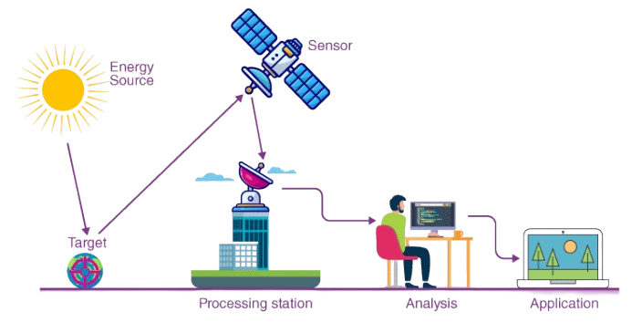
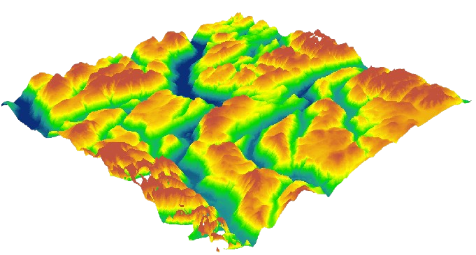

# Remote Sensing 🛰️

Remote sensing refers to the process of acquiring information about an object or phenomenon without making physical contact with it. This is typically achieved by detecting and analyzing reflected or emitted electromagnetic radiation from the Earth's surface and atmosphere. It plays a crucial role in various fields, including environmental monitoring, urban planning, agriculture, forestry, disaster management, and defense.

[ [Synthetic Aperture Radar (SAR)](./SAR.MD), [Interferometric Synthetic Aperture Radar (InSAR)](./INSAR.MD), [Pixel Offset Tracking (POT)](./POT.MD) ]

## How Remote Sensing Works

+ `Energy Source or Illumination` : A source (usually the Sun or an artificial emitter) provides electromagnetic radiation. Passive sensors rely on natural energy, while active sensors generate their own signal (e.g., radar).

+ `Propagation of Energy` : The energy travels through the atmosphere, interacts with the Earth's surface, and is reflected or emitted back.

+ `Interaction with Objects` : Different surfaces (water, vegetation, soil) interact differently with radiation, depending on their physical and chemical properties.

+ `Sensor Reception` : Sensors aboard satellites, aircraft, or drones capture the reflected/emitted radiation and convert it into data.

+ `Data Processing` : The raw data undergo preprocessing (removing noise, correcting distortions) and analysis to extract meaningful information.

Remote sensing employs a variety of sensors to capture data from the Earth's surface and atmosphere. These sensors differ based on the energy source, platform, wavelength sensitivity, and application. Below is a detailed explanation of the different types of sensors used in remote sensing.

### Classification of Sensors :

A. Based on Energy Source
+ `Passive Sensors`:
These sensors rely on natural energy sources, primarily sunlight. They measure the energy reflected or emitted by objects on the Earth's surface.
    + `Examples`: Optical cameras, multispectral scanners, thermal sensors.

+ `Active Sensors`:
These sensors emit their own energy (typically in the form of electromagnetic waves) and measure the reflected signal from the target.
    + `Examples`: Radar (Radio Detection and Ranging), LiDAR (Light Detection and Ranging).

B. Based on Platform
+ `Spaceborne Sensors`: Mounted on satellites, they provide global and large-area coverage.
    + `Examples`: Landsat, Sentinel, MODIS.

+ `Airborne Sensors`: Mounted on aircraft or drones for high-resolution, localized imaging.
    + `Examples`: Hyperspectral imagers on drones, LiDAR on airplanes.

+ `Ground-Based Sensors`: Deployed on the Earth's surface for localized and high-precision data collection.
    + `Examples`: Spectroradiometers, soil moisture probes.

C. Based on Wavelength Sensitivity
+ `Optical Sensors`: Operate in the visible, near-infrared (NIR), and short-wave infrared (SWIR) regions.
+ `Thermal Infrared Sensors`: Measure emitted thermal radiation, providing data on temperature.
+ `Microwave Sensors`: Operate in the microwave region and can penetrate clouds, vegetation, and even soil.

### Types of Sensors :

<table style="width:100%" >

<tr>
<th>Sensors</th>
<th>Description  </th>
<th>Reference  </th>
</tr>

<tr>
<th>Optical Sensors</th>
<td>

These sensors use visible and near-visible wavelengths to capture images of the Earth's surface.

+ Multispectral Sensors:
Capture data across a few spectral bands, typically 3 to 10.
    + Examples:

        - Landsat TM (Thematic Mapper) and OLI (Operational Land Imager)
        - Sentinel-2 MSI (Multispectral Instrument)
+ Hyperspectral Sensors:
Capture data across hundreds of continuous spectral bands, enabling detailed material analysis.
    + Examples:

        - Hyperion (onboard NASA's EO-1 satellite)
        - AVIRIS (Airborne Visible/Infrared Imaging Spectrometer)
    + Applications:

        - Vegetation health monitoring (e.g., NDVI).
        - Water quality analysis.
        - Mineral exploration.
 </td>
<td>-  </td>
</tr>

<tr>
<th>Thermal Infrared Sensors</th>
<td>

These sensors detect the Earth's emitted thermal radiation, which is related to surface temperature.

+ Examples:

    + MODIS (Moderate Resolution Imaging Spectroradiometer)
    + ASTER (Advanced Spaceborne Thermal Emission and Reflection Radiometer)

+ Applications:

    + Urban heat island studies.
    + Volcano and forest fire monitoring.
    + Soil moisture estimation.
  </td>
<td>$ bc  </td>
</tr>

<tr>
<th>Microwave Sensors</th>
<td>

Operate in the microwave region (1mm to 1m wavelength) and are less affected by weather conditions like clouds and rain.

+ Active Microwave Sensors (Radar):
Emit microwave signals and measure the return after interacting with the surface.
    + Examples:

        + Synthetic Aperture Radar (SAR) on Sentinel-1
        + RADARSAT

+ Passive Microwave Sensors:
Measure natural microwave emissions from the Earth's surface.
    + Examples:

        + SMOS (Soil Moisture and Ocean Salinity)
        + AMSR-E (Advanced Microwave Scanning Radiometer)
    + Applications:

    + Soil moisture and snowpack measurement.
    + Monitoring deforestation.
    + Ocean wind speed and wave height estimation.
</td>
<td>c</td>

</tr>

<tr>
<th>LiDAR (Light Detection and Ranging)</th>
<td>

LiDAR sensors emit laser pulses and measure the time taken for the reflected signals to return. This provides high-resolution 3D data.
+ Examples:
    + ICESat (Ice, Cloud, and Land Elevation Satellite)
    + Airborne LiDAR systems.
+ Applications:

    + Terrain mapping and digital elevation models (DEMs).
    + Forest canopy height measurement.
    + Urban infrastructure mapping.
    
</td>
<td>Logd</td>

</tr>

</table>

<table style="width:100%" >

<tr>
<th>Radiometers </th>
<th>Spectroradiometers  </th>
<th>Scatterometers  </th>
<th>Imaging Spectrometers  </th>
<th>Gravimeters  </th>
</tr>

<tr>
<td>

Measure the intensity of electromagnetic radiation across various wavelengths.

+ Examples:

    + AVHRR (Advanced Very High-Resolution Radiometer)
    + MODIS
+ Applications:

    + Monitoring sea surface temperatures.
    + Analyzing atmospheric and surface radiation.
</td>

<td>

Measure reflected or emitted energy across specific spectral ranges with high accuracy.

+ Examples:

    + MERIS (Medium Resolution Imaging Spectrometer)
    + SeaWiFS (Sea-viewing Wide Field-of-view Sensor)
+ Applications:

    + Monitoring chlorophyll concentration in oceans.
    + Atmospheric studies (aerosols, gases).
</td>

<td>
Active microwave sensors that measure the scattering of microwave energy. They are particularly useful for ocean and wind studies.

+ Examples:

    + QuikSCAT (Quick Scatterometer)
    + ASCAT (Advanced Scatterometer)

+ Applications:

    + Measuring ocean surface wind speeds.
    + Sea ice monitoring.

</td>

<td>
These combine the features of cameras and spectrometers, capturing both spatial and spectral information simultaneously.

+ Examples:

    + HyTES (Hyperspectral Thermal 
    + Emission Spectrometer)

+ Applications:

    + Mineral mapping.
    + Identifying crop stress.

</td>

<td>
Measure variations in the Earth's gravitational field to understand subsurface features.

+ Examples:

    + GRACE (Gravity Recovery and Climate Experiment)

+ Applications:

    + Groundwater studies.
    + Ice mass loss in polar regions.

</td>

</tr>

</table>

| Sensor Type          | Wavelengths Used       | Applications                              | Key Features                              |
|----------------------|-----------------------|------------------------------------------|------------------------------------------|
| Optical              | Visible, NIR, SWIR    | Land cover, vegetation, water quality    | High spatial resolution                  |
| Thermal Infrared     | 3-14 µm               | Heat islands, volcano monitoring         | Temperature data                         |
| Microwave (Active)   | 1mm-1m                | Soil moisture, flood mapping             | All-weather capability                   |
| Microwave (Passive)  | 1mm-1m                | Snowpack, sea ice monitoring             | Penetrates vegetation and clouds         |
| LiDAR                | Visible, NIR          | Terrain mapping, canopy height           | 3D elevation data                        |
| Hyperspectral        | Hundreds of bands     | Mineral, water, vegetation studies       | Detailed spectral analysis               |

## Data Types in Remote Sensing :

Remote sensing data can be classified into several types based on the nature of the data collected, the spatial resolution, and the application areas.

<table style="width:100%" >

<tr>
<th>Spatial Data</th>
<th>Spectral Data </th>
<th>Temporal Data  </th>
<th>Radiometric Data  </th>
</tr>

<tr>
<td>

Spatial data refers to the geographic location and arrangement of features on the Earth's surface.

+ `Features`:
Pixel-based data with associated coordinates.
Represented in raster (gridded) or vector (point, line, polygon) formats.
    + Examples: Land cover maps, vegetation indices (e.g., NDVI).
</td>
<td>

Spectral data represents the reflectance or emission of electromagnetic energy across different wavelengths.

+ `Types`:
    + Multispectral (data from a few discrete bands, e.g., Landsat).
    + Hyperspectral (data from hundreds of contiguous bands, e.g., AVIRIS).
+ Applications: Mineral identification, vegetation analysis, water quality assessment.
</td>
<td>

Temporal data involves time-series observations to analyze changes over time.

+ `Features`:
    + Collected at regular intervals (daily, monthly, yearly).
    + Used for dynamic studies.
+ Applications: Deforestation monitoring, urban expansion, disaster impact assessment.

</td>
<td>

Radiometric data pertains to the intensity of electromagnetic radiation detected by the sensor.

+ `Features`:
    + Quantitative measurements (e.g., reflectance values).
    + Stored as Digital Numbers (DNs) or converted to physical units.

+ Applications: Surface temperature estimation, energy balance studies.

</td>
</tr>

<tr>
<th>Altitude/Elevation Data</th>
<th>Polarimetric Data  </th>
<th>LiDAR Data  </th>
<th> </th>
</tr>

<tr>
<td>

Data representing the height or depth of a surface or object.

+ `Examples`: Digital Elevation Models (DEMs), bathymetric data.
+ Applications: Terrain mapping, watershed modeling, flood simulation.

</td>
<td>

Data that includes information about the polarization of electromagnetic waves.

+ `Features`:
Often from radar sensors (e.g., SAR).
+ Applications: Soil moisture estimation, vegetation structure analysis.
</td>
<td>

Light Detection and Ranging (LiDAR) data provides highly accurate 3D point clouds.

+ `Features`: Captures elevation and object height.
+ Applications: Urban planning, forest canopy analysis, digital terrain models.

</td>
<td>

</td>
</tr>

</table>

## Popular Data Processing Tools :

<table>
<tr>
<th> Geographic Information Systems (GIS) Software</th>
<th> Remote Sensing Software  </th>
<th> Programming Tools and Libraries  </th>
</tr>

<tr>
<td>

GIS tools process and analyze spatial and attribute data.

+ Popular Tools:
    + ArcGIS: Comprehensive GIS suite for spatial analysis and map production.
    + QGIS: Open-source alternative to ArcGIS with advanced geospatial capabilities.
</td>
<td>

Specialized software for processing raster and spectral data.

+ Popular Tools:
    + ERDAS IMAGINE: For remote sensing, photogrammetry, and spatial modeling.
    + ENVI: Advanced image analysis and spectral processing.
    + Orfeo Toolbox (OTB): Open-source library for remote sensing.
</td>
<td>

Custom processing using programming languages is common for large datasets.

+ Python Libraries:
    + Rasterio: For reading and writing raster data.
    + GDAL: Geospatial data abstraction library.
    + EarthPy: For Earth surface analysis.
    + scikit-image: Image processing.
+ R Libraries:
    + rgdal: Geospatial analysis.
    + raster: Raster data handling.

</td>
</tr>

<tr>
<th>Satellite-Specific Tools</th>
<th>LiDAR Processing Tools  </th>
<th>Cloud Platforms  </th>
</tr>

<tr>
<td>

Designed for specific satellite data and processing.

+ Examples:
    + SNAP: Sentinel Application Platform for processing Sentinel data.
    + Google Earth Engine: Cloud-based processing for large-scale geospatial data.
</td>
<td>

For analyzing point clouds and generating 3D models.

+ Examples:
    + LASTools: For LiDAR data visualization and processing.
    + CloudCompare: Open-source 3D point cloud processing software.
</td>
<td>

Cloud computing allows efficient processing of large datasets.

+ Examples:
    + AWS Earth on Cloud: Amazon's geospatial processing platform.
    + Google Earth Engine: For big-data geospatial processing.
    + Planet Platform: For PlanetScope satellite data.

</td>
</tr>

</table>

## Data Processing Techniques :

| **Technique**          | **Purpose**                             | **Steps/Methods**                                           |
|-------------------------|-----------------------------------------|------------------------------------------------------------|
| Preprocessing           | Prepare raw data for analysis          | Radiometric correction, atmospheric correction, geometric correction |
| Image Enhancement       | Improve image quality for interpretation | Contrast stretching, histogram equalization, filtering (e.g., edge detection) |
| Classification          | Categorize pixels into thematic classes | Supervised classification (e.g., SVM, Random Forest), unsupervised classification (e.g., K-means clustering) |
| Change Detection        | Identify temporal changes              | Image differencing, post-classification comparison, time-series analysis |
| Spectral Analysis       | Extract specific features using spectral bands | NDVI (Normalized Difference Vegetation Index), SAVI (Soil-Adjusted Vegetation Index) |
| Machine Learning and AI | Automate feature extraction and improve accuracy | Deep learning (e.g., CNNs), Random Forest, XGBoost         |

## Digital Elevation Models (DEMs) :

A `Digital Elevation Model (DEM)` is a digital representation of the Earth's surface topography or terrain. It is a 3D depiction of the elevation data, often used in various fields such as geography, geology, hydrology, environmental science, urban planning, and remote sensing.

DEMs are typically represented as a raster grid where each cell (or pixel) holds an elevation value corresponding to the terrain at that location. The resolution of a DEM refers to the size of each grid cell. High-resolution DEMs have smaller cells, capturing finer details of the terrain, while low-resolution DEMs are coarser. Elevation values in DEMs are usually measured in meters or feet above a reference point, often mean sea level. DEM accuracy depends on the source data and methods used to create the model. Errors can arise due to noise in data collection, interpolation methods, or data processing. The spatial resolution of a DEM refers to the distance between elevation points (e.g., 1 m, 30 m, or 90 m grid spacing).

Types of DEMs:

+ `Digital Surface Model (DSM)`: Includes all surface features like buildings, vegetation, and other objects.
+ `Digital Terrain Model (DTM)`: Represents the bare ground surface without any objects, derived by removing vegetation and man-made structures from the DSM.

### DEM Processing Techniques

+ Interpolation:
    + Filling in gaps between elevation points using methods such as Inverse Distance Weighting (IDW), Kriging, or Spline interpolation.

+ Filtering:
    + Removing noise or anomalies from the elevation data.

+ Resampling:
    + Changing the resolution of a DEM to make it coarser or finer.

+ Smoothing:
    + Reducing sharp changes in elevation to create a more realistic model.

+ Analysis Tools:
    + `Slope Calculation`: Determines the steepness of terrain.
    + `Aspect Analysis`: Identifies the direction a slope faces.
    + `Hillshade`: Simulates sunlight and shadows for visualization.
    + `Flow Direction and Accumulation`: Essential for hydrological studies.

Popular DEM Sources :
+ 1. `Free/Open-Access DEMs` : 
    - [SRTM](https://eospso.nasa.gov/missions/shuttle-radar-topography-mission) (Shuttle Radar Topography Mission):
    Provides global DEMs with a resolution of 30m (1 arc-second).
    - [ASTER](https://science.nasa.gov/resource/asters-global-digital-elevation-model/) (Advanced Spaceborne Thermal Emission and Reflection Radiometer):
    Global DEMs with 30m resolution. [[ASTGTMv3](https://lpdaac.usgs.gov/products/astgtmv003/)].
    - [ALOS PALSAR](https://asf.alaska.edu/datasets/daac/alos-palsar/):
    Global DEMs with 12.5m resolution derived from radar.
    - Copernicus DEM:
    European dataset with resolutions of 30m and finer.

+ 2. `Commercial DEMs` :
    - [WorldDEM](https://intelligence.airbus.com/imagery/reference-layers/worlddem-neo/) (Airbus):
    Global elevation data with a 12m resolution.
    - LiDAR-derived DEMs:
    High-resolution (sub-meter), often used in urban or environmental applications.

### Choose the Best Data Source
Different data sources offer varying levels of accuracy. Select the most suitable one for your area of interest:

+ (a) LiDAR (Light Detection and Ranging)
    + Accuracy: High vertical accuracy (±10cm to ±1m) and resolutions of 1m or finer.
    + Coverage: Ideal for small to medium areas.
    + Applications: Urban planning, flood modeling, and forestry.
    + Availability:
        + Many governments provide LiDAR data (e.g., USGS 3DEP in the U.S.).
        + Commercial vendors like Hexagon or Bluesky provide high-resolution LiDAR data.

        `LAStools` Workflow:
        Use `lasground` to classify ground points.
        Use `las2dem` to generate a raster DEM from the ground-classified points.
        Export the DEM in GeoTIFF format.

+ (b) Satellite-based DEMs
    + TanDEM-X: High-resolution global DEM (~12m resolution, ~2m vertical accuracy).
    + SRTM: 30m resolution with ±16m vertical accuracy (global coverage).
    + ASTER GDEM: 30m resolution but less accurate than SRTM (±20m vertical accuracy).
    + Copernicus DEM: Global DEM with 30m and 10m resolution versions.

+ (c) Photogrammetry
    + Using high-resolution aerial or drone images with photogrammetry software (e.g., Pix4D, Agisoft Metashape) can produce DEMs with sub-meter accuracy.

+ (d) Ground-based Surveys
    + For the highest accuracy, traditional surveying techniques (e.g., total stations, GPS-based RTK systems) are unbeatable.
    + Applications: Small areas like construction sites or precision agriculture.

    [ [Extracting Elevation Data from Google Earth](https://youtu.be/isDop9WKdjk?si=JNs8ZGD_nmQMFV8s), [Downloading Digital Elevation Data (SRTM) from USGS EarthExplorer](https://youtu.be/yYWdxExabHo?si=5mf-TIdAN7L2MS4J), [SRTM v3](https://youtu.be/7LeGd6tuEr4?si=UpWZYektNuHGajsQ), [Download DEM/Elevation, Slope, Roughness, Aspect Map in just One Click - OpenTopography](https://youtu.be/6-Q1ehAvAMQ?si=iKJIlQl5AtYhFQQ0), [LiDAR DEM from opentography.org](https://youtu.be/r-zglw8zgvA?si=_Y-Oe920hsMmZ1gG), [LiDAR data - AecGIS Pro](https://youtu.be/W_kDEKAsUzg?si=RfZtW6sP9PXnr3xH), [FOR 242 NTS Topo 1:24,000 vs 1m LiDAR DEM](https://youtu.be/WGMC1_Ve-H8?si=D0eJ4Y_UomobWKdis), [USGS 1m DEM](https://catalog.data.gov/dataset/usgs-1-meter-digital-elevation-model), [Gridding LiDAR to Create a DTM or DSM in Global Mapper](https://youtu.be/7w6an0qx6xM?si=373xWmMLUymcbXam) ]

Resources:

- [video] : [ [GIS and Remote Sensing (playlist)](https://www.youtube.com/watch?v=zDUofPwiUZQ&list=PLR4IfpMuzYx04UrN2vm7wBQa5ZMr65fS4), [RS (IITB)](https://www.youtube.com/watch?v=WbjPPgdmhuQ&list=PLOzRYVm0a65cD8A9tJpU-vOoz1LDQ-UjD), [RS (IITR)](https://www.youtube.com/playlist?list=PLLy_2iUCG87CDlroZBlwwBllYwz7KxVtA), [Intro to RS](https://youtu.be/u2_My_56hPQ?si=R6mRGLfLrDMruhHd), [RS with Py](https://youtu.be/gi4UdFsayoM?si=XZadPH2ZKajadYc1), [Google Earth Engine Py API](https://www.youtube.com/watch?v=xTGcIFSAsSo&list=PLyJZ14_CYRrC9IElaGRBFKOG7fpH61wVh), [Spatial Statistic with Py](https://youtu.be/B_LHPRVEOvs?si=CB915mPqWli7kKQL), [Hyperspectral remote sensing and its applications](https://youtu.be/2LNXeUS25Vw?si=WRos1hZRKOnMw8p_) ]