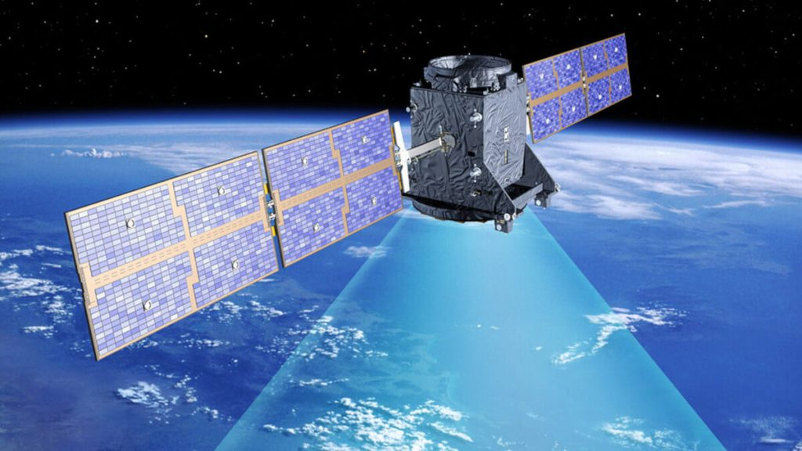
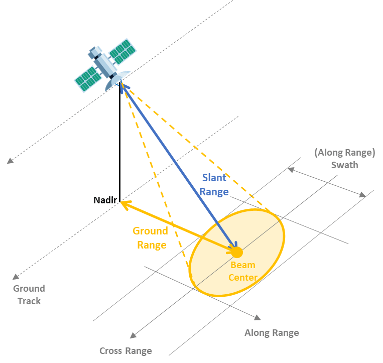

# Synthetic Aperture Radar (SAR)

<p style="text-align:justify;">
Synthetic Aperture Radar (SAR) is an advanced remote sensing technology that uses radar systems to create high-resolution images of the Earth's surface. Unlike optical sensors, SAR operates by transmitting microwave signals and measuring the reflected signals from the Earth's surface. This technology is widely used for Earth observation, military surveillance, environmental monitoring, and more due to its unique capabilities.
</p>



<p style="text-align:justify;">
Synthetic Aperture Radar (SAR) is an advanced remote sensing technology that uses radar systems to create high-resolution images of the Earth's surface. Unlike optical sensors, SAR operates by transmitting microwave signals and measuring the reflected signals from the Earth's surface. This technology is widely used for Earth observation, military surveillance, environmental monitoring, and more due to its unique capabilities.
</p>

[ [Differential Tomography SAR (D-TomoSAR)](./D-TomoSAR.MD), [InSAR Orbital Determination and Fusion](./INSORBFUS.MD), [GNSS Point-to-Surface Data Fusion](./GNSSP2S.MD), [Multi-track fusion 3D Deformation processing functions](./MULTITRACK.MD), [Polarization Processing and other functions](./POLP.MD), [Ortho Photo Generation](./ORTHO.MD), [Optical Stereo 3D](./OPSTER3d.MD) ]

## Principle of SAR

SAR works on the principle of active remote sensing:

+ Active Illumination:

    + The radar system transmits microwave pulses towards the ground. These pulses interact with the surface and are scattered back to the sensor.

+ Echo Detection:

    + The radar detects the reflected signals (echoes), which vary based on the surface's geometry, texture, and dielectric properties.

+ Synthetic Aperture:

    + SAR uses the motion of the radar platform (e.g., satellite, aircraft) to simulate a very large antenna or aperture. By combining the signals received at different positions along the flight path, SAR achieves high spatial resolution that would otherwise require an impractically large physical antenna.



## SAR Data Characteristics
+ `Polarization`: SAR systems can transmit and receive in different polarizations (horizontal or vertical).

+ Common modes include:
    - Single polarization (HH, VV)
    - Dual polarization (HH+VV, HV+VH)
    - Full polarization (HH, HV, VH, VV)

+ `Frequency Bands`: SAR operates in specific microwave frequency bands, each with distinct advantages:

    | **Band**   | **Frequency Range**   | **Applications**                        |
    |------------|-----------------------|-----------------------------------------|
    | X-band     | 8-12 GHz              | High-resolution mapping, urban studies |
    | C-band     | 4-8 GHz               | Vegetation monitoring, agriculture      |
    | L-band     | 1-2 GHz               | Forest biomass, subsurface penetration |
    | P-band     | 0.3-1 GHz             | Deep subsurface studies                |


+ `Spatial Resolution`: Depends on system design and operating frequency. SAR can achieve sub-meter resolution for high-precision applications.

+ `Interferometry (InSAR)`: By comparing phase differences between multiple SAR images, InSAR can measure surface deformations, subsidence, and terrain elevation.

## SAR Processing Techniques :
1. `Image Formation` : Raw SAR data must be processed to form interpretable images using algorithms like:
    + Range-Doppler algorithm
    + Chirp scaling algorithm
    + Back-projection method
2. `Speckle Reduction` : SAR images often contain speckle noise due to coherent imaging. Filtering techniques like Lee, Frost, or Gamma MAP filters are used.
3. `Polarimetric Analysis` : Explores the polarization characteristics of SAR data to distinguish surface features.
4. `SAR Interferometry (InSAR)` : Uses phase differences between two SAR images to measure surface deformation or topography.
5. `Differential SAR Interferometry (DInSAR)` : Enhances InSAR by isolating deformation signals for applications like subsidence monitoring.
6. `Persistent Scatterer Interferometry (PSI)` : Analyzes long-term deformation trends using stable reflectors (persistent scatterers).
7. `Time-Series Analysis` : Monitors temporal changes in SAR data to study dynamic processes like vegetation growth or ice flow.

### SAR Satellites and Missions
1. Active SAR Missions
+ [Sentinel-1](https://www.esa.int/Applications/Observing_the_Earth/Copernicus/Sentinel-1) (ESA):
C-band SAR for environmental monitoring and disaster response.
+ [RADARSAT-2](https://www.asc-csa.gc.ca/eng/satellites/radarsat2/) (Canada):
Multi-mode imaging for agriculture, forestry, and defense.
+ [TerraSAR-X](https://earth.esa.int/eogateway/missions/terrasar-x-and-tandem-x) (Germany):
High-resolution X-band SAR for urban and infrastructure studies.

2. Upcoming and Planned Missions
+ [NISAR](https://nisar.jpl.nasa.gov/) (NASA-ISRO SAR Mission):
Dual-band (L and S-band) SAR for global Earth observation.
+ [BIOMASS (ESA)](https://www.esa.int/Applications/Observing_the_Earth/FutureEO/Biomass):
P-band SAR for forest biomass and carbon stock estimation.

3. Historic Missions
+ ERS-1/2 (ESA):
Pioneered SAR applications in Earth observation.
+ [ALOS PALSAR](https://asf.alaska.edu/datasets/daac/alos-palsar/) (Japan):
L-band SAR for forestry and disaster monitoring.


## Tools for SAR Data Processing
+ Open-Source Tools:

    + [SNAP](https://step.esa.int/main/download/snap-download/) (Sentinel Application Platform):
    Free software by ESA for Sentinel-1 SAR data processing.
    + [ISCE](https://github.com/isce-framework/isce2) (InSAR Scientific Computing Environment):
    For SAR and InSAR workflows.

+ Commercial Software:

    + [SARscape](https://www.nv5geospatialsoftware.com/Solutions/SAR-Solutions) (ENVI):
    Advanced SAR processing for interferometry  and polarimetry.
    + ERDAS IMAGINE:
    SAR data analysis and interpretation.
+ Python Libraries:

    + [PySAR](https://github.com/hfattahi/PySAR):
    For time-series InSAR analysis.
    + [GDAL](https://github.com/OSGeo/gdal) and [Rasterio](https://github.com/rasterio/rasterio):
    For SAR data manipulation.

## SAR Data Processing Workflow :

```
Raw Data Acquisition → Radiometric Calibration → Geometric Correction → SAR Image Formation → Speckle Reduction → (Optional: Polarimetric/InSAR/DInSAR Processing) 
→ Image Interpretation → Data Integration and Visualization
```

<table border="1" style="border-collapse: collapse; width: 100%;">
    <thead>
        <tr>
            <th style="text-align: left; padding: 8px; background-color: #000;">Step</th>
            <th style="text-align: left; padding: 8px; background-color: #000;">Description</th>
            <th style="text-align: left; padding: 8px; background-color: #000;">Challenges</th>
        </tr>
    </thead>
    <tbody>
        <tr>
            <td style="padding: 8px;">1. Raw Data Acquisition</td>
            <td style="padding: 8px;">SAR systems collect raw electromagnetic signals in slant range geometry. These signals contain phase and amplitude information.</td>
            <td style="padding: 8px;">High data volumes; noisy raw data requiring extensive processing.</td>
        </tr>
        <tr>
            <td style="padding: 8px;">2. Radiometric Calibration</td>
            <td style="padding: 8px;">Corrects system distortions and converts signal intensity into radar backscatter coefficients (σ⁰).</td>
            <td style="padding: 8px;">Addressing antenna pattern and gain variations accurately.</td>
        </tr>
        <tr>
            <td style="padding: 8px;">3. Geometric Correction</td>
            <td style="padding: 8px;">Aligns SAR images to geographic coordinates via geocoding, orthorectification, and slant-to-ground range conversion.</td>
            <td style="padding: 8px;">Terrain-induced distortions and precise DEM integration.</td>
        </tr>
        <tr>
            <td style="padding: 8px;">4. SAR Image Formation</td>
            <td style="padding: 8px;">Converts raw SAR signals into interpretable 2D images using range and azimuth compression techniques.</td>
            <td style="padding: 8px;">Complexity of focusing algorithms like Range-Doppler or Chirp Scaling.</td>
        </tr>
        <tr>
            <td style="padding: 8px;">5. Speckle Noise Reduction</td>
            <td style="padding: 8px;">Reduces speckle noise using filters (e.g., Lee, Frost) or multi-look processing for smoother images.</td>
            <td style="padding: 8px;">Balancing noise reduction and edge preservation.</td>
        </tr>
        <tr>
            <td style="padding: 8px;">6. Polarimetric Processing (Optional)</td>
            <td style="padding: 8px;">Analyzes polarized backscatter data for surface classification and scattering mechanism analysis.</td>
            <td style="padding: 8px;">Handling high data dimensionality and decomposition complexities.</td>
        </tr>
        <tr>
            <td style="padding: 8px;">7. Interferometric SAR (InSAR) Processing (Optional)</td>
            <td style="padding: 8px;">Generates interferograms to measure elevation or displacement by computing phase differences between SAR images.</td>
            <td style="padding: 8px;">Coregistration accuracy and phase unwrapping challenges.</td>
        </tr>
        <tr>
            <td style="padding: 8px;">8. Differential InSAR (DInSAR) Processing (Optional)</td>
            <td style="padding: 8px;">Detects temporal surface changes by subtracting static topography from interferograms.</td>
            <td style="padding: 8px;">Minimizing noise due to atmospheric effects or decorrelation.</td>
        </tr>
        <tr>
            <td style="padding: 8px;">9. Time-Series Analysis (Optional)</td>
            <td style="padding: 8px;">Analyzes SAR data over time for dynamic changes, using techniques like PSI and SBAS.</td>
            <td style="padding: 8px;">Consistency in identifying stable reflectors or minimizing baseline errors.</td>
        </tr>
        <tr>
            <td style="padding: 8px;">10. Image Interpretation and Classification</td>
            <td style="padding: 8px;">Extracts meaningful information using thresholding, machine learning, or texture analysis.</td>
            <td style="padding: 8px;">Accurate feature extraction amidst noise and speckle artifacts.</td>
        </tr>
        <tr>
            <td style="padding: 8px;">11. Data Integration and Visualization</td>
            <td style="padding: 8px;">Combines SAR data with other datasets for comprehensive analysis, using GIS tools.</td>
            <td style="padding: 8px;">Harmonizing diverse datasets and ensuring spatial consistency.</td>
        </tr>
    </tbody>
</table>

## Synthetic Aperture Radar (SAR) Data: Understanding Its Components
SAR data comprises several critical components that describe how the data is acquired, the mode of operation, and the geometry of imaging. Below is a detailed explanation of key terms such as IW (Interferometric Wide Swath), Swath, Orbit, and others related to SAR data.


| **Component**              | **Description**                                                                                                                                                                       | **Example/Use Case**                                                                                       |
|----------------------------|---------------------------------------------------------------------------------------------------------------------------------------------------------------------------------------|------------------------------------------------------------------------------------------------------------|
| **Interferometric Wide Swath (IW) Mode** | IW mode is a SAR imaging mode, often used in systems like Sentinel-1, that balances resolution and coverage. It divides the imaging area into three sub-swaths and scans them using the TOPS (Terrain Observation by Progressive Scans) technique. This method minimizes scalloping effects and ensures uniform coverage. | Land deformation studies, glacier monitoring, and land cover classification.                               |
| **Swath**                  | A swath refers to the area observed by the SAR system during a pass. Wide swaths provide broad coverage but with coarser resolution, while narrow swaths offer higher resolution for detailed imaging. Swath width depends on the mode (e.g., IW mode covers ~250 km). | Wide-swath imaging is used for disaster monitoring, while narrow-swath modes are ideal for urban mapping. |
| **Orbit**                  | The trajectory of the satellite around the Earth. Ascending orbits move south-to-north, and descending orbits move north-to-south. Combining data from both orbits is essential for interferometry, as they provide complementary views of the target area. | Used in InSAR applications to measure ground displacement by combining ascending and descending passes.     |
| **Polarization**           | SAR transmits and receives signals in different polarization states, such as horizontal (H) and vertical (V). Modes include single (HH, VV), dual (e.g., HH+HV), and quad-polarization (HH, HV, VH, VV). Polarization provides information about surface properties. | Quad-polarization data is useful for vegetation analysis, soil moisture estimation, and urban mapping.      |
| **Incidence Angle**        | The angle between the radar beam and a line perpendicular to the Earth's surface. Incidence angle affects the backscatter intensity and data detail. It varies across the swath from near-range to far-range, with each range suited to different terrain types. | Low angles for flat surfaces; high angles for mountainous regions.                                          |
| **Look Direction**         | The side of the satellite's path where the radar beam is pointed. SAR systems are typically right-looking, but left-looking systems are also used in specialized applications. This direction determines shadow and layover areas in the imagery. | Right-looking systems are standard; left-looking used for customized imaging needs.                        |
| **Range and Azimuth Resolution** | Range resolution measures the ability to distinguish objects separated along the direction perpendicular to the satellite's motion, while azimuth resolution refers to distinguishing objects along the satellite's flight path. High resolution requires large radar bandwidth or advanced techniques like spotlight mode. | High-resolution SAR is crucial for urban studies, while coarser resolution is suitable for environmental monitoring. |
| **Amplitude and Phase**    | Amplitude represents the intensity of the radar signal and is used for surface classification. Phase captures the distance and elevation of the target, essential for interferometric applications like DEM generation and displacement mapping. | Amplitude is used for land cover studies, and phase is critical for DEMs and surface deformation analysis.   |
| **Temporal and Spatial Baseline** | Temporal baseline refers to the time difference between two acquisitions, while spatial baseline indicates the separation between the satellite passes. These baselines determine the quality of interferometric results. | Used in InSAR and DInSAR for detecting small surface changes such as land subsidence or uplift.              |
| **Ground Range and Slant Range** | Slant range is the direct distance between the radar and the target, while ground range is the projection of this distance onto the Earth's surface. Slant range data must often be converted to ground range for georeferencing and analysis. | Ground range conversion is essential for accurate geolocation in SAR imagery.                               |


Resources : [ [NASA SAR SNAP ARSET](https://youtu.be/Xemo2ZpduHA?si=65w9grJ-ruOrpzXH), [NASA video](https://www.youtube.com/@NASAgovVideo/playlists), [InSAR Theory and Processing (2020)](https://www.youtube.com/playlist?list=PLzmugeDoplFNxsJFbIhwX3AWy7oFSnG8u), [ESA Training - SAR and Optical](https://www.youtube.com/playlist?list=PLvT7fd9OiI9V72wSidaHKhOraDiNQaW8C), [EarthScope Consortium Presentations](https://www.youtube.com/@EarthScope_presentations/playlists), [Surface Motion Estimation](https://www.youtube.com/@agricultureandgistv8051/videos), [Radar Systems Engineering](https://www.youtube.com/watch?v=q7yNQp_8Acg&list=PLNKgf4Cv_NZ1_fZt0bAJXAro6MlaTAEAU), [InSAR Processing and Theory with GMTSAR (day1)](https://youtu.be/BUFwYDpnMOk?si=bEmZmdCC-Ud6Rc53) : [day2](https://youtu.be/_zA15Wq_Qzk?si=Oc0a4uM8LVOA1JUm), [day3](https://youtu.be/ZdGgmK9hrkk?si=KCx2gaoi_a5nBTHJ), [PolSAR](https://www.youtube.com/playlist?list=PLoESGzpi1Bfjn69Dpcb9kD40oZbYtpZIF), [Synthetic Aperture Radar: Systems and Signal Processing](https://www.wiley.com/en-us/Synthetic+Aperture+Radar%3A+Systems+and+Signal+Processing-p-9780471857709)